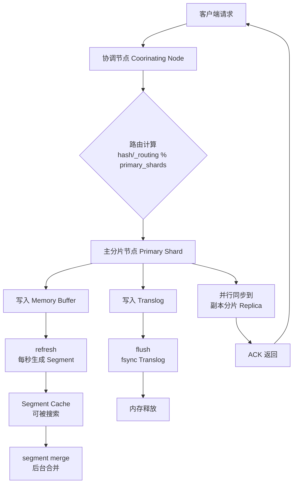
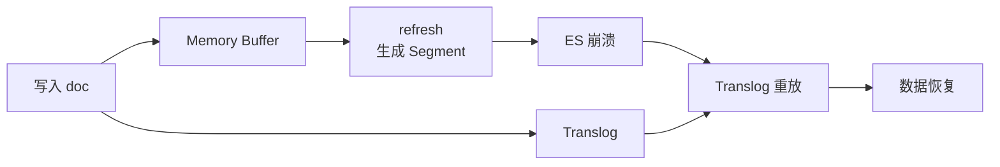

## Elasticsearch 写入流程

候选人小周在美团面试时，面试官问他："ES 的写入流程能说一下吗？"

小周回答："客户端发请求到 ES，ES 把数据写进去。"

面试官："具体怎么写到磁盘的？"

小周："...写到磁盘里？"

面试官："refresh 和 flush 的区别是什么？"

小周沉默了三秒，说："refresh 是刷新...flush 是刷新到磁盘？"

面试官没说话，继续问："translog 是干什么用的？"

小周彻底卡住了。

【面试官心理】
这道题我用来筛选候选人对 ES 写入链路是否有系统性理解。能把"写入内存 → refresh → flush"三层分开讲的占 30%，能说清 translog 在故障恢复中作用的占 10%。能答到最后的，基本都看过源码或者踩过数据丢失的坑。

---

## 一、写入全链路拆解 🔴

### 1.1 四层架构总览

ES 的写入流程分为以下几个关键阶段：



### 1.2 追问链

**第一层：怎么路由？**
面试官问："客户端发来一个写入请求，数据最终落到哪个分片？"
候选人答："根据文档 _id 的 hash 值..."
考察点：routing 机制

**第二层：主副本写入**
面试官追问："主分片写完后，副本怎么同步？"
候选人答："并行写到副本..."（可能卡在一致性级别）
考察点：写入一致性

**第三层：内存与持久化**
面试官追问："刚写入的数据能立即搜到吗？为什么？"
候选人答："不能，需要 refresh..."（这是 P6 分水岭）
考察点：refresh 机制、与 MySQL redo log 类比

**第四层：故障恢复**
面试官追问："ES 挂了重启后，数据是怎么恢复的？translog 起了什么作用？"
候选人答：...（P7 区分点）
考察点：ES 持久化机制、故障恢复原理

---

## 二、第一阶段：请求路由 🟡

### 2.1 协调节点的作用

客户端的写入请求首先打到任意一个 ES 节点（协调节点），协调节点负责：

1. **接收请求**：解析 JSON 文档内容
2. **路由计算**：`shard_num = hash(_routing) % num_primary_shards`
3. **转发主分片**：将请求转发到对应的主分片节点

```java
// ES 内部路由计算简化逻辑
int shardNum = Math.floorMod(hash(routingValue), primaryShards);
ShardId shardId = new ShardId(indexName, shardNum);
```

:::tip 💡
`Math.floorMod` 是取模操作，和 `%` 的区别在于处理负数时的行为。ES 用它是为了保证 hash 结果为负时也能正确路由到 0 到 num_primary_shards-1 之间的分片。
:::

### 2.2 自定义 Routing 的坑

如果你指定了自定义 `_routing` 字段（比如按 `user_id` 路由），所有相同用户的文档都会落在同一个分片。这在做"查询某用户的所有订单"时效率极高，但代价是：**如果某个用户数据量特别大，会造成分片数据不均衡**（热点分片问题）。

---

## 三、第二阶段：写入主分片与副本 🟡

### 3.1 主分片写入

主分片节点收到请求后，执行以下操作：

```java
// 简化后的写入流程
public void writeDocument(Document doc) {
    // 1. 写入 Memory Buffer（内存）
    memoryBuffer.add(doc);

    // 2. 写入 Translog（磁盘追加写）
    translog.append(doc);

    // 3. 返回 ACK 给协调节点
    return "success";
}
```

**这里有一个极其重要的点**：步骤 1 和步骤 2 是**顺序执行、同步进行**的。先写 Translog，再写 Buffer。Translog 是追加写，速度极快，所以对写入性能影响很小。

### 3.2 副本同步写入

主分片写完后，需要同步到副本分片。ES 支持三种一致性级别：

```java
// consistency 参数：quorum / all / one
PUT /orders/_doc/order_123?consistency=quorum
```

| 一致性级别 | 行为 | 说明 |
| --- | --- | --- |
| `one` | 只写主分片 | 最快，但主分片挂了会丢数据 |
| `quorum`（默认） | 主分片 + `N/2 + 1` 个副本 | CAP 权衡，写入速度稍慢 |
| `all` | 主分片 + 所有副本 | 最慢，但最强一致性 |

:::warning ⚠️
`quorum` 的计算方式是 `int((primary_shards + replica_shards) / 2) + 1`，而不是 `(primary_shards / 2) + 1`。很多候选人搞混这个。另外，副本数设为 0 时使用 `quorum` 会导致写入失败，因为没有副本可以参与投票。
:::

### 3.3 错误示范

**候选人原话**："ES 写入是先写到 Buffer，等 buffer 满了再刷到磁盘。"

**问题诊断**：
- 混淆了 Buffer 和 Translog 的作用
- 不知道 Translog 是如何保证持久性的
- 不理解"先写日志后写数据"的经典 Write-Ahead Logging 思想

**面试官内心 OS**："这个候选人可能用过 ES，但没有深入理解它的持久化设计。他不知道 ES 其实用了和 MySQL 类似的 redo log 思想——Translog 就是 ES 的 redo log。"

---

## 四、第三阶段：Refresh 与可搜索 🟡

### 4.1 为什么需要 refresh？

写入 Memory Buffer 的数据对用户**不可见**，因为数据还在内存里，没有生成倒排索引。ES 默认每 **1 秒**执行一次 refresh，将 Buffer 中的数据生成一个新的 Segment 并打开，使其可被搜索。

```
时间线：
T0: 写入 doc_1
T0 + 0.5s: 写入 doc_2
T1: refresh 触发，doc_1 和 doc_2 对外可见
T1 + 0.5s: 写入 doc_3
T2: refresh 触发，doc_1, doc_2, doc_3 对外可见
```

这就是 ES 的 **准实时（Near Real-Time）** 搜索能力：写入延迟约 1 秒。相比之下，MySQL 的写入要等到 redo log flush 到磁盘才能被事务读取，延迟更高。

### 4.2 refresh_interval 参数

```json
PUT /orders/_settings
{
  "index": {
    "refresh_interval": "1s"  // 默认值，可调
  }
}
```

:::tip 💡
如果你的场景是**日志检索**（允许秒级延迟）或者**批量导入**（不需要实时搜索），可以把 `refresh_interval` 调大到 `30s` 或 `-1`（写入期间禁止 refresh），能显著提升写入吞吐量。但注意：调大 refresh_interval 会导致新数据可搜索的延迟增加。
:::

---

## 五、第四阶段：Flush 与持久化 🔴

### 5.1 Translog 的前世今生

这是整个写入链路中最核心、也是面试中被追问最多的部分。

**Translog 的作用**：保证数据不丢失。Memory Buffer 里的数据在 refresh 后生成 Segment，此时如果 ES 崩溃，Buffer 中的数据就丢了。**Translog 记录了从上次 flush 到现在所有的增量操作**，重启时通过 Translog 重放来恢复数据。



### 5.2 Flush 的触发条件

Flush 不是定时执行的，而是满足以下任一条件时触发：

1. **Translog 大小超过阈值**：默认 `512MB`
2. **Translog 写入了超过 30 分钟的数据**（默认 `translog.flush_threshold_size` 和 `translog.flush_threshold_period`）

Flush 的本质操作：
1. **fsync Translog**：将 Translog 内容强制刷到磁盘
2. **清空 Translog**：生成新的 Translog 文件
3. **清空 Memory Buffer**：释放内存

:::warning ⚠️
Flush 不等于 segment merge。Flush 是将 Translog fsync 并清空 Buffer；segment merge 是后台进程将多个小 Segment 合并成大 Segment，减少查询时的 Segment 数量。很多候选人把这两个概念搞混。
:::

### 5.3 数据不丢失的保证

:::details 📖 点击展开：ES 的持久化保证
ES 的持久化机制相当于 MySQL 的 redo log + binlog 的组合：

| MySQL | ES | 作用 |
| --- | --- | --- |
| redo log | Translog | 保证崩溃后数据不丢失 |
| binlog | Segment 文件 | 保证数据对外可见 |
| - | refresh | 将 Buffer 转 Segment，使数据可搜索 |

ES 的写入流程完美体现了 **WAL（Write-Ahead Logging）** 思想：先写日志（Translog），再写数据（Memory Buffer）。
:::

---

## 六、生产避坑

### 6.1 写入瓶颈翻车

**线上后果**：双十一零点写入 QPS 从 5万 突然掉到 5000，整整持续了 10 分钟。

**排查过程**：
1. 查看集群写入延迟：`GET _nodes/stats/indices/indexing?pretty`
2. 发现 Translog fsync 时间从 1ms 飙升到 200ms
3. 原因是 Translog 磁盘写满，IO 延迟暴增

**根因**：Translog 存放在机械硬盘上，大量 fsync 操作导致 IO 排队。

**解决方案**：
- 将 Translog 目录放在 SSD 上
- 调大 `index.translog.durability = async`（异步模式，写入更快但有数据丢失风险）
- 调大 Translog flush 阈值：`"index.translog.flush_threshold_size": "1gb"`

### 6.2 refresh 导致集群抖动

**线上后果**：凌晨 2 点 ES 集群 CPU 抖动，查询延迟从 20ms 飙升到 500ms，持续 3 分钟。

**根因**：refresh_interval 默认 1s，凌晨的批量写入导致每分钟生成 60 个小 Segment，触发了大量段合并，CPU 全被 merge 进程吃掉了。

**排查命令**：
```bash
GET _cat/segments?v
GET _nodes/stats/indices/segments?pretty
```

---

## 七、工程选型

| 场景 | refresh_interval | translog.durability | 副本策略 |
| --- | --- | --- | --- |
| 日志写入 | `30s` 或 `-1` | `async` | 0 副本（丢失可接受） |
| 交易数据 | `1s`（默认） | `sync` | 至少 1 副本 |
| 实时分析 | `200ms` | `sync` | 按查询压力定 |
| 批量导入 | `-1`，导入完再调回 | `async` | 0 副本 |

【面试官心理】
这道题能答到"Translog 是 WAL 实现"的候选人，说明他对数据库持久化机制有系统性理解。这种候选人在 P6/P7 层面都有优势——因为他能把 ES 的设计思想和 MySQL、PostgreSQL 的设计思想串联起来。
