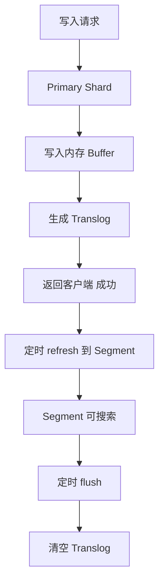
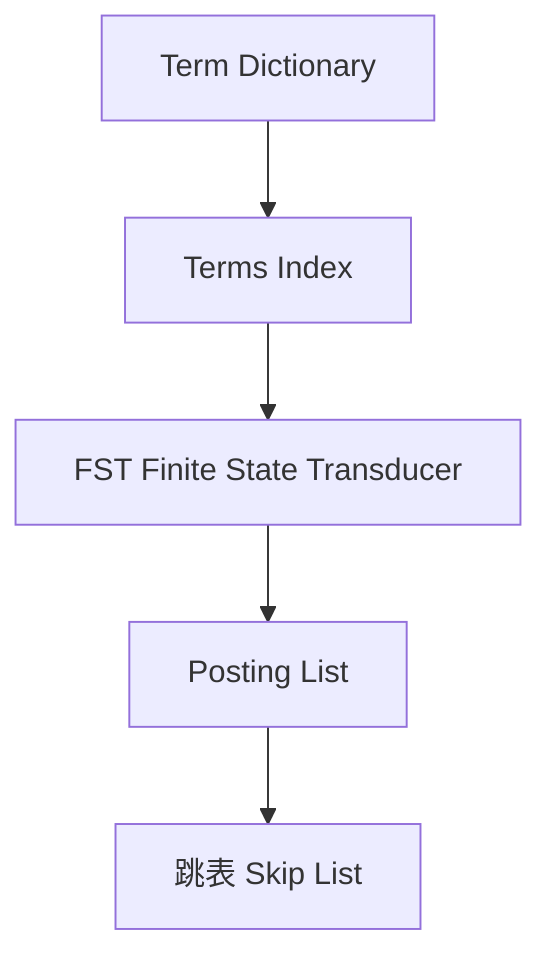

# Elasticsearch 搜索引擎

候选人小张在面试时被问到："ES 的倒排索引是什么？为什么比 B+ 树快？"

他回答："倒排索引是一种..."面试官追问："那分词器呢？ik_max_word 和 ik_smart 有什么区别？"

小张愣住了。

【面试官心理】
我问他倒排索引，不是想听他背概念。我想知道的是：他有没有真正理解"为什么搜索要用地排索引"，能不能说清楚 ES 和 MySQL 的区别，以及什么场景该用 ES。

---

## 一、ES 核心概念 🔴

### 1.1 问题拆解

**第一层：基本概念**
面试官问："ES 和 MySQL 的区别是什么？什么场景用 ES？"
候选人答："ES 是搜索引擎，MySQL 是关系型数据库..."（基本概念）

**第二层：架构理解**
面试官追问："ES 的 index、type、document、field 是什么关系？"
候选人答：...（数据模型）

**第三层：底层原理**
面试官追问："ES 为什么能做到近实时搜索？"
候选人答：...（P6 分水岭）

### 1.2 错误示范

**候选人原话**："ES 是全文搜索引擎，用来替代 MySQL 的 like 查询..."

**问题诊断**：
- 不知道 ES 和 MySQL 是互补关系，不是替代关系
- 不理解 ES 的写入流程
- 没理解"近实时"的含义

**面试官内心 OS**："这个候选人肯定没深入用过 ES..."

### 1.3 标准回答

**ES vs MySQL 对比**：

| 维度 | MySQL | Elasticsearch |
| --- | --- | --- |
| 数据结构 | 关系型 | 文档型（JSON） |
| 索引 | B+ 树 | 倒排索引 + B+ 树 |
| 查询能力 | 精确匹配、简单模糊 | 全文搜索、复杂查询 |
| 事务 | 支持 | 不支持（只保证最终一致） |
| 写入速度 | 较慢 | 快（但有延迟） |
| 适用场景 | 业务数据存储 | 搜索、日志分析 |

**ES 数据模型**：

```
MySQL: Database -> Table -> Row -> Column
ES:    Index    -> Type(DocType) -> Document -> Field

MySQL: world    -> user        -> {id:1, name:"张三", age:30}
ES:    world    -> user        -> {"id":"1","name":"张三","age":30}
```

**ES 写入流程**：



**为什么 ES 叫"近实时"**：

```java
// 写入不立即可搜索
// 1. 写入 Memory Buffer（不可搜索）
// 2. refresh 周期默认 1 秒（变成 Segment，才可搜索）
// 3. flush 周期默认 30 分钟（持久化到磁盘）

// 相关配置
{
  "index": {
    "refresh_interval": "1s"  // 默认 1 秒，可设 -1 关闭
  }
}
```

【面试官心理】
我追问他近实时的含义，是想看他有没有理解 ES 的架构设计。知道 refresh 和 flush 区别，基本都读过 ES 源码或深入文档。

---

## 二、倒排索引 🔴

### 2.1 问题拆解

**第一层：概念理解**
面试官问："倒排索引是什么？和正排索引有什么区别？"
候选人答："倒排索引是..."（概念）

**第二层：原理**
面试官追问："倒排索引是怎么存储的？Term Dictionary、Posting List 是什么？"
候选人答：...（存储结构）

**第三层：优化**
面试官追问："ES 用了哪些优化让查询这么快？"
候选人答：...（P6/P7 分水岭）

### 2.2 标准回答

**正排 vs 倒排**：

```java
// 正排索引：Document -> Terms（谁包含这个词）
// 类似书的目录：章节 -> 关键词
Map<docId, List<term>> forwardIndex = {
    doc1: ["apple", "banana", "fruit"],
    doc2: ["banana", "orange"],
    doc3: ["apple", "fruit", "orange"]
}

// 倒排索引：Term -> Documents（这个词在哪些文档里）
// 类似书的索引：关键词 -> 章节
Map<term, List<docId>> invertedIndex = {
    "apple":    [doc1, doc3],
    "banana":   [doc1, doc2],
    "orange":   [doc2, doc3],
    "fruit":    [doc1, doc3]
}
```

**倒排索引的存储结构**：



| 结构 | 作用 | 大小 |
| --- | --- | --- |
| Term Dictionary | 所有 term 列表 | 大 |
| Terms Index | 快速定位 term 的指针 | 小 |
| Posting List | term 出现的 doc 列表 | 大 |
| FST | 压缩 terms index | 更小 |

**Posting List 存储示例**：

```java
// 简单 Posting List：[1, 3, 5, 8, 9, 12, 15]
// 用 Gap 编码：[1, +2, +2, +3, +1, +3, +3]

// 高级 Posting List：Roaring Bitmap
// docId < 2^16: 用 short 数组
// docId >= 2^16: 用 int 数组
// 优点：压缩率高，支持快速交集
```

**为什么比 B+ 树快**：

```
MySQL B+ 树查找 "apple"：
1. 从根节点开始
2. 比较大小，逐层下沉
3. 平均 O(logN) 次磁盘 IO

ES 倒排索引查找 "apple"：
1. FST 定位 "apple"（内存操作）
2. 直接拿到 Posting List
3. O(1) 磁盘 IO

多词查询 "apple AND banana"：
- MySQL: 两棵树交集，效率低
- ES: 两个 Posting List 做跳表合并
```

:::tip 💡
ES 适合搜索场景的原因：
1. **倒排索引**：支持全文搜索，无需扫描全表
2. **FST 压缩**：内存占用小，定位快
3. **分布式**：数据分片，横向扩展
4. **相关性评分**：TF/IDF 算法排序
:::

---

## 三、分词器 🟡

### 3.1 问题拆解

**第一层：怎么用？**
面试官问："ES 的分词流程是什么？"
候选人答："分词器把文本切成词..."（基本概念）

**第二层：分词器类型**
面试官追问："ik_max_word 和 ik_smart 有什么区别？"
候选人答：...（中文分词）

**第三层：自定义**
面试官追问："怎么自定义分词器？"
候选人答：...（P6 分水岭）

### 3.2 标准回答

**分词流程**：

```java
// ES 分词流程
GET /_analyze
{
  "text": "我爱北京天安门",
  "analyzer": "ik_max_word"
}

// 输出
{
  "tokens": [
    {"token": "我", "start_offset": 0, "end_offset": 1},
    {"token": "爱", "start_offset": 1, "end_offset": 2},
    {"token": "北京", "start_offset": 2, "end_offset": 4},
    {"token": "天安门", "start_offset": 4, "end_offset": 7},
    // ... 还有更多细粒度分词
  ]
}
```

**ik_max_word vs ik_smart**：

| 分词器 | 行为 | 例子 "中华人民共和国" |
| --- | --- | --- |
| ik_max_word | 最细粒度分词 | 中华人民共和国、中华人民、中华、华人... |
| ik_smart | 最粗粒度分词 | 中华人民共和国 |
| standard | 英文智能 | 中华人民共和国 |
| whitespace | 空格分词 | 中华人民共和国 |

**自定义分词器配置**：

```json
{
  "settings": {
    "analysis": {
      "analyzer": {
        "my_analyzer": {
          "type": "custom",
          "tokenizer": "ik_max_word",
          "filter": ["lowercase", "synonym_filter"]
        }
      },
      "filter": {
        "synonym_filter": {
          "type": "synonym",
          "synonyms": [
            "手机,电话,移动端",
            "程序员,开发者,码农"
          ]
        }
      }
    }
  },
  "mappings": {
    "properties": {
      "title": {
        "type": "text",
        "analyzer": "my_analyzer"
      }
    }
  }
}
```

【面试官心理】
我追问他中文分词的区别，是想看他有没有实际处理过中文搜索。能说清 IK 分词差异的，基本都有过中文搜索项目经验。

---

## 四、搜索查询 🔴

### 4.1 问题拆解

**第一层：query 类型**
面试官问："ES 有哪些查询类型？match 和 term 有什么区别？"
候选人答："term 是精确匹配，match 是模糊匹配..."（基本区别）

**第二层：组合查询**
面试官追问："bool 查询的 must、should、must_not、filter 有什么区别？"
候选人答：...（查询组合）

**第三层：性能**
面试官追问："query_then_fetch 和 dfs_query_then_fetch 有什么区别？"
候选人答：...（P7 拉开差距）

### 4.2 标准回答

**match vs term**：

```json
// match：全文搜索，会分词
GET /index/_search
{
  "query": {
    "match": {
      "title": "手机价格"  // 会分成"手机"和"价格"两个词搜索
    }
  }
}

// term：精确匹配，不分词
GET /index/_search
{
  "query": {
    "term": {
      "status": "published"  // 精确匹配"published"
    }
  }
}

// terms：多值精确匹配
{
  "terms": {
    "status": ["published", "draft"]
  }
}
```

**bool 查询组合**：

```json
{
  "query": {
    "bool": {
      "must": [
        { "match": { "title": "手机" } }  // 必须匹配，计入评分
      ],
      "should": [
        { "match": { "content": "性价比" } },  // 应该匹配，计入评分
        { "match": { "content": "便宜" } }
      ],
      "must_not": [
        { "term": { "status": "deleted" } }  // 必须不匹配，不计入评分
      ],
      "filter": [
        { "term": { "category": "electronics" } }  // 必须命中，不计入评分
      ]
    }
  }
}
```

:::warning ⚠️
bool 查询的坑：
1. **must vs filter**：must 计入评分，filter 不计入。如果不关心相关性，用 filter 更快（不走评分）。
2. **should 的 minimum_should_match**：默认 0，可以设 > 0 改变行为。
3. **嵌套限制**：ES 默认最多嵌套 1024 个查询，太深的嵌套会报错。
:::

**深分页问题**：

```json
// from/size 分页：深度分页很慢
{
  "from": 10000,
  "size": 10
}

// 问题：ES 需要合并 10000 个分片结果

// 解决方案：search_after
{
  "size": 10,
  "sort": [
    { "created": "desc" },
    { "_id": "asc" }
  ],
  "search_after": [1680000000000, "doc_id_9999"]
}

// 或者用 scroll：适合导出大量数据
{
  "scroll": "1m",
  "size": 1000
}
```

---

## 五、索引设计 🟡

### 5.1 问题拆解

**第一层：分片设计**
面试官问："ES 的分片数怎么设计？"
候选人答："看数据量..."（初步理解）

**第二层：副本配置**
面试官追问："副本数设多少合适？为什么不能太多？"
候选人答：...（副本机制）

**第三层：mapping 设计**
面试官追问："keyword 和 text 有什么区别？什么时候用 keyword？"
候选人答：...（字段类型）

### 5.2 标准回答

**分片设计原则**：

```java
// 分片数计算公式
shards = (data_size * replication_factor) / single_shard_capacity

// 单个分片推荐大小：30-50GB
// 例如：1TB 数据，副本因子 1，单分片容量 50GB
// 分片数 = 1TB * 1 / 50GB = 20 个主分片

// 分片数设置建议
PUT /my_index
{
  "settings": {
    "number_of_shards": 5,      // 主分片数，创建后不能改
    "number_of_replicas": 1     // 副本数，可以改
  }
}
```

**字段类型选择**：

| 场景 | 类型 | 例子 |
| --- | --- | --- |
| 全文搜索 | text | title, content |
| 精确匹配/排序 | keyword | status, category, date |
| 数值范围查询 | long/double | price, count |
| 布尔 | boolean | is_active |
| 日期 | date | created_at |
| IP 地址 | ip | client_ip |

```json
{
  "mappings": {
    "properties": {
      "title": {
        "type": "text",
        "analyzer": "ik_max_word",
        "fields": {
          "keyword": {  // 同时支持精确搜索
            "type": "keyword"
          }
        }
      },
      "price": {
        "type": "double"
      },
      "status": {
        "type": "keyword"  // 不需要全文搜索，用 keyword
      }
    }
  }
}
```

【面试官心理】
我追问他字段类型选择，是想看他有没有实际的索引设计经验。能说清 keyword 和 text 区别，基本都踩过"类型选错导致查询慢"的坑。

---

## 六、性能调优 🟡

### 6.1 问题拆解

**第一层：常见问题**
面试官问："ES 查询慢怎么排查？"
候选人答："看慢日志..."（基本回答）

**第二层：排查手段**
面试官追问："explain API 怎么用？profile 呢？"
候选人答：...（排查工具）

**第三层：优化手段**
面试官追问："ES 性能优化有哪些手段？"
候选人答：...（P6/P7 分水岭）

### 6.2 标准回答

**慢查询排查**：

```json
// 1. 开启慢查询日志
PUT /my_index/_settings
{
  "index.search.slowlog.threshold.query.warn": "2s",
  "index.search.slowlog.threshold.query.info": "1s"
}

// 2. explain 查看查询执行
GET /my_index/_explain/1
{
  "query": {
    "match": { "title": "手机" }
  }
}

// 3. profile 查看各阶段耗时
GET /my_index/_search
{
  "profile": true,
  "query": {
    "match": { "title": "手机" }
  }
}
```

**常见优化手段**：

```java
// 1. 路由优化：用 routing 直接定位分片
GET /my_index/_search?routing=user_123
{
  "query": {
    "term": { "user_id": "123" }
  }
}

// 2. 禁用_source：减少网络传输
GET /my_index/_search
{
  "_source": false,
  "stored_fields": ["title"]
}

// 3. Filter 代替 Query：filter 不走评分更快
{
  "query": {
    "bool": {
      "must": { "match": { "title": "手机" } },
      "filter": { "term": { "status": "published" } }  // 不评分更快
    }
  }
}

// 4. 预索引数据：用 indexing榴
{
  "properties": {
    "price": {
      "type": "double"
    },
    "price_range": {
      "type": "keyword"
    }
  }
}
```

:::tip 💡
ES 性能优化的核心思想：
1. **数据建模**：keyword 和 text 分开，避免对不需要搜索的字段用 text
2. **查询优化**：Filter > Query，Filter 不评分更快
3. **分片策略**：小分片多副本，避开深度分页
4. **资源隔离**：写入用专用节点，查询用专用节点
:::

---

## 七、面试题分类

| 级别 | 高频问题 | 期望回答 |
| --- | --- | --- |
| P5 | ES vs MySQL、倒排索引概念、分词器 | 能说清基本概念 |
| P6 | 倒排索引原理、bool 查询、分片设计 | 能回答追问 |
| P7 | 深分页问题、性能调优、ES 架构设计 | 有实战经验 |

---

## 八、学习路径指引

| 阶段 | 内容 | 目标 |
| --- | --- | --- |
| 入门 | 基本 CRUD、索引操作 | 能建索引、查数据 |
| 进阶 | 复杂查询、聚合、分词 | 能做搜索功能 |
| 高级 | 性能调优、分片设计 | 能优化集群 |
| 精通 | 架构设计、原理深入 | 能做技术选型 |

---

## 九、生产避坑总结

| 场景 | 问题 | 解决方案 |
| --- | --- | --- |
| 深度分页 | from+size 过深性能差 | 用 search_after 或滚动查询 |
| 分片过多 | 小分片过多影响性能 | 控制单分片 30-50GB |
| 热数据集中 | 单节点写入压力大 | 用 ILM 冷热分离 |
| mapping 错误 | 类型选错查询慢 | 先用 test index 验证 |
| 副本过多 | 写入压力倍增 | 根据读写比设置副本数 |
| 内存溢出 | Fielddata 无限增长 | 限制 circuit_breaker |
