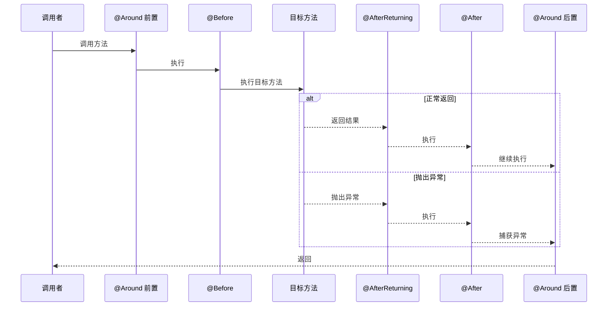

# 通知执行顺序

> 目标级别：P6
>
> 面试命中率：70%

## 快速自测

1. 多个切面的通知执行顺序是什么？
2. @Around 的执行流程是怎样的？
3. 异常情况下通知的执行顺序有什么变化？

---

## 一、通知执行流程



---

## 二、同一切面内通知顺序

```java
@Aspect
@Component
public class LoggingAspect {

    @Around("execution(* com.example.*.*(..))")
    public Object around(ProceedingJoinPoint pjp) {
        System.out.println("1. @Around 前置");
        Object result = null;
        try {
            result = pjp.proceed();  // 执行目标方法
            System.out.println("2. @Around 正常返回后");
            return result;
        } catch (Throwable e) {
            System.out.println("3. @Around 异常处理");
            throw e;
        } finally {
            System.out.println("4. @Around finally");
        }
    }

    @Before("execution(* com.example.*.*(..))")
    public void before() {
        System.out.println("5. @Before");
    }

    @After("execution(* com.example.*.*(..))")
    public void after() {
        System.out.println("6. @After");
    }

    @AfterReturning("execution(* com.example.*.*(..))")
    public void afterReturning() {
        System.out.println("7. @AfterReturning");
    }

    @AfterThrowing("execution(* com.example.*.*(..))")
    public void afterThrowing() {
        System.out.println("8. @AfterThrowing");
    }
}
```

**正常执行顺序**：
1. @Around 前置
2. @Before
3. 目标方法
4. @AfterReturning
5. @After
6. @Around 正常返回后
7. @Around finally

---

## 三、多个切面的执行顺序

### 默认顺序（按类名字母排序）

```java
@Aspect
@Component
public class AlphaAspect { }  // 字母排序靠前

@Aspect
@Component
public class BetaAspect { }   // 字母排序靠后
```

### 自定义顺序（@Order）

```java
@Aspect
@Component
@Order(1)  // 数字越小，优先级越高
public class FirstAspect { }

@Aspect
@Component
@Order(2)
public class SecondAspect { }
```

---

## 四、@Around 的特殊之处

`@Around` 通知可以完全控制目标方法的执行：

```java
@Aspect
@Component
public class TransactionAspect {

    @Around("execution(* com.example.*.*(..))")
    public Object around(ProceedingJoinPoint pjp) {
        Connection conn = null;
        try {
            // 开启事务
            conn = dataSource.getConnection();
            conn.setAutoCommit(false);

            // 执行目标方法
            Object result = pjp.proceed();

            // 提交事务
            conn.commit();
            return result;
        } catch (Exception e) {
            // 回滚事务
            if (conn != null) {
                conn.rollback();
            }
            throw new RuntimeException(e);
        } finally {
            // 释放连接
            if (conn != null) {
                conn.close();
            }
        }
    }
}
```

---

## 五、高频面试题

### 🔴 第一层：通知的执行顺序是什么？

**答案要点**：
1. @Around 前置
2. @Before
3. 目标方法
4. @AfterReturning / @AfterThrowing
5. @After
6. @Around 后置 / 异常处理

### 🟡 第二层：@Around 和其他通知的区别？

**答案要点**：
1. @Around 可以控制目标方法是否执行
2. @Around 必须接收 `ProceedingJoinPoint` 参数
3. 其他通知无法阻止目标方法执行

---

## 六、对比总结

| 通知类型 | 执行时机 | 能否阻止目标方法 | 参数 |
| --- | --- | --- | --- |
| @Before | 目标方法前 | ❌ | JoinPoint |
| @Around | 环绕目标方法 | ✅ | ProceedingJoinPoint |
| @After | 目标方法后（总是） | ❌ | JoinPoint |
| @AfterReturning | 目标方法正常返回后 | ❌ | JoinPoint, 返回值 |
| @AfterThrowing | 目标方法抛出异常后 | ❌ | JoinPoint, 异常 |
