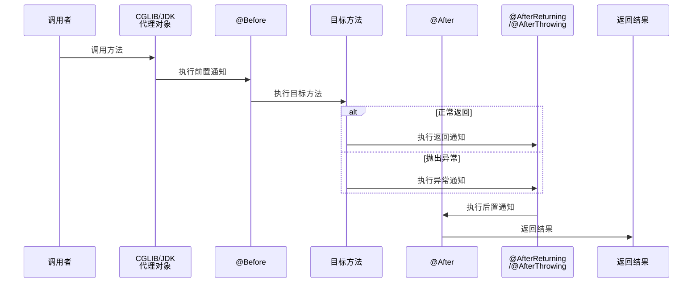

# Spring AOP 原理

> 目标级别：P6
>
> 面试命中率：90%

## 快速自测

1. Spring AOP 的代理创建时机是什么时候？发生在哪个阶段？
2. JDK 动态代理和 CGLIB 有什么区别？Spring 默认用哪个？
3. `@Before` 和 `@AfterReturning` 的执行顺序是怎样的？

如果这三道题都能完整回答，说明 AOP 核心原理已经掌握。如果有疑问，请继续往下看。

---

## 一、为什么需要 AOP

传统 OOP 编程中，如果需要对多个业务方法添加统一的日志、事务、安全检查等切面逻辑，通常有几种方式：

| 方式 | 缺点 |
| --- | --- |
| 在每个方法中直接编写 | 代码重复，违反 DRY 原则 |
| 继承父类 | 类层次结构复杂，单继承限制 |
| 装饰器模式 | 包装链太长，性能开销大 |

AOP（面向切面编程）通过将**横切关注点**与**业务主体**分离，解决了上述问题。

---

## 二、AOP 核心概念

| 概念 | 说明 |
| --- | --- |
| **Join Point（连接点）** | 程序执行过程中的某个点，如方法调用、异常抛出 |
| **Pointcut（切点）** | 定位连接点的表达式，如 `execution(* com.example.*.*(..))` |
| **Advice（通知）** | 切点处执行的逻辑，包括 `@Before`、`@After`、`@Around` 等 |
| **Aspect（切面）** | Pointcut + Advice 的组合 |
| **Weaving（织入）** | 将切面逻辑应用到目标对象的过程 |

### 五种通知类型

```java
@Aspect
@Component
public class MyAspect {

    // 前置通知：在目标方法执行前调用
    @Before("execution(* com.example.service.*.*(..))")
    public void before(JoinPoint joinPoint) {
        System.out.println("方法执行前执行");
    }

    // 后置通知：在目标方法执行后调用（无论是否异常）
    @After("execution(* com.example.service.*.*(..))")
    public void after(JoinPoint joinPoint) {
        System.out.println("方法执行后执行");
    }

    // 返回通知：目标方法正常返回后调用
    @AfterReturning(pointcut = "execution(* com.example.service.*.*(..))", returning = "result")
    public void afterReturning(JoinPoint joinPoint, Object result) {
        System.out.println("方法返回后执行，结果：" + result);
    }

    // 异常通知：目标方法抛出异常后调用
    @AfterThrowing(pointcut = "execution(* com.example.service.*.*(..))", throwing = "e")
    public void afterThrowing(JoinPoint joinPoint, Exception e) {
        System.out.println("方法异常后执行，异常：" + e.getMessage());
    }

    // 环绕通知：包裹目标方法，可控制是否执行以及如何执行
    @Around("execution(* com.example.service.*.*(..))")
    public Object around(ProceedingJoinPoint joinPoint) throws Throwable {
        System.out.println("环绕前置");
        Object result = joinPoint.proceed();  // 执行目标方法
        System.out.println("环绕后置");
        return result;
    }
}
```

---

## 三、代理创建时机

> ⚠️ **核心面试点**：Spring AOP 的代理对象是在 **`initializeBean`** 阶段创建的，发生在属性填充之后。

### Bean 生命周期与 AOP 代理的关系

```mermaid
sequenceDiagram
    participant Container as Spring 容器
    participant Create as 实例化<br/>(createBeanInstance)
    participant Populate as 属性填充<br/>(populateBean)
    participant Init as 初始化<br/>(initializeBean)
    participant PPBefore as BeanPostProcessor<br/>.postProcessBeforeInitialization
    participant InitMethod as 初始化方法
    participant PPAfter as BeanPostProcessor<br/>.postProcessAfterInitialization
    participant Proxy as AOP 代理<br/>创建完成

    Container->>Create: 1. 创建 Bean 实例
    Create->>Populate: 2. 属性填充
    Populate->>Init: 3. 开始初始化
    Init->>PPBefore: 4. 前置处理
    PPBefore->>InitMethod: 5. 调用初始化方法
    InitMethod->>PPAfter: 6. 后置处理
    PPAfter->>Proxy: 7. 生成 AOP 代理对象

    Note over Proxy: ⚠️ 注意：此时才创建代理！
```

### 源码解析

```java title="AbstractAutowireCapableBeanFactory.java"
protected Object initializeBean(String beanName, Object bean, RootBeanDefinition mbd) {
    // 1. 调用 xxxAware 接口方法
    invokeAwareMethods(beanName, bean);

    // 2. BeanPostProcessor 前置处理
    wrappedBean = applyBeanPostProcessorsBeforeInitialization(wrappedBean, beanName);

    // 3. 调用初始化方法
    invokeInitMethods(beanName, wrappedBean, mbd);

    // 4. BeanPostProcessor 后置处理（AOP 代理在这里创建！）
    wrappedBean = applyBeanPostProcessorsAfterInitialization(wrappedBean, beanName);

    return wrappedBean;
}
```

### AbstractAutoProxyCreator 的后置处理

```java title="AbstractAutoProxyCreator.java"
public Object postProcessAfterInitialization(Object bean, String beanName) {
    // 如果需要代理，创建代理对象
    if (bean != null && shouldSkip(beanName, getBeanType(beanName))) {
        return bean;
    }

    // 创建代理的时机在这里！
    Object proxy = wrapIfNecessary(bean, beanName);
    return proxy;
}
```

---

## 四、JDK 动态代理 vs CGLIB

### 对比表

| 对比维度 | JDK 动态代理 | CGLIB 动态代理 |
| --- | --- | --- |
| **实现方式** | 实现目标接口 `InvocationHandler` | 继承目标类的子类 |
| **要求** | 目标类必须实现接口 | 目标类不能被 `final` 修饰 |
| **性能** | 反射调用，性能略差 | 直接调用，性能更好 |
| **生成方式** | 生成 `$Proxy+N` 类 | 生成目标类的子类 `.class` |
| **方法调用** | 通过 `invoke()` 方法 | 直接调用父类方法 |

### Spring 默认选择策略

```java title="ProxyReactiveWebServerFactory.java"
public AopProxy createAopProxy(AdvisedSupport config) {
    // 如果配置了 optimize 或 proxyTargetClass=true，使用 CGLIB
    if (config.getProxyTargetClass() || 
        // 或者目标类没有实现接口，使用 CGLIB
        !AdvisedProxyFactory.class.isAssignableFrom(config.getTargetClass())) {
        return new CglibAopProxy(config);
    }
    // 否则使用 JDK 动态代理
    return new JdkDynamicAopProxy(config);
}
```

### Spring Boot 2.x 之后的默认行为

从 Spring Boot 2.x 开始，**默认使用 CGLIB 代理**（`proxy-target-class=true`），可以通过配置修改：

```yaml title="application.yml"
spring:
  aop:
    proxy-target-class: false  # 改为使用 JDK 动态代理
```

> ⚠️ **注意**：如果配置为 `false`，但目标类没有实现接口，仍然会降级为 CGLIB。

### CGLIB 的限制

```java
// ❌ 不能代理 final 类
public final class FinalClass { }

// ❌ 不能代理 final 方法（会被跳过）
public class MyService {
    public final void method() { }
}
```

---

## 五、通知执行顺序

### 执行流程图



### @Around 包裹一切

`@Around` 通知可以完全控制目标方法的执行，是最强大的通知类型。

```java
@Around("execution(* com.example.*.*(..))")
public Object around(ProceedingJoinPoint joinPoint) {
    try {
        // 前置逻辑
        System.out.println("调用前");

        // 执行目标方法
        Object result = joinPoint.proceed();

        // 后置逻辑
        System.out.println("调用后");

        return result;
    } catch (Exception e) {
        // 异常处理
        System.out.println("异常：" + e.getMessage());
        throw e;
    }
}
```

### 多个通知的执行顺序

如果同一个切点有多个同类型通知，按配置顺序执行：

```java
@Aspect
@Component
public class OrderAspect {

    @Before("execution(* com.example.*.*(..))")
    public void before1() {
        System.out.println("before1");
    }

    @Before("execution(* com.example.*.*(..))")
    public void before2() {
        System.out.println("before2");
    }
}
// 执行顺序：before1 -> before2 -> 目标方法
```

---

## 六、源码解析：AOP 代理创建流程

### 完整流程

```java title="AbstractAutoProxyCreator.java"
public Object postProcessAfterInitialization(Object bean, String beanName) {
    // 1. 获取增强器列表
    List<Advisor> candidateAdvisors = findCandidateAdvisors();

    // 2. 筛选适用于该 Bean 的增强器
    List<Advisor> eligibleAdvisors = findEligibleAdvisors(candidateAdvisors, beanName);

    // 3. 如果有增强器，创建代理
    if (!eligibleAdvisors.isEmpty()) {
        return createProxy(beanClass, bean, eligibleAdvisors);
    }

    return bean;
}

protected Object createProxy(Class<?> beanClass, String beanName,
                           List<Advisor> advisors) {
    // 创建代理工厂
    ProxyFactory proxyFactory = new ProxyFactory();
    proxyFactory.copyFrom(this);

    // 选择 JDK 代理或 CGLIB
    proxyFactory.setProxyTargetClass(true);

    // 设置增强器
    proxyFactory.addAdvisors(advisors);

    // 创建代理
    return proxyFactory.getProxy();
}
```

---

## 七、高频面试题

### 🔴 第一层：Spring AOP 的代理创建时机是什么时候？

**答案要点**：
1. 发生在 Bean 初始化阶段的 `postProcessAfterInitialization` 方法中
2. 具体流程：实例化 → 属性填充 → 初始化 → 后置处理 → 生成代理
3. 如果 Bean 被 BeanPostProcessor 处理时发现需要代理，则创建代理对象

### 🔴 第二层：JDK 动态代理和 CGLIB 有什么区别？

**答案要点**：
1. JDK 动态代理要求目标类实现接口，通过 `InvocationHandler` 实现
2. CGLIB 通过继承目标类生成子类实现，性能更好
3. Spring Boot 2.x 默认使用 CGLIB
4. CGLIB 不能代理 `final` 类和 `final` 方法

### 🔴 第三层：@Around 和其他通知的区别是什么？

**答案要点**：
1. `@Around` 可以完全控制目标方法是否执行以及如何执行
2. `@Around` 必须接收 `ProceedingJoinPoint` 参数，并调用 `proceed()` 执行目标方法
3. 其他通知不能阻止目标方法执行
4. 多个 `@Around` 时，只有外层的可以调用 `proceed()`

### 🟡 第四层：AOP 失效的场景有哪些？

**答案要点**：
1. 目标方法内部调用 `this.xxx()`，不走代理
2. 私有方法无法被代理
3. 构造器方法不会被代理
4. 静态方法无法被代理

---

## 八、常见陷阱

> ⚠️ **陷阱一**：认为 AOP 在 Bean 实例化时创建

AOP 代理是在 `initializeBean` 阶段创建的，在属性填充之后。如果在 `@PostConstruct` 或构造函数中调用被代理方法，代理可能尚未生效。

> ⚠️ **陷阱二**：在同一个类中调用被 `@Transactional` 标��的方法

这是最常见的 AOP 失效场景。`this.xxx()` 调用的是原始对象，而非代理对象。

```java
@Service
public class UserService {

    public void methodA() {
        // ⚠️ this.methodB() 不走代理，事务不生效！
        this.methodB();
    }

    @Transactional
    public void methodB() {
        // 数据库操作
    }
}
```

正确做法：

```java
@Service
public class UserService {

    @Autowired
    private UserService self;  // 注入代理对象

    public void methodA() {
        // ✅ 通过代理对象调用，走 AOP
        self.methodB();
    }

    @Transactional
    public void methodB() {
        // 数据库操作
    }
}
```

> ⚠️ **陷阱三**：配置了 `@EnableAspectJAutoProxy(exposeProxy = false)` 导致无法获取代理

如果需要在被代理方法中获取代理对象，需要设置 `exposeProxy = true`，然后通过 `AopContext.currentProxy()` 获取。

---

## 九、对比总结

| 对比维度 | JDK 动态代理 | CGLIB 动态代理 |
| --- | --- | --- |
| 实现原理 | 实现接口 + `InvocationHandler` | 继承子类 + MethodInterceptor |
| 性能 | 反射调用，较慢 | 直接调用较快 |
| 代理类生成 | 生成 `$Proxy+N` | 生成 `.class` 文件 |
| 限制 | 目标类必须实现接口 | 目标类不能是 `final` |
| Spring 默认 | ❌ | ✅（Spring Boot 2.x） |

---

## 十、扩展思考

### 💡 为什么 Spring 选择在初始化阶段创建代理？

**答案**：
1. 在属性填充阶段，Bean 的依赖关系还未完全建立
2. 如果在属性填充前创建代理，可能导致依赖注入失败
3. 初始化阶段所有依赖都已注入完毕，可以正确判断是否需要代理

### 💡 如何让 final 方法也能被代理？

**答案**：无法直接代理 `final` 方法。可以考虑：
1. 移除 `final` 修饰符
2. 将需要被代理的逻辑抽取到另一个 Bean 中
3. 使用 AspectJ 编译时织入（AspectJ LTW）

---

掌握 Spring AOP ���理，不仅要理解代理的创建时机，还要掌握 JDK 代理和 CGLIB 的区别，以及各种通知的执行顺序。这些知识在面试中往往会被深入追问。
