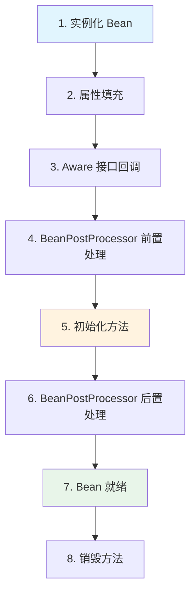
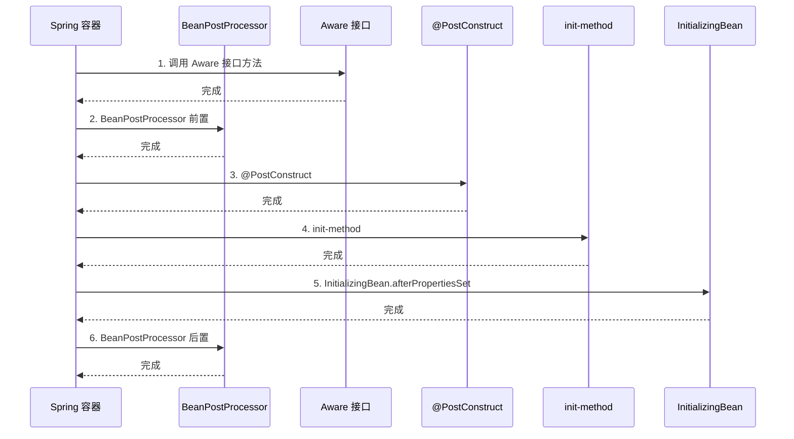

# Bean 生命周期

> 目标级别：P6
>
> 面试命中率：75%

## 快速自测

1. Bean 完整生命周期包括哪些阶段？
2. BeanPostProcessor 在哪个阶段被调用？
3. InitializingBean 和 @PostConstruct 的执行顺序是什么？

---

## 一、Bean 生命周期详解



### 完整生命周期源码

```java title="AbstractAutowireCapableBeanFactory.java"
protected Object doCreateBean(String beanName, ...) {
    // 1. 实例化
    BeanWrapper instanceWrapper = createBeanInstance(beanName, mbd, args);

    // 2. 属性填充
    populateBean(beanName, mbd, instanceWrapper);

    // 3. 初始化
    Object exposedObject = initializeBean(beanName, bean, mbd);

    return exposedObject;
}

protected Object initializeBean(String beanName, Object bean, RootBeanDefinition mbd) {
    // 3.1 Aware 接口回调
    invokeAwareMethods(beanName, bean);

    // 3.2 BeanPostProcessor 前置处理
    wrappedBean = applyBeanPostProcessorsBeforeInitialization(bean, beanName);

    // 3.3 初始化方法
    invokeInitMethods(beanName, wrappedBean, mbd);

    // 3.4 BeanPostProcessor 后置处理
    wrappedBean = applyBeanPostProcessorsAfterInitialization(bean, beanName);

    return wrappedBean;
}
```

---

## 二、Aware 接口详解

| Aware 接口 | 回调方法 | 注入内容 |
| --- | --- | --- |
| BeanNameAware | setBeanName | Bean 的名称 |
| BeanFactoryAware | setBeanFactory | BeanFactory |
| ApplicationContextAware | setApplicationContext | ApplicationContext |
| EnvironmentAware | setEnvironment | Environment |
| ResourceLoaderAware | setResourceLoader | ResourceLoader |
| MessageSourceAware | setMessageSource | MessageSource |
| ApplicationEventPublisherAware | setApplicationEventPublisher | 事件发布器 |

---

## 三、初始化方法执行顺序



**执行顺序**：@PostConstruct → init-method → InitializingBean

---

## 四、高频面试题

### 🔴 第一层：Bean 生命周期包括哪些阶段？

**答案要点**：
1. 实例化 → 属性填充 → Aware 接口 → BeanPostProcessor 前置 → 初始化 → BeanPostProcessor 后置

### 🟡 第二层：@PostConstruct 和 InitializingBean 的执行顺序？

**答案要点**：
1. @PostConstruct 先执行
2. 然后是 init-method
3. 最后是 InitializingBean.afterPropertiesSet

---

## 五、示例代码

```java
@Component
public class UserService implements InitializingBean {

    @PostConstruct
    public void init() {
        System.out.println("@PostConstruct 执行");
    }

    public void initMethod() {
        System.out.println("init-method 执行");
    }

    @Override
    public void afterPropertiesSet() throws Exception {
        System.out.println("InitializingBean 执行");
    }
}
```

```xml
<bean id="userService" class="com.example.UserService" init-method="initMethod"/>
```

---

## 六、常见陷阱

> ⚠️ **陷阱一**：@PostConstruct 方法中调用被代理的方法

@PostConstruct 在 BeanPostProcessor 前置处理之后执行，此时 AOP 代理已创建，但某些场景下可能还不是代理对象。

> ⚠️ **陷阱二**：在 init-method 中抛出异常

如果在 init-method 中抛出异常，Bean 初始化失败，Spring 会尝试销毁已创建的部分，可能导致资源泄漏。

---

## 七、对比总结

| 初始化方式 | 配置方式 | 执行顺序 | 推荐程度 |
| --- | --- | --- | --- |
| @PostConstruct | 注解 | 第一 | ⭐⭐⭐ |
| init-method | XML/Java Config | 第二 | ⭐⭐ |
| InitializingBean | 实现接口 | 第三 | ⭐ |
