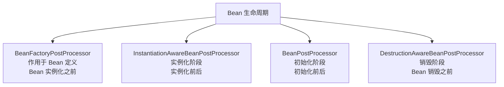
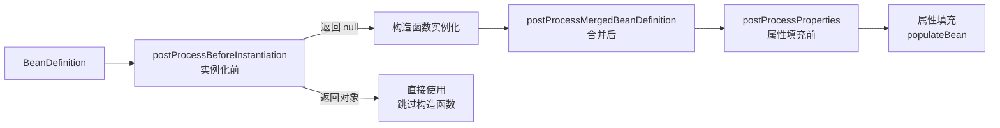

候选人小孙在面试阿里P6时，面试官问道：

"Spring 的 BeanPostProcessor 用过吗？它是干什么的？"

小孙说："用来对 Bean 进行增强的，在初始化前后做一些处理。"

面试官追问："那它和 InstantiationAwareBeanPostProcessor 有什么区别？和 BeanFactoryPostProcessor 呢？"

小孙支支吾吾答不上来。

面试官继续问："那 Spring AOP 的代理是怎么创建出来的？是谁调用了 CGLIB 或 JDK 动态代理？"

小周彻底卡住。

【面试官心理】
这道题我是在测候选人对 Spring 扩展机制的理解深度。BeanPostProcessor 是 Spring 的核心扩展点，几乎所有"神奇"功能（AOP 代理、注解注入、生命周期回调）都靠它。知道名字的占 60%，能说出三种后置处理器区别的占 25%，能讲清 AOP 代理创建流程的只有 10%。

## 一、后置处理器家族全景 🔴

Spring 的后置处理器分为三大类，分别作用于 Bean 生命周期的不同阶段：



### 1.1 三类后置处理器对比

| 类型 | 作用阶段 | 典型实现 | 典型用途 |
| --- | --- | --- | --- |
| `BeanFactoryPostProcessor` | Bean 定义加载后，实例化前 | `PropertySourcesPlaceholderConfigurer`、`ConfigurationClassPostProcessor` | 修改 Bean 定义、属性占位符替换、组件扫描 |
| `InstantiationAwareBeanPostProcessor` | 实例化前后 | `AutowiredAnnotationBeanPostProcessor`、`AnnotationAwareAspectJAutoProxyCreator` | 依赖注入、创建代理 |
| `BeanPostProcessor` | 初始化前后 | `RequiredAnnotationBeanPostProcessor`、`CommonAnnotationBeanPostProcessor` | @PostConstruct、@PreDestroy、生命周期增强 |

:::warning ⚠️
记住一个关键区别：**BeanFactoryPostProcessor 操作的是 BeanDefinition（ Bean 的蓝图），后两者操作的是 Bean 实例**。
:::

## 二、BeanFactoryPostProcessor 🔴

### 2.1 它能做什么

在 Spring 容器实例化任何 Bean 之前，修改 Bean 的定义信息。

```java
public interface BeanFactoryPostProcessor {
    void postProcessBeanFactory(ConfigurableListableBeanFactory beanFactory)
        throws BeansException;
}
```

### 2.2 最经典案例：属性占位符替换

```java
// @Value("${jdbc.url}") 背后是谁在工作？
// 答案是：PropertySourcesPlaceholderConfigurer
// 它是一个 BeanFactoryPostProcessor

public class PropertySourcesPlaceholderConfigurer
        extends PlaceholderResolver
        implements BeanFactoryPostProcessor {

    @Override
    public void postProcessBeanFactory(ConfigurableListableBeanFactory beanFactory)
            throws BeansException {
        // 遍历所有 Bean 定义
        for (String beanName : beanFactory.getBeanDefinitionNames()) {
            BeanDefinition bd = beanFactory.getBeanDefinition(beanName);

            // 解析属性占位符：${jdbc.url} → 实际值
            PropertyValues pvs = bd.getPropertyValues();
            MutablePropertyValues mpvs = new MutablePropertyValues(pvs);

            for (PropertyValue pv : pvs.getPropertyValues()) {
                Object value = resolvePlaceholder(
                    resolveEmbeddedValue(pv.getValue()), ...);
                mpvs.add(pv.getName(), value);
            }
            bd.setPropertyValues(mpvs);
        }
    }
}
```

### 2.3 更强大的案例：ConfigurationClassPostProcessor

Spring Boot 的 `@SpringBootApplication` 注解包含 `@ComponentScan`，扫描到的类最终通过 `ConfigurationClassPostProcessor` 被解析成 `BeanDefinition` 并注册到容器中。

```java
// BeanDefinitionRegistryPostProcessor 继承自 BeanFactoryPostProcessor
public interface BeanDefinitionRegistryPostProcessor
        extends BeanFactoryPostProcessor {

    void postProcessBeanDefinitionRegistry(BeanDefinitionRegistry registry)
        throws BeansException;  // 多了注册能力
}

// ConfigurationClassPostProcessor 在这里注册新的 BeanDefinition
@Override
public void postProcessBeanDefinitionRegistry(BeanDefinitionRegistry registry) {
    // 1. 解析 @ComponentScan → 扫描并注册 Bean 定义
    // 2. 解析 @Import → 注册 ImportBeanDefinitionRegistrar
    // 3. 解析 @Bean → 将方法注册为 Bean 定义
    // 4. 解析 @Configuration → 处理配置类
}
```

:::tip 💡
`BeanDefinitionRegistryPostProcessor` 是 `BeanFactoryPostProcessor` 的子类，专门用于动态注册新的 Bean 定义。Spring Boot 的自动配置就是靠它实现的。
:::

## 三、InstantiationAwareBeanPostProcessor 🔴

### 3.1 作用阶段



### 3.2 核心案例一：@Autowired 注入原理

`AutowiredAnnotationBeanPostProcessor` 是 `@Autowired` 和 `@Value` 注解的幕后英雄：

```java
public class AutowiredAnnotationBeanPostProcessor
        extends InstantiationAwareBeanPostProcessor
        implements MergedBeanDefinitionPostProcessor {

    // 存储所有需要注入的字段和方法信息（构建在类级别）
    private final Map<Class<?>, InjectionMetadata> injectionCache =
        new ConcurrentHashMap<>(256);

    // 在实例化后、属性填充前，收集所有 @Autowired 标注的成员
    @Override
    public PropertyValues postProcessProperties(
            PropertyValues pvs, Object bean, String beanName) {
        // 找到这个 Bean 类中所有需要注入的成员
        InjectionMetadata metadata = findAutowiringMetadata(bean.getClass());
        // 执行注入
        metadata.inject(bean, beanName, pvs);
        return pvs;
    }
}

// InjectionMetadata 持有所有待注入的成员信息
public class InjectionMetadata {
    private final Class<?> targetClass;
    private final Collection<InjectedElement> injectedElements;

    public void inject(Object target, String beanName, PropertyValues pvs) {
        for (InjectedElement element : injectedElements) {
            element.inject(target, beanName, pvs);  // 反射注入
        }
    }
}
```

### 3.3 核心案例二：Spring AOP 代理创建

`AnnotationAwareAspectJAutoProxyCreator`（或 Spring Boot 中的 `AutoProxyCreator`）也是一个 InstantiationAwareBeanPostProcessor：

```java
public class AnnotationAwareAspectJAutoProxyCreator
        extends AbstractAutoProxyCreator
        implements InstantiationAwareBeanPostProcessor,
                   BeanFactoryAware {

    @Override
    public Object postProcessBeforeInstantiation(
            Class<?> beanClass, String beanName) throws BeansException {
        // 判断这个 Bean 是否需要创建代理
        // 1. 检查 @AspectJ 切面
        // 2. 检查 Advisor 是否匹配
        if (shouldSkip(beanClass, beanName)) {
            return null;  // 跳过，不创建代理
        }

        // 2. 创建代理（关键！）
        Object proxy = createProxy(
            beanClass, beanName,
            new TargetSource(beanClass),  // 目标对象
            getInterceptorsAndDynamicInterceptionAdvice(beanClass, beanName)  // 通知
        );

        return proxy;  // 返回代理对象，跳过普通实例化！
    }
}
```

:::tip 💡
这就是 Spring AOP"神奇"的地方：你声明了 `@Aspect` 和 `@Around`，但从来没有手动调用过创建代理的代码——所有的一切都在 `postProcessBeforeInstantiation` 中自动完成了。
:::

### 3.4 源码验证

```java
// AbstractAutowireCapableBeanFactory.resolveBeforeInstantiation
protected Object resolveBeforeInstantiation(String beanName,
                                             RootBeanDefinition mbd) {
    Class<?> targetType = mbd.getBeanClass();
    if (targetType != null) {
        // 调用 postProcessBeforeInstantiation
        Object bean = applyBeanPostProcessorsBeforeInstantiation(
            targetType, beanName);
        if (bean != null) {
            // 如果返回了对象，调用 postProcessAfterInitialization
            bean = applyBeanPostProcessorsAfterInitialization(bean, beanName);
        }
    }
    return bean;
}
```

## 四、BeanPostProcessor 🔴

### 4.1 与 InstantiationAwareBean 的区别

```java
public interface BeanPostProcessor {
    // 初始化前回调
    Object postProcessBeforeInitialization(Object bean, String beanName);

    // 初始化后回调
    Object postProcessAfterInitialization(Object bean, String beanName);
}
```

**BeanPostProcessor 在所有 InstantiationAwareBeanPostProcessor 之后工作**，且不参与实例化阶段：

| 特性 | InstantiationAwareBeanPostProcessor | BeanPostProcessor |
| --- | --- | --- |
| 实例化前 | ✅ postProcessBeforeInstantiation | ❌ |
| 实例化后 | ✅ postProcessMergedBeanDefinition | ❌ |
| 属性填充前 | ✅ postProcessProperties | ❌ |
| 属性填充后 | ❌ | ✅ postProcessBeforeInitialization |
| 初始化前 | ❌ | ✅ postProcessBeforeInitialization |
| 初始化后 | ❌ | ✅ postProcessAfterInitialization |

### 4.2 核心实现：CommonAnnotationBeanPostProcessor

处理 `@PostConstruct`、`@PreDestroy`、`@Resource` 等注解：

```java
public class CommonAnnotationBeanPostProcessor
        extends BeanPostProcessor
        implements DestructionAwareBeanPostProcessor {

    private final InitDestroyAnnotationBeanPostProcessor lifecycleMetadataProcessor =
        new InitDestroyAnnotationBeanPostProcessor();

    @Override
    public Object postProcessBeforeInitialization(Object bean, String beanName) {
        // 调用 @PostConstruct 方法
        lifecycleMetadataProcessor.postProcessBeforeInitialization(
            bean, beanName);
        return bean;
    }

    @Override
    public void postProcessBeforeDestruction(Object bean, String beanName) {
        // 调用 @PreDestroy 方法
        lifecycleMetadataProcessor.postProcessBeforeDestruction(
            bean, beanName);
    }
}
```

## 五、❌ 错误示范

### 翻车点一：混淆三类后置处理器

**候选人原话**："BeanPostProcessor 可以修改 Bean 定义。"

BeanPostProcessor 操作的是实例，不是定义。修改定义要用 BeanFactoryPostProcessor。

### 翻车点二：不知道 AOP 代理的创建位置

**候选人原话**："Spring AOP 通过 AspectJ 织入编译器在编译时创建代理。"

实际上，Spring AOP（默认）通过 `AnnotationAwareAspectJAutoProxyCreator` 在运行时通过 InstantiationAwareBeanPostProcessor.postProcessBeforeInstantiation 创建代理。

### 翻车点三：BeanFactoryPostProcessor 不会自动注册

**候选人原话**："BeanFactory 里也能用 BeanFactoryPostProcessor。"

BeanFactory 不会自动发现和注册 BeanFactoryPostProcessor。ApplicationContext 才会在 refresh() 中自动注册所有 BeanFactoryPostProcessor。

## 六、标准回答

### P5 级别

> Spring 的后置处理器分为三类：BeanFactoryPostProcessor 在实例化前修改 Bean 定义；InstantiationAwareBeanPostProcessor 在实例化前后工作；BeanPostProcessor 在初始化前后工作。它们分别作用于 Bean 的定义、实例化和初始化阶段。

### P6 级别

> BeanFactoryPostProcessor 操作 BeanDefinition，可以修改 Bean 的属性或注册新的 Bean，典型实现是 PropertySourcesPlaceholderConfigurer（处理 `${}` 占位符）和 ConfigurationClassPostProcessor（处理组件扫描）。InstantiationAwareBeanPostProcessor 作用于实例化阶段，核心是 @Autowired 注解处理器 AutowiredAnnotationBeanPostProcessor（通过 postProcessProperties 注入）和 Spring AOP 代理创建器 AnnotationAwareAspectJAutoProxyCreator（通过 postProcessBeforeInstantiation 返回代理对象）。BeanPostProcessor 作用于初始化阶段，处理 @PostConstruct/@PreDestroy 的 CommonAnnotationBeanPostProcessor 和 @Required 的 RequiredAnnotationBeanPostProcessor 都是这个类型的典型实现。

### P7 级别

> Spring 后置处理器链是"插件式架构"的完美示范。整个 Spring 框架几乎所有核心功能都以后置处理器的形式存在：你想要修改 Bean 定义，就实现 BeanFactoryPostProcessor；想要在实例化前拦截或修改实例，就实现 InstantiationAwareBeanPostProcessor；想要在初始化阶段包装 Bean，就实现 BeanPostProcessor。Spring Boot 的自动配置本质上就是在 BeanFactoryPostProcessor 中动态注册了大量 Bean 定义。理解了这一层，你就理解了 Spring 框架的核心扩展哲学——框架本身只提供插槽，具体功能由用户插入的后置处理器决定。

## 七、追问升级 🟡

### 追问1：后置处理器的执行顺序由什么决定？

```java
// 实现 Ordered 接口或 @Order 注解
// 数字越小越先执行（与 Spring 的 Ordered 语义一致）

// Spring 内置处理器的顺序：
// 1. ConfigurationClassPostProcessor = Ordered.HIGHEST_PRECEDENCE（最高）
// 2. AutowiredAnnotationBeanPostProcessor = Ordered.LOWEST_PRECEDENCE（最低）
```

### 追问2：能否在代码中手动注册后置处理器？

可以：

```java
AnnotationConfigApplicationContext ctx =
    new AnnotationConfigApplicationContext(AppConfig.class);

// 手动注册
ctx.addBeanFactoryPostProcessor(new MyBeanFactoryPostProcessor());
ctx.addBeanPostProcessor(new MyBeanPostProcessor());
ctx.refresh();
```

### 追问3：@Async 的代理是怎么创建的？

`AsyncAnnotationBeanPostProcessor` 也是一个 BeanPostProcessor/InstantiationAwareBeanPostProcessor：

```java
// 在 postProcessAfterInitialization 中创建异步代理
@Override
public Object postProcessAfterInitialization(Object bean, String beanName) {
    if (this.advisor != null) {
        return createProxy(bean.getClass(), ...);  // 返回代理
    }
    return bean;
}
```

【面试官心理】
这道题我通常从"BeanPostProcessor 和 InstantiationAwareBeanPostProcessor 的区别"开始追问，逐步深入到 Spring AOP 的代理创建流程。能说出 AnnotationAwareAspectJAutoProxyCreator 在 postProcessBeforeInstantiation 中返回代理的凤毛麟角，但这是 Spring AOP 最核心的机制。
