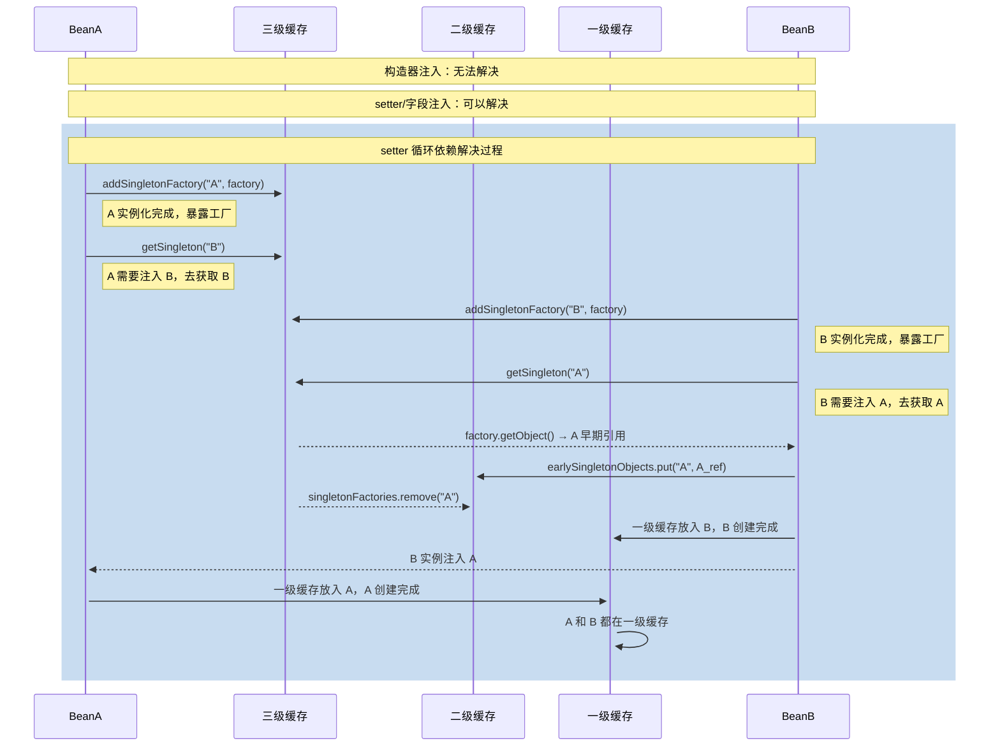

候选人小钱在面试字节P6时，面试官问道：

"Spring 是怎么解决循环依赖的？"

小钱说："用三级缓存，singletonObjects、earlySingletonObjects、singletonFactories..."

面试官追问："三级缓存分别存什么？为什么要三级，两级不够吗？"

小钱说："singletonObjects 存完整对象，early 存早期对象..."

面试官继续问："那 earlySingletonObjects 里的对象是什么时候放进去的？Bean 还没完成属性注入怎么就放进去了？"

小钱支支吾吾答不上来。

面试官："setter 注入能解决循环依赖，那构造器注入呢？为什么不能解决？"

小钱彻底卡住。

【面试官心理】
这道题我用来筛选那些真正看过 Spring 源码的人。三级缓存是 Spring 最复杂也是最精妙的机制之一。知道名字的占 80%，能说出三级缓存作用的占 40%，能讲清为什么构造器注入无法解决的只有 15%。循环依赖是 Spring 源码中最容易露馅的地方。

## 一、什么是循环依赖 🔴

### 1.1 三种循环依赖

```java
// 1. 字段注入循环依赖
@Service
public class A {
    @Autowired private B b;
}
@Service
public class B {
    @Autowired private A a;
}

// 2. setter 注入循环依赖
@Service
public class A {
    private B b;
    @Autowired
    public void setB(B b) { this.b = b; }
}
@Service
public class B {
    private A a;
    @Autowired
    public void setA(A a) { this.a = a; }
}

// 3. 构造器循环依赖（Spring 无法解决）
@Service
public class A {
    private B b;
    public A(B b) { this.b = b; }
}
@Service
public class B {
    private A a;
    public B(A a) { this.a = a; }
}
```

### 1.2 循环依赖的可解决范围

```mermaid
graph TD
    A[Spring 循环依赖解决能力] --> B[setter 注入<br/>✅ 可解决]
    A --> C[@Autowired/@Value 字段注入<br/>✅ 可解决]
    A --> D[构造器注入<br/>❌ 无法解决]
    A --> E[prototype Bean<br/>❌ 无法解决]
    A --> F[depends-on 强制依赖<br/>❌ 无法解决]
```

## 二、三级缓存详解 🔴

### 2.1 三级缓存的数据结构

```java
public class DefaultSingletonBeanRegistry extends SimpleAliasRegistry {

    // 一级缓存：完全初始化好的 Bean（可以直接使用）
    private final Map<String, Object> singletonObjects =
        new ConcurrentHashMap<>(256);

    // 二级缓存：提前曝光的 Bean（实例已创建，但属性未注入）
    private final Map<String, Object> earlySingletonObjects =
        new ConcurrentHashMap<>(256);

    // 三级缓存：Bean 的早期工厂（用于创建早期引用的回调）
    private final Map<String, ObjectFactory<?>> singletonFactories =
        new ConcurrentHashMap<>(256);

    // 正在创建中的 Bean 名称集合
    private final Set<String> singletonsCurrentlyInCreation =
        Collections.newSetFromMap(new ConcurrentHashMap<>(16));
}
```

### 2.2 getSingleton 核心逻辑

```java
public Object getSingleton(String beanName) {
    return getSingleton(beanName, true);
}

protected Object getSingleton(String beanName, boolean allowEarlyReference) {
    // 1. 先查一级缓存：已完全初始化的单例
    Object singletonObject = singletonObjects.get(beanName);
    if (singletonObject == null && isSingletonCurrentlyInCreation(beanName)) {
        // 2. 一级缓存没有，正在创建中，查二级缓存
        synchronized (this.singletonObjects) {
            singletonObject = earlySingletonObjects.get(beanName);
            if (singletonObject == null && allowEarlyReference) {
                // 3. 二级缓存没有，查三级缓存并升级
                ObjectFactory<?> singletonFactory = singletonFactories.get(beanName);
                if (singletonFactory != null) {
                    singletonObject = singletonFactory.getObject();  // 调用回调
                    // 升级到二级缓存
                    earlySingletonObjects.put(beanName, singletonObject);
                    // 删除三级缓存
                    singletonFactories.remove(beanName);
                }
            }
        }
    }
    return singletonObject;
}
```

### 2.3 为什么要三级？逐层拆解

**假设只有一级缓存**：

```java
// ❌ 一级缓存的问题
Map<String, Object> singletonObjects = new HashMap<>();

// 线程 A 创建 A 属性注入时需要 B，去创建 B
// 线程 A 创建 B 属性注入时需要 A，此时去一级缓存找 A
// 问题：一级缓存里没有 A（A 还在创建中，没有完成）
// 结果：死循环 or NPE
```

**假设只有两级缓存（一级 + 二级）**：

```java
// ❌ 两级缓存的问题
Map<String, Object> singletonObjects = new HashMap<>();
Map<String, Object> earlySingletonObjects = new HashMap<>();

// A 属性注入时需要 B，去创建 B
// B 属性注入时需要 A，去一级缓存找 A → 没有（A 还在创建）
// 去二级缓存找 A → 没有（A 还没有创建！）
// 问题：二级缓存里也没有，因为 A 还没开始创建
```

**三级缓存的解决方案**：

```java
// ✅ 三级缓存的关键：提前暴露工厂

// 1. A 开始创建，调用 addSingletonFactory
protected void addSingletonFactory(String beanName,
                                   ObjectFactory<?> singletonFactory) {
    if (!this.singletonObjects.containsKey(beanName)) {
        // 把工厂放入三级缓存
        this.singletonFactories.put(beanName, singletonFactory);
        // 注意：此时一级和二级缓存都没有 A
    }
}

// 2. A 实例化完成后，立即暴露工厂（此时 B 可以通过工厂获取 A 的早期引用）
// 在 doCreateBean 中：
boolean earlySingletonExposure = mbd.isSingleton()
    && this.allowCircularReferences
    && isSingletonCurrentlyInCreation(beanName);

if (earlySingletonExposure) {
    addSingletonFactory(beanName,
        () -> getEarlyBeanReference(beanName, mbd, bean));  // ← 三级缓存存的就是这个
}

// 3. B 在属性注入时发现需要 A，去调用 getSingleton("A")
// getSingleton 查一级 → 没有（因为 A 还没创建完）
// 查二级 → 没有
// 查三级 → 有！调用 singletonFactory.getObject() → getEarlyBeanReference("A")
// getEarlyBeanReference 返回 A 的早期引用（可能已经被代理）
// B 拿到 A 的早期引用，继续创建 → B 创建完成
// 回到 A，继续属性注入 → A 创建完成
```

### 2.4 为什么需要二级缓存？

二级缓存是为了**避免重复调用 singletonFactory.getObject()**：

```java
// 如果只有三级缓存：
// B 获取 A 的早期引用 → 调用 factory.getObject() → 创建代理
// C 获取 A 的早期引用 → 又调用 factory.getObject() → 又创建代理
// 同一个 Bean 被创建了两次代理！

// 有二级缓存后：
// B 获取 A 的早期引用 → 调用 factory.getObject() → 创建代理 → 存入二级缓存
// C 获取 A 的早期引用 → 查二级缓存 → 直接取已有的代理 → 不会重复创建
```

:::tip 💡
getEarlyBeanReference 不仅是返回早期引用，它还负责创建代理。如果 Bean 被 AOP 切面覆盖，这里的工厂会返回一个代理对象而不是原始对象。这就是为什么循环依赖中的 Bean 能拿到代理对象的原因。
:::

## 三、循环依赖解决流程图 🔴



## 四、构造器注入为什么无法解决 🔴

这是面试中最容易被追问的深水区：

```java
// 构造器注入的循环依赖
@Service
public class A {
    private B b;
    public A(B b) {  // 构造器需要 B
        this.b = b;
    }
}

@Service
public class B {
    private A a;
    public B(A a) {  // 构造器需要 A
        this.a = a;
    }
}
```

**原因**：三级缓存解决循环依赖的前提是**实例化可以先于属性注入完成**。


**关键点**：在 `addSingletonFactory` 调用之前，Bean 必须已经实例化完成。构造器注入要求依赖在构造时就确定，而此时还没有暴露工厂，所以无法解决。

```java
// doCreateBean 中暴露工厂的时机：
BeanWrapper instanceWrapper = createBeanInstance(beanName, mbd, args);
// ↑ 实例化完成后

boolean earlySingletonExposure = mbd.isSingleton()
    && this.allowCircularReferences
    && isSingletonCurrentlyInCreation(beanName);

if (earlySingletonExposure) {
    addSingletonFactory(beanName, ...);  // ← 这里才暴露工厂
}

// 但构造器注入的"实例化"发生在 new A(B b) 那一刻
// 此时 A 还没有进入 doCreateBean，还没有暴露工厂
// 所以 B 无法从三级缓存获取 A 的早期引用
```

## 五、❌ 错误示范

### 翻车点一：把二级缓存当成多余的

**候选人原话**："二级缓存可以不要，有三级就够了。"

实际上二级缓存用于缓存代理对象，避免同一个 Bean 被重复代理。

### 翻车点二：认为所有循环依赖都能解决

**候选人原话**："Spring 通过三级缓存可以解决所有循环依赖。"

错了！构造器注入、prototype Bean、depends-on 强制依赖都无法解决。

### 翻车点三：不知道早期引用可能是代理对象

**候选人原话**："earlySingletonObjects 存的是原始对象。"

实际上通过 getEarlyBeanReference 返回的可能是代理对象（AOP 的工作）。

## 六、标准回答

### P5 级别

> Spring 通过三级缓存解决 setter 注入和字段注入的循环依赖。三级缓存分别是：singletonObjects（一级，完全初始化）、earlySingletonObjects（二级，提前曝光）、singletonFactories（三级，早期工厂）。构造器注入无法解决循环依赖，因为构造时就需要依赖对象，此时工厂还没暴露。

### P6 级别

> 流程是：Bean 实例化完成后立即调用 addSingletonFactory 将工厂放入三级缓存。属性注入时遇到循环依赖，通过 getSingleton 依次查询三级缓存，最终从三级缓存获取早期引用。二级缓存用于避免重复调用工厂创建代理对象。关键在于 getEarlyBeanReference 方法——它不仅返回早期引用，还负责创建 AOP 代理，所以循环依赖中的 Bean 拿到的是代理对象。构造器注入无法解决是因为构造函数执行时 Bean 还未进入 doCreateBean，工厂尚未暴露。

### P7 级别

> 三级缓存的设计本质上是"延迟代理创建"和"循环依赖解决"的权衡。一级缓存存完全体，二级缓存存过渡态，三级缓存存工厂。为什么要这样？因为 AOP 代理的创建时机很关键——如果 Bean 被切面覆盖，循环依赖中其他 Bean 需要拿到代理而不是原始对象。singletonFactory.getObject() 调用 getEarlyBeanReference，它会检查 Bean 是否需要被代理，需要则创建代理并返回。这解释了为什么 Spring AOP 在循环依赖场景下依然能正常工作。构造器注入无法解决的根因是：它要求依赖在构造时确定，此时连实例化都没完成，根本没有机会暴露工厂给其他 Bean 使用。

## 七、追问升级 🟡

### 追问1：prototype Bean 为什么不能解决循环依赖？

```java
// prototype Bean 每次 getBean 都创建新实例，不走三级缓存
@Override
public Object getBean(String name, Object... args) {
    for (String beanName : beanDefinitionNames) {
        if (mbd.isPrototype()) {
            // prototype 不注册到 singletonFactories
            // 每次都是新创建，无法通过缓存解决
            return createBean(beanName, mbd, args);
        }
    }
}
```

### 追问2：allowCircularReferences 是什么？

```java
// 默认 allowCircularReferences = true
// 如果关闭，循环依赖会直接抛异常
protected Object getSingleton(String beanName, boolean allowEarlyReference) {
    if (!allowEarlyReference) {
        throw new BeanCurrentlyInCreationException(beanName);
    }
    // ...
}
```

### 追问3：二级缓存升级后，三级缓存要不要清？

必须清！

```java
// DefaultSingletonBeanRegistry.getSingleton
ObjectFactory<?> singletonFactory = singletonFactories.get(beanName);
if (singletonFactory != null) {
    singletonObject = singletonFactory.getObject();
    earlySingletonObjects.put(beanName, singletonObject);  // 升级到二级
    singletonFactories.remove(beanName);  // 必须删除三级
    // 否则下次还会调用工厂，创建重复代理
}
```

【面试官心理】
这道题我追问的深度取决于候选人的表现。如果前两问答得不错，我会追问"为什么需要二级缓存"和"getEarlyBeanReference 为什么要检查切面"。这两问能答好的，基本都是看过源码的候选人。
