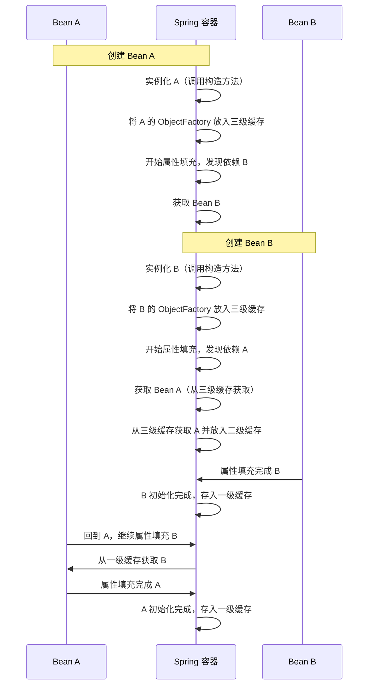
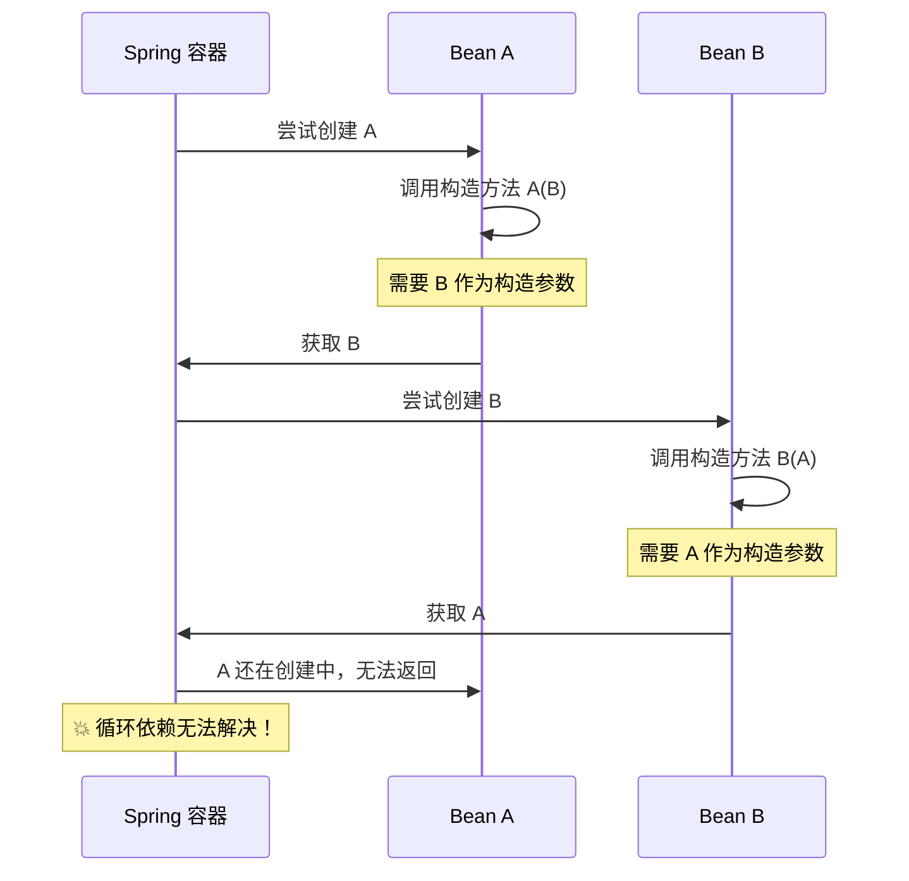

# 循环依赖与三级缓存

> 目标级别：P6
>
> 面试命中率：95%

## 快速自测

1. Spring 是如何解决循环依赖的？为什么要用三级缓存？
2. 构造器注入的循环依赖为什么无法解决？
3. Spring 默认允许循环依赖吗？如何配置？

如果这三道题都能完整回答，说明这块知识已经掌握。如果有疑问，请继续往下看。

---

## 一、什么是循环依赖

循环依赖是指两个或多个 Bean 之间相互依赖，形成闭环。例如：

```java
// A 依赖 B，B 依赖 A
@Service
public class A {
    @Autowired
    private B b;
}

@Service
public class B {
    @Autowired
    private A a;
}
```

Spring 创建 Bean 的顺序是：实例化 → 属性填充 → 初始化。如果不采取任何措施，A 在实例化后需要填充 b 属性，此时 b 还未创建，就会导致问题。

### 循环依赖的三种场景

| 场景 | 说明 | 能否解决 |
| --- | --- | --- |
| **Setter 注入 + 单例模式** | 属性注入，字段加 `@Autowired` | ✅ 可解决 |
| **构造器注入** | 构造方法参数依赖 | ❌ 无法解决 |
| **原型模式（Prototype）** | 每次获取都创建新实例 | ❌ 无法解决 |

---

## 二、三级缓存详解

Spring 使用三级缓存来解决单例模式下的循环依赖问题。

```java title="DefaultSingletonBeanRegistry.java"
public class DefaultSingletonBeanRegistry {

    // 一级缓存：成熟 Bean（已完成初始化，可直接使用）
    private final Map<String, Object> singletonObjects = new ConcurrentHashMap<>(256);

    // 二级缓存：早期 Bean（刚实例化，还未完成属性填充，用于提前暴露）
    private final Map<String, Object> earlySingletonObjects = new ConcurrentHashMap<>(16);

    // 三级缓存：单例工厂（用于创建早期引用，解决代理对象问题）
    private final Map<String, ObjectFactory<?>> singletonFactories = new HashMap<>(16);

}
```

### 三级缓存的作用

| 缓存 | 名称 | 内容 | 作用 |
| --- | --- | --- | --- |
| **singletonObjects** | 一级缓存 | 完全成品的 Bean | Bean 创建完成后存放，供直接使用 |
| **earlySingletonObjects** | 二级缓存 | 早期 Bean（半成品） | 解决循环依赖，提前暴露引用 |
| **singletonFactories** | 三级缓存 | 单例工厂 `ObjectFactory<?>` | 延迟创建早期引用，支持 AOP 代理 |

### 核心流程图



---

## 三、源码解析

### getSingleton 方法核心逻辑

```java title="DefaultSingletonBeanRegistry.java (Spring 源码)"
protected Object getSingleton(String beanName, boolean allowEarlyReference) {
    // 第一步：从一级缓存获取（成熟 Bean）
    Object singletonObject = singletonObjects.get(beanName);
    if (singletonObject == null && isSingletonCurrentlyInCreation(beanName)) {
        synchronized (singletonObjects) {
            // 第二步：从二级缓存获取（早期 Bean）
            singletonObject = earlySingletonObjects.get(beanName);
            if (singletonObject == null && allowEarlyReference) {
                // 第三步：从三级缓存获取工厂并创建早期引用
                ObjectFactory<?> singletonFactory = singletonFactories.get(beanName);
                if (singletonFactory != null) {
                    singletonObject = singletonFactory.getObject();
                    // 创建后移到二级缓存
                    earlySingletonObjects.put(beanName, singletonObject);
                    singletonFactories.remove(beanName);
                }
            }
        }
    }
    return singletonObject;
}
```

### doCreateBean 中的缓存操作

```java title="AbstractAutowireCapableBeanFactory.java (Spring 源码)"
protected Object doCreateBean(String beanName, ...) {
    // 1. 实例化 Bean
    BeanWrapper instanceWrapper = createBeanInstance(beanName, mbd, args);
    final Object bean = instanceWrapper.getWrappedInstance();

    // 2. 提前暴露：放入三级缓存（关键步骤！）
    boolean earlySingletonExists = singletonFactories.containsKey(beanName);
    if (earlySingletonExists) {
        // 加入二级缓存，移除三级缓存
        earlySingletonObjects.put(beanName, bean);
        singletonFactories.remove(beanName);
    }

    // 3. 属性填充（依赖注入）
    populateBean(beanName, mbd, instanceWrapper);

    // 4. 初始化
    exposedObject = initializeBean(beanName, exposedObject, mbd);

    // 5. 加入一级缓存，完成创建
    addSingleton(beanName, exposedObject);

    return exposedObject;
}
```

---

## 四、为什么要三级缓存？两级不够吗？

### 如果只有一级和二级缓存

假设没有三级缓存，二级缓存直接存储原始对象。当需要 AOP 代理时：

- **问题**：二级缓存中存储的是原始对象，而不是代理对象
- **结果**：最终返回的 Bean 可能不是代理对象，导致 AOP 失效

### 三级缓存的真正目的

三级缓存存储的是 `ObjectFactory`，可以在**真正需要的时候**创建代理对象：

```java
addSingletonFactory(beanName, () -> {
    // 延迟创建代理，保证返回的是代理对象而不是原始对象
    return getEarlyBeanReference(beanName, mbd, bean);
});
```

> 💡 **核心原理**：三级缓存解决了「提前暴露引用」与「AOP 代理」的矛盾。不用提前创建代理（性能优化），而在真正需要时通过 `ObjectFactory` 延迟创建。

### 一句话总结三级缓存

- **一级缓存**：存储成品，供外部使用
- **二级缓存**：存储半成品，解决循环引用
- **三级缓存**：存储工厂，延迟创建代理对象

---

## 五、构造器注入为什么无法解决

构造器注入发生在实例化阶段，此时 Bean 还未创建完成，无法提前暴露引用。

```java
@Service
public class A {
    private B b;

    // 构造器注入：创建 A 时必须同时创建 B
    @Autowired
    public A(B b) {
        this.b = b;  // 此时 B 还不存在！
    }
}
```

### 执行流程



### 解决方案

| 方案 | 说明 | 适用场景 |
| --- | --- | --- |
| **@Lazy 注解** | 延迟加载依赖 Bean | 临时解决方案 |
| **Setter 注入** | 改为属性注入 | 推荐方案 |
| **@PostConstruct** | 在初始化方法中注入 | 需要后置处理 |
| **ApplicationContextAware** | 通过 ApplicationContext 获取 | 不推荐，耦合度高 |

```java
// @Lazy 解决方案
@Service
public class A {
    private B b;

    @Autowired
    public A(@Lazy B b) {
        this.b = b;
    }
}
```

---

## 六、Spring Boot 对循环依赖的处理

### Spring Boot 2.6.x 之前

Spring Boot 默认允许循环依赖，但不推荐。

### Spring Boot 2.6.x 之后

从 Spring Boot 2.6.x 开始，**默认禁止循环依赖**，抛出 `BeanCurrentlyInCreationException`。

### 配置选项

```yaml title="application.yml"
# 允许循环依赖
spring.main.allow-circular-references=true

# 或通过代码配置
@Bean
public ConfigurableEnvironment environment() {
    MutablePropertySources sources = ...;
    sources.addFirst(new PropertySource<>(
        Map.of("spring.main.allow-circular-references", "true")
    ));
    return new StandardEnvironment();
}
```

> ⚠️ **注意**：允许循环依赖只是临时方案，正确的做法是重构代码，消除循环依赖。

---

## 七、高频面试题

### 🔴 第一层：Spring 是如何解决循环依赖的？

**答案要点**：
1. 使用三级缓存 `singletonObjects`、`earlySingletonObjects`、`singletonFactories`
2. 实例化 Bean 后，立即将 `ObjectFactory` 放入三级缓存
3. 属性填充时，从三级缓存获取依赖 Bean 的早期引用
4. 循环依赖解决后，Bean 放入一级缓存

### 🔴 第二层：为什么要用三级缓存？两级不够吗？

**答案要点**：
1. 两级缓存无法解决 AOP 代理问题
2. 三级缓存通过 `ObjectFactory` 延迟创建代理对象
3. 保证返回的是代理对象而非原始对象

### 🔴 第三层：构造器注入的循环依赖为什么无法解决？

**答案要点**：
1. 构造器注入发生在实例化阶段
2. 此时 Bean 还未创建完成，无法提前暴露引用
3. 必须同时创建所有依赖的 Bean，形成死循环

### 🟡 第四层：Spring 默认允许循环依赖吗？

**答案要点**：
1. Spring Framework 本身不禁止循环依赖
2. Spring Boot 2.6.x 之前默认允许
3. Spring Boot 2.6.x 之后默认禁止
4. 可以通过配置 `spring.main.allow-circular-references=true` 开启

### 🟢 第五层：原型模式的循环依赖为什么无法解决？

**答案要点**：
1. 原型模式每次获取都创建新实例
2. Spring 不会缓存原型 Bean
3. 无法提前暴露引用给其他 Bean 使用

---

## 八、常见陷阱

> ⚠️ **陷阱一**：认为只要加了 `@Lazy` 就能解决所有循环依赖

`@Lazy` 只是延迟加载，如果两个 Bean 都用构造器注入且互相依赖，`@Lazy` 只能推迟问题，不能根本解决。

> ⚠️ **陷阱二**：认为 Spring 可以自动解决所有循环依赖

Spring 只能解决单例模式下 Setter 注入的循环依赖。构造器注入、原型模式、多例模式都无法解决。

> ⚠️ **陷阱三**：忽略循环依赖对性能的影响

循环依赖会导致 Bean 创建链路变长，增加内存开销。如果业务中存在大量循环依赖，应该优先重构代码。

---

## 九、对比总结

| 对比维度 |Setter 注入 + 单例 | 构造器注入 | 原型模式 |
| --- | --- | --- | --- |
| 循环依赖 | ✅ 可解决 | ❌ 无法解决 | ❌ 无法解决 |
| 解决方式 | 三级缓存 | - | - |
| 性能 | 好 | 好 | 差（每次创建） |
| 推荐程度 | ⭐⭐⭐ | ⭐⭐ | ⭐ |

---

## 十、扩展思考

### 💡 为什么 Spring 选择三级缓存而不是直接创建代理？

**答案**：如果每次实例化 Bean 都创建代理，会带来不必要的性能开销。三级缓存通过 `ObjectFactory` 延迟创建，只有真正需要时才创建代理，实现了性能优化。

### 💡 如果 Bean 实现了 `SmartInstantiationAwareBeanPostProcessor`，三级缓存会怎么处理？

Spring 会调用 `getEarlyBeanReference` 方法，允许自定义早期引用创建逻辑，比如生成代理对象。

---

面试官问循环依赖，实际上是在考察你对 Spring Bean 创建流程、三级缓存机制以及 AOP 代理的理解。掌握这套机制，不仅能回答表层问题，还能应对各种追问。
