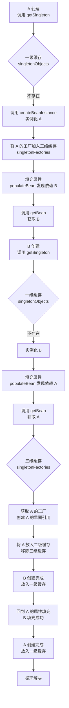

# 构造器循环依赖为何无法解决

候选人小李在字节跳动面试时，简历上写着"精通 Spring 源码"，面试官顺着问了一句：

"构造器注入的循环依赖，为什么 Spring 解决不了？"

小李说："因为构造器注入发生在对象创建时，属性注入发生在对象创建后，所以..." 面试官打断："那具体是哪个环节出了问题？三级缓存分别是什么？构造器注入时走到了哪一步？"

小李支支吾吾了三十秒，最后说："这个我没仔细研究过..."

【面试官心理】
这道题我用来区分"看过几篇博客"和"真正研究过源码"的候选人。构造器循环依赖是 Spring 循环依赖问题的深水区，90%的候选人知道" setter 注入能解决、构造器注入不能解决"这个结论，但说不清为什么。这道题能答到源码层面的，基本都是 P6+。

## 一、循环依赖的本质 🔴

### 1.1 什么是循环依赖

两个或多个 Bean 互相依赖，形成了一个环：

```java
@Service
public class A {
    private B b;
    // A 依赖 B
}

@Service
public class B {
    private A a;
    // B 依赖 A
}
```

### 1.2 为什么 setter 注入能解决

Spring 用三级缓存解决 setter 注入的循环依赖：

```java
// 一级缓存：成熟的单例Bean（完全初始化好）
private final Map<String, Object> singletonObjects = new ConcurrentHashMap<>(256);

// 二级缓存：提前暴露的Bean（实例化了，但未完成属性填充）
private final Map<String, Object> earlySingletonObjects = new ConcurrentHashMap<>(16);

// 三级缓存：单例工厂Map，用于创建代理对象
private final Map<String, ObjectFactory<?>> singletonFactories = new HashMap<>(16);
```

**三级缓存解决 setter 循环的核心流程**：



### ❌ 错误示范

**候选人原话**："构造器注入不能解决循环依赖，是因为构造器在对象创建时就执行了，Spring 还没来得及放进缓存..."

**问题诊断**：
- 只说了表面原因，没说清楚"哪个环节彻底卡死"
- 不知道三级缓存的具体内容
- 不知道 `addSingletonFactory` 的调用时机

【面试官心理】
"构造器在对象创建时就执行"——这句话只对了一半。真正卡死的地方在于：构造器参数需要**提前解析**，而参数解析依赖于被依赖 Bean 的实例。setter 注入是"先创建再填充"，构造器注入是"创建和填充同时进行"，这个时序差异才是根本原因。

### 1.3 构造器注入卡死的具体位置

Spring 在创建 Bean 时会走到 `AbstractAutowireCapableBeanFactory.createBeanInstance()`，这里会调用 `ConstructorResolver.resolveArguments()` 解析构造器参数：

```java
// AbstractAutowireCapableBeanFactory.java (简化)
private BeanWrapper createBeanInstance(String beanName, RootBeanDefinition mbd, @Nullable Constructor<?>[] ctors, @Nullable Object[] explicitArgs) {
    // 如果使用构造器注入，在这里解析构造器参数
    Constructor<?>[] ctorsToUse = ctors;
    if (ctorsToUse == null) {
        // 进入自动装配逻辑
        ctorsToUse = mbd.getAutowireMode() == AUTOWIRE_CONSTRUCTOR
            ? mbd.getResolvedConstructors()
            : null;
    }
    // 关键点：构造器参数需要提前解析！
    // 如果有构造器参数引用其他 Bean，这里就会尝试获取
    return instantiate(beanName, mbd, ctorsToUse);
}
```

关键在 `BeanDefinitionValues` 的解析阶段。当 Spring 尝试解析 `A(B b)` 这个构造器参数时，它需要先拿到一个 B 的实例。但是 B 也在创建过程中，还没放入任何缓存——**卡死了**。

```java
// ConstructorResolver.resolveArguments() 的核心逻辑
private ArgumentsHolder resolveConstructorArguments(...) {
    // 遍历每个构造器参数
    for (int paramIndex = 0; paramIndex < arguments.length; paramIndex++) {
        // 这里会调用 getBean() 去获取依赖的 Bean
        // 而此时 A 还没创建完成，B 也还没创建完成
        Object arg = resolveValue(argName, arguments[paramIndex]);
        // 如果 arg 本身是一个正在创建中的 Bean？
        // setter 注入会通过三级缓存提前暴露一个代理
        // 但构造器注入时，我们甚至还没到 addSingletonFactory 那一步！
    }
}
```

**致命差异**：setter 注入流程是：
1. `createBeanInstance` 实例化 → 得到原始对象
2. `addSingletonFactory` 加入三级缓存
3. `populateBean` 填充属性 → 触发 getBean

构造器注入流程是：
1. `createBeanInstance` **内部**就尝试解析构造器参数 → 触发 getBean
2. 还没走出 `createBeanInstance`，就已经去拿依赖了
3. `addSingletonFactory` 还没调用，整个三级缓存体系都没建立起来

### 1.4 更深一层：JDK 动态代理的问题

即使 Spring 想办法提前暴露了构造器中的 Bean，还有一个更棘手的问题：**构造器注入通常用于注入依赖**，而 JDK 动态代理需要一个默认构造器：

```java
// JDK 动态代理的限制：需要接口
public class JdkProxyFactory implements InvocationHandler {
    // 目标对象必须通过有参构造器传入
    public JdkProxyFactory(Object target) {
        this.target = target;
    }
}

// CGLIB 代理：不需要接口，但需要继承
// 问题：代理对象的构造器会调用父类构造器
// 如果父类构造器中引用了另一个 Bean A，而 A 正在创建中...
```

【面试官心理】
我追问 JDK 动态代理的问题，是想看候选人是否理解"AOP 代理的创建时机"。构造器注入下，如果需要生成代理对象，代理对象的构造器调用会触发被代理对象的父类构造器，而这个构造器里可能有循环依赖的陷阱。这是一个 P7 级别的追问点。

## 二、三级缓存的深层逻辑 🟡

### 2.1 为什么要三级缓存而不是两级

如果只是为了解决循环依赖，两级缓存就够了：

```java
// 两级缓存方案（简化）
Map<String, Object> singletons = new HashMap<>(); // 成熟的
Map<String, Object> early = new HashMap<>();       // 早期的
```

为什么需要三级？因为**可能需要创建代理对象**。

```java
// 一级：singletonObjects - 成熟的单例，可直接用
// 二级：earlySingletonObjects - 早期的，但已做过代理增强
// 三级：singletonFactories - 还没做代理，只有工厂
```

关键在于 `addSingletonFactory` 的调用时机：

```java
// AbstractAutowireCapableBeanFactory.doCreateBean()
protected void doCreateBean(...) {
    // 1. 实例化
    BeanWrapper instanceWrapper = createBeanInstance(...);

    // 2. 添加到三级缓存（注意：在这里才添加！）
    // 如果是构造器注入，在步骤1中就已经去解析参数了
    // 此时还没到步骤2，循环依赖就卡死了
    addSingletonFactory(beanName, () -> getEarlyBeanReference(beanName, mbd, bean));

    // 3. 属性填充
    populateBean(beanName, mbd, instanceWrapper);

    // 4. 初始化
    initializeBean(beanName, exposedObject, mbd);
}
```

:::tip 💡
真正卡死构造器循环依赖的**不是实例化本身**，而是**实例化过程中对构造器参数的解析**。`addSingletonFactory` 在 `createBeanInstance` 之后调用，而构造器参数的解析在 `createBeanInstance` 内部进行——还没来得及暴露工厂，循环引用就已经触发了。
:::

### 2.2 三级缓存各自的职责

| 缓存 | 内容 | 作用 | 何时写入 | 何时删除 |
|------|------|------|----------|----------|
| 一级 | 完全初始化的 Bean | 正式使用 | Bean 创建完成后 | 永不删除 |
| 二级 | 已暴露的早期 Bean | 防止重复创建早期引用 | 从三级升级时 | 放入一级后删除 |
| 三级 | 工厂 `ObjectFactory<?>` | 延迟创建代理 | 实例化后立即 | 获取后升级到二级 |

## 三、生产避坑 🟡

### 3.1 构造器循环依赖的真实场景

```java
@Service
public class OrderService {
    private final PriceService priceService;

    @Autowired
    public OrderService(PriceService priceService) {
        this.priceService = priceService;
    }
}

@Service
public class PriceService {
    private final OrderService orderService;  // 循环依赖！

    @Autowired
    public PriceService(OrderService orderService) {
        this.orderService = orderService;
    }
}
```

**报错**：

```
Caused by: org.springframework.beans.factory.BeanCurrentlyInCreationException:
  Error creating bean 'OrderService': Requested bean is currently in creation:
  Did you intend to reference an existing unconfigured bean named 'PriceService'?
```

### 3.2 正确的解决方式

**方案一：改为 setter 注入**

```java
@Service
public class OrderService {
    private PriceService priceService;

    @Autowired
    public void setPriceService(PriceService priceService) {
        this.priceService = priceService;
    }
}
```

**方案二：使用 @Lazy 延迟加载**

```java
@Service
public class OrderService {
    private final PriceService priceService;

    @Autowired
    public OrderService(@Lazy PriceService priceService) {
        this.priceService = priceService;
    }
}
```

`@Lazy` 让构造器参数不在容器启动时立即解析，而是在第一次使用时通过代理对象懒加载。

**方案三：使用 @PostConstruct 或 InitializingBean**

```java
@Service
public class OrderService {
    private PriceService priceService;

    @Autowired
    public void setPriceService(PriceService priceService) {
        this.priceService = priceService;
    }

    @PostConstruct
    public void init() {
        // 在这里使用 priceService，此时它已经完全初始化
    }
}
```

## 四、工程选型 🟢

### 4.1 什么时候必须用构造器注入

| 场景 | 推荐方式 | 原因 |
|------|----------|------|
| 依赖不可变（final） | 构造器注入 | 保证线程安全 |
| 依赖必须存在 | 构造器注入 | 编译期检查 |
| 避免循环依赖 | setter 注入或 @Lazy | 构造器注入无法解决 |
| 可选依赖 | setter 注入 + `@Autowired(required=false)` | 更灵活 |

【面试官心理】
我通常不会直接问候选人"用构造器还是 setter"，而是问"如果出现了循环依赖怎么办"。能答出三种解决方案的是基本合格，能分析出根本原因（构造器参数解析时机）的才是真正理解 Spring 生命周期的人。

:::warning ⚠️
`@Lazy` 只是治标不治本。如果你的业务逻辑中真的存在循环依赖，说明设计有问题。A 依赖 B，B 依赖 A，说明 A 和 B 的职责可能没有划分清楚，应该考虑重构。
:::

## 五、面试追问链 🔴

**第一层：基础概念**
面试官问："Spring 三级缓存分别是什么？"
候选人答："一级缓存存放成品，二级缓存存放半成品，三级缓存存工厂..."
考察点：基本概念记忆

**第二层：原理追问**
面试官追问："为什么需要三级而不是两级？"
候选人答："因为要支持 AOP 代理..."（可能说不清楚）
考察点：是否理解代理创建时机

**第三层：构造器注入卡死点**
面试官追问："构造器注入卡死在哪个方法里？"
候选人答：...（可能说不出来）
考察点：源码阅读深度

**第四层：实战追问**
面试官追问："如果线上报 BeanCurrentlyInCreationException，你怎么排查？"
候选人答：...
考察点：生产问题处理能力
