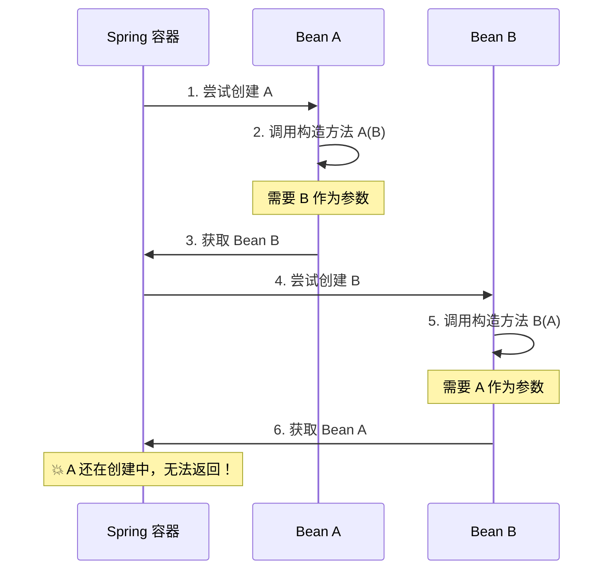

# 构造器注入无法解决循环依赖

> 目标级别：P6
>
> 面试命中率：70%

## 快速自测

1. 为什么构造器注入的循环依赖无法解决？
2. 如何解决构造器注入的循环依赖问题？
3. @Lazy 注解能完全解决构造器循环依赖吗？

---

## 一、构造器注入的循环依赖

### 问题场景

```java
@Service
public class A {
    private B b;

    // 构造器注入
    @Autowired
    public A(B b) {
        this.b = b;
    }
}

@Service
public class B {
    private A a;

    // 构造器注入
    @Autowired
    public B(A a) {
        this.a = a;
    }
}
```

### 执行流程分析



---

## 二、为什么无法解决

### 属性注入可以解决的原因

```java
// 属性注入方式
@Service
public class A {
    @Autowired
    private B b;  // 属性注入，创建 A 时不需要 B
}

// Spring 创建 A 的流程：
// 1. 调用构造方法创建 A（此时不需要 B）
// 2. 将 A 的 ObjectFactory 放入三级缓存（提前暴露）
// 3. 填充属性 b
// 4. 从缓存获取 B，B 填充时获取到提前暴露的 A
// 5. 循环解决
```

### 构造器注入无法解决的原因

```java
// 构造器注入方式
@Service
public class A {
    private B b;

    public A(B b) {  // ⚠️ 创建 A 时必须同时提供 B
        this.b = b;
    }
}

// Spring 创建 A 的流程：
// 1. 调用构造方法 A(B) - 需要 B！
// 2. 获取 B
// 3. 创建 B，需要 A！
// 4. 💥 死循环！
```

**核心原因**：构造器注入要求在实例化 Bean 时就必须提供所有依赖，而循环依赖的 Bean 尚未创建完成。

---

## 三、解决方案

### 方案一：@Lazy 延迟加载

```java
@Service
public class A {
    private B b;

    @Autowired
    public A(@Lazy B b) {
        this.b = b;
    }
}

@Service
public class B {
    private A a;

    @Autowired
    public B(@Lazy A a) {
        this.a = a;
    }
}
```

**原理**：`@Lazy` 让 Spring 创建代理对象代替真实 Bean，直到第一次使用时才解析依赖。

### 方案二：Setter 注入替代构造器注入

```java
@Service
public class A {
    private B b;

    @Autowired
    public void setB(B b) {  // Setter 注入
        this.b = b;
    }
}

@Service
public class B {
    private A a;

    @Autowired
    public void setA(A a) {  // Setter 注入
        this.a = a;
    }
}
```

### 方案三：重构代码消除循环依赖

```java
// 重构前：循环依赖
@Service
public class OrderService {
    @Autowired private InventoryService inventoryService;
}

@Service
public class InventoryService {
    @Autowired private OrderService orderService;
}

// 重构后：消除循环依赖
@Service
public class OrderService {
    @Autowired private OrderValidator validator;
}

@Service
public class InventoryService {
    @Autowired private OrderValidator validator;
}

@Service
public class OrderValidator {  // 抽取公共逻辑
    // 被多个服务共享
}
```

---

## 四、@Lazy 的局限性

> ⚠️ **注意**：`@Lazy` 只能推迟问题，不能根本解决问题。

```java
// ⚠️ 两个类都用 @Lazy + 构造器注入
@Service
public class A {
    private B b;

    @Autowired
    public A(@Lazy B b) {
        this.b = b;
    }

    public void methodA() {
        // 第一次调用 b.methodB() 时触发 B 的创建
        b.methodB();
    }
}

@Service
public class B {
    private A a;

    @Autowired
    public B(@Lazy A a) {
        this.a = a;
    }

    public void methodB() {
        // 第一次调用 a.methodA() 时触发 A 的创建
        a.methodA();
    }
}

// 调用 A.methodA() 时的执行顺序：
// 1. A.methodA()
// 2. b.methodB() - 此时才创建 B
// 3. B 构造器中需要 a，再次获取 A
// 4. 再次调用 A 的 @Lazy 代理，这次返回真实 A
// 5. A.methodA() 已经在执行中，可能导致问题！
```

---

## 五、高频面试题

### 🔴 第一层：为什么构造器注入无法解决循环依赖？

**答案要点**：
1. 构造器注入要求在实例化时必须提供依赖
2. 循环依赖的 Bean 尚未创建完成
3. 无法提前暴露引用给其他 Bean

### 🟡 第二层：如何解决构造器注入的循环依赖？

**答案要点**：
1. 使用 `@Lazy` 延迟加载
2. 改为 Setter 注入
3. 重构代码消除循环依赖

---

## 六、对比总结

| 注入方式 | 循环依赖 | 解决方案 | 推荐程度 |
| --- | --- | --- | --- |
| Setter 注入 | ✅ 可解决 | 三级缓存 | ⭐⭐⭐ |
| 构造器注入 | ❌ 无法解决 | @Lazy / 重构 | ⭐⭐ |
| @Lazy + 构造器 | ⚠️ 可能有坑 | 谨慎使用 | ⭐ |
