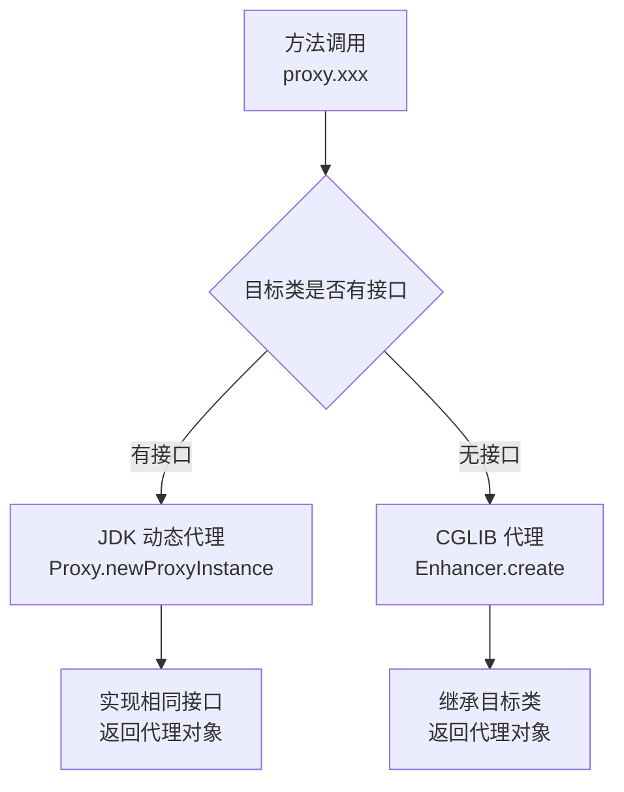

# Spring 设计模式总结

候选人小赵在面试字节时，面试官问了一个经典问题：

"看你简历上写了熟悉 Spring 源码，那你说说 Spring 里用到了哪些设计模式？"

小赵说："嗯...用了单例模式、工厂模式..."

面试官追问："工厂模式用的是 BeanFactory 还是 FactoryBean？有什么区别？"

小赵："...差不多吧？"

面试官继续追问："那代理模式呢？Spring 什么时候用 JDK 动态代理，什么时候用 CGLIB？"

小赵彻底答不上来了。

【面试官心理】
这道题我用来测试候选人对 Spring 框架的整体认知。知道 Spring 用设计模式的人很多，但能说出具体在哪里用、为什么这么用的不到20%。更重要的是，我通过这道题看候选人是"背过设计模式"还是"真的在源码里见过"。

## 一、Spring 设计模式全景图 🟡

### 1.1 核心模式一览

| 设计模式 | Spring 组件 | 作用 |
|----------|------------|------|
| 工厂模式 | `BeanFactory` / `FactoryBean` | 解耦对象创建 |
| 单例模式 | `DefaultSingletonBeanRegistry` | 减少重复创建开销 |
| 代理模式 | `AOP`（JDK Proxy / CGLIB） | 动态增强功能 |
| 策略模式 | `InstantiationStrategy` | 多态实例化 |
| 模板方法模式 | `AbstractApplicationContext.refresh` | 固定流程+可变步骤 |
| 观察者模式 | `ApplicationEventMulticaster` | 事件发布订阅 |
| 适配器模式 | `AdvisorAdapter` | 统一不同通知类型 |
| 装饰器模式 | `BeanWrapper` | 动态属性填充 |
| 责任链模式 | `BeanPostProcessor` | 链式处理 Bean |
| 建造者模式 | `BeanDefinitionBuilder` | 分步构建配置 |

### 1.2 ❌ 错误示范

**候选人原话**："Spring 里用了很多设计模式，比如单例模式、工厂模式、代理模式..."

**问题诊断**：
- 只能说出一堆模式名字，没有具体到源码位置
- 不理解每种模式的实际作用
- 不知道 Spring 为什么选择这个模式而不是另一个

【面试官心理】
我说"Spring 里用到了设计模式"不是想问名字，而是想问"这些模式解决了什么问题"。能说出具体场景和代码位置的，才是真正在源码里研究过的人。

## 二、工厂模式 🔴

### 2.1 BeanFactory —— 工厂模式的典范

```java
// 工厂接口
public interface BeanFactory {
    Object getBean(String name);
    <T> T getBean(Class<T> requiredType);
    Object getBean(String name, Object... args);
}
```

**工厂模式的本质**：把对象创建和使用分离。

```java
// 不用工厂模式
OrderService orderService = new OrderService();

// 用工厂模式
OrderService orderService = (OrderService) beanFactory.getBean("orderService");
```

### 2.2 FactoryBean —— 特殊的工厂

```java
public interface FactoryBean<T> {
    T getObject();              // 生产什么
    Class<?> getObjectType();  // 产品类型
    boolean isSingleton();     // 是否单例
}
```

FactoryBean 是 Spring 的"工厂 Bean"，本身是一个 Bean，但它的职责是**生产另一个 Bean**。

**典型应用**：MyBatis 的 `MapperFactoryBean`，用 FactoryBean + JDK 动态代理来注册 Mapper 接口。

## 三、单例模式 🔴

### 3.1 DefaultSingletonBeanRegistry

```java
// Spring 的单例注册表
public class DefaultSingletonBeanRegistry extends SimpleAliasRegistry {

    // 一级缓存：成品单例
    private final Map<String, Object> singletonObjects = new ConcurrentHashMap<>(256);

    // 二级缓存：早期单例（半成品）
    private final Map<String, Object> earlySingletonObjects = new HashMap<>(16);

    // 三级缓存：单例工厂
    private final Map<String, ObjectFactory<?>> singletonFactories = new HashMap<>(16);

    @Override
    public Object getSingleton(String beanName) {
        // 三级缓存获取逻辑
        // 1. 先查一级缓存，有则返回
        // 2. 再查二级缓存，有则返回（早期暴露的Bean）
        // 3. 最后查三级缓存，创建代理对象，升级到二级缓存
    }

    protected void addSingleton(String beanName, Object singletonObject) {
        synchronized (this.singletonObjects) {
            this.singletonObjects.put(beanName, singletonObject);
            this.earlySingletonObjects.remove(beanName);
            this.singletonFactories.remove(beanName);
        }
    }
}
```

:::tip 💡
Spring 的单例模式不是简单的"全局只有一个实例"，而是精心设计的"三级缓存单例模式"。三级缓存解决了循环依赖和代理对象的创建时机问题，这本身就体现了设计模式的工程智慧。
:::

## 四、代理模式 🔴

### 4.1 JDK 动态代理 vs CGLIB



**Spring 的选择策略**：

```java
// ProxyFactory.java 中的判断逻辑
public class ProxyCreatorSupport extends AdvisedSupport {
    AopProxy createAopProxy(AdvisedSupport config) {
        // 如果目标类有接口，使用 JDK 代理
        if (config.hasUserSpecifiedProxyInterface()
                && !this advised && AopProxyUtils.equalsEquals) {
            return new JdkDynamicAopProxy(config);
        }
        // 否则使用 CGLIB
        return new CglibAopProxy(config);
    }
}

// 注意：@EnableAspectJAutoProxy(proxyTargetClass = true) 强制使用 CGLIB
```

**两者的核心区别**：

| 维度 | JDK 动态代理 | CGLIB 代理 |
|------|-------------|-----------|
| 原理 | 继承 `InvocationHandler` 接口 | 继承目标类，重写方法 |
| 限制 | 目标类必须实现接口 | 目标类不能是 `final` |
| 性能 | 反射调用，略慢 | 生成字节码，运行时更快 |
| Spring 默认 | 有接口时优先 | 无接口或强制时 |

## 五、策略模式 🟡

### 5.1 InstantiationStrategy

```java
// 策略接口
public interface InstantiationStrategy {
    Object instantiate(RootBeanDefinition bd, String beanName,
                       BeanFactory owner, Constructor<?> ctor, Object[] args)
        throws BeansException;
}

// 具体策略1：直接实例化
public class SimpleInstantiationStrategy implements InstantiationStrategy {
    @Override
    public Object instantiate(...) {
        // 直接用构造器创建实例
        return BeanUtils.instantiateClass(ctor, args);
    }
}

// 具体策略2：CGLIB 实例化
public class CglibSubclassingInstantiationStrategy
        extends SimpleInstantiationStrategy {

    @Override
    public Object instantiate(...) {
        // 使用 CGLIB 创建子类实例
        Enhancer enhancer = new Enhancer();
        enhancer.setSuperclass(bd.getBeanClass());
        enhancer.setCallbackFilter(new MetadataAwareFilter());
        return enhancer.create();
    }
}
```

Spring 根据不同场景选择不同的实例化策略，不需要修改调用方代码。

## 六、模板方法模式 🟡

### 6.1 AbstractApplicationContext.refresh

```java
// 模板方法：定义骨架
public abstract class AbstractApplicationContext
        extends DefaultResourceLoader implements ConfigurableApplicationContext {

    public void refresh() throws BeansException {
        // 1. 准备容器
        prepareRefresh();

        // 2. 获取 BeanFactory
        ConfigurableListableBeanFactory beanFactory = obtainFreshBeanFactory();

        // 3. 准备 BeanFactory（设置类加载器、后置处理器等）
        prepareBeanFactory(beanFactory);

        // 4. 子类可扩展：在 BeanFactory 准备好后处理
        postProcessBeanFactory(beanFactory);

        // 5. 执行 BeanFactoryPostProcessor
        invokeBeanFactoryPostProcessors(beanFactory);

        // 6. 注册 BeanPostProcessor
        registerBeanPostProcessors(beanFactory);

        // 7. 初始化消息源
        initMessageSource();

        // 8. 初始化事件广播器
        initApplicationEventMulticaster();

        // 9. 子类扩展：刷新
        onRefresh();

        // 10. 注册监听器
        registerListeners();

        // 11. 实例化所有剩余的单例
        finishBeanFactoryInitialization(beanFactory);

        // 12. 发布刷新完成事件
        finishRefresh();
    }
}
```

**模板方法的核心**：父类定义流程骨架（`refresh`），子类通过覆写 `postProcessBeanFactory`、`onRefresh` 等方法来定制扩展点。

## 七、观察者模式 🟡

### 7.1 ApplicationEventMulticaster

```java
// 事件广播器：观察者模式的核心
public interface ApplicationEventMulticaster {
    void addApplicationListener(ApplicationListener<?> listener);
    void removeApplicationListener(ApplicationListener<?> listener);
    void multicastEvent(ApplicationEvent event);
}

// 广播器的实现
public class SimpleApplicationEventMulticaster
        extends AbstractApplicationEventMulticaster {

    @Override
    public void multicastEvent(ApplicationEvent event) {
        // 遍历所有监听器，同步或异步执行
        for (ApplicationListener<?> listener : getApplicationListeners(event)) {
            invokeListener(listener, event);
        }
    }

    // 支持异步执行
    public void multicastEvent(final ApplicationEvent event, ResolvableType type) {
        Executor executor = getTaskExecutor();
        if (executor != null) {
            executor.execute(() -> invokeListener(listener, event));
        } else {
            invokeListener(listener, event);  // 同步
        }
    }
}
```

## 八、适配器模式 🟡

### 8.1 AdvisorAdapter

```java
// Spring AOP 支持多种通知类型，但增强接口不统一
// 通过适配器将不同通知适配成 MethodInterceptor

public interface AdvisorAdapter {
    boolean supportsAdvice(Advice advice);
    MethodInterceptor getInterceptor(Advisor advisor);
}

// 适配 BeforeAdvice -> MethodBeforeAdviceInterceptor
public class MethodBeforeAdviceAdapter implements AdvisorAdapter {
    @Override
    public boolean supportsAdvice(Advice advice) {
        return advice instanceof MethodBeforeAdvice;
    }

    @Override
    public MethodBeforeAdviceInterceptor getInterceptor(Advisor advisor) {
        MethodBeforeAdvice advice = (MethodBeforeAdvice) advisor.getAdvice();
        return new MethodBeforeAdviceInterceptor(advice);
    }
}
```

## 九、装饰器模式 🟡

### 9.1 BeanWrapper

```java
// BeanWrapper 包装了 Bean 实例，提供了动态属性访问能力
public interface BeanWrapper extends ConfigurablePropertyResolver {
    void setWrappedInstance(Object obj, String nestedPath, String[] searchableStrings);
    Object getWrappedInstance();
    PropertyDescriptors propertyDescriptors();
}

// 装饰器模式：BeanWrapper 装饰了原始 Bean 对象
// 可以在不修改 Bean 类的情况下，动态增加属性访问、日志记录等功能
BeanWrapper wrapper = new BeanWrapperImpl(order);
wrapper.setPropertyValue("amount", 100);  // 动态设置属性
wrapper.getPropertyValue("amount");      // 动态获取属性
```

## 十、责任链模式 🟢

### 10.1 BeanPostProcessor

```java
// Bean 后置处理器链
public interface BeanPostProcessor {
    // 实例化后，初始化前
    default Object postProcessBeforeInitialization(
            Object bean, String beanName) throws BeansException {
        return bean;
    }

    // 初始化后
    default Object postProcessAfterInitialization(
            Object bean, String beanName) throws BeansException {
        return bean;
    }
}

// Spring 内置多个 BeanPostProcessor
// AutowiredAnnotationBeanPostProcessor  @Autowired 注解处理
// RequiredAnnotationBeanPostProcessor    @Required 注解处理
// CommonAnnotationBeanPostProcessor      @Resource 注解处理
// AsyncAnnotationBeanBeanProcessor       @Async 异步处理

// 责任链执行
for (BeanPostProcessor processor : beanPostProcessors) {
    Object result = processor.postProcessBeforeInitialization(bean, beanName);
    if (result == null) return result;  // 短路
}
```

## 十一、建造者模式 🟢

### 11.1 BeanDefinitionBuilder

```java
// 不用建造者
RootBeanDefinition beanDefinition = new RootBeanDefinition();
beanDefinition.setBeanClass(UserService.class);
beanDefinition.setScope("prototype");
beanDefinition.setLazyInit(true);
beanDefinition.getPropertyValues().add("name", "test");

// 用建造者
BeanDefinitionBuilder builder = BeanDefinitionBuilder
    .rootBeanDefinition(UserService.class)
    .setScope("prototype")
    .setLazyInit(true)
    .addPropertyValue("name", "test");

BeanDefinition bd = builder.getBeanDefinition();
```

## 十二、生产避坑 🟢

### 12.1 循环依赖与设计模式的关系

Spring 的三级缓存机制是**单例模式 + 工厂模式 + 代理模式**的综合应用：

```java
// DefaultSingletonBeanRegistry.getSingleton() 核心逻辑
public Object getSingleton(String beanName, ObjectFactory<?> singletonFactory) {
    synchronized (this.singletonObjects) {
        // 1. 先查一级缓存
        Object singletonObject = this.singletonObjects.get(beanName);
        if (singletonObject == null) {
            // 2. 创建过程检查
            if (this.singletonsCurrentlyInCreation.contains(beanName)) {
                // 循环依赖检测
            }
            // 3. 创建前标记
            beforeSingletonCreation(beanName);
            try {
                // 4. 调用工厂创建
                singletonObject = singletonFactory.getObject();
            } catch (BeansException e) {
                // 异常处理
            } finally {
                // 5. 创建后移除标记
                afterSingletonCreation(beanName);
            }
            // 6. 加入一级缓存
            addSingleton(beanName, singletonObject);
        }
        return singletonObject;
    }
}
```

【面试官心理】
我通常会问："Spring 为什么要设计三级缓存而不是两级？" 能答出"因为可能需要创建代理对象，而代理对象不能提前创建，必须在有完整 BeanDefinition 后才能生成"这个原因的，通常有较深的源码理解。

## 十三、工程选型 🟢

### 13.1 设计模式的选择原则

| 场景 | 选用模式 | 原因 |
|------|----------|------|
| 对象创建复杂 | 工厂模式 | 解耦创建和使用 |
| 全局唯一 | 单例模式 | 减少开销 |
| 需要增强方法 | 代理模式 | 动态增强，不修改原类 |
| 多种算法互换 | 策略模式 | 算法可切换 |
| 固定流程+可变步骤 | 模板方法 | 代码复用 |
| 事件通知 | 观察者模式 | 解耦发布和订阅 |

## 十四、面试追问链 🔴

**第一层：列举模式**
面试官问："Spring 里用到了哪些设计模式？"
候选人答："单例、工厂、代理、策略..."
考察点：知识广度

**第二层：具体实现**
面试官追问："BeanFactory 用的是什么工厂模式？和 FactoryBean 有什么区别？"
候选人答：...（容易混淆）
考察点：概念区分

**第三层：源码定位**
面试官追问："Spring 的 refresh() 方法用了什么设计模式？具体流程是什么？"
候选人答：...（模板方法）
考察点：源码深度

**第四层：综合应用**
面试官追问："Spring 是怎么把这么多设计模式组合在一起工作的？"
候选人答：...（融会贯通）
考察点：架构思维
