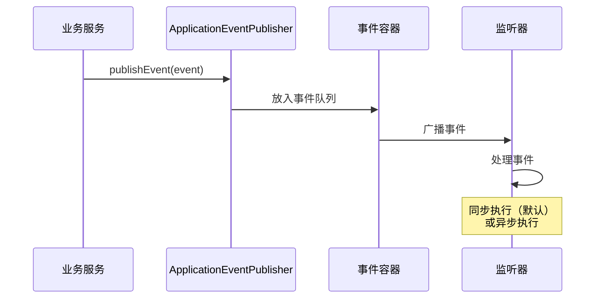

# Spring 事件监听机制

> 目标级别：P6
>
> 面试命中率：65%

## 快速自测

1. Spring 事件监听的核心组件有哪些？
2. 如何自定义 Spring 事件？
3. @EventListener 和实现 ApplicationListener 接口有什么区别？

---

## 一、核心组件

| 组件 | 说明 |
| --- | --- |
| **ApplicationEvent** | 事件基类，所有自定义事件都需继承此类 |
| **ApplicationListener** | 事件监听器接口 |
| **ApplicationEventPublisher** | 事件发布器，用于发布事件 |

---

## 二、自定义事件示例

### 定义事件

```java
// 继承 ApplicationEvent
public class OrderCreatedEvent extends ApplicationEvent {

    private final Order order;

    public OrderCreatedEvent(Object source, Order order) {
        super(source);
        this.order = order;
    }

    public Order getOrder() {
        return order;
    }
}
```

### 定义监听器

```java
// 方式一：实现 ApplicationListener 接口
@Component
public class OrderCreatedListener implements ApplicationListener<OrderCreatedEvent> {

    @Override
    public void onApplicationEvent(OrderCreatedEvent event) {
        Order order = event.getOrder();
        System.out.println("订单创建事件: " + order.getId());
        // 发送通知、更新库存等
    }
}

// 方式二：使用 @EventListener 注解
@Component
public class OrderNotificationService {

    @EventListener
    public void handleOrderCreated(OrderCreatedEvent event) {
        Order order = event.getOrder();
        System.out.println("发送订单通知: " + order.getId());
    }
}
```

### 发布事件

```java
@Service
public class OrderService {

    @Autowired
    private ApplicationEventPublisher publisher;

    public void createOrder(Order order) {
        // 业务逻辑
        orderDao.save(order);

        // 发布事件
        publisher.publishEvent(new OrderCreatedEvent(this, order));
    }
}
```

---

## 三、异步事件处理

```java
@Configuration
public class AsyncConfig implements AsyncConfigurer {

    @Override
    public Executor getAsyncExecutor() {
        return new ThreadPoolTaskExecutor();
    }
}

@Component
public class OrderNotificationService {

    @Async  // 异步处理
    @EventListener
    public void handleOrderCreated(OrderCreatedEvent event) {
        // 异步发送通知
    }
}
```

---

## 四、事件发布时机



---

## 五、高频面试题

### 🔴 第一层：Spring 事件监听的核心组件有哪些？

**答案要点**：
1. ApplicationEvent：事件基类
2. ApplicationListener：监听器接口
3. ApplicationEventPublisher：事件发布器

### 🟡 第二层：@EventListener 和实现 ApplicationListener 的区别？

**答案要点**：
1. @EventListener 更简洁，不需要实现接口
2. @EventListener 可以配合 @Async 实现异步
3. @EventListener 可以通过 @Order 控制顺序

---

## 六、常见陷阱

> ⚠️ **陷阱一**：在监听器中抛出异常导致事务失效

如果监听器中抛出的异常与事务关联，可能导致数据不一致。

> ⚠️ **陷阱二**：事件同步执行导致性能问题

默认情况下，事件是同步执行的，如果监听器处理时间长，会阻塞主业务。
