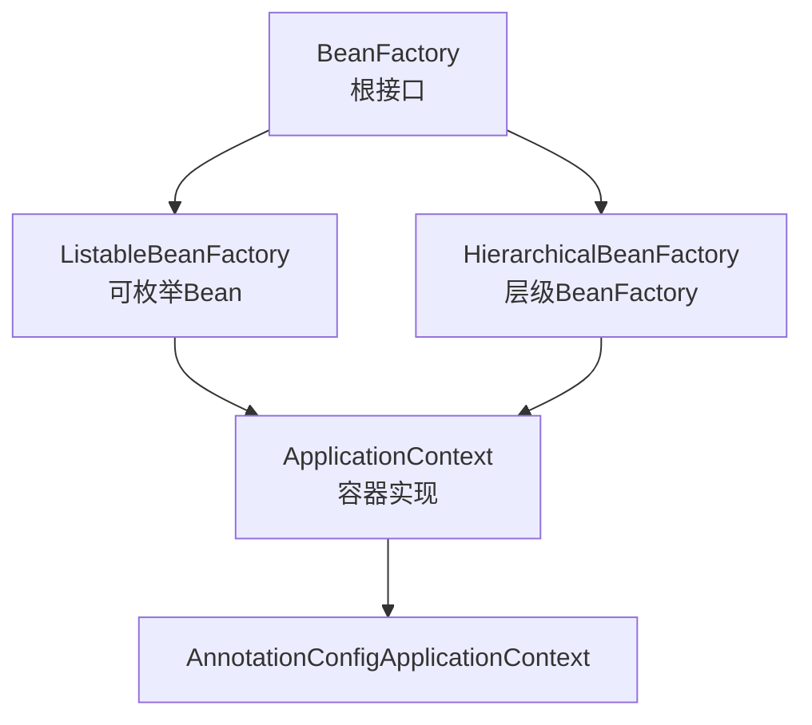

# FactoryBean 与 BeanFactory 对比

候选人小张在面试快手时，面试官问了一个看似简单的问题：

"FactoryBean 和 BeanFactory 有什么区别？"

小张说："FactoryBean 是工厂 Bean，用来创建 Bean 的... BeanFactory 是容器..."

面试官追问："那你用 & 符号获取 FactoryBean 本身的时候，Spring 怎么实现的？"

小张："...什么 & 符号？"

面试官继续追问："MyBatis 整合 Spring 时，Mapper 接口是怎么注册到容器里的？"

小张彻底卡住了。

【面试官心理】
这道题我用来区分"会用框架"和"理解框架"的候选人。FactoryBean 是 Spring 框架中最容易被忽视但又极其重要的一个接口。MyBatis、ShardingSphere、动态代理等大量框架都用它来扩展 Spring。知道 `&` 符号的占10%，能说清楚 MyBatis Mapper 注册原理的不到5%。

## 一、BeanFactory vs FactoryBean 🔴

### 1.1 概念辨析

| 接口 | 本质 | 作用 |
|------|------|------|
| `BeanFactory` | 容器根接口 | Spring IoC 容器的核心定义了 `getBean()` 等方法 |
| `FactoryBean` | 工厂 Bean（本身是 Bean） | 用来生产另一个 Bean（产品） |

```java
// BeanFactory：整个容器的根接口
public interface BeanFactory {
    Object getBean(String name) throws BeansException;
    <T> T getBean(String name, Class<T> requiredType) throws BeansException;
    // ...
}

// FactoryBean：工厂接口，自己是 Bean，但用来生产另一个 Bean
public interface FactoryBean<T> {
    T getObject();          // 返回产品对象
    Class<?> getObjectType();  // 返回产品类型
    boolean isSingleton();    // 产品是否是单例
}
```

### 1.2 ❌ 错误示范

**候选人原话**："FactoryBean 就是 BeanFactory，都是用来创建 Bean 的。"

**问题诊断**：
- 完全混淆了两个接口的角色
- 不理解 FactoryBean 的产品机制
- 不知道 `&` 前缀的作用

【面试官心理】
这两个名字太像了，90%的候选人会在这里翻车。我追问 `&` 符号，是想看候选人有没有动手写过 demo、读过源码。能把 FactoryBean 的机制说清楚的，基本都看过 Spring 的 `AbstractBeanFactory.getObjectForBeanInstance()` 方法。

### 1.3 BeanFactory 的继承体系



Spring 容器本身就是 BeanFactory 的实现：

```java
// BeanFactory 核心方法
public interface BeanFactory {
    String FACTORY_BEAN_PREFIX = "&";  // 前缀常量

    Object getBean(String name);
    <T> T getBean(Class<T> requiredType);

    // 如果 name 以 & 开头，返回 FactoryBean 本身
    // 如果不带 &，返回 FactoryBean 生产的产品
    Object getObjectForBeanInstance(Object beanInstance, String name, String beanName, RootBeanDefinition mbd);
}
```

## 二、FactoryBean 的工作机制 🔴

### 2.1 核心流程

```java
// 实现 FactoryBean 接口
@Component
public class MyFactoryBean implements FactoryBean<OrderService> {

    @Override
    public OrderService getObject() {
        // 创建并返回产品对象
        OrderService orderService = new OrderService();
        orderService.setName("factory-created");
        return orderService;
    }

    @Override
    public Class<?> getObjectType() {
        return OrderService.class;
    }

    @Override
    public boolean isSingleton() {
        return true;
    }
}
```

```java
@Autowired
private ApplicationContext context;

// 获取 FactoryBean 本身（注意 & 前缀）
MyFactoryBean factory = (MyFactoryBean) context.getBean("&myFactoryBean");

// 获取 FactoryBean 生产的产品（正常调用）
OrderService orderService = context.getBean(OrderService.class);
// 注意：这里 getBean 的 name 是 "myFactoryBean"
// Spring 识别到这个名字对应一个 FactoryBean
// 所以自动调用 factory.getObject() 返回产品
```

**Spring 内部处理流程**：

```java
// AbstractBeanFactory.doGetBean() 核心逻辑
protected <T> T doGetBean(String name, Class<T> requiredType, Object[] args, boolean typeCheckOnly) {
    String beanName = transformedBeanName(name);  // 去掉 & 前缀

    Object beanInstance = getSingleton(beanName);

    // 如果实例不存在，且是 FactoryBean
    if (isFactoryBean(beanName)) {
        Object bean = getObjectForBeanInstance(beanInstance, name, beanName, mbd);

        // 关键逻辑：
        // 1. 如果 name 以 & 开头，直接返回 FactoryBean 本身
        // 2. 否则，调用 FactoryBean.getObject() 返回产品
    }
}
```

### 2.2 为什么要用 & 前缀

```java
// 如果我们同时需要 FactoryBean 本身和它生产的产品
@Configuration
public class BeanConfig {

    @Bean
    public MyFactoryBean myFactoryBean() {
        return new MyFactoryBean();
    }

    // 注入 FactoryBean 本身
    @Bean
    public Object factoryBeanHolder(BeanFactory beanFactory) {
        // 使用 & 前缀获取 FactoryBean 本身
        MyFactoryBean factory = (MyFactoryBean) beanFactory.getBean("&myFactoryBean");
        // 或通过类型查找
        // FactoryBean fb = context.getBeansOfType(FactoryBean.class);
        return factory;
    }
}
```

## 三、经典使用场景 🟡

### 3.1 MyBatis Mapper 接口注册

MyBatis-Spring 正是用 FactoryBean 来注册 Mapper 接口的：

```java
// Mybatis 源码：MapperFactoryBean
public class MapperFactoryBean<T> extends SqlSessionDaoSupport implements FactoryBean<T> {

    private Class<T> mapperInterface;

    @Override
    public T getObject() {
        // 关键：getObject 返回的是 JDK 动态代理对象
        // 代理的InvocationHandler是MyBatis的MapperProxy
        return getSqlSession().getMapper(mapperInterface);
    }

    @Override
    public Class<?> getObjectType() {
        return mapperInterface;
    }

    @Override
    public boolean isSingleton() {
        return true;
    }
}
```

**注册方式**：

```java
@Configuration
public class MyBatisConfig {

    @Bean
    public UserMapper userMapper(SqlSessionFactory sqlSessionFactory) {
        // FactoryBean 直接注册
        MapperFactoryBean<UserMapper> factory = new MapperFactoryBean<>(UserMapper.class);
        factory.setSqlSessionFactory(sqlSessionFactory);
        return factory.getObject();  // 这里返回的是代理对象！
    }
}
```

或者用 `@MapperScan` 批量注册：

```java
@SpringBootApplication
@MapperScan("com.example.mapper")
public class Application {
    // @MapperScan 内部就是用 MapperFactoryBean 批量注册 Mapper 接口
}
```

:::tip 💡
MyBatis 的 Mapper 接口本身没有实现类，但通过 FactoryBean + JDK 动态代理，每次 `getBean("UserMapper")` 返回的都是 MyBatis 生成的代理对象。这个代理对象实现了 `UserMapper` 接口，具体 SQL 执行由 `MapperProxy` 处理。
:::

### 3.2 动态代理场景

```java
@Component
public class DynamicProxyFactoryBean implements FactoryBean<Object> {

    @Autowired
    private TargetService targetService;

    @Override
    public Object getObject() {
        return Proxy.newProxyInstance(
            DynamicProxyFactoryBean.class.getClassLoader(),
            targetService.getClass().getInterfaces(),
            (proxy, method, args) -> {
                // 前置增强
                System.out.println("Before: " + method.getName());
                Object result = method.invoke(targetService, args);
                // 后置增强
                System.out.println("After: " + method.getName());
                return result;
            }
        );
    }

    @Override
    public Class<?> getObjectType() {
        return targetService.getClass();
    }

    @Override
    public boolean isSingleton() {
        return true;
    }
}
```

### 3.3 @Bean 注册 FactoryBean 的坑 🟡

```java
@Configuration
public class BeanConfig {

    // 错误写法：直接返回 FactoryBean 本身
    @Bean
    public MyFactoryBean myFactoryBean() {
        return new MyFactoryBean();
        // 问题：getBean("myFactoryBean") 返回的是
        // MyFactoryBean.getObject() 的结果，而不是 FactoryBean 本身
        // 因为 Spring 对所有 @Bean 都做了处理
    }

    // 正确写法：返回 FactoryBean 本身，用 & 前缀获取
    @Bean
    public MyFactoryBean myFactoryBean() {
        return new MyFactoryBean();
    }

    // 如果想获取 FactoryBean 本身：
    // context.getBean("&myFactoryBean")
}
```

**更隐蔽的坑**：

```java
@Configuration
public class BeanConfig {

    // 如果 Bean 名和 FactoryBean 的 getObjectType() 返回的类型名冲突
    @Bean
    public UserService userService() {
        return new UserServiceImpl();
    }

    @Bean
    public UserServiceFactoryBean userService() {
        // 编译通过！但运行时 Bean 名称冲突
        // Spring 会报错：Bean name 'userService' is already used
        return new UserServiceFactoryBean();
    }
}
```

## 四、Spring 内部的 FactoryBean 应用 🟡

Spring 框架本身大量使用 FactoryBean：

| FactoryBean | 作用 | 产品类型 |
|-------------|------|----------|
| `JndiObjectFactoryBean` | JNDI 查找 | JNDI 对象 |
| `LocalSessionFactoryBean` | Hibernate SessionFactory | SessionFactory |
| `SqlSessionFactoryBean` | MyBatis SqlSessionFactory | SqlSessionFactory |
| `MapperFactoryBean` | Mapper 接口 | JDK 代理对象 |
| `ProxyFactoryBean` | AOP 代理 | 代理对象 |
| `RxJava3AdapterFactoryBean` | 响应式适配 | 响应式对象 |

## 五、生产避坑 🟡

### 5.1 循环依赖中的 FactoryBean

```java
@Component
public class A implements FactoryBean<A> {
    @Override
    public A getObject() { return new A(); }
    @Override
    public Class<?> getObjectType() { return A.class; }
}

@Component
public class B {
    @Autowired
    private A a;  // 这里注入的是 A.getObject() 的结果

    @Autowired
    @Qualifier("&a")
    private A factoryBean;  // 这里才注入 FactoryBean 本身
}
```

### 5.2 isSingleton 与缓存

```java
@Component
public class PerRequestFactoryBean implements FactoryBean<SomeService> {

    @Override
    public SomeService getObject() {
        // 每次返回新实例
        return new SomeServiceImpl();
    }

    @Override
    public boolean isSingleton() {
        return false;  // 关键：告诉 Spring 不要缓存
        // 如果返回 true，Spring 会缓存 getObject() 的结果
        // 同一个请求多次 getBean 都返回同一个实例
    }
}
```

:::warning ⚠️
`isSingleton()` 返回 `true` 时，Spring 只会调用一次 `getObject()` 并缓存结果。如果你的工厂逻辑需要每次返回新实例（如请求级别的对象），必须返回 `false`。MyBatis 的 MapperFactoryBean 返回 `true` 是因为 Mapper 代理本身是线程安全的，可以复用。
:::

## 六、工程选型 🟢

### 6.1 什么时候用 FactoryBean

| 场景 | 是否用 FactoryBean | 原因 |
|------|-------------------|------|
| 注册动态代理对象 | 是 | 代理在 Spring 启动时创建 |
| MyBatis Mapper | 是 | 接口没有实现类，需要动态代理 |
| 第三方库对象创建 | 可能 | 复杂初始化逻辑 |
| 简单的对象创建 | 否 | 直接 `@Bean` 即可 |
| 需要参数化创建 | 否 | 用 `@Bean` + 方法参数更灵活 |

【面试官心理】
我通常会追问："既然有了 @Bean，为什么还需要 FactoryBean？" 能答出"@Bean 适合直接返回成品，但无法处理接口类型需要动态代理、或需要按条件生成不同产品的情况"的，通常有较好的框架设计理解。

## 七、面试追问链 🔴

**第一层：基础概念**
面试官问："FactoryBean 和 BeanFactory 的区别是什么？"
候选人答："FactoryBean 是工厂，BeanFactory 是容器..."（说不清）
考察点：基本概念

**第二层：机制细节**
面试官追问："& 符号的作用是什么？什么时候需要用它？"
候选人答：...（可能不知道）
考察点：源码理解

**第三层：MyBatis 集成**
面试官追问："MyBatis 的 Mapper 接口没有实现类，Spring 是怎么把它注册成 Bean 的？"
候选人答：...（深度追问）
考察点：框架集成理解

**第四层：工程实践**
面试官追问："你在项目里用过 FactoryBean 吗？什么场景？"
候选人答：...（实战经验）
考察点：实际应用
