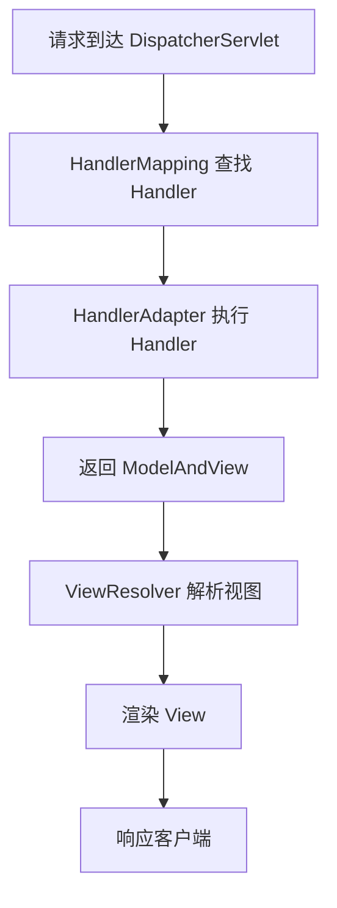

# Spring 核心原理

候选人小刘在字节面试时被问到："Spring 的 IoC 容器是怎么工作的？"

他背出了"控制反转、依赖注入"八个字。面试官追问："那 Bean 的生命周期呢？"

小刘愣了一下，勉强说了个大概。面试官又问："Aware 接口是干嘛用的？什么场景会用到？"

小刘开始擦汗。

【面试官心理】
我问他 IoC，不是想听背书。我想知道的是：他有没有亲手 debug 过容器，有没有理解过 Spring 是怎么从"配置"变成"Bean"的。BeanPostProcessor、BeanFactoryPostProcessor、FactoryBean——这几个概念能答清楚的基本都有源码阅读经验。

---

## 一、Spring IoC 容器 🔴

### 1.1 问题拆解

**第一层：怎么用？**
面试官问："Spring 是怎么创建对象的？"
候选人答："通过依赖注入..."（太表面）

**第二层：底层实现**
面试官追问："那 BeanFactory 和 ApplicationContext 有什么区别？"
候选人答：...（开始卡）

**第三层：边界缺陷**
面试官追问："BeanFactoryPostProcessor 和 BeanPostProcessor 的区别是什么？分别在什么时候执行？"
候选人答：...（P5/P6 分水岭）

**第四层：选型 trade-off**
面试官追问："Spring 为什么用三级缓存解决循环依赖，而不是直接告诉你"有循环依赖"？"
候选人答：...（P7 拉开差距）

### 1.2 错误示范

**候选人原话**："Spring IoC 就是控制反转，交给 Spring 管理 Bean 的创建和依赖关系..."

**问题诊断**：
- 只背了概念，完全没看过源码
- 不知道 Bean 是怎么从配置变成对象的
- 不理解 Spring 的扩展点设计

**面试官内心 OS**："又是一个背八股的..."

### 1.3 标准回答

**原理+实战闭环**：

```java
// 最简 IoC 容器实现
public class SimpleContainer {
    private Map<String, Object> beans = new HashMap<>();

    public void register(String name, Object bean) {
        beans.put(name, bean);
    }

    public Object getBean(String name) {
        return beans.get(name);
    }
}
```

这个实现有什么问题？
- 没有依赖注入：Bean 之间的依赖关系怎么处理？
- 没有生命周期管理：创建前/后要不要做点什么？
- 没有扩展机制：怎么让用户自定义初始化逻辑？

**Spring 的解决方案**：

```java
// BeanDefinition 描述 Bean 的元信息
public class BeanDefinition {
    private Class<?> beanClass;
    private String scope;
    private boolean lazyInit;
    private PropertyValues propertyValues;  // 依赖注入的值
}

// 容器核心接口
public interface BeanFactory {
    Object getBean(String name);
    boolean containsBean(String name);
}

// 扩展点：BeanPostProcessor
public interface BeanPostProcessor {
    Object postProcessBeforeInitialization(Object bean, String beanName);
    Object postProcessAfterInitialization(Object bean, String beanName);
}
```

Spring 的 IoC 容器工作流程：
1. **加载配置**：XML/注解/JavaConfig
2. **解析 BeanDefinition**：把配置转成 BeanDefinition 对象
3. **注册 BeanDefinition**：放入 BeanDefinitionRegistry
4. **实例化 Bean**：根据 BeanDefinition 创建实例
5. **依赖注入**：填充属性，处理 @Autowired、@Value
6. **生命周期回调**：InitializingBean、@PostConstruct、BeanPostProcessor
7. **缓存 Bean**：放入 singletonObjects 一级缓存

【面试官心理】
我追问他 BeanPostProcessor，是想看他有没有真正理解 Spring 的扩展机制。知道这个接口的占 30%，能说清楚执行时机的占 10%。能答到这一层的，基本都有阅读源码的习惯。

### 1.4 追问升级

**P6/P7 差距拉开点**：

```java
// Spring 三级缓存解决循环依赖
public class DefaultSingletonBeanRegistry {
    // 一级缓存：成品 Bean
    private final Map<String, Object> singletonObjects = new ConcurrentHashMap<>();
    // 二级缓存：提前暴露的 Bean（未完成属性注入）
    private final Map<String, Object> earlySingletonObjects = new HashMap<>();
    // 三级缓存：Bean 工厂
    private final Map<String, ObjectFactory<?>> singletonFactories = new HashMap<>();

    public Object getSingleton(String beanName) {
        // 1. 先从一级缓存拿
        Object singleton = singletonObjects.get(beanName);
        if (singleton == null && isSingletonCurrentlyInCreation(beanName)) {
            // 2. 从二级缓存拿（早期暴露）
            singleton = earlySingletonObjects.get(beanName);
            if (singleton == null) {
                // 3. 从三级缓存拿工厂创建
                ObjectFactory<?> factory = singletonFactories.get(beanName);
                if (factory != null) {
                    singleton = factory.getObject();
                    earlySingletonObjects.put(beanName, singleton);
                    singletonFactories.remove(beanName);
                }
            }
        }
        return singleton;
    }
}
```

为什么需要三级缓存？
- **一级缓存**：成品 Bean，可以直接使用
- **二级缓存**：半成品 Bean，已经实例化但未完成属性注入和初始化
- **三级缓存**：Bean 工厂，用于创建代理对象

这样设计是为了解决**循环依赖时创建代理对象**的问题。如果只有一级缓存，无法区分成品和半成品；如果只有两级缓存，无法处理代理对象的创建时机。

---

## 二、Spring AOP 🔴

### 2.1 问题拆解

**第一层：怎么用？**
面试官问："AOP 怎么用？"
候选人答："用 @Aspect 注解定义切面..."（基本 API）

**第二层：底层实现**
面试官追问："JDK 动态代理和 CGLIB 动态代理有什么区别？Spring 怎么选？"
候选人答：...（开始模糊）

**第三层：边界缺陷**
面试官追问："Spring Boot 为什么默认用 CGLIB？JDK 动态代理有什么限制？"
候选人答：...（P6/P7 分水岭）

**第四层：源码细节**
面试官追问："AOP 代理是怎么创建和执行的？invoke 方法里做了什么？"
候选人答：...（P7 拉开差距）

### 2.2 错误示范

**候选人原话**："AOP 是面向切面编程，可以用来做日志、事务、权限控制..."

**问题诊断**：
- 只背了概念，不知道底层是怎么实现的
- 不理解 JDK 代理和 CGLIB 的区别
- 不知道 Spring 是怎么决定用哪种代理的

**面试官内心 OS**："这个候选人肯定没看过 AOP 源码，只背了概念..."

### 2.3 标准回答

**最简实现对比**：

```java
// JDK 动态代理：要求目标类实现接口
public class JdkDynamicProxy implements InvocationHandler {
    private Object target;

    public JdkDynamicProxy(Object target) {
        this.target = target;
    }

    @Override
    public Object invoke(Object proxy, Method method, Object[] args) throws Throwable {
        System.out.println("方法执行前...");
        Object result = method.invoke(target, args);
        System.out.println("方法执行后...");
        return result;
    }
}

// CGLIB 动态代理：基于继承，不需要接口
public class CglibDynamicProxy implements MethodInterceptor {
    private Object target;

    public Object createProxy(Object target) {
        this.target = target;
        Enhancer enhancer = new Enhancer();
        enhancer.setSuperclass(target.getClass());
        enhancer.setCallback(this);
        return enhancer.create();
    }

    @Override
    public Object intercept(Object proxy, Method method, Object[] args, MethodProxy methodProxy) throws Throwable {
        System.out.println("方法执行前...");
        Object result = methodProxy.invokeSuper(proxy, args);
        System.out.println("方法执行后...");
        return result;
    }
}
```

这个写法会在哪翻车？
- JDK 代理要求目标类必须有接口，没有接口就用不了
- CGLIB 代理基于继承，无法代理 final 类和 final 方法
- Spring 需要一个策略来决定用哪种代理

**Spring 的代理选择策略**：

```java
// JdkDynamicAopProxy 和 CglibAopProxy 的选择逻辑
public class DefaultAopProxyFactory {
    public AopProxy createAopProxy(AdvisedSupport config) {
        // 如果目标是接口，或者配置了优化项，使用 JDK 代理
        if (config.getTargetSource().getTargetClass().length > 0 &&
            !config.getProxyTargetClass()) {
            return new JdkDynamicAopProxy(config);
        }
        // 否则使用 CGLIB
        return new CglibAopProxy(config);
    }
}

// Spring Boot 的默认行为
// Spring Boot 2.0 开始，默认 proxyTargetClass = true，即默认使用 CGLIB
```

为什么 Spring Boot 默认用 CGLIB？
1. **不需要接口**：业务类通常没有接口，直接代理实现类更方便
2. **强制 cglib**：@EnableAspectJAutoProxy(proxyTargetClass = true) 是默认值
3. **性能考虑**：CGLIB 在初始化时比 JDK 代理慢，但运行时调用性能相当

【面试官心理】
我追问他 JDK 和 CGLIB 的区别，是想看他有没有实际用过、对比过。知道区别的占 60%，能说出 Spring 为什么默认用 CGLIB 的占 20%。能答到这一层的，基本都有排障经验。

### 2.4 生产避坑

| 场景 | 问题 | 排查方法 |
| --- | --- | --- |
| 事务失效 | 同一个类内部调用，事务注解不生效 | 检查是否走了代理对象 |
| AOP 失效 | private 方法无法被代理 | 把方法改成 public 或注入自己 |
| 循环依赖 | 使用 @Lazy 注解延迟加载 | 检查 Bean 依赖关系 |

:::warning ⚠️
同一个类内部调用会导致 AOP 失效！这是生产事故的高发区。例如下面的代码：

```java
@Service
public class OrderService {
    public void createOrder() {
        // 走的是 this.updateStock()，不是代理对象
        this.updateStock();
    }

    @Transactional
    public void updateStock() {
        // 事务不会生效！
    }
}
```

正确做法：注入自己或者用 ApplicationContext 获取代理对象。
:::

---

## 三、Spring 事务 🔴

### 3.1 问题拆解

**第一层：怎么用？**
面试官问："@Transactional 怎么用？"
候选人答："加在方法或类上，开启事务..."（基本使用）

**第二层：底层实现**
面试官追问："事务的传播行为有几种？REQUIRED 和 REQUIRES_NEW 有什么区别？"
候选人答：...（传播行为是高频追问点）

**第三层：边界缺陷**
面试官追问："什么情况下 @Transactional 会失效？"
候选人答：...（生产事故高发区）

**第四层：源码细节**
面试官追问："TransactionSynchronizationManager 是怎么管理事务的？"
候选人答：...（P7 拉开差距）

### 3.2 错误示范

**候选人原话**："@Transactional 可以开启事务，出异常就会回滚..."

**问题诊断**：
- 不知道默认只对 RuntimeException 回滚
- 不知道 private 方法事务会失效
- 不理解事务传播行为的真正含义

**面试官内心 OS**："这个候选人肯定没踩过事务的坑..."

### 3.3 标准回答

**事务失效的 7 种情况**：

1. **同一个类内部调用**：不走代理对象，事务不生效
2. **private 方法**：JDK 动态代理无法代理 private 方法
3. **非 RuntimeException**：默认只对 RuntimeException 回滚
4. **rollbackFor 配置错误**：没有配置对应的异常类型
5. **新开启事务**：传播行为配置错误，导致没有开启新事务
6. **多数据源**：没有配置正确的事务管理器
7. **try-catch 捕获异常**：异常被吞掉，事务无法感知

```java
// 正确的事务配置示例
@Service
public class TransferService {
    @Autowired
    private AccountMapper accountMapper;

    @Transactional(rollbackFor = Exception.class)  // 指定所有异常都回滚
    public void transfer(String from, String to, BigDecimal amount) {
        accountMapper.decreaseBalance(from, amount);
        // 模拟异常
        if (amount.compareTo(BigDecimal.ZERO) > 10000) {
            throw new BusinessException("单笔转账超过限额");
        }
        accountMapper.increaseBalance(to, amount);
    }
}
```

**传播行为的真正含义**：

```java
// REQUIRED：加入当前事务，没有则创建新事务
@Transactional(propagation = Propagation.REQUIRED)
public void methodA() {
    methodB();  // 会加入到 methodA 的事务中
}

// REQUIRES_NEW：每次都创建新事务，挂起当前事务
@Transactional(propagation = Propagation.REQUIRES_NEW)
public void methodB() {
    // 独立事务，不受 methodA 影响
}
```

【面试官心理】
我追问他事务失效的场景，是想看他有没有实际踩过坑。能说出 3 种以上的，基本都有生产排障经验。能说清楚"同一个类内部调用事务失效"这个坑的，基本都看过 Spring 源码。

### 3.4 生产避坑

**事务和锁的顺序问题**：

```java
// 错误顺序：先解锁再提交，可能导致数据不一致
@Transactional
public void createOrder() {
    // 锁定库存
    lockStock(productId);
    // 扣减库存
    reduceStock(productId);
    // 创建订单
    createOrderRecord();
    // 这里如果异常，锁已经释放，但事务未提交
}

// 正确顺序：先操作再锁定，确保原子性
@Transactional
public void createOrder() {
    // 扣减库存（带乐观锁）
    reduceStockWithVersion(productId);
    // 创建订单
    createOrderRecord();
    // 事务提交时自动释放锁
}
```

:::tip 💡
事务和锁的顺序是生产事故的高发区。建议：先开启事务，再获取锁，最后操作数据。这样锁的粒度和事务的边界是匹配的。
:::

---

## 四、Spring MVC 请求处理流程 🟡

### 4.1 问题拆解

**第一层：怎么用？**
面试官问："Spring MVC 的请求处理流程是什么？"
候选人答："DispatcherServlet 接收请求..."（基本流程）

**第二层：组件协作**
面试官追问："HandlerMapping 和 HandlerAdapter 有什么区别？"
候选人答：...（组件职责）

**第三层：扩展点**
面试官追问："怎么自定义参数解析器？什么场景会用到？"
候选人答：...（P6 拉开差距）

### 4.2 标准回答



关键组件：
- **DispatcherServlet**：前端控制器，统一处理请求入口
- **HandlerMapping**：根据 URL 找到对应的 Handler（Controller 方法）
- **HandlerAdapter**：执行 Handler，返回 ModelAndView
- **ViewResolver**：解析视图名，找到具体的 View 实现
- **View**：渲染模型数据，生成 HTML/JSON 等

【面试官心理】
我追问他自定义参数解析器，是想看他有没有扩展过 Spring MVC。能回答出来的，基本都有过"要给前端提供非标准参数格式"的实战经验。

---

## 五、Spring 扩展点 🟡

### 5.1 核心扩展点

| 扩展点 | 接口 | 执行时机 | 使用场景 |
| --- | --- | --- | --- |
| BeanFactoryPostProcessor | `postProcessBeanFactory()` | BeanDefinition 加载后，Bean 实例化前 | 修改 BeanDefinition |
| BeanPostProcessor | `postProcessBefore/After()` | Bean 实例化后，初始化前后 | 属性注入、AOP 代理 |
| InitializingBean | `afterPropertiesSet()` | Bean 属性填充后 | 初始化逻辑 |
| DisposableBean | `destroy()` | 容器关闭时 | 资源释放 |
| FactoryBean | `getObject()` | 获取 Bean 时 | 复杂对象创建 |
| ImportBeanDefinitionRegistrar | `registerBeanDefinitions()` | 配置类解析时 | 动态注册 Bean |

### 5.2 生产避坑

:::warning ⚠️
BeanFactoryPostProcessor 和 BeanPostProcessor 名字很像，但作用完全不同：
- BeanFactoryPostProcessor：修改 BeanDefinition，可以在 Bean 实例化前改变 Bean 的配置
- BeanPostProcessor：处理 Bean 实例，在 Bean 初始化前后做增强

记不住？那就记住：**BeanDefinition 是图纸，Bean 是成品**。Factory 在图纸阶段动手，Processor 在成品阶段动手。
:::

---

## 六、学习路径指引

| 级别 | 重点 | 期望回答 |
| --- | --- | --- |
| P5 | IoC 基础、依赖注入、AOP 使用 | 能说清楚 IoC 和 AOP 的概念，会用注解 |
| P6 | Bean 生命周期、事务失效场景、代理原理 | 能回答追问，理解源码细节 |
| P7 | 三级缓存、事务传播机制、Spring 扩展点 | 能讲清设计原理，有生产排障经验 |

:::tip 💡
准备 Spring 面试时，建议先从"事务失效"这个高频追问点入手，因为这既是面试重点，也是生产事故的高发区。
:::

---

## 七、工程选型

### 什么场景用 Spring

**适用场景**：
- 企业级应用：Spring Boot 快速搭建微服务
- 复杂依赖管理：IoC 容器统一管理 Bean 依赖
- 切面编程：统一处理日志、事务、安全
- 响应式编程：Spring WebFlux

**不适用场景**：
- 极致性能：Spring 封装较多，性能敏感场景考虑裸 JDBC
- 极简项目：Spring Boot 虽然简单，但对 GraalVM 原生编译不友好
- 函数式场景：考虑 Vert.x 或 Project Reactor

---

## 八、生产避坑总结

| 场景 | 问题 | 解决方案 |
| --- | --- | --- |
| 循环依赖 | 构造器注入 + 代理对象创建死循环 | 改用 setter 注入或 @Lazy |
| 事务失效 | 同一个类内部调用不走代理 | 注入自己或用 AopContext.currentProxy() |
| 启动失败 | Bean 依赖缺失导致启动报错 | 检查 @DependsOn 注解 |
| 内存泄漏 | BeanScope 配置错误或未销毁 | 确认 Bean 作用域，及时释放资源 |

:::tip 💡
生产环境遇到 Spring 问题，先看日志：BeanCreationException 说明 Bean 实例化失败，BeanNotOfRequiredTypeException 说明类型不匹配，NoSuchBeanDefinitionException 说明依赖缺失。
:::
