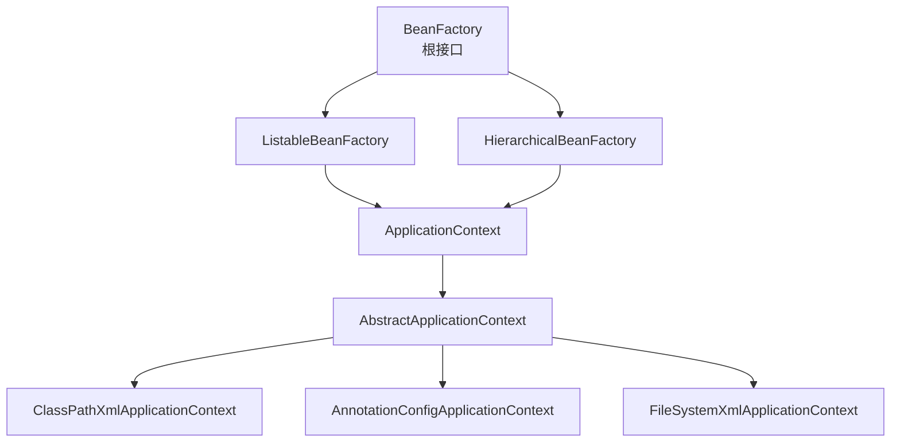

# Spring IoC 容器核心原理

候选人小孙在面试拼多多时，面试官问了一个看似简单的问题：

"BeanFactory 和 ApplicationContext 有什么区别？"

小孙说："ApplicationContext 是 BeanFactory 的子接口，功能更多。"

面试官追问："那 ApplicationContext 比 BeanFactory 多做了哪些事？"

小孙："...预加载 Bean？"

面试官继续追问："Spring 容器初始化的 refresh() 方法有哪些步骤？"

小孙答不上来。

【面试官心理】
这道题我用来测试候选人对 Spring 容器架构的整体认知。知道 BeanFactory 和 ApplicationContext 区别的是基本合格，能说出 refresh() 12 个步骤的是认真读过源码的，能讲清楚 BeanFactoryPostProcessor 和 BeanPostProcessor 差异的才是真正理解 Spring 生命周期的人。

## 一、BeanFactory vs ApplicationContext 🔴

### 1.1 核心区别

| 特性 | BeanFactory | ApplicationContext |
|------|-------------|-------------------|
| 加载时机 | 懒加载（按需加载） | 预加载（启动时全部加载） |
| 事件广播 | 不支持 | 支持 `ApplicationEventMulticaster` |
| 国际化 | 不支持 | 内置 `MessageSource` |
| 资源加载 | 不支持 | 内置 `ResourceLoader` |
| 环境配置 | 不支持 | 内置 `EnvironmentCapable` |
| 生命周期回调 | 不支持 | 支持 `Lifecycle` 接口 |
| AOP | 不支持 | 可集成 |
| 适用场景 | 资源极度敏感 | 大多数场景（默认选择） |

```java
// BeanFactory 是老式容器，按需加载
BeanFactory factory = new XmlBeanFactory(new ClassPathResource("beans.xml"));
OrderService orderService = factory.getBean("orderService");  // 第一次 getBean 时才创建

// ApplicationContext 是现代容器，预加载
ApplicationContext context = new ClassPathXmlApplicationContext("beans.xml");
// 启动时即加载所有 Bean
OrderService orderService = context.getBean("orderService");  // 启动时就创建好了
```

### 1.2 ❌ 错误示范

**候选人原话**："ApplicationContext 比 BeanFactory 功能多，所以应该用 ApplicationContext。"

**问题诊断**：
- 不知道懒加载在资源敏感场景的价值
- 不理解预加载带来的启动时间成本
- 没有考虑过移动端或嵌入式场景

【面试官心理】
大多数候选人只知道 ApplicationContext 比 BeanFactory 功能多，但不知道 BeanFactory 的懒加载在某些场景下是优势。比如 Spring Boot CLI 环境下，BeanFactory 的按需加载能显著减少启动时间。知道这个区别的，通常是有架构思维的工程师。

### 1.3 继承体系



## 二、ApplicationContext 的扩展功能 🟡

### 2.1 事件机制

```java
// ApplicationContext 内置了事件广播器
public interface ApplicationContext extends EnvironmentCapable,
        ListableBeanFactory, HierarchicalBeanFactory,
        MessageSource, ApplicationEventPublisher,  // 事件发布
        ResourcePatternResolver {                   // 资源加载
}
```

### 2.2 国际化

```java
@Autowired
private MessageSource messageSource;

public String getMessage(String code) {
    return messageSource.getMessage(code, null, Locale.CHINA);
}

// messages_zh_CN.properties
// user.not.found=用户不存在
```

### 2.3 资源加载

```java
// ApplicationContext 实现了 ResourcePatternResolver
ApplicationContext context = new AnnotationConfigApplicationContext();
Resource[] resources = context.getResources("classpath*:mapper/**/*.xml");
// 支持 Ant 风格的路径模式
```

## 三、refresh() 方法 —— 容器初始化12步 🔴

### 3.1 完整流程

```java
// AbstractApplicationContext.refresh() 的12个步骤
public void refresh() throws BeansException {
    // 1. 准备刷新上下文
    prepareRefresh();

    // 2. 获取 BeanFactory
    ConfigurableListableBeanFactory beanFactory = obtainFreshBeanFactory();

    // 3. 准备 BeanFactory（设置类加载器、表达式解析器、后置处理器）
    prepareBeanFactory(beanFactory);

    try {
        // 4. 子类扩展：在 BeanFactory 准备好后处理
        postProcessBeanFactory(beanFactory);

        // 5. 执行 BeanFactoryPostProcessor
        //    （注意：在 BeanDefinition 加载之后、Bean 实例化之前）
        invokeBeanFactoryPostProcessors(beanFactory);

        // 6. 注册 BeanPostProcessor
        //    （注意：在 Bean 实例化之后、初始化之前）
        registerBeanPostProcessors(beanFactory);

        // 7. 初始化消息源
        initMessageSource(beanFactory);

        // 8. 初始化事件广播器
        initApplicationEventMulticaster(beanFactory);

        // 9. 子类扩展：刷新
        onRefresh();

        // 10. 注册监听器
        registerListeners();

        // 11. 实例化所有剩余的单例（非懒加载）
        finishBeanFactoryInitialization(beanFactory);

        // 12. 发布刷新完成事件
        finishRefresh();
    } catch (BeansException ex) {
        destroyBeans();  // 销毁已创建的单例
        throw ex;
    }
}
```

### 3.2 BeanFactoryPostProcessor vs BeanPostProcessor

这是面试中最容易被问混的两个接口：

| 对比项 | BeanFactoryPostProcessor | BeanPostProcessor |
|--------|-------------------------|-------------------|
| 执行时机 | BeanDefinition 加载后，Bean 实例化**前** | Bean 实例化后，初始化**前/后** |
| 处理对象 | BeanDefinition（元数据） | Bean 实例（成品） |
| 典型应用 | 修改 BeanDefinition 配置、属性占位符解析 | 依赖注入、AOP 代理创建 |
| 执行次数 | 每个后置处理器执行一次 | 每个 Bean 实例化时都执行 |
| 例子 | `PropertySourcesPlaceholderConfigurer` | `AutowiredAnnotationBeanPostProcessor` |

```java
// BeanFactoryPostProcessor：修改 BeanDefinition
@Component
public class MyBeanFactoryPostProcessor implements BeanFactoryPostProcessor {
    @Override
    public void postProcessBeanFactory(
            ConfigurableListableBeanFactory beanFactory) throws BeansException {
        // 可以修改 BeanDefinition
        BeanDefinition bd = beanFactory.getBeanDefinition("orderService");
        bd.getPropertyValues().add("database", "mysql");
    }
}

// BeanPostProcessor：处理 Bean 实例
@Component
public class MyBeanPostProcessor implements BeanPostProcessor {
    @Override
    public Object postProcessBeforeInitialization(
            Object bean, String beanName) throws BeansException {
        // Bean 实例化后，初始化之前调用
        // 可以返回代理对象替换原始对象
        if (bean instanceof OrderService) {
            // 生成代理
        }
        return bean;
    }

    @Override
    public Object postProcessAfterInitialization(
            Object bean, String beanName) throws BeansException {
        // 初始化之后调用
        return bean;
    }
}
```

### 3.3 关键步骤详解

**第5步：invokeBeanFactoryPostProcessors**

```java
// PropertySourcesPlaceholderConfigurer 的工作原理
// 它是 BeanFactoryPostProcessor，在 Bean 实例化前修改 BeanDefinition
// 将 ${jdbc.url} 占位符替换为实际值

// 如果没有这一步，所有 @Value("${xxx}") 都会拿不到值
// 因为 BeanDefinition 中存的是 "${xxx}"，不是真实值
```

**第11步：finishBeanFactoryInitialization**

```java
protected void finishBeanFactoryInitialization(
        ConfigurableListableBeanFactory beanFactory) {

    // 1. 初始化类型转换服务
    beanFactory.setTypeConverter(
        new BeanFactoryTypeConverter());

    // 2. 添加嵌入值解析器（处理 @Value）
    beanFactory.addEmbeddedValueResolver(strVal ->
        resolveEmbeddedValue(strVal));

    // 3. 初始化所有非懒加载的单例 Bean
    beanFactory.preInstantiateSingletons();
}
```

## 四、容器继承体系 🟡

### 4.1 HierarchicalBeanFactory

```java
// HierarchicalBeanFactory：父子容器
public interface HierarchicalBeanFactory extends BeanFactory {
    // 获取父容器
    BeanFactory getParentBeanFactory();

    // 检查当前容器（不包含父容器）中是否包含指定 Bean
    boolean containsLocalBean(String name);
}
```

典型应用：Spring MVC 的父子容器。

```java
// Spring MVC 中的父子容器
// 父容器（ApplicationContext）：Service、Repository
// 子容器（WebApplicationContext）：Controller
// Controller 能访问 Service，但 Service 不能访问 Controller
```

### 4.2 ListableBeanFactory

```java
// ListableBeanFactory：可枚举的 BeanFactory
public interface ListableBeanFactory extends BeanFactory {
    // 根据类型获取所有 Bean
    <T> Map<String, T> getBeansOfType(Class<T> type);

    // 获取指定类型的所有 Bean 名称
    String[] getBeanNamesForType(Class<?> type);

    // 检查是否包含指定名称的 Bean
    boolean containsBean(String name);

    // 获取所有 Bean 定义的名称
    String[] getBeanDefinitionNames();
}
```

:::tip 💡
BeanFactory 的 `getBean()` 是按名查找，是**运行时**操作；ListableBeanFactory 的 `getBeansOfType()` 可以一次获取所有该类型的 Bean，是**启动时**操作。两者结合使用，可以在启动时做批量检查。
:::

## 五、生产避坑 🟡

### 5.1 循环依赖的检测

Spring 在容器初始化时会检测循环依赖：

```java
// AbstractBeanFactory 中检查
private final Set<String> singletonsCurrentlyInCreation =
    Collections.newSetFromMap(new ConcurrentHashMap<>(16));

// 在创建 Bean 之前标记
beforeSingletonCreation(beanName);  // 将 beanName 加入 Set

// 如果发现重复创建（循环依赖）
if (this.singletonsCurrentlyInCreation.contains(beanName)) {
    throw new BeanCurrentlyInCreationException(beanName);
}
```

### 5.2 Bean 初始化顺序问题

```java
@Component
public class A {
    @Autowired
    private B b;  // A 依赖 B
}

@Component
public class B {
    @Autowired
    private C c;  // B 依赖 C
}

@Component
public class C {
    @Autowired
    private A a;  // C 依赖 A —— 循环依赖！
}
```

启动时报错：

```
BeanCurrentlyInCreationException: Error creating bean 'a':
Requested bean is currently in creation: Did you intend to reference
an existing unconfigured bean named 'b'?
```

### 5.3 容器关闭与销毁

```java
// ApplicationContext 实现了 ConfigurableApplicationContext
ConfigurableApplicationContext context = new AnnotationConfigApplicationContext();

// 容器关闭时
context.close();  // 同步关闭
// 或
context.registerShutdownHook();  // 注册 JVM 关闭钩子，自动调用 close()

// 触发所有 DisposableBean.destroy() 和 destroy-method
```

## 六、工程选型 🟢

### 6.1 什么时候用 BeanFactory

| 场景 | 建议 | 原因 |
|------|------|------|
| 资源极度敏感 | BeanFactory | 懒加载，按需创建 |
| 嵌入式设备 | BeanFactory | 启动快，内存占用小 |
| Spring Boot CLI | BeanFactory | 交互式环境，按需加载 |
| 普通 Web 应用 | ApplicationContext | 默认选择 |
| 需要事件机制 | ApplicationContext | 必须 |
| 需要国际化 | ApplicationContext | 必须 |
| 需要 AOP | ApplicationContext | 必须 |

【面试官心理】
Spring Boot 默认使用 ApplicationContext。但理解 BeanFactory 的懒加载机制，有助于在特殊场景（资源受限、插件化框架）下做架构决策。

## 七、面试追问链 🔴

**第一层：基本区别**
面试官问："BeanFactory 和 ApplicationContext 有什么区别？"
候选人答："功能多少的区别..."（说不完整）
考察点：基本概念

**第二层：核心差异**
面试官追问："为什么 ApplicationContext 是预加载，BeanFactory 是懒加载？"
候选人答：...（源码层面）
考察点：实现原理

**第三层：生命周期**
面试官追问："BeanFactoryPostProcessor 和 BeanPostProcessor 的区别是什么？分别在哪个阶段执行？"
候选人答：...（容易混淆）
考察点：生命周期理解

**第四层：扩展点**
面试官追问："如果要自定义一个 Bean 的创建过程，比如加个日志，应该用哪个接口？"
候选人答：...（BeanPostProcessor）
考察点：实际应用
