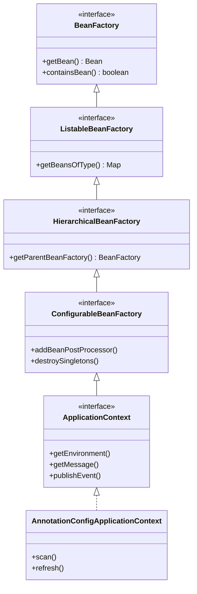
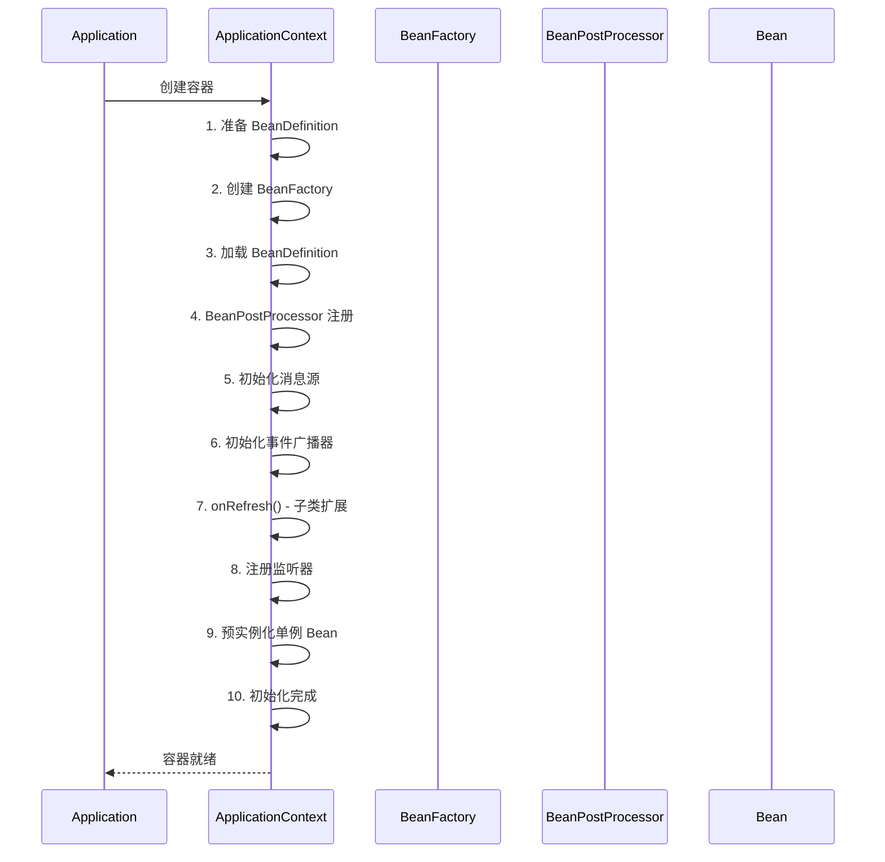

# Spring IoC 容器

> 目标级别：P6
>
> 面试命中率：80%

## 快速自测

1. 什么是 IoC？Spring 为什么需要 IoC？
2. BeanFactory 和 ApplicationContext 有什么区别？
3. Spring 如何管理 Bean 之间的依赖关系？

---

## 一、IoC 概念详解

### 什么是 IoC

IoC（Inversion of Control，控制反转）是一种设计原则，将对象的创建和依赖管理从应用代码中转移到容器。

```java
// ❌ 传统方式：对象自己创建依赖
public class UserService {
    private UserDao userDao = new UserDaoImpl();  // 主动创建

    public void save(User user) {
        userDao.save(user);
    }
}

// ✅ IoC 方式：由容器注入依赖
public class UserService {
    private UserDao userDao;  // 被动接收

    @Autowired
    public UserService(UserDao userDao) {
        this.userDao = userDao;  // 容器注入
    }
}
```

### 依赖注入（DI）vs 控制反转（IoC）

| 概念 | 说明 |
| --- | --- |
| **IoC** | 广义概念：控制权的转移（从程序员到容器） |
| **DI** | IoC 的具体实现：通过构造函数、Setter、接口注入等方式注入依赖 |

---

## 二、BeanFactory vs ApplicationContext

### 对比表

| 对比维度 | BeanFactory | ApplicationContext |
| --- | --- | --- |
| **初始化时机** | 懒加载（首次获取 Bean 时） | 预加载（容器启动时） |
| **功能** | 基础功能 | 增强功能 |
| **国际化** | ❌ | ✅ |
| **事件发布** | ❌ | ✅ |
| **资源加载** | ❌ | ✅ |
| **Web 应用** | XmlWebApplicationContext | ClassPathXmlApplicationContext 等 |
| **推荐程度** | 了解即可 | ⭐⭐⭐ 推荐 |

### 继承关系



---

## 三、Spring 容器初始化流程



### refresh() 方法核心源码

```java title="AbstractApplicationContext.java"
public void refresh() throws BeansException {
    // 1. 准备刷新上下文
    prepareRefresh();

    // 2. 获取新的 BeanFactory
    ConfigurableListableBeanFactory beanFactory = obtainFreshBeanFactory();

    // 3. 准备 BeanFactory（注册 BeanPostProcessor）
    prepareBeanFactory(beanFactory);

    try {
        // 4. 子类扩展：允许在 BeanFactory 准备好后进行处理
        postProcessBeanFactory(beanFactory);

        // 5. 调用 BeanFactoryPostProcessor
        invokeBeanFactoryPostProcessors(beanFactory);

        // 6. 注册 BeanPostProcessor
        registerBeanPostProcessors(beanFactory);

        // 7. 初始化消息源
        initMessageSource(beanFactory);

        // 8. 初始化事件广播器
        initApplicationEventMulticaster();

        // 9. 子类扩展：在刷新时初始化特殊 Bean
        onRefresh();

        // 10. 注册监听器
        registerListeners();

        // 11. 实例化所有剩余的单例 Bean（非懒加载）
        finishBeanFactoryInitialization(beanFactory);

        // 12. 完成刷新：发布相应的事件
        finishRefresh();
    } catch (BeansException ex) {
        destroyBeans();
        cancelRefresh(ex);
        throw ex;
    }
}
```

---

## 四、Bean 作用域

| 作用域 | 说明 | 生命周期 |
| --- | --- | --- |
| **singleton** | 默认，每个容器一个实例 | 容器创建到销毁 |
| **prototype** | 每次获取创建新实例 | 使用到销毁 |
| **request** | 每次 HTTP 请求创建新实例 | 请求开始到结束 |
| **session** | 每次 HTTP 会话创建新实例 | 会话开始到结束 |
| **application** | ServletContext 级别 | 应用启动到停止 |
| **websocket** | WebSocket 生命周期 | WebSocket 连接生命周期 |

---

## 五、依赖注入方式

### 1. 构造函数注入（推荐）

```java
@Service
public class UserService {
    private final UserDao userDao;

    @Autowired
    public UserService(UserDao userDao) {
        this.userDao = userDao;
    }
}
```

### 2. Setter 注入（可选依赖）

```java
@Service
public class UserService {
    private UserDao userDao;

    @Autowired
    public void setUserDao(UserDao userDao) {
        this.userDao = userDao;
    }
}
```

### 3. 字段注入（不推荐）

```java
@Service
public class UserService {
    @Autowired
    private UserDao userDao;  // ⚠️ 不推荐，无法设置为 final
}
```

---

## 六、高频面试题

### 🔴 第一层：BeanFactory 和 ApplicationContext 的区别？

**答案要点**：
1. BeanFactory 是懒加载，ApplicationContext 是预加载
2. ApplicationContext 提供了更多企业级功能（国际化、事件、资源加载）
3. 日常开发推荐使用 ApplicationContext

### 🟡 第二层：Spring 容器初始化都做了什么？

**答案要点**：
1. 创建 BeanFactory
2. 加载 BeanDefinition
3. 注册 BeanPostProcessor
4. 初始化消息源和事件广播器
5. 预实例化单例 Bean

---

## 七、常见陷阱

> ⚠️ **陷阱一**：BeanFactory 可以延迟初始化

如果使用 BeanFactory，某些 Bean 可能在首次使用时才初始化，可能导致意外的错误延迟到运行时才发现。

> ⚠️ **陷阱二**：循环依赖问题

Spring 可以解决 Setter 注入的循环依赖，但构造器注入的循环依赖无法解决。
