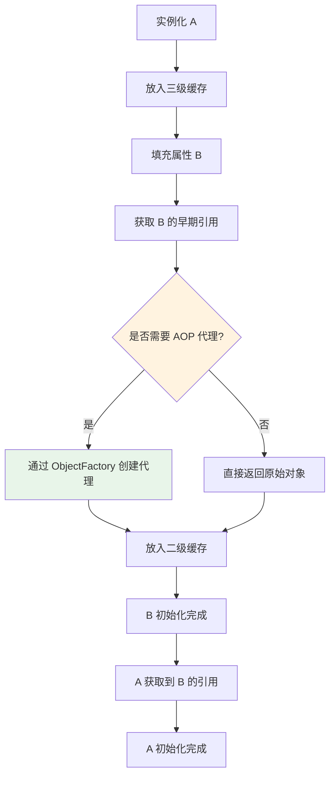

# 为什么需要三级缓存

> 目标级别：P6
>
> 面试命中率：75%

## 快速自测

1. 一级缓存能解决循环依赖吗？
2. 二级缓存存在的意义是什么？
3. 三级缓存解决了什么问题？

---

## 一、为什么需要三级缓存

### 一级缓存的问题

如果只有一级缓存，Bean 创建流程如下：

```java
// 只有一级缓存的情况
public class SimpleSingletonRegistry {

    private Map<String, Object> singletonObjects = new ConcurrentHashMap<>();

    public Object getSingleton(String beanName, ObjectFactory<?> factory) {
        // 从一级缓存获取
        Object singleton = singletonObjects.get(beanName);
        if (singleton == null) {
            singleton = factory.getObject();  // 创建 Bean
            singletonObjects.put(beanName, singleton);  // 放入一级缓存
        }
        return singleton;
    }
}
```

**问题**：如果 Bean 需要 AOP 代理，一级缓存中存的是原始对象，不是代理对象。

### 二级缓存的作用

```java
// 加入二级缓存
private Map<String, Object> earlySingletonObjects = new ConcurrentHashMap<>();

public Object getSingleton(String beanName, ObjectFactory<?> factory) {
    // 一级缓存没有
    Object singleton = singletonObjects.get(beanName);
    if (singleton == null) {
        // 二级缓存也没有
        singleton = earlySingletonObjects.get(beanName);
        if (singleton == null) {
            // 创建 Bean，提前暴露
            singleton = factory.getObject();
            // ⚠️ 放入二级缓存，但这里放的是原始对象还是代理对象？
            earlySingletonObjects.put(beanName, singleton);
        }
    }
    return singleton;
}
```

**问题**：二级缓存存入的是 `factory.getObject()` 的结果，可能是原始对象。

### 三级缓存的真正目的

三级缓存存储 `ObjectFactory`，而不是直接存储对象：

```java
// 三级缓存
private Map<String, ObjectFactory<?>> singletonFactories = new HashMap<>();

public Object getSingleton(String beanName, ObjectFactory<?> factory) {
    // 三级缓存有工厂
    ObjectFactory<?> singletonFactory = singletonFactories.get(beanName);
    if (singletonFactory != null) {
        // 调用工厂获取对象（可能是代理对象）
        Object singleton = singletonFactory.getObject();
        // 移到二级缓存
        earlySingletonObjects.put(beanName, singleton);
        singletonFactories.remove(beanName);
        return singleton;
    }
    return null;
}
```

---

## 二、三级缓存解决的核心问题

```java title="AbstractAutowireCapableBeanFactory.java"
// 创建 Bean 时的提前暴露
addSingletonFactory(beanName, () -> {
    // 延迟创建代理
    return getEarlyBeanReference(beanName, mbd, bean);
});
```

### getEarlyBeanReference 方法

```java
protected Object getEarlyBeanReference(String beanName, RootBeanDefinition mbd, Object bean) {
    // 调用所有 SmartInstantiationAwareBeanPostProcessor
    // 允许自定义创建早期引用（如代理对象）
    Object exposedBean = bean;
    for (SmartInstantiationAwareBeanPostProcessor bp : getBeanPostProcessors()) {
        exposedBean = bp.getEarlyBeanReference(exposedBean, beanName);
        if (exposedBean == null) {
            return exposedBean;
        }
    }
    return exposedBean;
}
```

---

## 三、核心原理

### 为什么不能直接创建代理？



---

## 四、高频面试题

### 🔴 第一层：为什么要用三级缓存？

**答案要点**：
1. 一级缓存存储成品 Bean
2. 二级缓存存储早期 Bean（半成品）
3. 三级缓存存储工厂，延迟创建代理对象
4. 解决「提前暴露引用」与「AOP 代理」之间的矛盾

### 🟡 第二层：为什么不能直接在二级缓存创建代理？

**答案要点**：
1. 如果每次实例化都创建代理，会带来不必要的性能开销
2. 三级缓存通过 `ObjectFactory` 延迟创建
3. 只有真正需要时才创建代理对象

---

## 五、对比总结

| 缓存 | 内容 | 作用 | 使用时机 |
| --- | --- | --- | --- |
| 一级 | 成品 Bean | 供外部使用 | Bean 创建完成后 |
| 二级 | 早期 Bean | 解决循环依赖 | 循环依赖时 |
| 三级 | ObjectFactory | 延迟创建代理 | 实例化后立即 |
