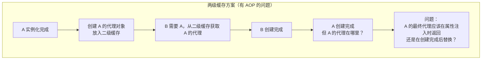
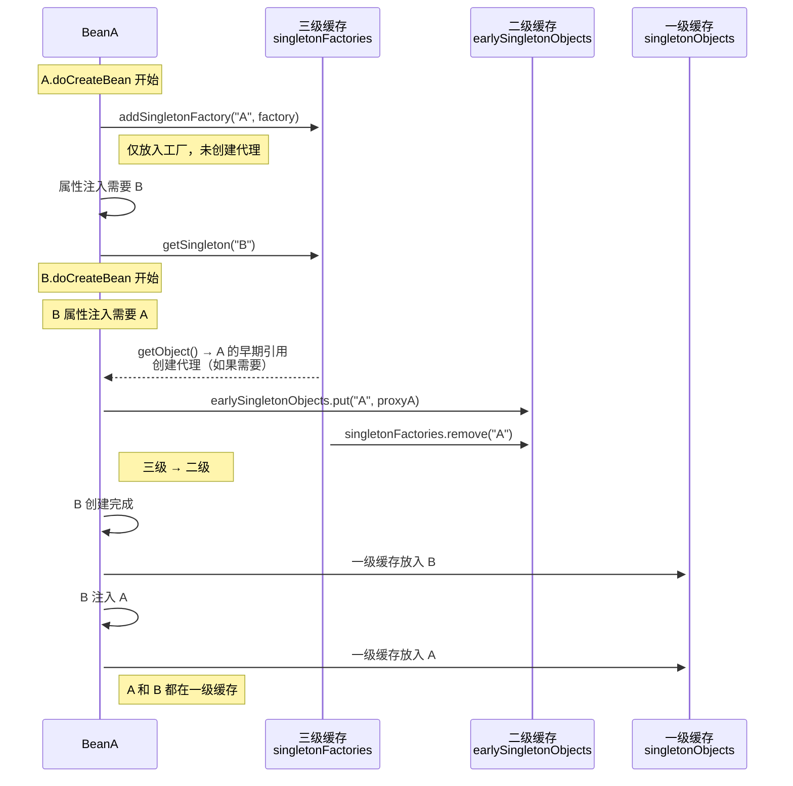
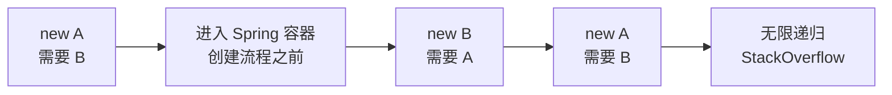
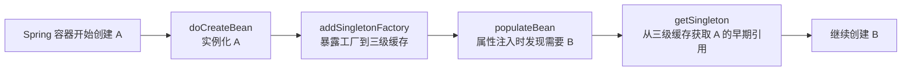

候选人小林在面试美团时，面试官问道：

"Spring 为什么需要三级缓存？两级不够吗？"

小林说："一级缓存存完整对象，二级缓存存早期对象，三级缓存存工厂..."

面试官追问："那为什么不能直接用二级缓存存工厂创建出来的对象，而要多加一个三级？"

小林愣住了。

面试官继续问："那如果 Spring 没有 AOP，还需要三级缓存吗？"

小林彻底答不上来。

【面试官心理】
这道题我是在测候选人对 Spring 设计哲学的理解。三级缓存不是随意设计的，它是为了解决一个特定问题：如何在循环依赖的同时保证 AOP 代理的正确性。能回答出"为了延迟代理创建"的才是真正理解的。

## 一、从一个问题开始 🔴

**为什么需要三级缓存？**

答案是：**为了在解决循环依赖的同时支持 AOP 代理**。

这不是为了缓存性能，不是为了减少对象创建——完全是为了解决"代理"和"循环"同时存在的场景。

### 1.1 如果没有 AOP

假设 Spring 没有 AOP 功能：

```java
// 没有 AOP 切面时
Map<String, Object> singletonObjects = new HashMap<>();        // 一级
Map<String, Object> earlySingletonObjects = new HashMap<>();   // 二级
// 只需要两级就够了！工厂不需要了，直接在实例化后把对象放入二级缓存
```

**结论**：如果没有 AOP，只需要两级缓存。一级存完全体，二级存早期引用足矣。

### 1.2 有 AOP 时的问题

假设只有两级缓存：



两级缓存的困境：

```java
// ❌ 两级缓存方案
// A 实例化后，直接创建代理存入二级缓存
Object proxyA = createProxy(aInstance);  // 假设这里能创建代理
earlySingletonObjects.put("A", proxyA);

// B 属性注入时拿到的是 A 的代理
B b = new B();
b.setA(getEarlySingleton("A"));  // 获取到的是早期代理

// A 初始化完成后... 怎么替换掉早期代理？
// 问题：谁持有 A 的引用？谁来触发替换？
```

这就是三级缓存存在的意义：**工厂方法 + 延迟代理创建**。

## 二、三级缓存的工作机制 🔴

### 2.1 核心思想：延迟代理

```java
// 三级缓存的关键设计
// 不是"实例化后立即创建代理"
// 而是"需要时才创建代理"

public Object getSingleton(String beanName, ObjectFactory<?> singletonFactory) {
    synchronized (this.singletonObjects) {
        Object singletonInstance = this.singletonObjects.get(beanName);
        if (singletonInstance == null) {
            // 回调工厂获取对象
            singletonInstance = singletonFactory.getObject();
            // 放入缓存
            this.singletonObjects.put(beanName, singletonInstance);
        }
        return singletonInstance;
    }
}
```

### 2.2 工厂方法的设计

```java
// Spring 中的工厂方法定义
@FunctionalInterface
public interface ObjectFactory<T> {
    T getObject() throws BeansException;
}

// addSingletonFactory 的调用点
// 在 doCreateBean 中，实例化后立即调用
boolean earlySingletonExposure = mbd.isSingleton()
    && this.allowCircularReferences
    && isSingletonCurrentlyInCreation(beanName);

if (earlySingletonExposure) {
    addSingletonFactory(beanName,
        () -> getEarlyBeanReference(beanName, mbd, bean));
}

// getEarlyBeanReference 负责创建早期引用（可能是代理）
protected Object getEarlyBeanReference(String beanName,
                                         RootBeanDefinition mbd,
                                         Object bean) {
    Object exposedObject = bean;
    // 如果需要 AOP 代理，在这里创建
    if (mbd.isSynthetic() && hasInstantiationAwareBeanPostProcessors()) {
        // 遍历所有后置处理器，检查是否需要创建代理
        for (BeanPostProcessor bp : getBeanPostProcessors()) {
            if (bp instanceof AbstractAutoProxyCreator) {
                AbstractAutoProxyCreator proxyCreator =
                    (AbstractAutoProxyCreator) bp;
                // 检查切面是否匹配这个 Bean
                if (proxyCreator.shouldProxy(bean, beanName)) {
                    exposedObject = proxyCreator.getEarlyBeanReference(
                        bean, beanName);
                    break;
                }
            }
        }
    }
    return exposedObject;
}
```

### 2.3 工厂延迟触发的场景



**关键观察**：
- 工厂在实例化完成后立即放入三级缓存
- **代理的实际创建发生在其他 Bean 从三级缓存获取时**
- 这就是"延迟"的含义：不是立即创建代理，而是等需要时才创建

### 2.4 为什么需要二级缓存？

防止同一个 Bean 被多次代理：

```java
// 场景：多个 Bean 同时循环依赖同一个 Bean
// A 和 C 都依赖 B

// A 创建时
B b = singletonFactory.getObject();  // 第一次调用，创建代理 B1
earlySingletonObjects.put("B", b);

// C 创建时
B b2 = earlySingletonObjects.get("B");  // 直接从二级缓存取
// 不会再次调用 factory.getObject()

// 如果只有三级缓存：
// A 创建时，放入工厂
// C 创建时，又调用 factory.getObject() → 又创建一个代理 B2！
// B 出现了两个不同的代理对象！
```

## 三、设计权衡分析 🔴

### 3.1 三级缓存 vs 两级缓存的权衡

| 维度 | 两级缓存 | 三级缓存 |
| --- | --- | --- |
| 代理创建时机 | 实例化后立即创建 | 延迟到获取时创建 |
| 循环依赖支持 | ❌ 无法支持 AOP 场景 | ✅ 完美支持 |
| 代码复杂度 | 低 | 高 |
| 性能开销 | 稍高（多一次缓存查找） | 略高（三次 map 查找） |
| 可维护性 | 简单 | 复杂 |

### 3.2 为什么不能实例化后立即创建代理？

如果代理在实例化后立即创建，会面临一个问题：**属性注入还没完成，切面可能无法正确判断**。

```java
// ❌ 假设实例化后立即创建代理
BeanWrapper wrapper = createBeanInstance(beanName, mbd, args);
Object proxy = createProxy(wrapper.getWrappedInstance(), beanName);
// 此时属性还没注入，AspectJ 无法判断某些切点是否匹配
// 因为被代理对象的状态还不完整
```

### 3.3 Spring 的优化：SmartInstantiationAwareBeanPostProcessor

```java
// Spring 5.x 引入了 getEarlyBeanReference 回调
// 它是 SmartInstantiationAwareBeanPostProcessor 的方法
public interface SmartInstantiationAwareBeanPostProcessor
        extends InstantiationAwareBeanPostProcessor {

    // 在实例化后、属性注入前，预测 Bean 的类型
    Object predictBeanType(Class<?> beanClass, String beanName);

    // 获取早期引用（用于循环依赖）
    Object getEarlyBeanReference(Object bean, String beanName);
}
```

:::tip 💡
AbstractAutoProxyCreator 实现了 getEarlyBeanReference，在其中判断是否需要为循环依赖中的 Bean 创建代理。这样，即使属性还没注入，也能正确创建代理。
:::

## 四、为什么构造器注入无法解决 🔴

构造器注入无法解决的根本原因：**实例化发生在进入 doCreateBean 之前**。



**对比 setter 注入的流程**：



**关键差异**：

```java
// 构造器注入：实例化 = 构造器调用 = 需要依赖
// 此时根本还没进入 Spring 的创建流程！

// setter 注入：实例化 = 构造函数执行（不需要依赖）
// 实例化完成后才进行属性注入
// 在属性注入前，有机会暴露工厂
```

```java
// Spring 构造函数实例化支持两种模式：
// 1. 构造函数注入（autowire = constructor）
// 2. 普通构造函数

// 无论哪种，构造函数的执行都在 createBeanInstance 中完成
protected BeanWrapper createBeanInstance(String beanName, ...) {
    Constructor<?> constructorToUse;
    ConstructorResolver.resolvePreparedArguments(...);
    return new BeanWrapperImpl(
        instantiationStrategy.instantiate(mbd, beanName, constructorToUse, args)
    );
    // ↑ new A(b) 在这里执行
    // 如果构造器需要 B 参数... B 参数的获取不在 Spring 控制下！
}

// 而 setter 注入是在 populateBean 中：
protected void populateBean(String beanName, RootBeanDefinition mbd, ...) {
    // 这里已经完成实例化了
    // 注入 Aware 接口
    // 注入属性
    applyPropertyValues(beanName, mbd, bw, pvs);  // ← 注入在这里发生
}
```

## 五、标准回答

### P5 级别

> Spring 三级缓存分别是：singletonObjects（一级，完全初始化）、earlySingletonObjects（二级，提前曝光）、singletonFactories（三级，早期工厂）。Bean 实例化后立即将工厂放入三级缓存，属性注入时遇到循环依赖，通过 getSingleton 依次查询三级缓存，从工厂获取早期引用。二级缓存避免重复调用工厂创建代理。

### P6 级别

> 三级缓存的核心设计意图是"延迟代理创建"。如果没有 AOP，两级缓存就足够了。但有了 AOP 后，需要保证循环依赖中其他 Bean 拿到的是代理对象而非原始对象。三级缓存通过工厂方法实现延迟创建：工厂在实例化后立即放入三级缓存，但工厂的 getObject() 调用被延迟到真正需要的时候。如果多个 Bean 同时循环依赖同一个 Bean，二级缓存确保它们拿到的是同一个代理对象，避免重复创建。

### P7 级别

> 三级缓存的设计体现了 Spring 在"循环依赖解决"和"AOP 代理一致性"之间的权衡。如果实例化后立即创建代理，属性注入还没完成，无法正确判断切面匹配——因为被代理对象状态不完整。如果完全延迟到初始化完成后创建，循环依赖中的 Bean 在属性注入时就拿不到代理对象。三级缓存的折中方案是：在实例化后立即暴露工厂，但工厂创建代理的动作延迟到"第一次被请求时"。这意味着同一个 Bean 在循环依赖中可能多次被请求（多个 Bean 同时依赖它），二级缓存负责缓存已创建的代理，保证代理的唯一性。这个设计虽然增加了复杂度，但保证了两个核心特性的正确性：循环依赖解决和 AOP 代理语义。

【面试官心理】
这道题我通常从"为什么需要三级"追问到"为什么需要二级"，再追问到"构造器注入为什么不行"。能回答好这三问的候选人，对 Spring 的理解已经到了相当深的层次。很多候选人只知道"三级缓存解决循环依赖"这个结论，不知道背后的设计意图。
