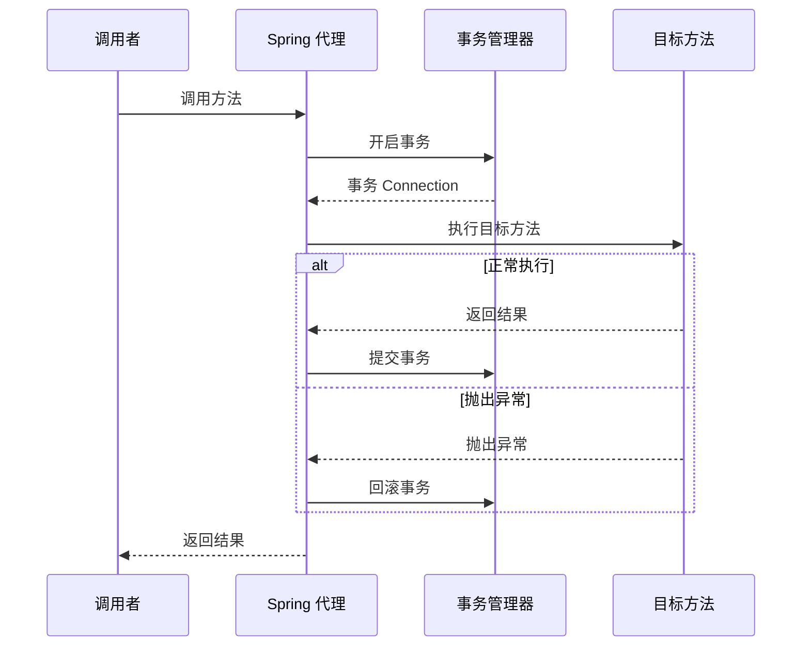

# @Transactional 失效场景

> 目标级别：P6
>
> 面试命中率：95%

## 快速自测

1. 同类内部方法调用为什么会导致事务失效？
2. `@Transactional` 加在 `private` 方法上会怎样？
3. 异常被 `try...catch` 捕获后事务还能回滚吗？

如果这三道题都能完整回答，说明 @Transactional 核心原理已经掌握。如果有疑问，请继续往下看。

---

## 一、@Transactional 核心原理

`@Transactional` 是基于 AOP 实现的，本质上是在目标方法前后添加了事务处理的切面逻辑。



---

## 二、八大失效场景详解

### 场景一：同类内部方法调用（最常见）

```java
@Service
public class UserService {

    public void transfer(String from, String to, double amount) {
        // ⚠️ this.withdraw() 不走代理，事务失效！
        this.withdraw(from, amount);
        this.deposit(to, amount);
    }

    @Transactional
    public void withdraw(String account, double amount) {
        // 扣款逻辑
        throw new RuntimeException("余额不足");
    }

    @Transactional
    public void deposit(String account, double amount) {
        // 存款逻辑
    }
}
```

**原因**：`this.withdraw()` 调用的是目标对象的原始方法，而非代理对象。

**解决方案**：

```java
@Service
public class UserService {

    @Autowired
    private UserService self;  // 注入自身代理对象

    public void transfer(String from, String to, double amount) {
        // ✅ 通过代理对象调用
        self.withdraw(from, amount);
        self.deposit(to, amount);
    }

    @Transactional
    public void withdraw(String account, double amount) {
        // 扣款逻辑
    }

    @Transactional
    public void deposit(String account, double amount) {
        // 存款逻辑
    }
}
```

> ⚠️ **注意**：使用这种方案时，Bean 必须是单例的，且 Spring Boot 2.x 默认已启用 CGLIB 代理。

---

### 场景二：异常被内部捕获

```java
@Service
public class OrderService {

    @Transactional
    public void createOrder(Order order) {
        try {
            // 业务逻辑
            saveOrder(order);
            updateInventory(order.getItems());
        } catch (Exception e) {
            // ⚠️ 异常被捕获，事务不会回滚！
            log.error("创建订单失败", e);
        }
    }
}
```

**原因**：Spring 事务管理器只检查方法是否抛出**未捕获**的异常来决定是否回滚。

**解决方案**：

```java
// 方案一：重新抛出异常
@Transactional
public void createOrder(Order order) {
    try {
        saveOrder(order);
        updateInventory(order.getItems());
    } catch (Exception e) {
        log.error("创建订单失败", e);
        throw new RuntimeException(e);  // ✅ 重新抛出
    }
}

// 方案二：手动回滚
@Transactional(rollbackFor = Exception.class)
public void createOrder(Order order) {
    try {
        saveOrder(order);
    } catch (Exception e) {
        log.error("创建订单失败", e);
        TransactionAspectSupport.currentTransactionStatus().setRollbackOnly();  // ✅ 手动回滚
    }
}
```

---

### 场景三：异常类型不匹配

```java
@Service
public class UserService {

    @Transactional
    public void register(User user) {
        // 业务逻辑
        throw new BusinessException("用户名已存在");
    }
}

// 自定义异常
public class BusinessException extends Exception {
    // 默认只回滚 RuntimeException
}
```

**原因**：Spring 默认只对 **`RuntimeException`** 和 **`Error`** 进行回滚。对于受检异常（checked exception），需要配置 `rollbackFor`。

**解决方案**：

```java
// ✅ 指定回滚的异常类型
@Transactional(rollbackFor = Exception.class)
public void register(User user) {
    throw new BusinessException("用户名已存在");
}

// ✅ 指定不回滚的异常类型
@Transactional(noRollbackFor = BusinessException.class)
public void register(User user) {
    throw new BusinessException("用户名已存在");
}
```

> ⚠️ **面试追问**：为什么 Spring 默认只回滚 RuntimeException？
>
> **答案**：这是 Spring 设计团队的选择。RuntimeException 通常表示程序错误（如空指针、非法参数），这类异常通常表示事务应该回滚。而受检异常可能表示业务逻辑的正常流程（如库存不足），需要业务代码显式决定是否回滚。

---

### 场景四：方法访问权限问题

```java
@Service
public class PaymentService {

    // ⚠️ private 方法上的 @Transactional 无效！
    @Transactional
    private void processPayment(Order order) {
        // 扣款逻辑
    }

    // public 方法才能被代理
    @Transactional
    public void pay(Order order) {
        processPayment(order);  // 内部调用
    }
}
```

**原因**：Spring AOP 基于 JDK 动态代理或 CGLIB，两者都要求目标方法必须是 **`public`** 的。CGLIB 虽然可以代理 `protected` 和 `package-private` 方法，但不推荐。

**最佳实践**：

```java
@Service
public class PaymentService {

    // ✅ 使用 public 方法
    @Transactional
    public void pay(Order order) {
        // 扣款逻辑
    }
}
```

---

### 场景五：同类中方法直接调用

```java
@Service
public class ProductService {

    @Transactional(rollbackFor = Exception.class)
    public void updatePrice(Long productId, BigDecimal newPrice) {
        // ⚠️ 同一类中调用不会走代理
        validatePrice(newPrice);
        // 更新价格
    }

    private void validatePrice(BigDecimal price) {
        if (price.compareTo(BigDecimal.ZERO) < 0) {
            throw new IllegalArgumentException("价格不能为负");
        }
    }
}
```

**解决方案**：将 `validatePrice` 抽取到另一个 Service 中。

---

### 场景六：事务传播行为配置错误

```java
@Service
public class OrderService {

    @Transactional(propagation = Propagation.REQUIRES_NEW)
    public void createOrder(Order order) {
        // 使用新事务
    }
}

@Service
public class PaymentService {

    // ⚠️ REQUIRES_NEW 会挂起当前事务
    @Transactional(propagation = Propagation.REQUIRES_NEW)
    public void pay(Order order) {
        // 创建新事务
    }
}

@Service
public class ShoppingCartService {

    @Transactional
    public void checkout(Order order) {
        orderService.createOrder(order);  // 订单在事务 A 中
        paymentService.pay(order);        // 支付在新事务 B 中
        // 如果支付失败，订单已经提交！
    }
}
```

**解决方案**：理解并正确使用事务传播行为，详见[事务传播行为详解](/framework/spring/transaction-propagation)。

---

### 场景七：非 Spring 管理的 Bean

```java
@Configuration
public class AppConfig {

    // ⚠️ new 出来的对象不受 Spring 管理
    @Bean
    public UserService userService() {
        return new UserService();  // 不是 Spring Bean
    }
}

public class UserService {
    @Transactional  // ⚠️ 无效！
    public void register(User user) {
        // ...
    }
}
```

**原因**：Spring AOP 只对 Spring 容器管理的 Bean 起作用。

---

### 场景八：多数据源配置问题

```java
@Service
public class OrderService {

    // ⚠️ 默认事务管理器可能不是 orderDao 的管理器
    @Transactional
    public void createOrder(Order order) {
        orderDao.save(order);           // 使用 dataSource1
        inventoryDao.update(order);     // 使用 dataSource2，如果失败，order 已提交
    }
}
```

**解决方案**：使用 `@Transactional(value = "orderTransactionManager")` 指定事务管理器。

---

## 三、@Transactional 属性详解

| 属性 | 类型 | 说明 |
| --- | --- | --- |
| **propagation** | `Propagation` | 事务传播行为，默认 `REQUIRED` |
| **isolation** | `Isolation` | 事务隔离级别，默认 `DEFAULT` |
| **readOnly** | `boolean` | 是否只读事务，默认 `false` |
| **rollbackFor** | `Class<? extends Throwable>` | 指定回滚的异常类型 |
| **noRollbackFor** | `Class<? extends Throwable>` | 指定不回滚的异常类型 |
| **timeout** | `int` | 超时时间（秒），默认 `-1`（无超时） |
| **value** | `String` | 指定事务管理器名称 |

---

## 四、高频面试题

### 🔴 第一层：同类内部调用为什么会导致事务失效？

**答案要点**：
1. Spring AOP 基于代理实现，`@Transactional` 注解的方法被代理对象调用时才生效
2. 同类内部调用 `this.xxx()` 绕过了代理对象，直接调用目标方法
3. 因此事务切面没有机会执行，事务失效

### 🔴 第二层：@Transactional 加在 private 方法上为什么无效？

**答案要点**：
1. Spring AOP 的代理机制要求目标方法是 `public` 的
2. CGLIB 代理无法重写 `private` 方法
3. JDK 动态代理的接口方法也必须是 `public` 的

### 🔴 第三层：异常被 catch 后事务还能回滚吗？

**答案要点**：
1. Spring 事务管理器只检查未捕获的异常
2. 如果异常被 `catch`，Spring 认为方法正常执行完毕，不会回滚
3. 可以通过 `TransactionAspectSupport.currentTransactionStatus().setRollbackOnly()` 手动回滚

### 🟡 第四层：Spring 默认对哪些异常回滚？

**答案要点**：
1. 默认对 `RuntimeException` 和 `Error` 进行回滚
2. 对受检异常（checked exception）不回滚
3. 可以通过 `rollbackFor` 和 `noRollbackFor` 自定义

---

## 五、常见陷阱

> ⚠️ **陷阱一**：认为所有异常都会导致事务回滚

Spring 默认只对 `RuntimeException` 和 `Error` 回滚。业务异常通常是 `Exception`（受检异常），默认不回滚。

> ⚠️ **陷阱二**：在事务方法中使用 `new` 创建对象

`new` 创建的对象不受 Spring 管理，其方法上的 `@Transactional` 不会生效。

> ⚠️ **陷阱三**：忽略事务传播行为的副作用

`REQUIRES_NEW` 会挂起当前事务，创建新事务。如果业务逻辑依赖外层事务的回滚，使用 `REQUIRES_NEW` 会导致数据不一致。

---

## 六、最佳实践

### 1. 事务方法放在 Service 层

```java
@Service
public class OrderService {

    @Transactional(rollbackFor = Exception.class)  // ✅ 指定回滚
    public void createOrder(Order order) {
        // 业务逻辑
    }
}
```

### 2. 避免同类内部调用

```java
@Service
public class OrderService {

    @Autowired
    private OrderService self;  // ✅ 注入自身

    public void checkout(Order order) {
        self.createOrder(order);  // 通过代理调用
    }

    @Transactional
    public void createOrder(Order order) {
        // ...
    }
}
```

### 3. 正确配置 rollbackFor

```java
@Transactional(rollbackFor = Exception.class)
public void businessMethod() throws BusinessException {
    // ...
}
```

### 4. 使用编程式事务处理复杂场景

```java
@Service
public class ComplexOrderService {

    @Autowired
    private TransactionTemplate transactionTemplate;

    public void complexOperation() {
        transactionTemplate.execute(status -> {
            try {
                // 业务逻辑
                return true;
            } catch (Exception e) {
                status.setRollbackOnly();  // 手动回滚
                return false;
            }
        });
    }
}
```

---

## 七、对比总结

| 场景 | @Transactional 是否生效 | 原因 |
| --- | --- | --- |
| 同类内部方法调用 | ❌ | 绕过代理对象 |
| private 方法 | ❌ | AOP 无法代理 |
| 异常被 catch | ❌ | Spring 认为正常执行 |
| 非 Spring Bean | ❌ | 不受 Spring 管理 |
| rollbackFor 配置错误 | ❌ | 异常类型不匹配 |
| REQUIRES_NEW 传播 | ⚠️ | 事务被挂起，可能不回滚 |

---

## 八、扩展思考

### 💡 为什么 Spring 不使用 AspectJ 编译时织入来解决同类调用问题？

**答案**：
1. 编译时织入需要额外的编译步骤和 AspectJ 工具链
2. 会增加构建复杂度
3. Spring 设计选择使用运行时代理，牺牲部分能力换取简单性
4. 正确做法是通过架构设计避免同类内部调用

### 💡 如何在同类内部调用时也能保证事务生效？

**答案**：
1. 注入自身代理对象（最常用）
2. 使用 `AopContext.currentProxy()` 获取代理对象
3. 将事务逻辑抽取到另一个 Service
4. 使用 AspectJ 编译时织入

---

掌握 @Transactional 失效场景，是 Spring 面试的必备技能。这些场景在实际开发中非常常见，理解原理才能避免踩坑。
