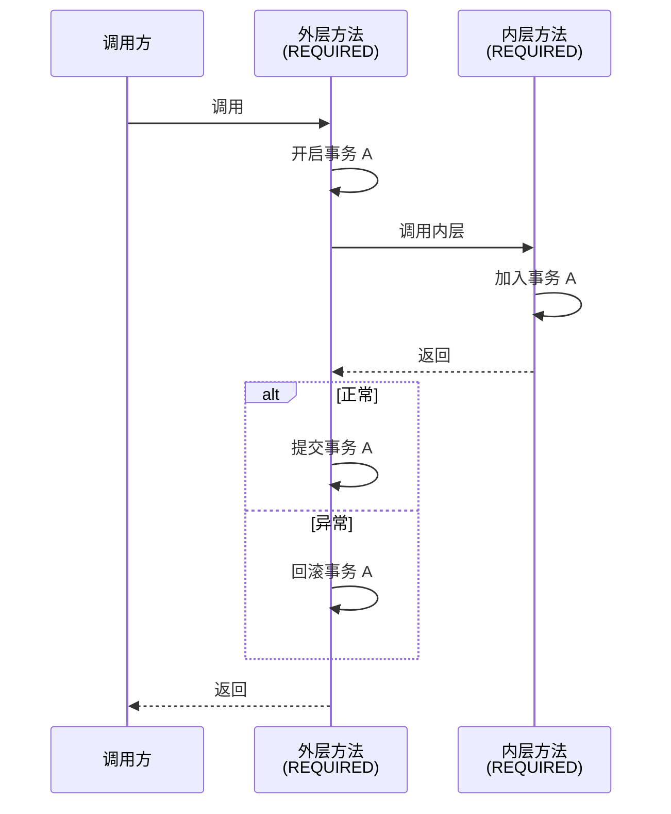
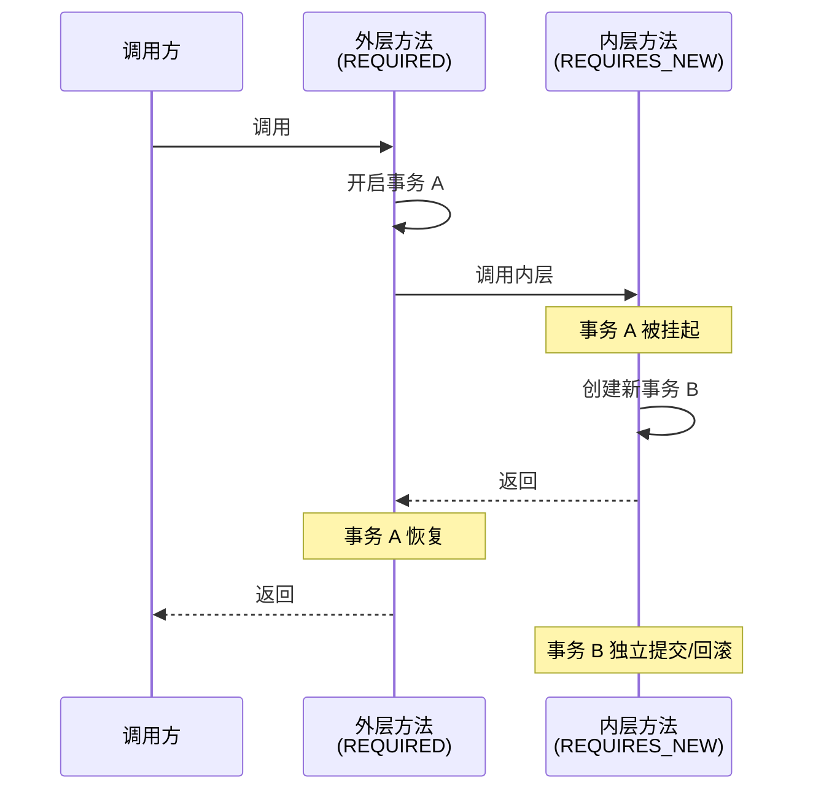
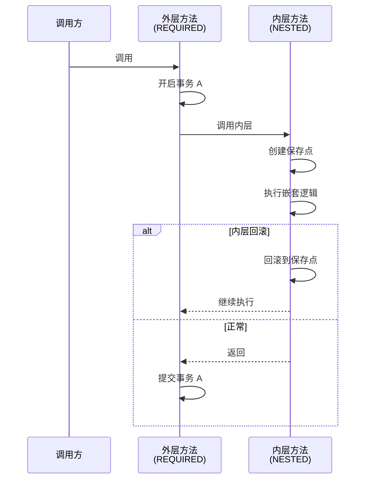

# Spring 事务传播行为

> 目标级别：P6
>
> 面试命中率：85%

## 快速自测

1. `REQUIRED` 和 `REQUIRES_NEW` 有什么区别？
2. `NESTED` 和 `REQUIRED` 有什么不同？
3. 如果外层事务回滚，`REQUIRES_NEW` 创建的新事务会怎样？

如果这三道题都能完整回答，说明事务传播行为已经掌握。如果有疑问，请继续往下看。

---

## 一、七种事务传播行为

Spring 定义了 7 种事务传播行为，定义在 `Propagation` 枚举中：

| 传播行为 | 说明 | 常见场景 |
| --- | --- | --- |
| **REQUIRED** | 默认。如果当前有事务，加入该事务；如果没有，创建新事务 | 常规业务操作 |
| **SUPPORTS** | 如果当前有事务，加入该事务；如果没有，以非事务执行 | 查询操作 |
| **MANDATORY** | 如果当前有事务，加入该事务；如果没有，抛出异常 | 必须在事务中执行的方法 |
| **REQUIRES_NEW** | 创建新事务。如果当前有事务，挂起该事务 | 日志记录、发送消息 |
| **NOT_SUPPORTED** | 以非事务执行。如果当前有事务，挂起该事务 | 性能监控 |
| **NEVER** | 以非事务执行。如果当前有事务，抛出异常 | 避免事务嵌套 |
| **NESTED** | 如果当前有事务，在嵌套事务中执行；如果没有，创建新事务 | 局部回滚 |

---

## 二、核心传播行为详解

### REQUIRED（默认）



**特点**：内层方法加入外层事务，共享同一个 Connection，是一个整体。

**示例**：

```java
@Service
public class OrderService {

    @Transactional
    public void createOrder(Order order) {
        orderDao.save(order);           // 加入事务 A
        inventoryService.reduceStock(order.getItems());  // 加入事务 A
    }
}

@Service
public class InventoryService {

    @Transactional  // 默认 REQUIRED，加入 orderService 的事务
    public void reduceStock(List<Item> items) {
        for (Item item : items) {
            inventoryDao.update(item);
        }
    }
}
```

---

### REQUIRES_NEW

**特点**：每次都创建新事务，挂起当前事务。



**示例**：

```java
@Service
public class OrderService {

    @Transactional
    public void createOrder(Order order) {
        orderDao.save(order);
        // ⚠️ 如果 paymentService 失败，订单已提交！
        paymentService.processPayment(order);
    }
}

@Service
public class PaymentService {

    @Transactional(propagation = Propagation.REQUIRES_NEW)
    public void processPayment(Order order) {
        // 独立的支付事务
        paymentDao.save(order);
        // 如果这里抛出异常，只有支付事务回滚
    }
}
```

> ⚠️ **面试追问**：外层方法捕获了内层的异常，会怎样？
>
> **答案**：REQUIRES_NEW 创建的新事务是独立的。如果内层抛出异常但被外层捕获，新事务仍然会回滚，但外层事务可以决定是否继续执行。

---

### NESTED

**特点**：使用 JDBC 的保存点（Savepoint）实现嵌套事务。



**示例**：

```java
@Service
public class OrderService {

    @Transactional
    public void createOrder(Order order) {
        orderDao.save(order);  // 订单保存

        try {
            inventoryService.reduceStock(order.getItems());  // 库存扣减
        } catch (Exception e) {
            // ⚠️ 库存扣减失败，但订单已保存！
            // NESTED 会回滚到保存点，订单也会回滚
            throw e;
        }
    }
}

@Service
public class InventoryService {

    @Transactional(propagation = Propagation.NESTED)
    public void reduceStock(List<Item> items) {
        // 使用保存点，失败时回滚到保存点
    }
}
```

---

## 三、三种传播行为的对比

| 对比维度 | REQUIRED | REQUIRES_NEW | NESTED |
| --- | --- | --- | --- |
| 事务数量 | 1 个 | 2 个 | 1 个（使用保存点） |
| Connection | 共享 | 独立 | 共享 |
| 外层回滚时 | 内层一起回滚 | 内层不受影响 | 内层回滚到保存点 |
| 内层回滚时 | 外层决定是否继续 | 外层可以选择捕获 | 外层可以选择继续 |
| 性能 | 好 | 差（需要新建连接） | 好 |
| 数据一致性 | 强 | 弱 | 中 |

---

## 四、高频面试题

### 🔴 第一层：REQUIRED 和 REQUIRES_NEW 有什么区别？

**答案要点**：
1. `REQUIRED`：加入当前事务，如果没有则创建新事务
2. `REQUIRES_NEW`：总是创建新事务，挂起当前事务
3. `REQUIRES_NEW` 的内层事务是独立的，外层事务的回滚不会影响内层

### 🔴 第二层：NESTED 和 REQUIRED 有什么不同？

**答案要点**：
1. `NESTED` 使用 JDBC 保存点实现嵌套事务
2. 外层事务回滚时，`NESTED` 的内层也会回滚
3. 内层回滚时，可以回滚到保存点，外层可以选择继续执行
4. `REQUIRED` 是完全共享事务，内层失败会导致外层也回滚

### 🔴 第三层：什么场景下使用 REQUIRES_NEW？

**答案要点**：
1. 日志记录：无论业务成功失败，日志都应该记录
2. 发送消息：消息发送失败不应影响业务提交
3. 异步任务：需要独立事务执行的任务
4. 不希望被外层事务影响的操作

### 🟡 第四层：REQUIRES_NEW 有什么坑？

**答案要点**：
1. 内层事务失败不会导致外层事务回滚（可能不是期望的行为）
2. 多次创建新事务会增加性能开销
3. 如果内层需要外层事务的数据（如外层事务未提交的数据），REQUIRES_NEW 会导致查询不到

---

## 五、实战场景分析

### 场景一：订单创建 + 库存扣减 + 发送消息

```java
@Service
public class OrderService {

    @Transactional
    public void createOrder(Order order) {
        orderDao.save(order);                    // ✅ 订单保存
        inventoryService.reduceStock(order.getItems());  // ⚠️ 如果失败，订单也回滚
        messageService.sendOrderCreated(order);  // ✅ 用 REQUIRES_NEW
    }
}

@Service
public class MessageService {

    @Transactional(propagation = Propagation.REQUIRES_NEW)
    public void sendOrderCreated(Order order) {
        // 即使发送失败，订单也应该保存
        // 使用 REQUIRES_NEW 保证消息服务的事务独立
    }
}
```

### 场景二：用户注册 + 发送欢迎邮件

```java
@Service
public class UserService {

    @Transactional
    public void register(User user) {
        userDao.save(user);                      // 用户保存
        try {
            emailService.sendWelcomeEmail(user);  // ⚠️ 如果失败，用户已注册
        } catch (Exception e) {
            log.error("发送欢迎邮件失败", e);
            // 不能因为邮件发送失败就回滚用户注册
        }
    }
}

@Service
public class EmailService {

    @Transactional(propagation = Propagation.REQUIRES_NEW)
    public void sendWelcomeEmail(User user) {
        // 独立事务，失败不影响用户注册
    }
}
```

### 场景三：批量处理中的局部失败

```java
@Service
public class BatchService {

    @Transactional
    public void processBatch(List<Order> orders) {
        for (Order order : orders) {
            try {
                orderService.processOrder(order);
            } catch (Exception e) {
                log.error("处理订单 {} 失败，继续处理下一个", order.getId());
                // 继续处理下一个订单，不影响整体事务
            }
        }
    }
}

@Service
public class OrderService {

    @Transactional(propagation = Propagation.NESTED)
    public void processOrder(Order order) {
        // 单个订单失败，回滚到保存点，继续处理下一个
    }
}
```

---

## 六、常见陷阱

> ⚠️ **陷阱一**：在 REQUIRES_NEW 内层事务中查询外层事务的数据

由于 REQUIRES_NEW 创建独立事务，外层事务未提交前，数据对内层不可见。

```java
@Transactional
public void outer() {
    orderDao.save(order);  // 订单保存，但未提交

    try {
        inner();  // REQUIRES_NEW，内层查不到订单数据！
    } catch (Exception e) {
        // 处理
    }
}

@Transactional(propagation = Propagation.REQUIRES_NEW)
public void inner() {
    // ⚠️ 可能查不到订单数据，因为外层事务未提交
    Order o = orderDao.findById(order.getId());
}
```

> ⚠️ **陷阱二**：在 finally 块中提交外层事务

如果内层使用 REQUIRES_NEW，外层在 finally 中提交事务，可能导致异常情况：

```java
@Transactional
public void outer() {
    try {
        inner();  // REQUIRES_NEW
    } finally {
        // ⚠️ 如果内层还未完成，可能导致数据不一致
    }
}
```

> ⚠️ **陷阱三**：NESTED 在不支持保存点的数据库上不生效

MySQL 的 MyISAM 引擎不支持保存点，NESTED 会降级为 REQUIRED。

---

## 七、对比总结

| 传播行为 | 事务数量 | Connection | 外层回滚 | 内层回滚 | 适用场景 |
| --- | --- | --- | --- | --- | --- |
| REQUIRED | 1 | 共享 | 全部回滚 | 可选继续 | 常规业务 |
| SUPPORTS | 0 或 1 | 共享 | - | - | 查询方法 |
| MANDATORY | 0 或 1 | 共享 | - | 抛出异常 | 强制事务 |
| REQUIRES_NEW | 2 | 独立 | 不影响 | 独立回滚 | 日志、消息 |
| NOT_SUPPORTED | 0 | 无 | 不影响 | - | 性能监控 |
| NEVER | 0 | 无 | 抛出异常 | - | 禁止事务 |
| NESTED | 1 | 共享 | 全部回滚 | 回滚到保存点 | 局部回滚 |

---

## 八、扩展思考

### 💡 为什么 Spring 默认选择 REQUIRED？

**答案**：
1. REQUIRED 是最符合直觉的行为：一个业务操作应该在同一个事务中
2. 性能最优：不需要额外的 Connection 和事务开销
3. 数据一致性最强：所有操作在一个事务中，要么全部成功，要么全部回滚

### 💡 NESTED 的保存点机制是如何实现的？

**答案**：
1. 基于 JDBC 的 `Savepoint` 实现
2. 使用 `Connection.setSavepoint()` 创建保存点
3. 使用 `Connection.rollback(savepoint)` 回滚到保存点
4. 不同的数据库对保存点的支持程度不同

---

掌握事务传播行为，是正确使用 Spring 事务的关键。理解每种传播行为的适用场景，才能在实际开发中做出正确的选择。
