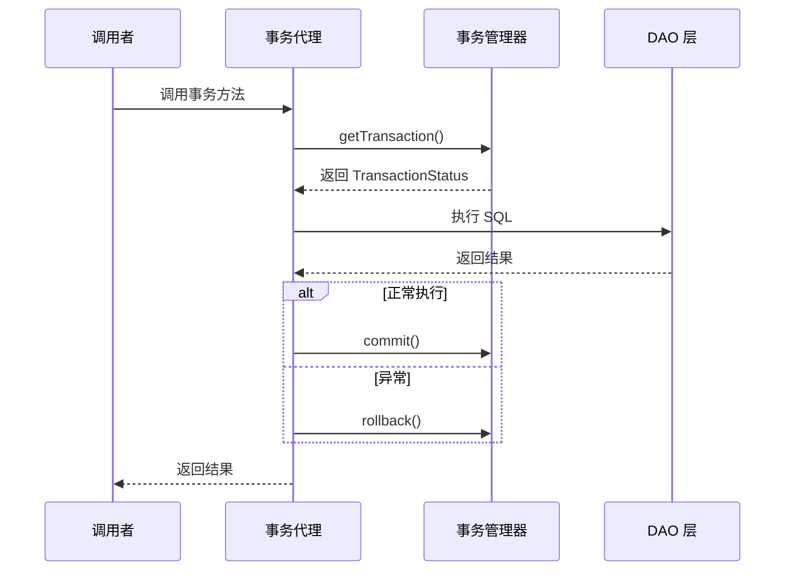

# Spring 事务管理

> 目标级别：P6
>
> 面试命中率：90%

## 快速自测

1. Spring 事务管理的核心接口是什么？
2. @Transactional 的原理是什么？
3. 编程式事务和声明式事务有什么区别？

---

## 一、事务管理核心接口

### PlatformTransactionManager

```java title="PlatformTransactionManager.java"
public interface PlatformTransactionManager {

    // 获取事务状态
    TransactionStatus getTransaction(@Nullable TransactionDefinition definition)
            throws TransactionException;

    // 提交事务
    void commit(TransactionStatus status) throws TransactionException;

    // 回滚事务
    void rollback(TransactionStatus status) throws TransactionException;
}
```

### 常见实现类

| 实现类 | 适用场景 |
| --- | --- |
| DataSourceTransactionManager | JDBC/MyBatis |
| JpaTransactionManager | JPA |
| HibernateTransactionManager | Hibernate |
| JtaTransactionManager | 分布式事务 |

---

## 二、@Transactional 注解详解

### 基本用法

```java
@Service
public class OrderService {

    @Transactional(rollbackFor = Exception.class)
    public void createOrder(Order order) {
        orderDao.save(order);
        inventoryService.reduceStock(order.getItems());
    }
}
```

### 注解属性

```java
@Target({ElementType.TYPE, ElementType.METHOD})
@Retention(RetentionPolicy.RUNTIME)
public @interface Transactional {
    String value() default "";
    String transactionManager() default "";

    // 事务传播行为
    Propagation propagation() default Propagation.REQUIRED;

    // 事务隔离级别
    Isolation isolation() default Isolation.DEFAULT;

    // 是否只读
    boolean readOnly() default false;

    // 超时时间（秒）
    int timeout() default -1;

    // 回滚的异常类型
    Class<? extends Throwable>[] rollbackFor() default {};

    // 不回滚的异常类型
    Class<? extends Throwable>[] noRollbackFor() default {};
}
```

---

## 三、事务管理流程



---

## 四、编程式事务 vs 声明式事务

### 编程式事务

```java
@Service
public class OrderService {

    @Autowired
    private TransactionTemplate template;

    public void createOrder(Order order) {
        template.execute(status -> {
            try {
                orderDao.save(order);
                inventoryService.reduceStock(order.getItems());
                return true;
            } catch (Exception e) {
                status.setRollbackOnly();
                return false;
            }
        });
    }
}
```

### 声明式事务

```java
@Service
public class OrderService {

    @Transactional(rollbackFor = Exception.class)
    public void createOrder(Order order) {
        orderDao.save(order);
        inventoryService.reduceStock(order.getItems());
    }
}
```

### 对比表

| 对比维度 | 编程式事务 | 声明式事务 |
| --- | --- | --- |
| 代码量 | 多 | 少 |
| 灵活性 | 高 | 中 |
| 可维护性 | 差 | 好 |
| 适用场景 | 复杂事务逻辑 | 一般业务场景 |
| 推荐程度 | 特殊场景使用 | ⭐⭐⭐ 推荐 |

---

## 五、事务隔离级别

| 隔离级别 | 说明 | 脏读 | 不可重复读 | 幻读 |
| --- | --- | --- | --- | --- |
| DEFAULT | 使用数据库默认 | - | - | - |
| READ_UNCOMMITTED | 未提交读 | 可能 | 可能 | 可能 |
| READ_COMMITTED | 已提交读 | 不可能 | 可能 | 可能 |
| REPEATABLE_READ | 可重复读 | 不可能 | 不可能 | 可能 |
| SERIALIZABLE | 串行化 | 不可能 | 不可能 | 不可能 |

---

## 六、高频面试题

### 🔴 第一层：Spring 事务的原理是什么？

**答案要点**：
1. 基于 AOP 代理实现
2. 通过 `TransactionInterceptor` 拦截方法
3. 在方法前后添加事务开启和提交/回滚逻辑

### 🔴 第二层：@Transactional 失效的场景有哪些？

**答案要点**：
1. 同类内部方法调用
2. private 方法
3. 异常被 catch 捕获
4. 异常类型不匹配
5. 非 Spring 管理的 Bean

---

## 七、常见陷阱

> ⚠️ **陷阱一**：异常被 catch 后手动抛出不同类型的异常

```java
@Transactional
public void method() {
    try {
        // 业务逻辑
    } catch (SQLException e) {
        throw new BusinessException(e);  // 包装后可能不回滚
    }
}
```

> ⚠️ **陷阱二**：在事务方法中获取数据库连接

如果在事务方法中手动获取数据库连接，可能绕过了 Spring 的事务管理。
