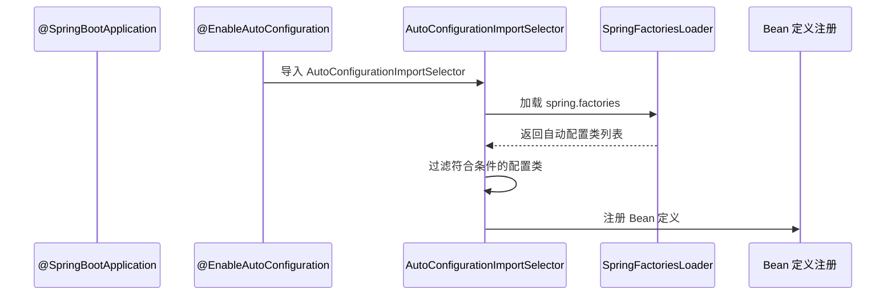
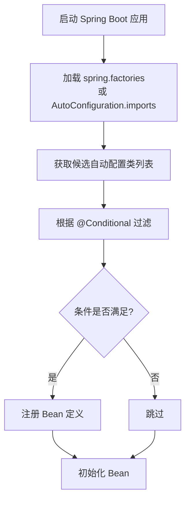

# Spring Boot 自动配置原理

> 目标级别：P6
>
> 面试命中率：95%

## 快速自测

1. `@SpringBootApplication` 注解由哪些注解组成？
2. Spring Boot 是如何自动配置 Bean 的？
3. `spring.factories` 和 `META-INF/spring/org.springframework.boot.autoconfigure.AutoConfiguration.imports` 有什么区别？

---

## 一、@SpringBootApplication 注解详解

```java
@Target(ElementType.TYPE)
@Retention(RetentionPolicy.RUNTIME)
@Documented
@Configuration  // 标记为配置类
@EnableAutoConfiguration  // 启用自动配置
@ComponentScan  // 组件扫描
public @interface SpringBootApplication {
    // ...
}
```

### 三个核心注解

| 注解 | 作用 |
| --- | --- |
| `@Configuration` | 标记为 Spring 配置类 |
| `@EnableAutoConfiguration` | 启用自动配置 |
| `@ComponentScan` | 扫描 `@Component` 等注解 |

---

## 二、@EnableAutoConfiguration 原理



---

## 三、自动配置加载机制

### Spring Boot 2.7.x 之前：spring.factories

```properties title="META-INF/spring.factories"
# Auto Configure
org.springframework.boot.autoconfigure.EnableAutoConfiguration=\
com.example.autoconfig.RedisAutoConfiguration,\
com.example.autoconfig.DruidAutoConfiguration
```

### Spring Boot 2.7.x 之后：AutoConfiguration.imports

```text title="META-INF/spring/org.springframework.boot.autoconfigure.AutoConfiguration.imports"
com.example.autoconfig.RedisAutoConfiguration
com.example.autoconfig.DruidAutoConfiguration
```

---

## 四、AutoConfiguration 注解

### @AutoConfiguration

标记类为自动配置类：

```java
@AutoConfiguration
@ConditionalOnClass(RedisTemplate.class)  // 当 RedisTemplate 在 classpath 中时生效
@ConditionalOnMissingBean(RedisTemplate.class)  // 当不存在 RedisTemplate Bean 时生效
public class RedisAutoConfiguration {

    @Bean
    @ConditionalOnMissingBean
    public RedisTemplate<String, Object> redisTemplate() {
        return new RedisTemplate<>();
    }
}
```

### @Conditional 条件注解

| 条件注解 | 条件 |
| --- | --- |
| @ConditionalOnClass | classpath 中存在指定类 |
| @ConditionalOnMissingClass | classpath 中不存在指定类 |
| @ConditionalOnBean | 容器中存在指定 Bean |
| @ConditionalOnMissingBean | 容器中不存在指定 Bean |
| @ConditionalOnProperty | 配置属性满足条件 |
| @ConditionalOnWebApplication | 是 Web 应用 |

---

## 五、自动配置源码解析

### AutoConfigurationImportSelector

```java title="AutoConfigurationImportSelector.java"
public class AutoConfigurationImportSelector
        implements DeferredImportSelector, BeanClassLoaderAware {

    @Override
    public String[] selectImports(AnnotationMetadata annotationMetadata) {
        // 获取自动配置类列表
        List<String> configurations = getCandidateConfigurations(
            annotationMetadata,
            getAttributes()
        );

        // 去重
        configurations = removeDuplicates(configurations);

        // 获取排除列表
        Set<String> exclusions = getExclusions(annotationMetadata);
        configurations.removeAll(exclusions);

        // 应用 @AutoConfiguration 注解的过滤
        configurations = getConfigurationClassFilter().filter(configurations);

        // 发布自动配置事件
        fireAutoConfigurationImportEvents(configurations, exclusions);

        return configurations.toArray(new String[0]);
    }
}
```

### SpringFactoriesLoader

```java title="SpringFactoriesLoader.java"
public final class SpringFactoriesLoader {

    public static List<String> loadFactoryNames(
            Class<?> factoryType,
            @Nullable ClassLoader classLoader) {

        ClassLoader classLoaderToUse = classLoader;
        String factoryTypeName = factoryType.getName();

        // 加载 META-INF/spring.factories
        result = FACTORIES.putIfAbsent(
            factoryTypeName,
            classLoaderToUse.loadResources(FACTORIES_RESOURCE_LOCATION)
        );

        return result;
    }
}
```

---

## 六、自动配置流程总结



---

## 七、高频面试题

### 🔴 第一层：@SpringBootApplication 由哪些注解组成？

**答案要点**：
1. `@Configuration`：标记为配置类
2. `@EnableAutoConfiguration`：启用自动配置
3. `@ComponentScan`：组件扫描

### 🔴 第二层：Spring Boot 是如何实现自动配置的？

**答案要点**：
1. 通过 `@EnableAutoConfiguration` 启用自动配置
2. `AutoConfigurationImportSelector` 加载 `spring.factories`
3. 根据 `@Conditional` 条件筛选配置类
4. 注册符合条件的 Bean 定义

### 🔴 第三层：spring.factories 和 AutoConfiguration.imports 有什么区别？

**答案要点**：
1. Spring Boot 2.7.x 之前使用 `spring.factories`
2. Spring Boot 2.7.x 之后推荐使用 `AutoConfiguration.imports`
3. 新方式更清晰，便于维护

---

## 八、自定义 Starter

### 1. 创建 Starter 模块

```xml title="pom.xml"
<groupId>com.example</groupId>
<artifactId>my-spring-boot-starter</artifactId>
```

### 2. 创建自动配置类

```java
@Configuration
@ConditionalOnClass(MyService.class)
@ConditionalOnProperty(name = "my.service.enabled", havingValue = "true")
public class MyAutoConfiguration {

    @Bean
    @ConditionalOnMissingBean
    public MyService myService() {
        return new MyService();
    }
}
```

### 3. 注册自动配置

```properties title="META-INF/spring/org.springframework.boot.autoconfigure.AutoConfiguration.imports"
com.example.autoconfigure.MyAutoConfiguration
```

### 4. 使用 Starter

```yaml title="application.yml"
my:
  service:
    enabled: true
```

---

## 九、常见陷阱

> ⚠️ **陷阱一**：@ConditionalOnMissingBean 的坑

如果用户手动定义了 Bean，`@ConditionalOnMissingBean` 会使自动配置的 Bean 不生效。但执行顺序可能导致意外结果。

> ⚠️ **陷阱二**：自动配置类的执行顺序

自动配置类之间可能有依赖关系，错误的顺序可能导致 Bean 创建失败。

> ⚠️ **陷阱三**：spring.factories 和 AutoConfiguration.imports 混用

Spring Boot 2.7.x 之后，推荐使用新的方式，但旧方式仍然有效，可能导致混淆。

---

## 十、对比总结

| 对比维度 | spring.factories | AutoConfiguration.imports |
| --- | --- | --- |
| Spring Boot 版本 | 2.7.x 之前 | 2.7.x 之后 |
| 文件位置 | META-INF/spring.factories | META-INF/spring/*.imports |
| 格式 | Properties | 每行一个类名 |
| 推荐程度 | ❌ 不推荐 | ✅ 推荐 |

---

## 十一、扩展思考

### 💡 为什么自动配置可以按需加载？

**答案**：
1. 通过 `@Conditional` 系列注解实现条件判断
2. 只有当 classpath 中存在指定类或配置满足条件时才生效
3. 避免引入不需要的组件，提高启动性能

### 💡 如何排查自动配置不生效的问题？

**答案**：
1. 启动时添加 `--debug` 参数，查看自动配置报告
2. 检查 `@Conditional` 条件是否满足
3. 查看是否被 `spring.autoconfigure.exclude` 排除
4. 检查 Bean 定义是否被用户代码覆盖

---

掌握 Spring Boot 自动配置原理，不仅能回答表层问题，还能应对面试官对源码的深入追问。
