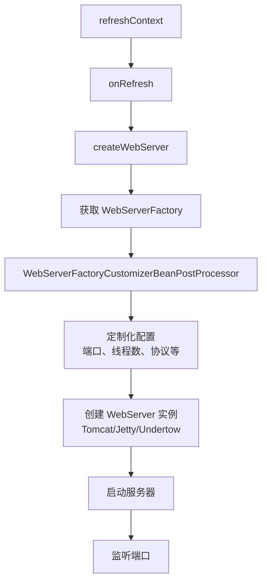

# 嵌入式 Web 容器原理

候选人小陈在面试阿里P6时，被问到：

"Spring Boot 内嵌的 Tomcat 是怎么启动的？为什么不需要单独部署 Tomcat？"

小陈说："Spring Boot 把 Tomcat 打包进来了吧？"面试官追问："具体是怎么打包的？Tomcat 是什么时候创建的？"小陈答不上来。

面试官又问："Tomcat、Jetty、Undertow 有什么区别？你们为什么选 Undertow？"小陈支支吾吾："Undertow 性能好？"

【面试官心理】

这道题我用来测试候选人对 Spring Boot "零部署"设计的理解程度。能说出"内嵌 Tomcat"的占 60%，能说出 WebServerFactory 创建流程的占 30%，能讲清楚容器选型理由的只有 10%。这道题涉及 Tomcat 的架构知识和性能对比，区分度很高。

## 一、嵌入式容器的启动流程 🔴

### 1.1 从 onRefresh 说起

Spring Boot 在 `onRefresh()` 阶段创建 Web 服务器。这是在 `refreshContext` 过程中调用的：

```java
@Override
protected void onRefresh() {
    super.onRefresh();
    // Spring Boot 特有的：创建 Web 服务器
    createWebServer();
}
```

### 1.2 Web 服务器的创建链

```java
private void createWebServer() {
    // 获取 WebServerFactory
    WebServerFactory serverFactory = this.webServerFactoryGenerator.getIfAvailable();
    if (serverFactory != null) {
        // 关键的 BeanPostProcessor
        WebServerStartStopLifecycle webServer = this.webServerFactoryCustomizerBPP.postProcessBeforeInitialization(
            serverFactory, WebServerFactory.class.getName());

        this.webServer = webServer.start();
    }
}
```

这里有两个关键角色：
1. **WebServerFactoryCustomizerBeanPostProcessor**：在容器刷新前执行，对 WebServerFactory 做定制化配置
2. **WebServerFactory**：实际的服务器工厂类

### 1.3 WebServerFactory 体系

```java
// 接口层级
WebServerFactory
├── TomcatServletWebServerFactory
├── JettyServletWebServerFactory
└── UndertowServletWebServerFactory
```

Spring Boot 通过 `spring-boot-starter-tomcat`、`spring-boot-starter-jetty`、`spring-boot-starter-undertow` 依赖自动引入对应的 Factory：

```java
// 以 Tomcat 为例
@ConditionalOnClass({Servlet.class, Tomcat.class, UpgradeProtocol.class})
@ConditionalOnMissingBean(value = WebServerFactory.class, search = SearchStrategy.CURRENT)
public TomcatServletWebServerFactoryWebServerErrorPageRegistrar {

    @Bean
    public ConfigurableServletWebServerFactory tomcatServletWebServerFactory(
            ObjectProvider<TomcatContextCustomizer> contextCustomizers,
            ObjectProvider<TomcatConnectorCustomizer> connectors) {
        return new TomcatServletWebServerFactory();
    }
}
```

:::details 📖 点击展开嵌入式容器启动 Mermaid 图



:::

## 二、Tomcat 定制化配置 🟡

### 2.1 WebServerFactoryCustomizer

Spring Boot 提供了一个钩子，允许用户对 Tomcat 做深度定制：

```java
@Component
public class TomcatCustomizer implements WebServerFactoryCustomizer<TomcatServletWebServerFactory> {
    @Override
    public void customize(TomcatServletWebServerFactory factory) {
        // 配置线程池
        factory.addConnectorCustomizers(connector -> {
            TomcatConnectorConfig config = connector.getProtocolHandler();
            if (config instanceof AbstractProtocol) {
                ((AbstractProtocol) config).setMaxThreads(200);
                ((AbstractProtocol) config).setMinSpareThreads(20);
            }
        });

        // 添加 Tomcat 特有的上下文定制器
        factory.addContextCustomizers(context -> {
            context.setBackgroundProcessorDelay(10);
        });
    }
}
```

### 2.2 application.yml 配置

```yaml
server:
  port: 8080
  tomcat:
    threads:
      max: 200
      min-spare: 20
    max-connections: 10000
    accept-count: 100
    connection-timeout: 20000
    uri-encoding: UTF-8
```

| 配置项 | 说明 | 默认值 |
| --- | --- | --- |
| server.tomcat.threads.max | 最大工作线程数 | 200 |
| server.tomcat.threads.min-spare | 最小空闲线程数 | 10 |
| server.tomcat.max-connections | 最大连接数 | 10000 |
| server.tomcat.accept-count | 等待队列长度 | 100 |
| server.tomcat.connection-timeout | 连接超时（ms） | 20000 |

## 三、Tomcat vs Jetty vs Undertow 🟡

### 3.1 核心对比

| 特性 | Tomcat | Jetty | Undertow |
| --- | --- | --- | --- |
| 定位 | 全功能 servlet 容器 | 轻量级 servlet 容器 | 高性能非阻塞服务器 |
| 架构 | 多线程阻塞 | 多线程阻塞 | XNIO 非阻塞 |
| 内存占用 | 高 | 中 | 低 |
| 并发能力 | 中 | 中 | 高 |
| WebSocket | 支持 | 支持 | 支持 |
| HTTP/2 | 需要 APR | 需要额外配置 | 原生支持 |
| Spring Boot 默认 | 是 | 否 | 否 |

### 3.2 选型建议

```xml
<!-- 切换为 Undertow -->
<dependency>
    <groupId>org.springframework.boot</groupId>
    <artifactId>spring-boot-starter-web</artifactId>
    <exclusions>
        <exclusion>
            <groupId>org.springframework.boot</groupId>
            <artifactId>spring-boot-starter-tomcat</artifactId>
        </exclusion>
    </exclusions>
</dependency>
<dependency>
    <groupId>org.springframework.boot</groupId>
    <artifactId>spring-boot-starter-undertow</artifactId>
</dependency>
```

```yaml
# Undertow 配置
server:
  undertow:
    threads:
      io: 4      # IO 线程数
      worker: 20 # 工作线程数
    buffer-size: 16384
    direct-buffers: true
```

:::tip 💡

Undertow 使用 XNIO 架构，基于非阻塞 I/O，适合高并发短连接场景（如微服务间 RPC 调用）。Tomcat 的 NIO 模式虽然也支持非阻塞，但架构上仍有不少同步阻塞点。如果你的 QPS 超过 5 万/秒，建议考虑 Undertow；如果是传统的业务系统，Tomcat 足够。

:::

## 四、Graceful Shutdown 🟢

### 4.1 什么是 Graceful Shutdown

Graceful Shutdown（优雅关闭）是指在收到停止信号后，先停止接收新请求，等待正在处理中的请求完成后再关闭服务器。

```yaml
server:
  shutdown: graceful  # 默认是 immediate

spring:
  lifecycle:
    timeout-per-shutdown-phase: 30s  # 等待请求处理完成的最大时间
```

### 4.2 行为说明

- `shutdown: immediate`：立即关闭，所有正在处理的请求会被强制中断
- `shutdown: graceful`：优雅关闭，新请求不再接收，等待已接收的请求处理完成

```
优雅关闭时序：
1. 收到 SIGTERM 信号
2. 停止接收新连接
3. 等待正在处理的请求完成（最多等待 timeout-per-shutdown-phase）
4. 如果超时，强制关闭
5. 关闭容器
```

:::warning ⚠️

Graceful Shutdown 只是让容器不再接收新请求，并不会中断正在执行中的线程。如果你的请求处理逻辑中有死循环或长时间阻塞的代码，即使设置了优雅关闭也无法及时停止。

:::

## 五、HTTP/2 配置 🟢

### 5.1 Tomcat HTTP/2 配置

```yaml
server:
  http2:
    enabled: true
  ssl:
    enabled: true
    key-store: classpath:keystore.p12
    key-store-password: changeit
    key-store-type: PKCS12
    key-alias: tomcat
```

Tomcat 的 HTTP/2 需要 SSL 支持（ALPN 协议），并且依赖 JDK 的 SSL 实现。

### 5.2 Undertow HTTP/2 配置

Undertow 对 HTTP/2 的支持更原生：

```yaml
server:
  undertow:
    http2:
      enabled: true
  ssl:
    enabled: true
    # ...
```

Undertow 的 HTTP/2 实现不需要 ALPN，对 JDK 版本的要求更低。

## 六、❌ 错误示范

### 6.1 只会背结论

**候选人原话**："Undertow 性能比 Tomcat 好，因为它是基于非阻塞 I/O 的。"

**问题诊断**：
- 知道结论但不知道 Undertow 内部是怎么实现的
- 不知道非阻塞 I/O 的具体含义
- 不知道 Undertow 在某些场景下反而不如 Tomcat

**面试官内心 OS**："这个候选人可能看过一些对比文章，但没有实际压测过。Undertow 的非阻塞模型在短连接高并发场景下有优势，但如果你的业务逻辑大部分是阻塞的，反而会因为线程模型的问题导致性能下降。"

### 6.2 不知道定制化机制

**候选人原话**："Tomcat 配置只能在 application.yml 里改。"

**问题诊断**：
- 不知道 WebServerFactoryCustomizer 的存在
- 不知道可以通过实现接口做深度定制

## 七、面试标准回答

### 7.1 P5 级别

"Spring Boot 通过 spring-boot-starter-tomcat 引入了嵌入式 Tomcat，在 onRefresh 阶段调用 createWebServer() 创建和启动服务器。Spring Boot 支持切换为 Jetty 或 Undertow，只需要排除 tomcat starter 并引入对应的 starter 即可。"

### 7.2 P6 级别

"Spring Boot 的 Web 服务器创建流程是：refreshContext → onRefresh → createWebServer → WebServerFactoryCustomizerBeanPostProcessor 定制化配置 → 创建 WebServerFactory（TomcatServletWebServerFactory 等）→ 启动服务器。

可以通过实现 WebServerFactoryCustomizer 接口对服务器做深度定制，比如修改线程池参数、添加连接器定制器。Graceful Shutdown 通过 server.shutdown=graceful 开启，收到 SIGTERM 后会等待已接收的请求处理完成再关闭。"

### 7.3 P7 级别

"这道题背后考的是对容器架构的理解。我们在选型时做过详细压测：

- Tomcat 在 CPU 和内存充足时性能稳定，生态好、资料多、出问题容易排查
- Undertow 在高并发短连接场景下 QPS 比 Tomcat 高 30%，但内存占用低很多
- Jetty 比较中庸，胜在轻量，适合对包体积敏感的场景

我们最终选了 Undertow 做 API 网关（QPS 10万+），业务服务还是用 Tomcat（维护成本低）。

Graceful Shutdown 我们踩过一个坑：应用中有定时任务在优雅关闭期间仍在执行，导致请求超时。后来在 @PreDestroy 中加了 shutdown 标记，所有定时任务先检查这个标记再决定是否执行。"

【面试官心理】

P7 的回答重点在于"选型依据"和"踩坑经历"。能说出压测数据和具体场景的候选人，说明他是真正做过技术选型的，而不是在背别人写的对比文章。
