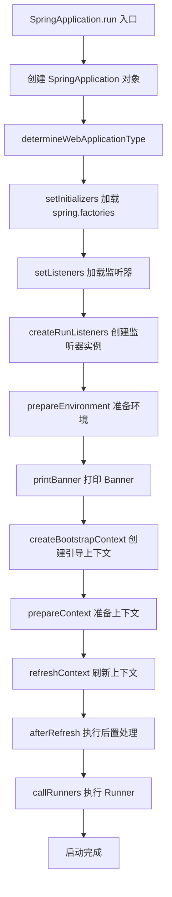

# Spring Boot 快速上手

候选人小王面试时被问到："Spring Boot 的自动配置是怎么工作的？"

他回答："通过 @SpringBootApplication 注解，里面有个 @EnableAutoConfiguration..."

面试官追问："那你知道 spring.factories 文件吗？知道 Spring Boot 是怎么加载这些配置类的？"

小王支支吾吾，明显没看过源码。

【面试官心理】
我问他自动配置，不是想听他背注解名字。我想知道的是：他有没有理解过 Spring Boot 是怎么"自动"把配置类加载进来的，@Conditional 注解是干什么用的，为什么有些自动配置类不生效。

---

## 一、Spring Boot 自动配置 🔴

### 1.1 问题拆解

**第一层：怎么用？**
面试官问："Spring Boot 为什么不需要配置 XML？自动配置是怎么工作的？"
候选人答："通过 starter 和自动配置..."（表面回答）

**第二层：底层实现**
面试官追问："@SpringBootApplication 里面有哪些注解？分别有什么用？"
候选人答：...（开始模糊）

**第三层：条件注册**
面试官追问："@Conditional 注解是干什么用的？有哪些变体？"
候选人答：...（P6 分水岭）

**第四层：源码细节**
面试官追问："Spring Boot 是怎么知道要加载哪些自动配置类的？spring.factories 和 META-INF/spring/org.springframework.boot.autoconfigure.AutoConfiguration.imports 有什么区别？"
候选人答：...（P7 拉开差距）

### 1.2 错误示范

**候选人原话**："Spring Boot 通过starter和自动配置，简化了 Spring 应用的开发..."

**问题诊断**：
- 只知道自动配置这个概念，不知道底层机制
- 不理解 @Conditional 的作用
- 分不清 spring.factories 和 META-INF 的区别

**面试官内心 OS**："这个候选人肯定没看过 Spring Boot 源码..."

### 1.3 标准回答

**@SpringBootApplication 拆解**：

```java
@SpringBootApplication
public class MyApplication {
    public static void main(String[] args) {
        SpringApplication.run(MyApplication.class, args);
    }
}

// 等价于
@Target(ElementType.TYPE)
@Retention(RetentionPolicy.RUNTIME)
@Documented
@Inherited
@SpringBootConfiguration  // 其实就是 @Configuration
@EnableAutoConfiguration  // 开启自动配置
@ComponentScan(excludeFilters = { @Filter(type = FilterType.CUSTOM, classes = TypeExcludeFilter.class),
                                   @Filter(type = FilterType.CUSTOM, classes = AutoConfigurationImportFilter.class) })
public @interface SpringBootApplication {}

// @EnableAutoConfiguration 内部
@AutoConfigurationPackage  // 记录主配置类所在包
@Import(AutoConfigurationImportSelector.class)  // 导入自动配置类
public @interface EnableAutoConfiguration {}
```

Spring Boot 2.7 之前用 `spring.factories`：

```properties
# META-INF/spring.factories
org.springframework.boot.autoconfigure.EnableAutoConfiguration=\
  org.springframework.boot.autoconfigure.jdbc.DataSourceAutoConfiguration,\
  org.springframework.boot.autoconfigure.web.servlet.WebMvcAutoConfiguration
```

Spring Boot 2.7 开始推荐用 `META-INF/spring/org.springframework.boot.autoconfigure.AutoConfiguration.imports`：

```properties
# META-INF/spring/org.springframework.boot.autoconfigure.AutoConfiguration.imports
org.springframework.boot.autoconfigure.jdbc.DataSourceAutoConfiguration
org.springframework.boot.autoconfigure.web.servlet.WebMvcAutoConfiguration
```

**@Conditional 条件注解家族**：

```java
// 条件注解：只有满足条件才注册 Bean
@ConditionalOnClass(DataSource.class)           // classpath 有这个类才生效
@ConditionalOnMissingBean(DataSource.class)   // 容器里没有这个 Bean 才生效
@ConditionalOnProperty(prefix = "spring.datasource", name = "url")  // 配置文件中存在这个属性才生效
@ConditionalOnWebApplication                  // 是 Web 应用才生效
@ConditionalOnExpression("${feature.enabled:true}")  // SpEL 表达式为 true 才生效
```

一个自定义自动配置类的例子：

```java
@Configuration
@ConditionalOnClass(DataSource.class)
@ConditionalOnMissingBean(DataSource.class)
@EnableConfigurationProperties(DataSourceProperties.class)
public class MyDataSourceAutoConfiguration {

    @Bean
    @Primary
    public DataSource dataSource(DataSourceProperties properties) {
        // 如果用户没有自定义 DataSource，就用自动配置的
        return properties.initializeDataSourceBuilder().build();
    }
}
```

【面试官心理】
我追问他 @Conditional，是想看他有没有自己写过自动配置类。能说清楚 @ConditionalOnMissingBean 和 @ConditionalOnClass 的区别，基本都有实战经验。

---

## 二、Spring Boot 启动流程 🟡

### 2.1 问题拆解

**第一层：怎么用？**
面试官问："SpringApplication.run() 做了什么？"
候选人答："启动 Spring 应用..."（太笼统）

**第二层：阶段划分**
面试官追问："Spring Boot 启动分哪几个阶段？"
候选人答：...（开始列阶段）

**第三层：扩展点**
面试官追问："ApplicationRunner 和 CommandLineRunner 有什么区别？"
候选人答：...（P6 拉开差距）

### 2.2 标准回答



**关键阶段说明**：

1. **创建 SpringApplication**：判断是 Servlet 还是 Reactive 应用
2. **加载 initializers**：从 spring.factories 加载 ApplicationContextInitializer
3. **加载 listeners**：从 spring.factories 加载 ApplicationListener
4. **prepareEnvironment**：加载配置文件（application.yml 等）
5. **refreshContext**：创建 Bean，更新容器（这是核心）
6. **callRunners**：执行 ApplicationRunner 和 CommandLineRunner

```java
// 如何自定义启动行为
@SpringBootApplication
public class MyApplication {
    public static void main(String[] args) {
        SpringApplication app = new SpringApplication(MyApplication.class);
        // 添加自定义监听器
        app.addListeners(new MyApplicationListener());
        // 设置 banner 模式
        app.setBannerMode(Banner.Mode.OFF);
        app.run(args);
    }
}

// ApplicationRunner 和 CommandLineRunner 的区别
@Component
@Order(1)
public class MyApplicationRunner implements ApplicationRunner {
    @Override
    public void run(ApplicationArguments args) throws Exception {
        // 可以解析 --foo=bar 格式的参数
        args.getOptionValues("foo").forEach(System.out::println);
    }
}

@Component
@Order(2)
public class MyCommandLineRunner implements CommandLineRunner {
    @Override
    public void run(String... args) throws Exception {
        // 拿到原始的 String[] 参数
        Arrays.stream(args).forEach(System.out::println);
    }
}
```

【面试官心理】
我追问他 ApplicationRunner 和 CommandLineRunner 的区别，是想看他有没有在项目里用过这两个接口。知道区别的基本都有过"应用启动后执行初始化任务"的实战经验。

---

## 三、Spring Boot 常用 Starter 🟡

### 3.1 核心 Starter

| Starter | 用途 | 关键配置 |
| --- | --- | --- |
| spring-boot-starter-web | Web 应用 | server.port, server.servlet.context-path |
| spring-boot-starter-data-jpa | JPA 持久层 | spring.jpa.hibernate.ddl-auto |
| spring-boot-starter-data-redis | Redis 缓存 | spring.redis.host, spring.redis.password |
| spring-boot-starter-actuator | 应用监控 | management.endpoints.web.exposure.include |
| spring-boot-starter-validation | 参数校验 | jakarta.validation.* |

### 3.2 生产配置示例

```yaml
# application.yml
spring:
  application:
    name: order-service
  profiles:
    active: dev
  datasource:
    url: jdbc:mysql://localhost:3306/orders?useSSL=false
    username: root
    password: ${DB_PASSWORD}  # 从环境变量读取
    hikari:
      maximum-pool-size: 20
      minimum-idle: 5
      connection-timeout: 30000
  jpa:
    hibernate:
      ddl-auto: validate  # 生产用 validate，不修改表结构
    show-sql: false
    properties:
      hibernate:
        format_sql: true
  redis:
    host: localhost
    port: 6379
    timeout: 5000
    lettuce:
      pool:
        max-active: 20
        max-idle: 10
        min-idle: 5

server:
  port: 8080
  servlet:
    context-path: /api

management:
  endpoints:
    web:
      exposure:
        include: health,info,metrics,prometheus
  endpoint:
    health:
      show-details: when_authorized
```

---

## 四、Spring Boot 监控与排查 🟡

### 4.1 Actuator 端点

| 端点 | 路径 | 用途 |
| --- | --- | --- |
| health | /actuator/health | 健康检查 |
| info | /actuator/info | 应用信息 |
| metrics | /actuator/metrics | 性能指标 |
| env | /actuator/env | 环境变量 |
| loggers | /actuator/loggers | 日志配置 |
| heapdump | /actuator/heapdump | 堆 Dump |

### 4.2 生产问题排查

**CPU 飙高排查**：

```bash
# 1. 先看哪个进程占用高
top -c

# 2. 看这个进程的线程
ps -mp <pid> -o THREAD,tid,time

# 3. 拿到线程 ID 转十六进制
printf '%x\n' <tid>

# 4. 用 jstack 打印堆栈
jstack <pid> | grep <hex-tid> -A 10
```

**内存泄漏排查**：

```bash
# 1. 生成堆 Dump
curl -X POST http://localhost:8080/actuator/heapdump -o heapdump.hprof

# 2. 用 MAT 或 JProfiler 分析
# 重点关注：Shallow Retain Size 大的对象
```

**接口响应慢排查**：

```bash
# 1. 开启 Actuator 的 trace
management.trace.http.enabled=true

# 2. 查看最近 10 条请求追踪
curl http://localhost:8080/actuator/httptrace
```

:::warning ⚠️
生产环境开启 heapdump 端点要谨慎：
1. heapdump 生成需要时间，会影响服务
2. dump 文件可能很大（几 G），占用磁盘
3. 建议联系运维提前预留磁盘空间
:::

---

## 五、Spring Boot 自动装配原理 🟡

### 5.1 自动配置类加载流程

```mermaid
graph TD
    A[@EnableAutoConfiguration] --> B[AutoConfigurationImportSelector]
    B --> C[getAutoConfigurationEntry]
    C --> D[getCandidateConfigurations]
    D --> E[SpringFactoriesLoader.loadFactoryNames]
    E --> F[从 spring.factories 加载]
    F --> G[过滤配置类]
    G --> H[@ConditionalOnClass 判断是否生效]
    H --> I[注册 BeanDefinition]
```

### 5.2 自定义 Starter 示例

**需求**：提供一个"统一响应"starter，封装接口返回值格式

**第一步：创建 starter 模块**：

```
my-starter/
├── src/main/java/
│   └── com/example/starter/
│       ├── AutoConfiguration.java
│       └── ResponseWrapper.java
├── src/main/resources/
│   └── META-INF/
│       └── spring/
│           └── org.springframework.boot.autoconfigure.AutoConfiguration.imports
└── pom.xml
```

**第二步：实现自动配置类**：

```java
@Configuration
@ConditionalOnWebApplication
public class MyResponseAutoConfiguration {

    @Bean
    @ConditionalOnMissingBean
    public ResponseAdvice responseAdvice() {
        return new ResponseAdvice();
    }
}
```

**第三步：注册自动配置**：

```properties
# META-INF/spring/org.springframework.boot.autoconfigure.AutoConfiguration.imports
com.example.starter.MyResponseAutoConfiguration
```

**第四步：用户使用**：

```xml
<!-- 只需要引入依赖，自动配置就生效 -->
<dependency>
    <groupId>com.example</groupId>
    <artifactId>my-starter</artifactId>
</dependency>
```

【面试官心理】
我追问他自定义 Starter，是想看他有没有真正理解"自动配置"的本质。能自己写一个 Starter 的，基本都理解 Spring Boot 的设计理念。

---

## 六、Spring Boot 面试题分类

| 级别 | 高频问题 | 期望回答 |
| --- | --- | --- |
| P5 | 自动配置原理、starter 作用 | 能说清 @SpringBootApplication 组成 |
| P6 | @Conditional 用法、启动流程 | 能回答追问，理解条件注解 |
| P7 | 自定义 Starter、原理扩展 | 能设计 Starter，理解 Spring Boot SPI |

---

## 七、学习路径指引

| 阶段 | 内容 | 目标 |
| --- | --- | --- |
| 入门 | 快速搭建、项目结构 | 能跑起一个 Web 应用 |
| 进阶 | 自动配置、starter | 理解自动配置原理 |
| 高级 | 自定义 starter、原理扩展 | 能为团队封装 starter |
| 精通 | Spring Boot 源码、Spring Factories | 能解决复杂问题 |

:::tip 💡
准备 Spring Boot 面试时，建议先从"自动配置"入手，理解 @Conditional 是怎么工作的，这是 Spring Boot 最核心的扩展机制。
:::

---

## 八、生产避坑总结

| 场景 | 问题 | 解决方案 |
| --- | --- | --- |
| 配置不生效 | profile 激活顺序错误 | spring.profiles.active 在最后覆盖 |
| Bean 覆盖 | 自定义 Bean 被自动配置覆盖 | 用 @Bean 但方法名不同，或用 @ConditionalOnMissingBean |
| 启动失败 | 缺少 starter 依赖 | 检查 pom.xml 是否引入完整 |
| 端口冲突 | 多个服务用了同一个端口 | 配置 server.port=0 或 -1 |
| 环境变量泄露 | 配置明文写在 yml 里 | 用 ${ENV_VAR} 引用环境变量 |
