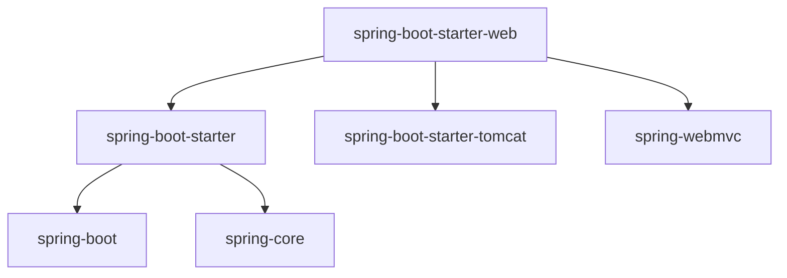
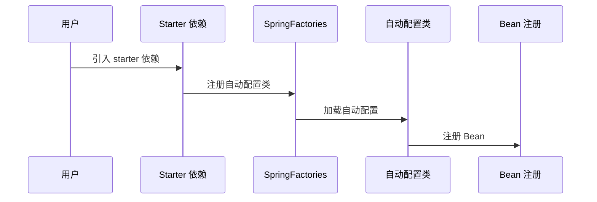

# Spring Boot Starter 原理

> 目标级别：P6
>
> 面试命中率：85%

## 快速自测

1. Spring Boot Starter 的结构是怎样的？
2. Spring Boot 如何自动配置 Spring MVC？
3. 为什么引入 starter 就能自动配置？

---

## 一、Starter 组成

### 官方 Starter 命名规范

| 组件 | 说明 |
| --- | --- |
| `spring-boot-starter-*` | 官方 Starter |
| `*-spring-boot-starter` | 第三方 Starter |

### Starter 结构

```
my-spring-boot-starter/
├── pom.xml
└── src/main/resources/
    └── META-INF/
        └── spring/
            └── org.springframework.boot.autoconfigure.AutoConfiguration.imports
```

---

## 二、Starter 依赖关系

### spring-boot-starter-web 依赖关系



---

## 三、自动配置流程



---

## 四、自定义 Starter

### 1. 创建 Starter 模块

```xml title="pom.xml"
<dependencies>
    <dependency>
        <groupId>org.springframework.boot</groupId>
        <artifactId>spring-boot-autoconfigure</artifactId>
    </dependency>
</dependencies>
```

### 2. 创建配置属性类

```java
@ConfigurationProperties(prefix = "my.service")
public class MyServiceProperties {

    private String host = "localhost";
    private int port = 8080;
    // getter/setter
}
```

### 3. 创建自动配置类

```java
@Configuration
@ConditionalOnClass(MyService.class)
@EnableConfigurationProperties(MyServiceProperties.class)
public class MyServiceAutoConfiguration {

    @Bean
    @ConditionalOnMissingBean
    public MyService myService(MyServiceProperties properties) {
        return new MyService(properties.getHost(), properties.getPort());
    }
}
```

### 4. 注册自动配置

```text title="META-INF/spring/org.springframework.boot.autoconfigure.AutoConfiguration.imports"
com.example.autoconfigure.MyServiceAutoConfiguration
```

### 5. 使用 Starter

```yaml
my:
  service:
    host: 127.0.0.1
    port: 9090
```

---

## 五、高频面试题

### 🔴 第一层：Spring Boot Starter 的原理是什么？

**答案要点**：
1. Starter 包含自动配置类
2. 通过 `spring.factories` 或 `AutoConfiguration.imports` 注册
3. Spring Boot 根据条件注解按需加载

### 🟡 第二层：为什么引入 starter 就能自动配置？

**答案要点**：
1. Starter 依赖了需要自动配置的组件
2. Spring Boot 根据 `@Conditional` 条件自动注册 Bean
3. 开发者无需手动配置

---

## 六、常见陷阱

> ⚠️ **陷阱一**：Starter 循环依赖

如果两个 Starter 相互依赖，会导致启动失败。

> ⚠️ **陷阱二**：条件注解顺序错误

如果 `@ConditionalOnBean` 在 Bean 注册之前检查，会导致条件失效。
