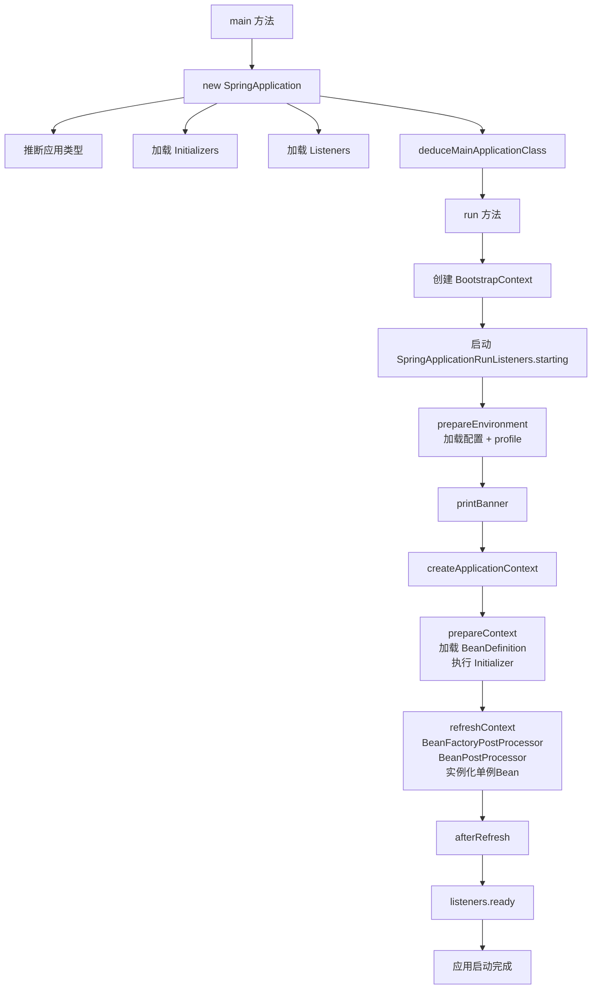
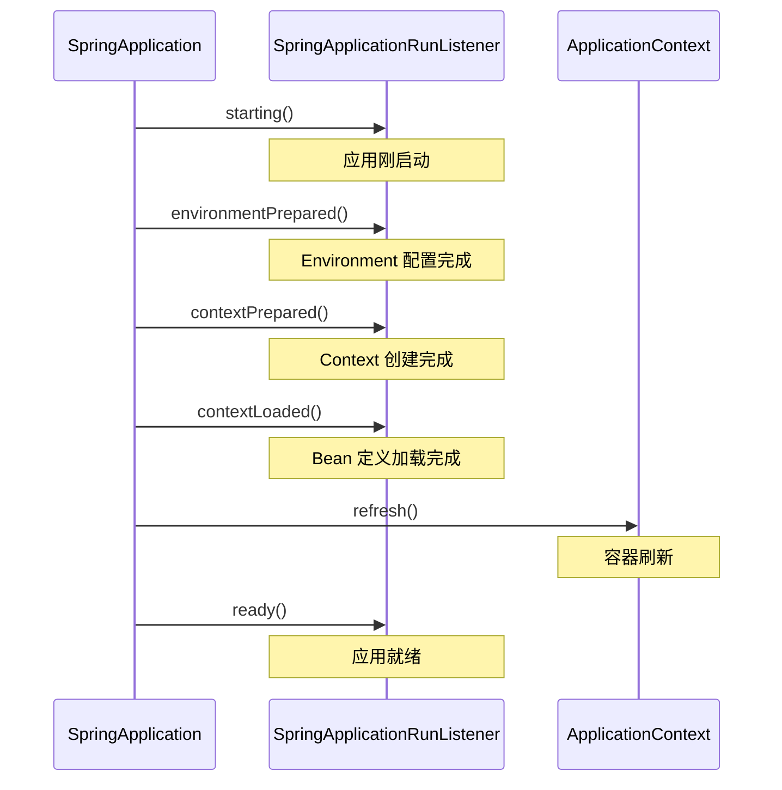

# Spring Boot 启动流程

候选人小刘在面试美团P6时，被问到：

"Spring Boot 的启动流程说一下，从 main 方法开始。"

小刘说："先创建 SpringApplication，然后调用 run 方法。"面试官追问："run 方法里面做了什么？"小刘说："就是启动 Spring 容器吧？"

面试官拿起笔："那 prepareContext 做了什么？refreshContext 呢？"小刘卡住了。

面试官又问："SpringApplicationRunListener 是什么时候触发的？ApplicationContextInitializer 呢？"小刘彻底答不上来。

【面试官心理】

这道题我用来测试候选人对 Spring Boot 启动链路的整体理解。能说出"new SpringApplication 然后 run"的占 80%，能说出 run 方法中关键步骤的占 30%，能完整画出启动流程图并说出每个扩展点的只有 5%。这道题太细节了，大多数人只用过，没研究过。

## 一、启动链路全解析 🔴

### 1.1 从 main 方法说起

```java
public static void main(String[] args) {
    SpringApplication.run(Application.class, args);
}
```

`SpringApplication.run()` 实际上做了两件事：

```java
public static ConfigurableApplication run(Class<?> primarySource, String... args) {
    return new SpringApplication(primarySource).run(args);
}
```

1. `new SpringApplication(primarySources)`：创建 SpringApplication 实例
2. `run(args)`：执行启动流程

### 1.2 new SpringApplication 做了什么

```java
public SpringApplication(Class<?>... primarySources) {
    // 1. 保存主配置类
    this.primarySources = new LinkedHashSet<>(Arrays.asList(primarySources));

    // 2. 推断应用类型：REACTIVE / SERVLET / NONE
    this.webApplicationType = WebApplicationType.deduceFromClasspath();

    // 3. 设置 BootstrapRegistryInitializer
    this.setInitializers(this.getSpringFactoriesInstances(ApplicationContextInitializer.class));

    // 4. 设置 ApplicationListener
    this.setListeners(this.getSpringFactoriesInstances(ApplicationListener.class));

    // 5. 推断主入口类
    this.mainApplicationClass = this.deduceMainApplicationClass();
}
```

:::details 📖 点击展开应用类型推断逻辑

```java
// WebApplicationType.deduceFromClasspath()
static WebApplicationType deduceFromClasspath() {
    // 如果有 REACTIVE 包但没有 SERVLET 包 → REACTIVE
    if (ClassUtils.isPresent("org.springframework.web.reactive.DispatcherHandler", null)
            && !ClassUtils.isPresent("org.springframework.web.servlet.DispatcherServlet", null)) {
        return WebApplicationType.REACTIVE;
    }
    // 如果没有 SERVLET 相关类 → NONE（非 Web 应用）
    for (String className : SERVLET_INDICATIVE_CLASSES) {
        if (!ClassUtils.isPresent(className, null)) {
            return WebApplicationType.NONE;
        }
    }
    // 否则 → SERVLET（传统 Web 应用）
    return WebApplicationType.SERVLET;
}
```

:::

### 1.3 run 方法的核心流程

```java
public ConfigurableApplication run(String... args) {
    // 1. 创建计时器
    StopWatch stopWatch = new StopWatch();
    stopWatch.start();

    // 2. 创建 BootstrapContext（引导上下文）
    DefaultBootstrapContext bootstrapContext = createBootstrapContext();

    // 3. 配置 Headless 属性（无头模式）
    configureHeadlessProperty();

    // 4. 获取并启动 SpringApplicationRunListeners
    SpringApplicationRunListeners listeners = getRunListeners(args);
    listeners.starting(bootstrapContext, this.mainApplicationClass);

    // 5. 准备 Environment
    ConfigurableEnvironment environment = prepareEnvironment(
        bootstrapContext, listeners, applicationArguments);

    // 6. 打印 Banner
    Banner printedBanner = printBanner(environment);

    // 7. 创建 ApplicationContext
    ConfigurableApplicationContext context = createApplicationContext();
    context.setApplicationStartup(this.applicationStartup);

    // 8. 准备 Context（关键步骤）
    prepareContext(bootstrapContext, context, environment, listeners,
                   applicationArguments, printedBanner);

    // 9. 刷新 Context（核心：创建 Bean、启动服务器等）
    refreshContext(context);

    // 10. 刷新后处理
    afterRefresh(context, applicationArguments);

    // 11. 停止计时器并发布 ApplicationReadyEvent
    stopWatch.stop();
    listeners.ready(context, this.typedApplicationArguments);

    return context;
}
```

:::details 📖 点击展开启动流程 Mermaid 图



:::

## 二、prepareContext 详解 🟡

### 2.1 prepareContext 的四个步骤

```java
private void prepareContext(ConfigurableApplicationContext context,
        ConfigurableEnvironment environment, SpringApplicationRunListeners listeners,
        ApplicationArguments applicationArguments, Banner printedBanner) {
    // 1. 设置 Environment
    context.setEnvironment(environment);

    // 2. 配置 ResourceLoader 和 ClassLoader
    postProcessApplicationContext(context);

    // 3. 应用 Initializers
    applyInitializers(context);

    // 4. 加载 Bean 定义
    load(context, sources.toArray(new Object[0]));
}
```

### 2.2 ApplicationContextInitializer 的触发时机

```java
protected void applyInitializers(ConfigurableApplicationContext context) {
    // 遍历所有 Initializers，逐个调用 initialize()
    for (ApplicationContextInitializer initializer : this.initializers) {
        initializer.initialize(context);
    }
}
```

`ApplicationContextInitializer` 是在 refreshContext 之前执行的扩展点，用于在容器刷新前做预处理：

```java
// 自定义 Initializer 示例
public class MyInitializer implements ApplicationContextInitializer<ConfigurableApplicationContext> {
    @Override
    public void initialize(ConfigurableApplicationContext context) {
        // 在容器刷新前执行：修改 BeanFactory、设置环境变量等
        context.getBeanFactory().registerSingleton("myService", new MyService());
    }
}

// 注册方式：在 spring.factories 中声明
# META-INF/spring.factories
org.springframework.boot.SpringApplicationRunListener=\
com.example.MyInitializer
```

:::warning ⚠️

ApplicationContextInitializer 是在 `prepareContext` 阶段执行的，此时 Bean 定义还没加载，容器还没刷新。如果你在这里调用 `context.getBean()`，会直接抛出 NoSuchBeanDefinitionException。

:::

## 三、refreshContext 核心流程 🟡

### 3.1 refreshContext 等价于 Spring 的 refresh

Spring Boot 的 `refreshContext` 调用的是 Spring Framework 的 `AbstractApplicationContext.refresh()`：

```java
protected void refresh(ApplicationContext applicationContext) {
    ((AbstractApplicationContext) applicationContext).refresh();
}
```

`refresh()` 的完整步骤：

```java
public void refresh() {
    // 1. 准备 BeanFactory
    prepareBeanFactory(beanFactory);

    // 2. 允许子类修改 BeanFactory
    postProcessBeanFactory(beanFactory);

    // 3. 调用 BeanFactoryPostProcessor（包括 ConfigurationClassPostProcessor）
    invokeBeanFactoryPostProcessors(beanFactory);

    // 4. 注册 BeanPostProcessor
    registerBeanPostProcessors(beanFactory);

    // 5. 初始化消息源
    initMessageSource();

    // 6. 初始化事件广播器
    initApplicationEventMulticaster();

    // 7. 初始化特定上下文子类
    onRefresh();

    // 8. 注册监听器
    registerListeners();

    // 9. 实例化所有非懒加载的单例 Bean
    finishBeanFactoryInitialization(beanFactory);

    // 10. 初始化 LifecycleProcessor
    finishRefresh();
}
```

### 3.2 Spring Boot 的 onRefresh

Spring Boot 在 `onRefresh()` 阶段做了额外的事情：

```java
@Override
protected void onRefresh() {
    super.onRefresh();
    // 创建 Web 服务器（Tomcat/Undertow/Jetty）
    createWebServer();
}
```

`createWebServer()` 是 Spring Boot 引入 Web 服务器的关键步骤。

## 四、SpringApplicationRunListener 触发时机 🟡

### 4.1 五个回调方法

`SpringApplicationRunListener` 定义了 5 个生命周期回调：

```java
public interface SpringApplicationRunListener {
    // 应用刚启动（run 方法开始时）
    void starting(ConfigurableBootstrapContext bootstrapContext, Class<?> mainApplicationClass);

    // Environment 准备好之后
    void environmentPrepared(ConfigurableBootstrapContext bootstrapContext,
                             ConfigurableEnvironment environment);

    // ApplicationContext 准备好之后
    void contextPrepared(ConfigurableApplicationContext context);

    // ApplicationContext 加载完成、refresh 之前
    void contextLoaded(ConfigurableApplicationContext context);

    // 应用启动完成
    void ready(ConfigurableApplicationContext context,
               ApplicationArguments arguments);
}
```



### 4.2 自定义 SpringApplicationRunListener

```java
// 必须是 SpringApplication 的构造函数的参数
public class MyListener implements SpringApplicationRunListener {
    @Override
    public void starting(ConfigurableBootstrapContext bootstrapContext, Class<?> mainApplicationClass) {
        long start = System.currentTimeMillis();
        System.out.println("应用启动开始...");
    }

    @Override
    public void ready(ConfigurableApplicationContext context, ApplicationArguments arguments) {
        long duration = System.currentTimeMillis() - startTime;
        System.out.println("应用启动完成，耗时: " + duration + "ms");
    }
}
```

## 五、❌ 错误示范

### 5.1 只会说皮毛

**候选人原话**："Spring Boot 启动就是创建 SpringApplication 然后调用 run 方法，run 方法会启动 Spring 容器。"

**问题诊断**：
- 说不清 run 方法中的具体步骤
- 不知道 prepareContext、refreshContext、afterRefresh 的区别
- 不理解 SpringApplicationRunListener 和 ApplicationContextInitializer 的触发时机

**面试官内心 OS**："这个候选人肯定没看过 Spring Boot 的源码。run 方法里有十几个步骤，他只说了一个'启动容器'。"

### 5.2 张冠李戴

**候选人原话**："refreshContext 里面就是注册 Bean，BeanFactoryPostProcessor 是在 prepareContext 里执行的。"

**问题诊断**：
- 把执行顺序搞混了
- BeanFactoryPostProcessor 是在 refresh 的 invokeBeanFactoryPostProcessors 阶段执行的，不是在 prepareContext

## 六、标准回答

### 6.1 P5 级别

"Spring Boot 启动流程是：先 new SpringApplication 设置各种属性，然后调用 run 方法。run 方法中会准备 Environment、创建 ApplicationContext、加载 Bean 定义、启动 Web 服务器。"

### 6.2 P6 级别

"Spring Boot 启动分两个阶段：构造 SpringApplication 和执行 run。

构造阶段做四件事：推断应用类型（REACTIVE/SERVLET/NONE）、加载 ApplicationContextInitializer、加载 ApplicationListener、推断主入口类。

run 方法的流程是：启动 BootstrapContext → listeners.starting → prepareEnvironment → createApplicationContext → prepareContext → refreshContext → afterRefresh → listeners.ready。

其中 prepareContext 会调用 Initializers、加载 Bean 定义；refreshContext 调用 Spring 容器的 refresh()，完成 BeanFactoryPostProcessor 调用、BeanPostProcessor 注册、单例 Bean 实例化；afterRefresh 做刷新后的额外处理。SpringApplicationRunListener 有 5 个回调方法，分别在启动的不同阶段触发。"

### 6.3 P7 级别

"这道题背后考的是 Spring Boot 的扩展点设计。我在项目中用过两个扩展点：ApplicationContextInitializer 用于在容器刷新前注册一些系统级的单例 Bean；SpringApplicationRunListener 用于做启动耗时监控。

Spring Boot 2.4+ 引入的 DefaultBootstrapContext 是新的扩展点，比 SpringApplicationRunListener 更早执行，适用于需要共享状态的场景。

容器刷新阶段最耗时的是 finishBeanFactoryInitialization（实例化所有单例 Bean）。如果启动慢，重点排查这个阶段——通常是 DataSource 初始化、Redis 连接池初始化、或者大量 @Bean 的懒加载没生效。"

【面试官心理】

P7 的回答重点在于"扩展点使用"和"性能优化"。能说出具体在哪个扩展点踩过坑、做过优化的候选人，说明他对 Spring Boot 的理解已经进入了工程化层面。
