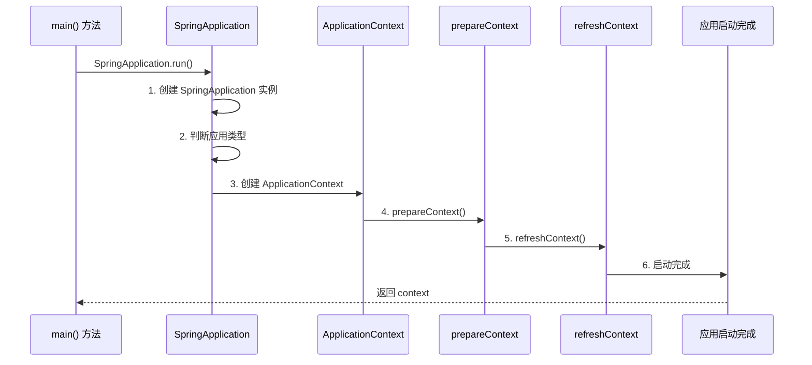

# Spring Boot 启动流程

> 目标级别：P6
>
> 面试命中率：75%

## 快速自测

1. Spring Boot 应用的启动流程是怎样的？
2. SpringApplication.run() 做了什么？
3. Spring Boot 如何判断 Web 应用类型？

---

## 一、启动流程概览



---

## 二、SpringApplication 源码解析

```java title="SpringApplication.java"
public static ConfigurableApplicationContext run(Class<?> primarySource, String... args) {
    return new SpringApplication(primarySource).run(args);
}

public ConfigurableApplicationContext run(String... args) {
    // 1. 创建并启动计时器
    StopWatch stopWatch = new StopWatch();
    stopWatch.start();

    // 2. 创建引导上下文
    BootstrapContext bootstrapContext = createBootstrapContext();

    // 3. 获取并配置环境
    ConfigurableEnvironment environment = prepareEnvironment(bootstrapContext, args);

    // 4. 打印 Banner
    Banner printedBanner = printBanner(environment);

    // 5. 创建 ApplicationContext
    context = createApplicationContext(environment);

    // 6. 准备上下文
    prepareContext(bootstrapContext, context, environment);

    // 7. 刷新上下文
    refreshContext(context);

    // 8. 刷新后处理
    afterRefresh(context, args);

    // 9. 停止计时器
    stopWatch.stop();

    // 10. 返回上下文
    return context;
}
```

---

## 三、判断应用类型

```java title="SpringApplication.java"
private WebApplicationType deduceWebApplicationType() {
    // 如果存在 spring-webflux，返回 REACTIVE
    if (ClassUtils.isPresent(
            "org.springframework.web.reactive.DispatcherHandler",
            null)) {
        return WebApplicationType.REACTIVE;
    }

    // 如果存在 spring-webmvc，返回 SERVLET
    if (!ClassUtils.isPresent(
            "org.springframework.web.servlet.DispatcherServlet",
            null)) {
        return WebApplicationType.NONE;
    }

    return WebApplicationType.SERVLET;
}
```

---

## 四、创建 ApplicationContext

```java title="SpringApplication.java"
protected ConfigurableApplicationContext createApplicationContext(ConfigurableEnvironment environment) {
    WebApplicationType webApplicationType = getWebApplicationType(environment);

    // 根据应用类型创建不同的上下文
    ApplicationContextFactory factory = ApplicationContextFactory.DEFAULT;
    ConfigurableApplicationContext context = factory.createContext(webApplicationType);

    if (context == null) {
        // 默认实现
        switch (webApplicationType) {
            case SERVLET:
                context = new AnnotationConfigServletWebServerApplicationContext();
                break;
            case REACTIVE:
                context = new AnnotationConfigReactiveWebServerApplicationContext();
                break;
            default:
                context = new AnnotationConfigApplicationContext();
        }
    }

    return context;
}
```

---

## 五、refreshContext 核心流程

```java title="AbstractApplicationContext.java"
public void refresh() throws BeansException, IllegalStateException {
    // 1. 准备刷新
    prepareRefresh();

    // 2. 获取 BeanFactory
    ConfigurableListableBeanFactory beanFactory = obtainFreshBeanFactory();

    // 3. 准备 BeanFactory
    prepareBeanFactory(beanFactory);

    // 4. 后置处理 BeanFactory
    postProcessBeanFactory(beanFactory);

    // 5. 调用 BeanFactoryPostProcessor
    invokeBeanFactoryPostProcessors(beanFactory);

    // 6. 注册 BeanPostProcessor
    registerBeanPostProcessors(beanFactory);

    // 7. 初始化消息源
    initMessageSource(beanFactory);

    // 8. 初始化事件广播器
    initApplicationEventMulticaster();

    // 9. 初始化特定 Bean（Web Server）
    onRefresh();

    // 10. 注册监听器
    registerListeners();

    // 11. 实例化单例 Bean
    finishBeanFactoryInitialization(beanFactory);

    // 12. 刷新完成
    finishRefresh();
}
```

---

## 六、高频面试题

### 🔴 第一层：Spring Boot 启动流程是怎样的？

**答案要点**：
1. 创建 SpringApplication 实例
2. 判断应用类型
3. 创建 ApplicationContext
4. 准备上下文
5. 刷新上下文（核心流程）
6. 刷新后处理

### 🟡 第二层：Spring Boot 如何判断 Web 应用类型？

**答案要点**：
1. 如果存在 DispatcherHandler，返回 REACTIVE
2. 如果存在 DispatcherServlet，返回 SERVLET
3. 否则返回 NONE

---

## 七、常见陷阱

> ⚠️ **陷阱一**：Tomcat 启动失败

如果端口被占用或配置错误，会导致启动失败。

> ⚠️ **陷阱二**：Bean 初始化失败

如果 Bean 创建过程中抛出异常，Spring Boot 会尝试关闭上下文。
