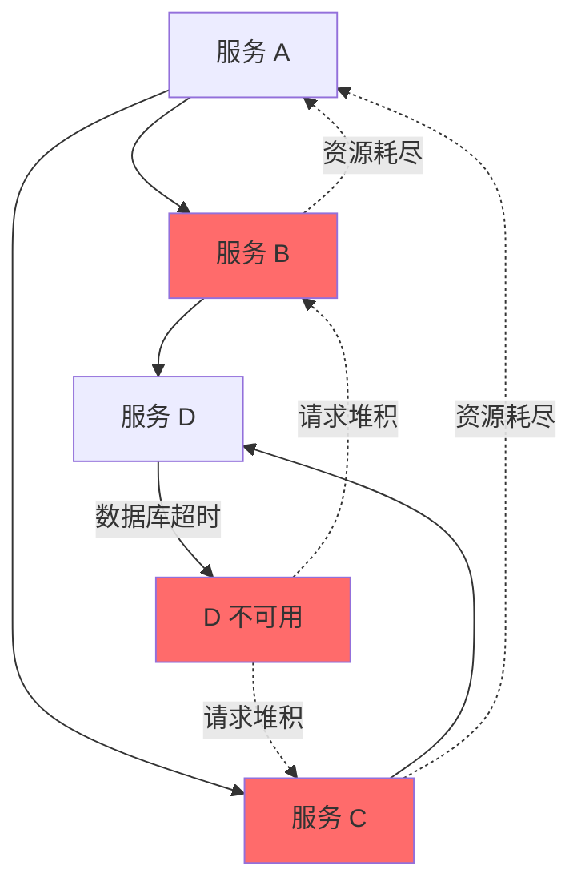
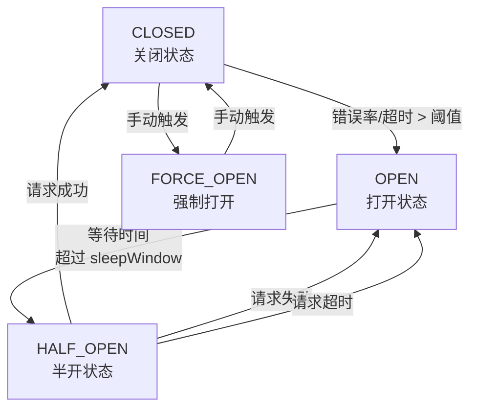
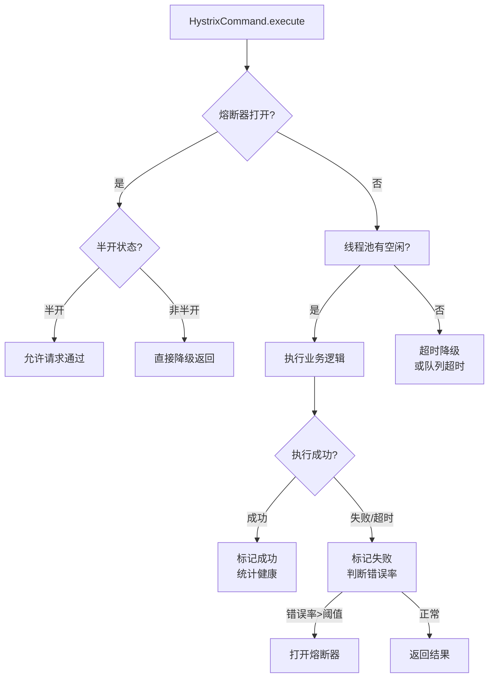

# 服务熔断与降级机制

候选人小张在面试字节订单服务团队时，面试官问："什么是熔断？Hystrix 的熔断器有几种状态？"

小张说："熔断就是防止雪崩..." 面试官追问："那 Hystrix 的熔断器状态转换是怎样的？从 CLOSED 到 OPEN 是什么条件触发的？"

小张说："错误率超过阈值..." 面试官继续追问："从 OPEN 到 HALF_OPEN 呢？HALF_OPEN 状态下，如果请求成功会怎样？"

小张支支吾吾答不上来。

面试官又问："Sentinel 的滑动窗口和 Hystrix 有什么区别？Sentinel 的五种流量整形策略是什么？"

小赵彻底卡住。

【面试官心理】

这道题我用来测试候选人对熔断器核心原理的理解。熔断是微服务架构中最核心的容错机制之一，Hystrix 和 Sentinel 是两个主流实现。能说出状态转换的占 50%，能解释滑动窗口和流量整形的只有 15%。这道题能筛选出真正理解熔断器原理的候选人。

## 一、为什么需要熔断 🔴

### 1.1 雪崩效应



一个服务的故障，引发连锁反应，最终导致整个系统不可用。

### 1.2 熔断的核心思想

熔断器：**当检测到下游服务不可用时，立即"熔断"，不再调用下游，直接返回降级结果**，防止请求堆积和资源耗尽。

```
正常状态：
  A → B → C → D → 正常返回

熔断触发后：
  A → B → [熔断器打开] → 直接降级返回
```

## 二、Hystrix 熔断器原理 🔴

### 2.1 熔断器的三种状态



| 状态 | 说明 | 行为 |
| --- | --- | --- |
| CLOSED | 熔断器关闭，正常调用 | 统计成功/失败/超时，错误率超标则打开 |
| OPEN | 熔断器打开，快速失败 | 所有请求直接降级，不调用实际服务 |
| HALF_OPEN | 熔断器半开，试探恢复 | 允许一个请求通过，成功则关闭，失败则打开 |

### 2.2 HystrixCircuitBreaker 源码解析

```java
// HystrixCircuitBreaker.java - 熔断器核心接口
public interface HystrixCircuitBreaker {
    // 是否允许请求通过
    boolean allowRequest();

    // 是否熔断器打开
    boolean isOpen();

    // 标记熔断器打开
    void open();

    // 标记请求成功
    void markSuccess();

    // 标记请求失败
    void markFailure();
}

// HystrixCircuitBreakerImpl.java - 熔断器实现
public class HystrixCircuitBreakerImpl implements HystrixCircuitBreaker {
    // 配置参数
    private final HystrixCommandProperties properties;

    // 熔断器状态（默认 CLOSED）
    private final AtomicReference<HystrixCircuitBreaker.State> state;

    public enum State {
        CLOSED,    // 关闭
        OPEN,      // 打开
        HALF_OPEN  // 半开
    }

    @Override
    public boolean allowRequest() {
        // 1. 如果是 FORCE_OPEN，直接拒绝
        if (properties.circuitBreakerForceOpen().get()) {
            return false;
        }

        // 2. 如果是 FORCE_CLOSED，允许所有请求
        if (properties.circuitBreakerForceClosed().get()) {
            return true;
        }

        // 3. 检查状态
        if (state.get() == CLOSED) {
            return true;  // 关闭状态，允许请求
        }

        if (state.get() == OPEN) {
            // 检查是否过了熔断时间
            if (durationInOpenState() >= properties.circuitBreakerSleepWindow().get()) {
                // 进入 HALF_OPEN 状态
                if (state.compareAndSet(OPEN, HALF_OPEN)) {
                    circuitOpened.set(System.currentTimeMillis());
                }
                return true;  // 半开状态，允许一个请求通过
            }
            return false;  // 还在熔断窗口内，拒绝请求
        }

        return false;
    }

    @Override
    public void markSuccess() {
        if (state.get() == HALF_OPEN) {
            // HALF_OPEN 状态下，请求成功，关闭熔断器
            state.set(CLOSED);
            // 重置计数器
            metrics.reset();
        }
    }

    @Override
    public void markFailure() {
        if (state.get() == CLOSED) {
            // 在 CLOSED 状态下，标记失败
            metrics.recordFailure();
        }

        // 在 HALF_OPEN 状态下，任何失败都重新打开熔断器
        if (state.get() == HALF_OPEN) {
            circuitOpened.set(System.currentTimeMillis());
            state.set(OPEN);
        }
    }
}
```

### 2.3 熔断触发条件

```java
// HystrixCommandProperties.java - 熔断器配置
@HystrixProperty(name = "circuitBreaker.enabled", value = "true")           // 启用熔断
@HystrixProperty(name = "circuitBreaker.requestVolumeThreshold", value = "20") // 最小请求数
@HystrixProperty(name = "circuitBreaker.sleepWindowInMilliseconds", value = "5000") // 熔断持续时间
@HystrixProperty(name = "circuitBreaker.errorThresholdPercentage", value = "50") // 错误率阈值

/*
 * 熔断触发条件：
 *
 * 1. requestVolumeThreshold = 20
 *    必须至少收到 20 个请求，才会判断是否熔断
 *    （避免统计样本太少导致的误判）
 *
 * 2. errorThresholdPercentage = 50
 *    当 20 个请求中，失败率超过 50% 时，触发熔断
 *    即 10 个以上请求失败/超时/异常
 *
 * 3. sleepWindowInMilliseconds = 5000
 *    熔断打开后，持续 5 秒
 *    5 秒后，允许一个请求通过（HALF_OPEN）
 *    如果成功则关闭熔断器
 *    如果失败则继续打开 5 秒
 */

// 统计失败率
// HystrixCircuitBreakerImpl.java
public void markFailure() {
    // 将当前请求标记为失败
    metrics.markFailure();
}

// 定时检查是否需要熔断
// HealthCountsStream.java
public void checkCircuitBreaker() {
    long total = getTotal();
    long error = getErrorCount();

    if (total >= requestVolumeThreshold) {
        double errorPercentage = error * 100.0 / total;

        if (errorPercentage >= errorThresholdPercentage) {
            // 错误率超过阈值，打开熔断器
            circuitBreaker.open();
        }
    }
}
```

### 2.4 Hystrix 执行流程



## 三、Sentinel 滑动窗口算法 🟡

### 3.1 Sentinel vs Hystrix 的核心区别

| 维度 | Hystrix | Sentinel |
| --- | --- | --- |
| 统计方式 | 滚动窗口（每 10 秒一个桶） | 滑动窗口（精确到毫秒）|
| 熔断策略 | 基于错误率/数量 | 基于错误率/异常数/慢调用比例 |
| 限流策略 | 线程数/QPS | QPS/并发线程数/冷启动/匀速排队 |
| 配置方式 | 代码注解 | 控制台 + SDK |
| 动态配置 | 不支持 | 支持（推模式）|

### 3.2 LeapArray 滑动窗口

```java
// LeapArray.java - Sentinel 的滑动窗口实现
public class LeapArray<T> {
    // 时间窗口参数
    private final int windowLengthInMs;   // 每个桶的时间长度
    private final int sampleCount;        // 桶的数量
    private final int intervalInMs;       // 总时间窗口 = windowLengthInMs * sampleCount

    // 实际存储的桶数组
    private final AtomicReferenceArray<Window<T>> array;

    // LeapArray 示例：
    // windowLengthInMs = 200ms
    // sampleCount = 5
    // intervalInMs = 1000ms (1秒)
    //
    // 滑动窗口示意：
    // |<-- 200ms -->|<-- 200ms -->|<-- 200ms -->|<-- 200ms -->|<-- 200ms -->|
    // |    Bucket0  |    Bucket1  |    Bucket2  |    Bucket3  |    Bucket4  |
    //                                                              ↑
    //                                                        当前时间
    //
    // 计算 QPS = (Bucket0 + Bucket1 + ... + Bucket4) / 1s
}

// WindowBucket.java - 单个时间桶
public class Window<T> {
    private long windowStart;  // 桶的开始时间
    private T value;           // 统计数据

    // value 可能是：
    // - MetricBucket: 请求总数、成功数、异常数、阻塞数、响应时间
    // - BucketWrap: 存储上述数据的包装类
}
```

### 3.3 Sentinel 熔断策略

```java
// DegradeRule.java - Sentinel 熔断规则
// 支持三种熔断策略：

// 1. 基于异常比例熔断
@HystrixProperty(name = "degrade.max_exception_ratio", value = "0.3")
// 异常比例阈值：0.3 = 30%
// 当 1 秒内请求数 >= 5，且异常比例 >= 30% 时，熔断

// 2. 基于异常数熔断
@HystrixProperty(name = "degrade.max_exception_count", value = "10")
// 异常数阈值：10
// 当 1 秒内异常数 >= 10 时，熔断

// 3. 基于慢调用比例熔断
@HystrixProperty(name = "degrade.max_slow_ratio", value = "0.5")
@HystrixProperty(name = "degrade.max_rt", value = "1000")
// 慢调用比例阈值：0.5 = 50%
// 慢调用阈值：RT = 1000ms
// 当 1 秒内慢调用比例 >= 50% 时，熔断

// 配置示例
@PostConstruct
public void initRules() {
    List<DegradeRule> rules = new ArrayList<>();

    // 异常比例熔断
    DegradeRule rule1 = new DegradeRule("user-service")
        .setGrade(CircuitBreakerStrategy.ERROR_RATIO.getType())
        .setCount(0.3)  // 30% 异常比例
        .setMinRequestAmount(5)  // 最小请求数
        .setStatIntervalMs(1000)  // 统计时间窗口
        .setTimeWindow(10);  // 熔断持续 10 秒

    // 慢调用比例熔断
    DegradeRule rule2 = new DegradeRule("user-service")
        .setGrade(CircuitBreakerStrategy.SLOW_RT_RATIO.getType())
        .setCount(1000)  // 慢调用阈值 1000ms
        .setMinRequestAmount(5)
        .setSlowRatioThreshold(0.5)  // 50% 慢调用比例
        .setTimeWindow(10);

    rules.add(rule1);
    rules.add(rule2);

    DegradeRuleManager.loadRules(rules);
}
```

### 3.4 Sentinel 五种流量整形策略

```java
// FlowRule.java - 限流规则
// 五种流量整形策略：

// 1. 直接拒绝（默认）
// 直接拒绝超过阈值的请求
FlowRule rule = new FlowRule("user-service")
    .setGrade(RuleConstant.FLOW_GRADE_QPS)
    .setCount(100)  // QPS 上限 100
    .setControlBehavior(RuleConstant.CONTROL_BEHAVIOR_DEFAULT);
    // 超出 100 QPS 的请求直接拒绝

// 2. 冷启动（Warm Up）
// 预热阶段逐步提升阈值
// 适用于秒杀等场景
FlowRule rule = new FlowRule("user-service")
    .setGrade(RuleConstant.FLOW_GRADE_QPS)
    .setCount(100)
    .setControlBehavior(RuleConstant.CONTROL_BEHAVIOR_WARM_UP)
    .setWarmUpPeriodSec(10);  // 预热时长 10 秒
    // 开始时 QPS = 100 / 10 = 10
    // 10 秒后逐渐升到 100

// 3. 匀速排队
// 超过阈值的请求排队等待
FlowRule rule = new FlowRule("user-service")
    .setGrade(RuleConstant.FLOW_GRADE_QPS)
    .setCount(100)
    .setControlBehavior(RuleConstant.CONTROL_BEHAVIOR_RATE_LIMITER)
    .setMaxQueueingTimeMs(500);  // 最多排队 500ms
    // 如果 QPS = 1000，超出 900 个请求会排队
    // 每个请求间隔 10ms 释放
    // 排队超过 500ms 的请求会被拒绝

// 4. 预热 + 匀速排队
// 组合策略
FlowRule rule = new FlowRule("user-service")
    .setGrade(RuleConstant.FLOW_GRADE_QPS)
    .setCount(100)
    .setControlBehavior(RuleConstant.CONTROL_BEHAVIOR_WARM_UP_RATE_LIMITER)
    .setWarmUpPeriodSec(10)
    .setMaxQueueingTimeMs(500);

// 5. 冷启动 + 匀速排队
// 基于漏桶算法的组合
```

## 四、线程池隔离 vs 信号量隔离 🟡

### 4.1 隔离策略对比

```java
// Hystrix 隔离策略配置
@HystrixCommand(
    commandProperties = {
        // 信号量隔离
        @HystrixProperty(name = "execution.isolation.strategy", value = "SEMAPHORE"),
        // 信号量最大并发数
        @HystrixProperty(name = "execution.isolation.semaphore.maxConcurrentRequests", value = "10")
    },
    threadPoolProperties = {
        // 线程池隔离
        @HystrixProperty(name = "coreSize", value = "10"),
        @HystrixProperty(name = "maxQueueSize", value = "100"),
        @HystrixProperty(name = "keepAliveTimeMinutes", value = "1")
    }
)
public String callUserService() {
    return userClient.getUser();
}
```

| 维度 | 线程池隔离 | 信号量隔离 |
| --- | --- | --- |
| 线程模型 | 新线程执行调用 | 主线程执行调用 |
| 开销 | 线程创建/切换开销 | 无额外线程开销 |
| 并发控制 | 线程池大小控制 | 信号量计数控制 |
| 超时控制 | 支持（可设置超时）| 不支持 |
| 调用延迟 | 额外延迟（线程切换）| 无额外延迟 |
| 适用场景 | 有远程调用（HTTP/DB）| 本地方法调用/极其快速的方法 |
| 资源隔离 | 好（线程池级别）| 差（仅计数）|

### 4.2 ThreadPoolKey 的隔离

```java
// 每个 HystrixCommandGroup 有一个 ThreadPoolKey
// 相同 ThreadPoolKey 的命令共享线程池

@HystrixCommand(
    groupKey = "UserGroup",
    threadPoolKey = "UserServicePool",  // 指定 ThreadPoolKey
    commandProperties = {
        @HystrixProperty(name = "coreSize", value = "10")
    }
)
public String getUser() {}

// ThreadPoolKey 相同，则共享线程池
@HystrixCommand(groupKey = "UserGroup", threadPoolKey = "UserServicePool")
public String getUserInfo() {}  // 和上面的命令共享线程池
```

## 五、生产最佳实践 🟡

### 5.1 熔断策略配置

```yaml
# 生产环境熔断器配置
hystrix:
  command:
    default:
      execution:
        isolation:
          strategy: THREAD
          thread:
            timeoutInMilliseconds: 3000  # 超时时间略大于接口 RT
      circuitBreaker:
        enabled: true
        requestVolumeThreshold: 20       # 最小请求数
        sleepWindowInMilliseconds: 5000  # 熔断持续 5 秒
        errorThresholdPercentage: 50     # 50% 错误率触发熔断
      fallback:
        enabled: true

# Sentinel 配置
sentinel:
  transport:
    dashboard: localhost:8080
  rules:
    degrade:
      - resource: user-service
        grade: 2  # ERROR_RATIO
        count: 0.5  # 50% 异常比例
        minRequestAmount: 5  # 最小请求数
        timeWindow: 10  # 熔断持续 10 秒
```

### 5.2 降级策略设计

```java
// 分级降级策略
public class GradedFallback {
    // 第一级降级：返回缓存数据
    public User fallbackFromCache(Long userId) {
        User cached = redisTemplate.opsForValue().get("user:" + userId);
        if (cached != null) {
            log.info("一级降级：从缓存返回 user={}", userId);
            return cached;
        }
        throw new NeedSecondFallbackException();
    }

    // 第二级降级：返回默认数据
    public User fallbackDefault(Long userId) {
        log.info("二级降级：返回默认 user={}", userId);
        User user = new User();
        user.setId(userId);
        user.setName("默认用户");
        user.setStatus("降级返回");
        return user;
    }
}
```

## 六、常见翻车现场 🔴

### ❌ 翻车点一：熔断阈值设置过低导致频繁熔断

```java
// ❌ 错误：requestVolumeThreshold 设置过低
@HystrixProperty(name = "circuitBreaker.requestVolumeThreshold", value = "3")
// 只有 3 个请求就判断熔断，统计样本太少，容易误判

// ✅ 正确：设置足够的统计样本
@HystrixProperty(name = "circuitBreaker.requestVolumeThreshold", value = "20")
// 至少 20 个请求后再判断熔断，统计更准确
```

### ❌ 翻车点二：Sentinel 熔断持续时间太短

```java
// ❌ 错误：熔断持续时间太短
.setTimeWindow(1)  // 只熔断 1 秒就恢复
// 服务还没完全恢复，又被打挂了

// ✅ 正确：根据服务恢复时间设置
.setTimeWindow(30)  // 熔断 30 秒后再尝试
```

### ❌ 翻车点三：Sentinel 和 Hystrix 混用

```xml
<!-- ❌ 错误：同时引入两个依赖 -->
<dependency>
    <groupId>org.springframework.cloud</groupId>
    <artifactId>spring-cloud-starter-netflix-hystrix</artifactId>
</dependency>
<dependency>
    <groupId>com.alibaba.csp</groupId>
    <artifactId>sentinel-core</artifactId>
</dependency>

<!-- ✅ 正确：选择其中一个
     推荐 Sentinel，功能更丰富，配置更灵活
-->
```

:::warning ⚠️
Hystrix 已停止维护（2021 年），生产环境强烈推荐使用 Sentinel。Sentinel 的滑动窗口算法比 Hystrix 的滚动窗口更精确，支持的熔断策略更丰富，且有活跃的社区维护。
:::

【面试官心理】

这道题我通常从熔断器的状态转换开始，逐步深入到滑动窗口算法、流量整形策略、生产避坑。能说出三种状态的占 50%，能解释 Sentinel 滑动窗口的占 30%，能说出五种流量整形策略的只有 10%。熔断是微服务容错的核心，能把这些讲清楚的候选人对分布式系统的稳定性设计有较深的理解。
