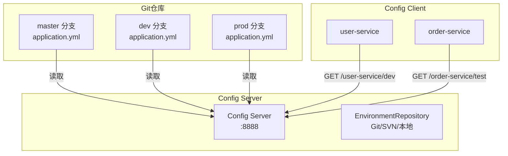
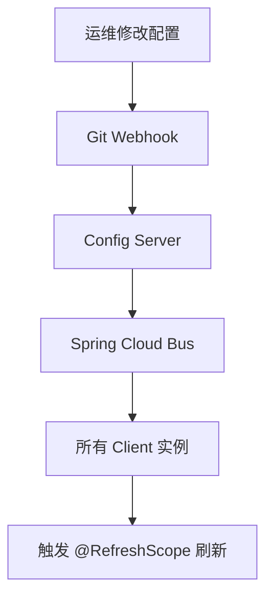

# 配置中心核心原理

候选人小李在面试拼多多基础架构岗时，面试官问："你们的配置中心是怎么实现的？改了配置后客户端是怎么感知到变更的？"

小李说："用 Spring Cloud Config，Git 存储..." 面试官追问："Git 仓库的配置文件命名规范是什么？为什么需要 profile？"

小李说："就是 application.properties..." 面试官继续追问："那客户端怎么感知配置变更的？@RefreshScope 的原理是什么？"

小李支支吾吾答不上来。

面试官又问："如果配置变更后，Bean 没有加 @RefreshScope 注解，还能热更新吗？"

小李彻底卡住。

【面试官心理】

这道题我用来测试候选人对配置中心完整链路的理解。知道配置中心名字的占 80%，能说出配置拉取流程的占 40%，能解释 @RefreshScope 和长轮询机制的只有 15%。配置中心是微服务不可或缺的基础设施，能把这些讲清楚的候选人对 Spring Cloud 有较深的理解。

## 一、为什么需要配置中心 🔴

### 1.1 传统配置管理的问题

```java
// ❌ 传统方式：配置写在 application.properties
# application.properties
jdbc.url=jdbc:mysql://192.168.1.100:3306/db
jdbc.username=root
jdbc.password=secret123
redis.host=192.168.1.101
redis.port=6379
feign.timeout=5000
```

问题：
1. **环境切换麻烦**：dev/test/prod 需要维护多套配置文件
2. **修改需要重启**：改了配置必须重启服务
3. **配置分散**：几十个微服务，每个都要单独维护
4. **版本管理缺失**：改了配置不知道是谁改的、什么时候改的
5. **权限不可控**：所有能看到代码的人都能看到密码

### 1.2 配置中心的核心能力

| 能力 | 说明 |
| --- | --- |
| 统一管理 | 所有环境的配置集中存储 |
| 环境隔离 | dev/test/prod 配置分离 |
| 实时生效 | 配置变更无需重启 |
| 版本管理 | Git 后端支持配置历史 |
| 权限控制 | 不同环境、不同团队不同权限 |
| 加密存储 | 敏感配置加密 |

## 二、Spring Cloud Config 核心原理 🔴

### 2.1 Config Server 架构



### 2.2 配置文件的命名规范

```
{application}/{profile}[/{label}]
```

| 路径 | 说明 |
| --- | --- |
| `application.yml` | 公共配置，所有服务共享 |
| `user-service.yml` | user-service 的默认配置 |
| `user-service-dev.yml` | user-service 的 dev 环境配置 |
| `user-service-prod.yml` | user-service 的 prod 环境配置 |
| `user-service.yml` + `application.yml` | user-service 会同时加载两者，user-service.yml 优先级更高 |

Spring Boot 的配置加载顺序（后面的覆盖前面的）：

```
1. application.yml（低优先级）
2. application-{profile}.yml
3. {application}-{profile}.yml（高优先级）
```

### 2.3 Config Server 启动

```java
// 1. 启用配置中心服务器
@SpringBootApplication
@EnableConfigServer
public class ConfigServerApplication {
    public static void main(String[] args) {
        SpringApplication.run(ConfigServerApplication.class, args);
    }
}

// 2. 配置文件
spring:
  application:
    name: config-server
  cloud:
    config:
      server:
        # Git 后端配置
        git:
          uri: https://github.com/your-org/config-repo
          # 仓库分支（可以指定 default-label）
          default-label: master
          # 配置搜索路径
          search-paths: '{application}'
          # 用户名密码（私有仓库需要）
          username: github-user
          password: github-token
          # 每次请求强制拉取最新（生产建议开启）
          force-pull: true
          # 克隆超时时间
          timeout: 10
      # 健康检查路径
      health:
        enabled: true

server:
  port: 8888  # Config Server 默认端口
```

### 2.4 Config Client 连接配置中心

```java
// Config Client 配置
spring:
  application:
    name: user-service
  cloud:
    config:
      # 服务名（对应 Git 仓库中的文件名）
      name: user-service
      # 环境
      profile: dev
      # 分支
      label: master
      # 配置中心地址（-discovery.enabled=true 时可以省略）
      uri: http://localhost:8888
      # 是否向注册中心查找 Config Server
      discovery:
        enabled: false
      # 获取失败时快速失败
      fail-fast: true
      # 重试次数
      retry:
        max-attempts: 6
        multiplier: 1.5
        max-interval: 2000
```

### 2.5 配置拉取流程

```java
// BootstrapConfiguration.java
// Config Client 启动时，通过 Spring Cloud Context 自动配置

// 1. Spring Cloud Config 自动配置类
@Configuration
@ConditionalOnClass(ConfigServicePropertySourceLocator.class)
public class ConfigServiceBootstrapConfiguration {
    @Bean
    public ConfigServicePropertySourceLocator configServicePropertySourceLocator() {
        return new ConfigServicePropertySourceLocator(
            getClientConfigPropertiesBootstrapConfiguration()
                .clientConfig()
        );
    }
}

// 2. Config Client 启动时拉取配置
// ConfigServicePropertySourceLocator.java
public PropertySource<?> locate(Environment environment) {
    CompositePropertySource composite = new CompositePropertySource("config");

    // 构建请求 URL
    // GET http://config-server:8888/user-service/dev/master
    String uri = properties.getUri();
    String path = String.format("%s/%s/%s/%s",
        uri,
        properties.getName(),      // user-service
        properties.getProfile(),   // dev
        properties.getLabel()     // master
    );

    // 发送 HTTP 请求拉取配置
    String result = getRemoteEnv(uri, path);

    // 解析为 PropertySource
    return parseStore(result, path);
}

// 3. 请求路径解析
// Spring Cloud Config Controller
@GetMapping("/{name}/{profile}/{label}")
public Environment labelled(@PathVariable String name,
                             @PathVariable String profile,
                             @PathVariable String label) {
    // 1. 根据 {name} 查找配置文件：user-service.yml, application.yml
    // 2. 根据 {profile} 叠加：user-service-dev.yml, application-dev.yml
    // 3. 根据 {label} 确定分支：master
    // 4. 按优先级合并返回
    return environment.getPropertySources().stream()
        .filter(name -> name.startsWith("config repo "))
        .findFirst()
        .orElse(new Environment(name, profile, label));
}
```

## 三、配置变更感知机制 🔴

### 3.1 两种配置刷新方式

**方式一：客户端主动拉取（默认）**

```java
// Config Client 每 30 秒（默认）主动从 Config Server 拉取配置
// Spring Cloud Context 的 RefreshScope 自动刷新机制

// 配置刷新触发端点
@PostMapping("/actuator/refresh")
public String refresh() {
    // 1. 清除所有 @RefreshScope Bean 的缓存
    // 2. 发布 EnvironmentChangeEvent 事件
    // 3. 下次获取 Bean 时重新创建，加载最新配置
    context.publishEvent(new EnvironmentChangeEvent(changeKeys));
    return "refreshed";
}
```

**方式二：Spring Cloud Bus + Webhook（推荐）**



### 3.2 @RefreshScope 的完整链路

```java
// Spring Cloud Context 的刷新机制

// 1. 监听配置变更事件
// RefreshAutoConfiguration.java
@EventListener(classes = EnvironmentChangeEvent.class)
public class EnvironmentChangeEventListener {
    @Autowired
    private RefreshScope refreshScope;

    public void onApplicationEvent(EnvironmentChangeEvent event) {
        // 清除 @RefreshScope Bean 的缓存
        // 下次获取 Bean 时重新创建
        refreshScope.refreshAll();
    }
}

// 2. RefreshScope 的 Bean 获取逻辑
// RefreshScope.java
public class RefreshScope extends AbstractScope {
    @Override
    public Object get(String name, ObjectFactory<?> objectFactory) {
        BeanHolder<T> beanHolder = beans.get(name);
        if (beanHolder == null) {
            // 缓存不存在，通过 ObjectFactory 创建
            // ObjectFactory 会重新调用 @Bean 方法，重新绑定 @Value
            beanHolder = new BeanHolder<>(objectFactory.getObject());
            this.beans.put(name, beanHolder);
        }
        return beanHolder.get();
    }

    // 核心：刷新所有缓存的 Bean
    @Override
    public void refreshAll() {
        this.beans.clear();  // 清除缓存
        // 销毁回调会被触发
    }
}

// 3. @ConfigurationProperties 的额外处理
// ConfigurationPropertiesRebinder.java
// 除了清除 RefreshScope 缓存，还重新绑定配置值
public boolean rebind(String name) {
    // 1. 标记需要重新绑定
    this.beans.markBeansDirty(name);
    // 2. 销毁旧 Bean
    this.context.destroy(name);
    // 3. 重新创建 Bean 并绑定配置
    this.context.refresh();
}
```

### 3.3 配置加密 🔴

Spring Cloud Config 支持对称加密和非对称加密：

```yaml
# 对称加密（使用同一个密钥）
spring:
  cloud:
    config:
      server:
        encrypt:
          enabled: true
# 配置文件中使用：{cipher}前缀
# jdbc.password={cipher}AQB...xxx

# 非对称加密（使用公钥/私钥）
# 通过 keystore 配置
spring:
  cloud:
    config:
      server:
        encrypt:
          key-store:
            location: classpath:config-server.jks
            password: changeit
            alias: config-server
            secret: changeme
```

## 四、Nacos 配置中心 🟡

### 4.1 Nacos 配置管理

Nacos 配置中心相比 Spring Cloud Config 最大的优势：**支持配置变更推送（长轮询）**，无需依赖 Git Webhook。

```java
// Nacos Config Client 配置
spring:
  application:
    name: user-service
  cloud:
    nacos:
      config:
        # 配置中心地址
        server-addr: nacos-server:8848
        # 命名空间（用于环境隔离）
        namespace: dev
        # 配置分组
        group: DEFAULT_GROUP
        # 配置文件后缀（默认 properties）
        file-extension: properties
        # 需要加载的配置文件列表
        shared-configs:
          - data-id: common.properties
            group: COMMON_GROUP
            refresh: true
        # 刷新间隔（默认 30000ms）
        refresh-interval: 30000
        # 是否自动刷新
        auto-refresh: true
```

### 4.2 Nacos 配置变更推送

```java
// NacosContextRefresher.java
// Spring Cloud Alibaba 的配置刷新实现

@Component
public class NacosContextRefresher {
    @PostConstruct
    public void init() {
        // 监听配置变更
        configService.addListener(dataId, group, new Listener() {
            @Override
            public void receiveConfigInfo(String configInfo) {
                // Nacos 推送变更通知
                // 触发 Spring 的 Environment 刷新
                applicationContext.publishEvent(
                    new RefreshEvent(this, null, "Nacos Config Change")
                );
            }
        });
    }
}
```

## 五、常见翻车现场 🔴

### ❌ 翻车点一：@ConfigurationProperties Bean 没有热刷新

```java
// ❌ 错误：纯 @ConfigurationProperties 无法热刷新
@Component
@ConfigurationProperties(prefix = "user")
@Data
public class UserProperties {
    private int maxCacheSize = 100;
    // 如果这个值在 @PostConstruct 中使用，改配置不会生效
}

// ✅ 正确：配合 @RefreshScope
@Component
@RefreshScope
@ConfigurationProperties(prefix = "user")
@Data
public class UserProperties {
    private int maxCacheSize = 100;
}

// ✅ 或者在 @PostConstruct 中使用 getter 懒加载
@PostConstruct
public void init() {
    // 不要在这里直接使用字段值
    // 而是在每次使用时调用 getter
}
```

### ❌ 翻车点二：静态字段不刷新

```java
// ❌ 错误：静态字段不随配置刷新而改变
@Component
@RefreshScope
public class UserConfig {
    private static int MAX_SIZE;

    @Value("${user.max-cache-size:100}")
    public void setMaxSize(int size) {
        MAX_SIZE = size;  // 静态字段不刷新
    }
}

// ✅ 正确：使用实例字段
@Component
@RefreshScope
public class UserConfig {
    private int maxCacheSize;

    @Value("${user.max-cache-size:100}")
    public void setMaxCacheSize(int size) {
        this.maxCacheSize = size;
    }

    public int getMaxCacheSize() {
        return this.maxCacheSize;
    }
}
```

### ❌ 翻车点三：配置加载顺序导致覆盖问题

```
Git 仓库中的文件：
  application.yml       → jdbc.url = A
  user-service.yml      → jdbc.url = B
  user-service-dev.yml  → （没有 jdbc.url）

加载顺序（优先级从低到高）：
1. application.yml         jdbc.url = A
2. user-service.yml        jdbc.url = B（覆盖了 A）
3. user-service-dev.yml    （没有 jdbc.url，维持 B）

结果：dev 环境的 jdbc.url = B（和默认环境一样）
```

:::warning ⚠️
每个环境的配置文件中，最好明确覆盖所有需要环境隔离的配置项，避免继承导致配置泄漏。
:::

【面试官心理】

这道题我会从配置热刷新开始，逐步深入到 @RefreshScope 原理、Git 后端、加密机制。能说出配置拉取流程的占 50%，能解释 @RefreshScope 代理模式的占 30%，能说清楚边界条件和 Nacos 长轮询差异的只有 15%。配置中心是微服务架构的核心基础设施，能把这些讲清楚的候选人对 Spring Cloud 有较深的理解。
