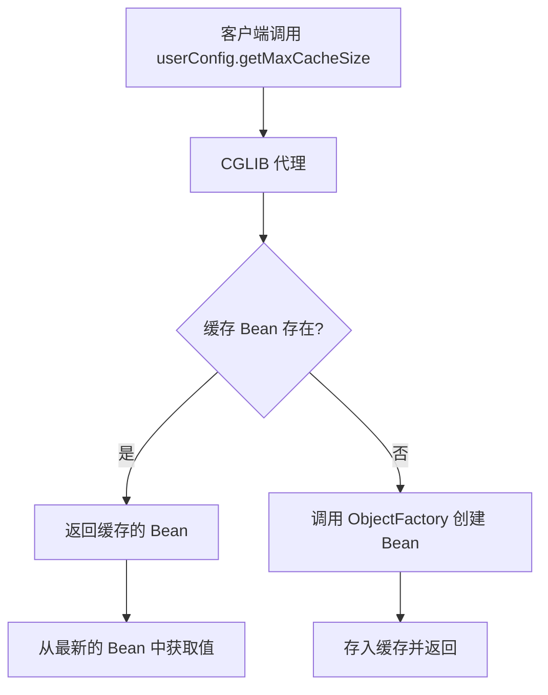
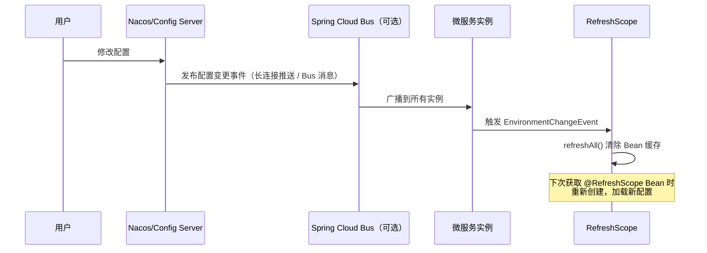

# 配置热刷新原理深度解析

候选人小林在字节面试微服务配置管理时，面试官问："生产环境里想改一个配置参数但不想重启服务，你们怎么实现的？"

小林说："用 @RefreshScope..." 面试官追问："@RefreshScope 的原理是什么？为什么加了注解后配置就能热刷新？"

小林说："就是重新加载配置吧..." 面试官继续追问："那加了 @RefreshScope 的 Bean，和没加的有什么区别？Bean 的生命周期发生了什么变化？"

小林答不上来。

面试官又问："那你遇到过配置改了但没生效的情况吗？什么场景下会失效？"

小林彻底卡住。

【面试官心理】

这道题我用来测试候选人对 Spring 生命周期和 Spring Cloud 上下文的理解深度。知道 @RefreshScope 名字的占 60%，能解释原理的占 30%，能说出边界条件和失效场景的只有 10%。生产环境中，配置热刷新失效是最常见的坑之一，很多候选人没踩过这个坑，所以答不上来。

## 一、问题的起源：配置刷新 ≠ Bean 重建 🔴

### 1.1 为什么配置改了服务要重启？

在传统 Spring Boot 应用中，所有 Bean 在应用启动时一次性创建完成，配置值在创建时就已经"固化"到 Bean 中：

```java
@Component
public class UserConfig {
    @Value("${user.max-cache-size:100}")
    private int maxCacheSize;  // 这个值在 UserConfig Bean 创建时就被赋值了

    public UserConfig() {
        // 构造函数执行时，maxCacheSize 已经有了值
        // 即使后来改了配置文件，这个字段不会变
    }

    @PostConstruct
    public void init() {
        // 初始化时根据 maxCacheSize 创建缓存
        this.cache = new LRUCache<>(maxCacheSize);
    }
}
```

即使 Spring 容器重新加载了配置，这个已经创建的 Bean 和它的字段不会自动更新。这就是为什么传统模式下改配置需要重启。

### 1.2 最朴素的热刷新方案

```java
// 最简单的热刷新思路：重新创建 Bean
public class HotReloadBeanFactory {
    private Map<String, Object> beans = new HashMap<>();

    public Object getBean(String name) {
        return beans.get(name);
    }

    // 热刷新：销毁旧 Bean，重新创建
    public void refresh(String beanName) {
        Object oldBean = beans.remove(beanName);
        if (oldBean instanceof DisposableBean) {
            ((DisposableBean) oldBean).destroy();
        }
        Object newBean = createBean(beanName);
        beans.put(beanName, newBean);
    }
}
```

这个思路很简单，但 Spring 的 Bean 生命周期远比这复杂。@RefreshScope 就是 Spring Cloud 在这个思路上的工程化实现。

## 二、@RefreshScope 核心原理 🔴

### 2.1 Scope 的概念

在 Spring 中，`Scope` 决定了 Bean 的生命周期范围。常见的 Scope 有：

- `singleton`：整个容器中只有一个实例（默认）
- `prototype`：每次获取都创建一个新实例
- `request`：每个 HTTP 请求创建一个实例（Web 环境）
- `session`：每个 HTTP Session 创建一个实例（Web 环境）
- `refresh`：@RefreshScope 专用，Bean 可以被刷新重建

```java
// Spring 源码中的 Scope 接口
public interface Scope {
    Object get(String name, ObjectFactory<?> objectFactory);

    Object remove(String name);

    void registerDestructionCallback(String name, Runnable callback);

    String getConversationId();
}
```

### 2.2 @RefreshScope 注解定义

```java
@Target({ElementType.TYPE, ElementType.METHOD})
@Retention(RetentionPolicy.RUNTIME)
@Scope("refresh")
@Documented
public @interface RefreshScope {
    // proxiedMode 决定是使用 CGLIB 代理还是 JDK 动态代理
    // SCOPED_PROXY_MODE = ScopedProxyMode.TARGET_CLASS（默认）
    // 这意味着返回的是代理对象，实际对象在代理内部
}
```

### 2.3 代理模式的核心作用

@RefreshScope 默认使用 **CGLIB 代理**（`ScopedProxyMode.TARGET_CLASS`）。这个设计非常关键：



关键点：**代理对象持有了一个 ObjectFactory，每次调用都通过 ObjectFactory 获取最新的 Bean**。

### 2.4 源码解析

```java
// RefreshScope.java - Spring Cloud Context
public class RefreshScope extends AbstractScope implements Scope {

    private BeanLifecycleContextManagement beanLifecycleContextManagement;

    // ⭐ 核心方法：获取 Bean，如果缓存不存在则通过 ObjectFactory 创建
    @Override
    public Object get(String name, ObjectFactory<?> objectFactory) {
        // 先尝试从缓存获取
        BeanHolder<T> beanHolder = beans.get(name);
        if (beanHolder == null) {
            if (this.eagerlyDestroyBeans) {
                destroy(name);
            }
            // 缓存不存在，通过 ObjectFactory 创建
            // ObjectFactory 是 Spring 传入的，它的 create() 会重新执行 @Bean 方法
            beanHolder = new BeanHolder<>(objectFactory.getObject());
            this.beans.put(name, beanHolder);
        }
        return beanHolder.get();
    }

    // ⭐ 核心方法：清除所有缓存的 Bean
    // 配置变更时调用，所有 @RefreshScope Bean 下次获取时重新创建
    @Override
    public void refreshAll() {
        this.beans.clear();
    }

    // 销毁指定的 Bean
    @Override
    public Object remove(String name) {
        BeanHolder<?> beanHolder = this.beans.remove(name);
        if (beanHolder != null) {
            return beanHolder.get();
        }
        return null;
    }
}
```

```java
// ContextIdApplicationContextProvider.java
// 监听配置变更事件，触发 RefreshScope 刷新

@EventListener(public class ContextIdApplicationContextProvider {
    @Autowired
    private RefreshScope refreshScope;

    @EventListener(EnvironmentChangeEvent.class)
    public void onApplicationEvent(EnvironmentChangeEvent event) {
        // 当配置变更事件发生时，清除所有 @RefreshScope Bean 缓存
        // 下次获取时重新创建，加载新配置
        if (refreshScope != null) {
            log.info("配置变更，刷新 @RefreshScope Bean: {}",
                     event.getKeys());
            refreshScope.refreshAll();
        }
    }
}
```

## 三、配置广播流程 🔴

### 3.1 完整的配置刷新链路



### 3.2 Nacos 的长连接推送

Nacos 不依赖消息总线，它自己维护了和客户端的长连接：

```java
// Nacos 客户端订阅配置变更
// NacosConfigService.java

public void addListener(String dataId, String group, Listener listener) {
    // 内部维护一个长轮询任务
    // 每 30 秒检查一次配置是否有变更
    // 如果有变更，触发 listener 回调
    worker.addListeners(dataId, group, Collections.singleton(listener));
}

// ConfigFilterChainImpl.java
// 过滤器链，处理配置变更通知
public String[] getConfig(String dataId, String group, long timeoutMs) {
    // ...
}

// NacosContextRefresher.java
// Spring Cloud Alibaba 的配置刷新器
@Component
public class NacosContextRefresher {
    @Autowired
    private ConfigService configService;

    @PostConstruct
    public void init() {
        // 监听配置变更
        configService.addListener(dataId, group, new Listener() {
            @Override
            public void receiveConfigInfo(String configInfo) {
                // 收到配置变更通知
                applicationContext.publishEvent(
                    new RefreshEvent(this, null, "Nacos Config Change")
                );
            }
        });
    }
}
```

### 3.3 触发刷新的方式

**方式一：手动调用刷新接口**

```bash
# 刷新所有配置
curl -X POST http://localhost:8080/actuator/refresh

# 刷新指定服务的配置
curl -X POST http://localhost:8080/actuator/refresh?destination=user-service:8080

# Nacos Web 控制台
# 在 Nacos 控制台修改配置后，点击"发布"，勾选"是否推送配置变更"
```

**方式二：Git Webhook 自动触发**

```yaml
# Git 仓库配置 Webhook
# 当 master 分支有提交时，自动触发所有服务的 /actuator/refresh

# GitHub Webhook 配置：
# Payload URL: http://config-server/actuator/bus-refresh
# Content type: application/json
# Events: Push events
```

## 四、@ConfigurationProperties 的热刷新 🟡

### 4.1 优于 @Value 的方式

@Value 需要配合 @RefreshScope 才能热刷新，而 @ConfigurationProperties 可以更优雅地实现热刷新：

```java
// ✅ 推荐方式：使用 @ConfigurationProperties
@Component
@ConfigurationProperties(prefix = "user")
@Data
public class UserProperties {
    private int maxCacheSize = 100;
    private int tokenExpireMinutes = 30;
    private List<String> allowedOrigins = new ArrayList<>();
}

// 使用配置
@Service
public class UserService {
    @Autowired
    private UserProperties userProperties;  // 注入 Properties 对象

    public int getMaxCacheSize() {
        // 每次调用都从最新的 Properties 对象获取值
        return userProperties.getMaxCacheSize();
    }
}
```

### 4.2 Properties 刷新机制

```java
// ConfigurationPropertiesBeans.java
// Spring Cloud 自动为 @ConfigurationProperties Bean 添加刷新能力

@Configuration
@ConditionalOnClass(RefreshScope.class)
public class ConfigurationPropertiesBeans {
    @Autowired
    private BeanFactory beanFactory;

    // postProcessBeforeInitialization 中处理
    public Object postProcessBeforeInitialization(Object bean, String beanName) {
        if (bean instanceof ConfigurationProperties) {
            // 如果是 @ConfigurationProperties Bean
            // 且当前上下文在刷新中
            if (beanFactory instanceof ListableBeanFactory) {
                // 标记这个 Bean 需要在配置刷新时重新绑定
            }
        }
        return bean;
    }
}

// ConfigurationPropertiesRebinder.java
// 刷新时重新绑定配置值
public class ConfigurationPropertiesRebinder {
    @Autowired
    private ConfigurationPropertiesBeans beans;

    public void rebind() {
        for (String beanName : beans.getBeanNames()) {
            rebind(beanName);
        }
    }

    public boolean rebind(String beanName) {
        // 销毁旧的 Properties Bean
        // 重新创建，并绑定最新的配置值
    }
}
```

:::tip 💡
@ConfigurationProperties 的热刷新机制和 @RefreshScope 不同：@RefreshScope 是"销毁并重建整个 Bean"，而 @ConfigurationProperties 是"重新绑定配置值"。对于纯配置类（只有 getter/setter，没有状态），@ConfigurationProperties 的方式性能更好。
:::

## 五、热刷新失效的常见场景 🔴

### ❌ 场景一：静态字段不刷新

```java
// ❌ 错误：静态字段在类加载时就确定了，不会随配置刷新而改变
@Component
@RefreshScope
public class UserConfig {
    private static int MAX_SIZE;  // 静态字段
    private int instanceField;    // 实例字段，可以刷新

    @Value("${user.max-cache-size:100}")
    public void setMaxSize(int maxSize) {
        MAX_SIZE = maxSize;  // 赋值给静态字段
    }
}

// ❌ 使用
public class UserService {
    public void process() {
        int size = UserConfig.MAX_SIZE;  // 永远是旧值
    }
}

// ✅ 正确做法
@Component
@RefreshScope
public class UserConfig {
    private int maxCacheSize;

    @Value("${user.max-cache-size:100}")
    public void setMaxCacheSize(int maxCacheSize) {
        this.maxCacheSize = maxCacheSize;
    }

    public static int getMaxCacheSize(UserConfig config) {
        return config.getMaxCacheSize();
    }
}
```

### ❌ 场景二：@PostConstruct 初始化只执行一次

```java
@Component
@RefreshScope
public class CacheConfig {
    private Cache cache;

    @Value("${cache.max-size:1000}")
    private int maxSize;

    @PostConstruct
    public void init() {
        // 这个方法只在 Bean 首次创建时执行
        // Bean 被销毁重建时会重新执行
        // 但如果只是配置值变了，Bean 没重建，这个方法不会重新执行
        this.cache = new LRUCache<>(maxSize);
    }

    // ✅ 正确做法：使用 getter 懒加载
    public Cache getCache() {
        if (this.cache == null) {
            this.cache = new LRUCache<>(maxSize);
        }
        return this.cache;
    }
}
```

### ❌ 场景三：构造函数中的配置值被"固化"

```java
// ❌ 错误：配置值在构造函数中固化
@Component
@RefreshScope
public class UserConfig {
    private final int maxCacheSize;
    private final Cache cache;

    public UserConfig(@Value("${user.max-cache-size:100}") int maxSize) {
        this.maxCacheSize = maxSize;  // 构造函数执行时赋值
        this.cache = new LRUCache<>(this.maxCacheSize);  // 永远不变
    }
}

// ✅ 正确：使用 setter 或懒加载
@Component
@RefreshScope
public class UserConfig {
    private int maxCacheSize;

    @Value("${user.max-cache-size:100}")
    public void setMaxCacheSize(int maxCacheSize) {
        this.maxCacheSize = maxCacheSize;
    }

    public Cache getCache() {
        return new LRUCache<>(this.maxCacheSize);  // 每次调用都是最新的
    }
}
```

### ❌ 场景四：Bean 不在 @RefreshScope 内

```java
// ❌ 错误：使用 @ConfigurationProperties 但忘了启用刷新能力
@Configuration
@EnableConfigurationProperties(UserProperties.class)
public class Config {
    // 缺少这个才能启用热刷新
}

// ✅ 正确：需要 Spring Cloud 的 ConfigurationPropertiesRebinder
@SpringCloudApplication
@EnableDiscoveryClient
public class Application {
    // Spring Cloud 应用自动启用配置刷新能力
}
```

## 六、生产最佳实践 🟡

### 6.1 配置变更的幂等性

```java
// 配置变更回调可能触发多次，需要保证幂等性
@RefreshScope
@Component
public class UserProperties {
    private volatile int maxCacheSize = 100;

    @Value("${user.max-cache-size:100}")
    public void setMaxCacheSize(int maxSize) {
        // volatile 保证可见性
        this.maxCacheSize = maxSize;
        // 触发缓存重建
        rebuildCache();
    }

    private void rebuildCache() {
        // 幂等操作：检查是否真的需要重建
        Cache newCache = new LRUCache<>(this.maxCacheSize);
        // 替换引用
    }
}
```

### 6.2 监控配置刷新事件

```java
// 监听配置刷新事件，便于监控和排障
@Component
public class RefreshEventListener {
    @EventListener
    public void onRefresh(RefreshEvent event) {
        log.info("配置刷新触发，变更的 keys: {}", event.getKeys());
        // 发送监控指标
        // 发送告警通知
    }

    @EventListener
    public void onEnvironmentChange(EnvironmentChangeEvent event) {
        log.info("环境变量变更: {}", event.getKeys());
    }
}
```

【面试官心理】

问到配置热刷新这道题，我会从 @RefreshScope 的基本用法开始，逐步深入到代理模式、生命周期、失效场景。能说出基本原理的占 60%，能解释 CGLIB 代理和 ObjectFactory 的占 30%，能列举所有失效场景并给出正确写法的只有 10%。这道题是区分"用过"和"真正理解"的分水岭。
