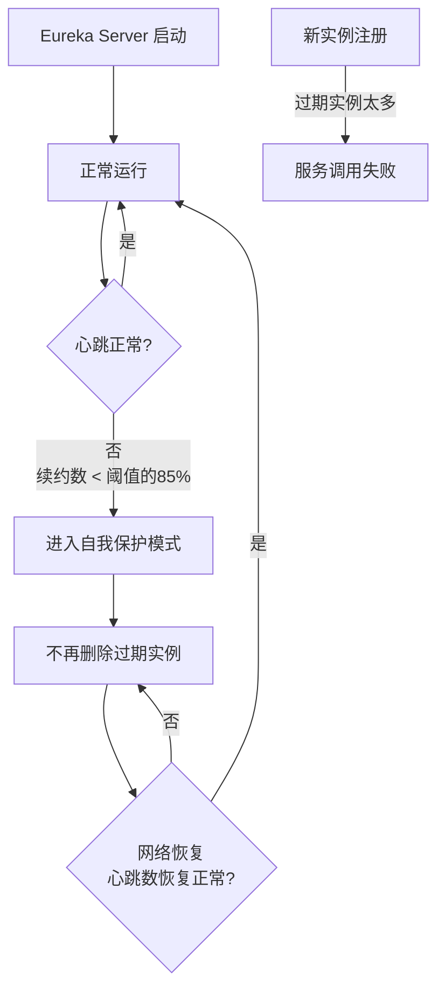

# Eureka 自我保护机制

候选人小王在面试字节基础架构团队时，面试官问："生产环境里 Eureka 注册中心突然告警，说有大批量服务实例被标记为不健康，但实际上这些服务都是正常的。你遇到过这种情况吗？知道什么是 Eureka 的自我保护机制吗？"

小王说："好像 Eureka 有一个保护模式..." 面试官追问："那触发条件是什么？多少比例的心跳没收到才会触发？"

小王说："应该是 85% 吧..." 面试官继续追问："为什么 Eureka 要设计自我保护？它在保护什么？"

小王彻底卡住。

【面试官心理】

这道题我用来测试候选人对 Eureka 生产环境行为的理解。自我保护是 Eureka 最独特的设计，也是生产环境中最容易引发困惑的地方。知道有这个机制的占 60%，能说出触发条件的占 30%，能解释设计原理和生产影响的只有 15%。这道题能筛选出真正在生产环境运维过 Eureka 的候选人。

## 一、问题的起源：网络分区的坑 🔴

### 1.1 网络分区场景

想象这样一个场景：

```
某机房网络故障，导致：
- Eureka Server 节点之间网络中断
- Eureka Client 和 Eureka Server 之间网络中断

但实际上：
- 微服务实例本身都在正常运行
- 实例之间的 RPC 调用也正常
- 只是它们和 Eureka Server 之间的"心跳"断了
```

如果没有自我保护，Eureka 会认为所有心跳断了的实例都"挂了"，然后从注册表中删除它们。

结果就是：** Eureka 把所有活着的实例都从注册表中删掉了**。

### 1.2 自我保护的核心思想

Eureka 的自我保护机制：**宁可保留不该保留的（已下线的实例），也不要删除不该删除的（还在运行的实例）**。

```
场景：网络分区发生
  ↓
Eureka Server 收不到心跳
  ↓
按照正常逻辑，应该删除超时实例
  ↓
触发自我保护评估
  ↓
如果心跳丢失比例 > 15%（即 renewalPercentThreshold < 0.85）
  ↓
进入自我保护模式：不再删除任何实例
  ↓
即使实例真的挂了，也保留在注册表中
  ↓
直到网络恢复，心跳恢复正常，退出自我保护
```

## 二、触发机制源码解析 🔴

### 2.1 核心参数

```java
// 客户端续约配置
eureka.instance.lease-renewal-interval-in-seconds=30      // 心跳间隔：30秒
eureka.instance.lease-expiration-duration-in-seconds=90   // 过期时间：90秒

// 服务端自我保护配置
eureka.server.enable-self-preservation=true               // 是否开启自我保护（默认 true）
eureka.server.renewal-percent-threshold=0.85              // 触发阈值：85%

// ExpectedRenewalsPerMinute 计算逻辑：
// 如果有 100 个客户端实例
// 每 30 秒续约一次
// 那么每分钟应该有 100 * 2 = 200 次续约
// 85% 阈值意味着：每分钟续约数 < 200 * 0.85 = 170 时，触发自我保护
```

### 2.2 源码解析

```java
// AbstractInstanceRegistry.java - Eureka 服务端注册表核心

// 1. 续约方法：每次收到客户端心跳时调用
public boolean renew(String appName, String id, String overriddenStatus,
                     boolean isReplication) {
    // 统计每分钟续约次数（用于自我保护评估）
    renewsLastMin.increment(appName, id);

    // 续约的核心逻辑
    // 如果租约不存在，返回 false
    // 如果存在，更新 lastUpdateTimestamp

    // 2. 自我保护评估：是否低于阈值
    // numberOfRenewsPerMinThreshold = expectedRenewalsPerMinute * 0.85
    // expectedRenewalsPerMinute = 实例数量 * 2（每分钟理论续约次数）
    if (!isReplication) {
        // 判断是否应该进入自我保护
        return triggerOnDemandUpdate();
    }
    return true;
}

// 2. 自我保护评估任务：每 15 秒执行一次
// EvictionTask.java
public final class EvictionTask extends AbstractRegionEvictionTask {
    @Override
    public EvictionTaskValue execute() {
        // 计算应该驱逐多少实例
        // 如果启用了自我保护，且心跳数低于阈值，则不驱逐任何实例
        if (!registry.isLeaseExpirationEnabled()) {
            logger.debug("Lease expiration is disabled");
            return null;
        }

        // 正常情况下，计算过期的租约并驱逐
        List<InstanceResource> expiredLease = registry.getExpiredLeases();

        // 关键判断：如果开启了自我保护，且心跳数不足
        // 则不执行驱逐
        if (isAboveThreshold()) {
            // 自我保护模式：缩小驱逐范围，只驱逐少量
            int evictionSize = (int) Math.ceil(
                expiredLease.size() * evictionPercentThreshold
            );
            expiredLease = expiredLease.subList(0, evictionSize);
        }
        return new EvictionTaskValue(expiredLease);
    }
}

// 3. 是否进入自我保护的关键判断
protected boolean isAboveThreshold() {
    // 从 HeartbeatMonitor 获取每分钟续约数和阈值
    int numberOfRenewsPerMinThreshold = registry.getNumOfRenewsPerMinThreshold();
    int lastMinuteRenewals = registry.getLastMinuteRenews();

    // 续约数 < 阈值的 85% 时，返回 true，表示应该缩小驱逐
    // 即进入了自我保护模式
    return lastMinuteRenewals < numberOfRenewsPerMinThreshold * 0.85;
}
```

### 2.3 状态变化图



## 三、生产环境的自我保护 🔴

### 3.1 自我保护的表现

进入自我保护模式后，Eureka Server 的日志会输出：

```
EMERGENCY! EUREKA MAY BE INCORRECTLY CLAIMING INSTANCES ARE UP WHEN
THEY'RE NOT. RENEWALS ARE LESSER THAN THE THRESHOLD AND THUS THE
INSTANCES ARE NOT BEING EXPIRED AS THEY'RE (supposedly) HEALTHY.
```

这意味着：
1. **UI 上显示的实例数会比实际多**：已下线的实例仍然显示为 UP
2. **不会删除任何实例**：即使实例真的挂了，也不会从注册表中移除
3. **Eureka Server 日志持续告警**：直到心跳恢复正常

### 3.2 生产告警配置

```yaml
# application.yml
eureka:
  server:
    # 自我保护开关（生产建议开启）
    enable-self-preservation: true
    # 续约百分比阈值（默认 0.85）
    renewal-percent-threshold: 0.85
    # 每分钟续约数阈值更新间隔
    renewal-threshold-update-interval-ms: 15 * 60 * 1000  # 15分钟更新一次

  instance:
    # 心跳间隔
    lease-renewal-interval-in-seconds: 30
    # 租约过期时间
    lease-expiration-duration-in-seconds: 90

# 告警规则（配合 Prometheus/Grafana）
# 告警条件：Eureka Server 的 self-preservation-mode 持续为 true 超过 5 分钟
# 原因：可能存在网络分区或 Eureka Server 集群故障
```

### 3.3 退出自我保护

当心跳恢复正常后，Eureka 会自动退出自我保护：

1. 续约数恢复到阈值以上
2. `isAboveThreshold()` 返回 false
3. 后台清理任务恢复正常驱逐
4. 已下线的实例被正确清理

:::tip 💡
如果需要手动退出自我保护（用于紧急场景），可以通过 Eureka Server 的 Actuator 端点：
```bash
curl -X PUT http://eureka-server:8761/actuator/revokeLease?appId=APP_ID&instanceId=INSTANCE_ID
```
或者在控制台页面点击 "EMERGENCY" 按钮强制退出自我保护（生产环境慎用）。
:::

## 四、Eureka vs Nacos 健康检查设计 🟡

| 维度 | Eureka | Nacos |
| --- | --- | --- |
| 健康检查方式 | Client 报告（心跳） | Client 报告 + Server 主动探测 |
| 临时实例 | 不支持 | 支持（ephemeral=true） |
| 永久实例 | 默认 | 支持（ephemeral=false） |
| 自我保护 | 有（可能保留已下线实例） | 无（Nacos CP 模式下会立即删除） |
| 网络分区处理 | 保护模式，不删除实例 | CP 模式下拒绝写入，AP 模式下异步同步 |
| 健康状态同步 | 延迟最多 30 秒 | 实时或准实时 |

### Nacos 的处理方式

Nacos 在 AP 模式下类似于 Eureka，实例下线后会在下次心跳检测时被移除。在 CP 模式下，如果 Leader 节点故障，会重新选主，这个过程中会拒绝服务注册和心跳，直到新的 Leader 选出。

```java
// Nacos CP 模式的 Raft 协议
// 临时实例：心跳断了立即删除（类似 Eureka 默认行为）
// 永久实例：注册到 Leader，Raft 同步，强一致

// CP 模式下，如果 Leader 挂了
// Nacos 会进行 Leader 选举
// 选举期间（通常几十毫秒到几秒）：
// - 服务注册可能失败
// - 心跳可能丢失
// 选举完成后，集群恢复服务
```

## 五、常见翻车现场 🔴

### ❌ 翻车点一：误以为服务正常但 Eureka 认为是 DOWN

```yaml
# ❌ 错误配置：心跳间隔太长
eureka.instance.lease-renewal-interval-in-seconds: 60
eureka.instance.lease-expiration-duration-in-seconds: 90
# 问题：服务端每 90 秒才认为过期，但心跳间隔 60 秒，
# 在高负载时，可能 2 个心跳周期（120 秒）才发一次，
# 导致服务被误判为过期下线

# ✅ 正确配置：过期时间 = 心跳间隔 * 2
eureka.instance.lease-renewal-interval-in-seconds: 30
eureka.instance.lease-expiration-duration-in-seconds: 90
```

### ❌ 翻车点二：服务重启时触发自我保护

大批量服务实例同时重启时，会出现大量心跳超时，触发自我保护：

```java
// 问题分析：
// 100 个实例同时重启
// 重启时间假设 30 秒
// 期间 Eureka Server 收不到这 100 个实例的心跳
// 如果其他 900 个实例的心跳正常
// 那么：renewalPercentThreshold = 1000 / 1000 = 1.0（100%）
// 即便有 100 个心跳丢失，只要其他 900 个正常，也不会触发自我保护

// 但如果只有 50 个实例，突然重启 50 个：
// 续约数从 50 * 2 = 100/分钟 降到 0
// renewalPercentThreshold = 50 / 100 = 0.5 < 0.85
// 触发自我保护！
```

:::warning ⚠️
大批量重启服务时，建议：
1. 分批重启，每批间隔至少 2 分钟
2. 或者关闭自我保护（`eureka.server.enable-self-preservation=false`），用其他机制保证服务发现正确性
3. 或者改用 Nacos，通过健康检查机制避免误判
:::

### ❌ 翻车点三：测试环境误开自我保护

测试环境实例数量少，自我保护阈值计算不准确：

```
测试环境：只有 3 个微服务实例
每分钟理论续约数 = 3 * 2 = 6
触发阈值 = 6 * 0.85 = 5.1（约等于 5）

只要有 1 个实例心跳丢失：
续约数 = 5 / 6 = 83.3% < 85%
触发自我保护！
```

【面试官心理】

这道题我通常从生产告警场景引入，看候选人是否真正运维过 Eureka。能说出自我保护触发条件的占 40%，能解释为什么这么设计的占 25%，能说清楚生产避坑的只有 10%。Eureka 的自我保护是它最独特也最容易被误解的设计，能把这个讲清楚的候选人，通常对分布式系统的 CAP 理论有实际的理解。
