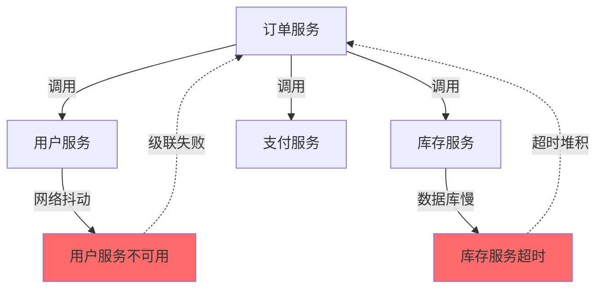
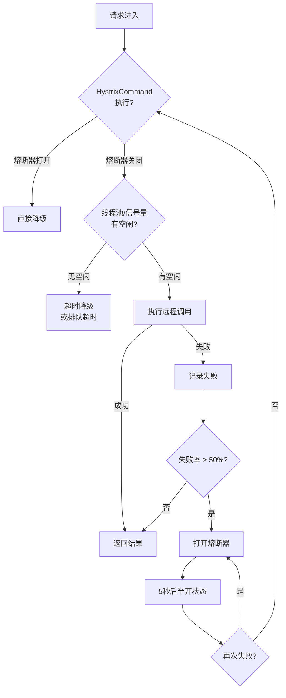

# Feign 重试与降级机制

候选人小周在面试美团订单团队时，面试官问："Feign 调用失败时怎么处理？fallback 和 fallbackFactory 有什么区别？"

小周说："可以用 fallback..." 面试官追问："fallback 能获取到异常信息吗？如果需要知道为什么降级了，该用哪个？"

小周说："应该用 fallback..." 面试官继续追问："Feign 的重试机制是什么？Ribbon 的重试和 Hystrix 的重试有什么区别？"

小周支支吾吾答不上来。

面试官又问："如果需要区分不同异常做不同的降级策略，该怎么设计？"

小赵彻底卡住。

【面试官心理】

这道题我用来测试候选人对 Feign 容错机制的理解。fallback 和 fallbackFactory 是 Feign 最常用的容错手段，但很多人只知道 fallback，不知道 fallbackFactory 能获取异常信息。重试和降级的配合使用，更是生产环境必备的技能。能区分 fallback 和 fallbackFactory 的占 50%，能说出重试机制和生产避坑的只有 15%。

## 一、为什么需要降级 🔴

### 1.1 微服务调用的脆弱性



一个服务不可用，可能导致调用方线程堆积、请求超时，最终引发整个系统雪崩。

### 1.2 降级的核心思想

降级的核心：**当远程调用不可用时，返回一个"退而求其次"的默认响应**，而不是让请求失败或无限等待。

```java
// ❌ 没有降级：服务不可用时抛出异常
@Service
public class OrderService {
    @Autowired
    private UserClient userClient;

    public Order getOrder(Long orderId) {
        Order order = orderRepository.findById(orderId);
        User user = userClient.getUser(order.getUserId());  // 可能抛出异常
        order.setUser(user);
        return order;
    }
}

// ✅ 有降级：服务不可用时返回默认用户
@Service
public class OrderService {
    @Autowired
    private UserClient userClient;

    public Order getOrder(Long orderId) {
        Order order = orderRepository.findById(orderId);
        User user = userClient.getUser(order.getUserId());  // 不抛异常
        if (user == null) {
            user = User.DEFAULT_USER;  // 降级返回
        }
        order.setUser(user);
        return order;
    }
}
```

## 二、Feign 降级：fallback vs fallbackFactory 🔴

### 2.1 fallback：简单降级

```java
// 1. 定义降级类（实现 Feign 客户端接口）
@Component
public class UserClientFallback implements UserClient {

    @Override
    public User getUser(Long id) {
        // 服务不可用时，返回默认用户
        User user = new User();
        user.setId(-1L);
        user.setName("默认用户");
        user.setStatus("降级返回");
        return user;
    }

    @Override
    public User createUser(UserRequest request) {
        // 返回一个默认的创建结果
        User user = new User();
        user.setId(-1L);
        user.setStatus("降级-创建失败");
        return user;
    }
}

// 2. 在 @FeignClient 中指定 fallback
@FeignClient(
    name = "user-service",
    fallback = UserClientFallback.class  // 指定降级类
)
public interface UserClient {
    @RequestMapping(method = RequestMethod.GET, path = "/user/{id}")
    User getUser(@PathVariable("id") Long id);

    @RequestMapping(method = RequestMethod.POST, path = "/user/create")
    User createUser(@RequestBody UserRequest request);
}
```

### 2.2 fallbackFactory：带异常信息的降级

```java
// 1. 定义 FallbackFactory
@Component
public class UserClientFallbackFactory
    implements FallbackFactory<UserClient> {

    @Autowired
    private Logger logger;

    @Override
    public UserClient create(Throwable cause) {
        // ⭐ 关键：cause 就是 Feign 调用失败的原因
        return new UserClient() {
            @Override
            public User getUser(Long id) {
                logger.error("调用 user-service 失败，userId={}, 原因={}",
                    id, cause.getMessage());

                // 根据不同的异常类型，返回不同的降级策略
                if (cause instanceof FeignException) {
                    FeignException fe = (FeignException) cause;
                    if (fe.status() == 404) {
                        // 404：用户不存在
                        return User.NOT_FOUND_USER;
                    } else if (fe.status() == 503) {
                        // 503：服务不可用
                        return User.SERVICE_UNAVAILABLE_USER;
                    }
                } else if (cause instanceof TimeoutException) {
                    // 超时
                    return User.TIMEOUT_USER;
                }

                return User.DEFAULT_USER;
            }

            @Override
            public User createUser(UserRequest request) {
                logger.error("创建用户失败，原因={}", cause.getMessage());
                return User.createFailedUser(request.getName());
            }
        };
    }
}

// 2. 在 @FeignClient 中指定 fallbackFactory
@FeignClient(
    name = "user-service",
    fallbackFactory = UserClientFallbackFactory.class  // 指定 FallbackFactory
)
public interface UserClient {
    // ...
}
```

### 2.3 fallback vs fallbackFactory 对比

| 维度 | fallback | fallbackFactory |
| --- | --- | --- |
| 获取异常信息 | ❌ 不能 | ✅ 可以 |
| 记录日志 | ❌ 无法记录具体原因 | ✅ 可以记录完整异常信息 |
| 异常分类降级 | ❌ 无法区分 | ✅ 可以根据异常类型返回不同降级策略 |
| 代码复杂度 | 简单 | 稍复杂 |
| 使用场景 | 简单降级，所有异常返回相同结果 | 精细化降级，不同异常不同处理 |

:::tip 💡
生产环境强烈建议使用 fallbackFactory，因为它能帮助你排查问题、进行差异化降级。比如 404 返回"用户不存在"的降级结果，503 返回"服务繁忙"的降级结果，两者用户体验完全不同。
:::

## 三、Feign 重试机制 🔴

### 3.1 重试 vs 降级的区别

```
重试（Retry）：调用失败后，等待一段时间，再次尝试调用
  ↓ 失败
降级（Fallback）：调用失败后，不再重试，返回默认结果
```

```
重试适用场景：服务临时抖动、偶发的网络丢包
降级适用场景：服务彻底不可用、长时间故障
```

### 3.2 Feign 内置重试机制

```java
// Retryer.java - Feign 的重试接口
public interface Retryer extends Cloneable {
    // 继续重试：重置计数器，准备下一次重试
    void continueOrPropagate(RetryableException e);

    // 默认实现：最多重试 5 次
    public static class Default implements Retryer {
        private final int maxAttempts;
        private final long period;      // 重试间隔基准
        private final long maxPeriod;   // 最大重试间隔

        public Default() {
            this(100, 1000, 5);  // 100ms 基准，最大 1s，最多 5 次
        }

        @Override
        public void continueOrPropagate(RetryableException e) {
            if (this.attempt++ >= this.maxAttempts) {
                // 超过最大重试次数，抛出异常（触发降级）
                throw e;
            }

            // 计算下一次重试的间隔（指数退避 + 随机抖动）
            long interval = (long) (this.period * Math.pow(1.5, this.attempt - 1));
            interval = Math.min(interval, this.maxPeriod);

            // 等待后继续重试
            try {
                Thread.sleep(interval);
            } catch (InterruptedException ignored) {
                Thread.currentThread().interrupt();
            }
        }
    }
}
```

### 3.3 重试条件配置

```yaml
# application.yml
feign:
  client:
    config:
      default:
        # 默认不重试
        retryer: feign.retryer.Retryer$NeverRetryer
      user-service:
        # 针对特定服务配置重试
        retryer: myRetryer

# Ribbon 重试配置（和 Feign 重试独立）
user-service:
  ribbon:
    # 同一实例最多重试 0 次（默认）
    MaxAutoRetries: 0
    # 最多切换 1 个实例重试
    MaxAutoRetriesNextServer: 1
    # 连接超时
    ConnectTimeout: 3000
    # 读取超时
    ReadTimeout: 5000
```

### 3.4 重试与幂等性

```java
// ❌ 危险：非幂等操作重试会导致数据问题
@FeignClient(name = "payment-service")
public interface PaymentClient {
    @RequestMapping(method = RequestMethod.POST, path = "/payment/deduct")
    void deduct(@RequestBody DeductRequest request);
}

// 如果网络超时触发重试，可能扣款两次！

// ✅ 正确：使用唯一订单号保证幂等
@FeignClient(name = "payment-service")
public interface PaymentClient {
    @RequestMapping(method = RequestMethod.POST, path = "/payment/deduct")
    Result deduct(
        @RequestHeader("X-Idempotency-Key") String idempotencyKey,
        @RequestBody DeductRequest request
    );
}

@Service
public class PaymentService {
    public void pay(Order order) {
        String idempotencyKey = order.getId() + "-" + order.getVersion();
        paymentClient.deduct(idempotencyKey, buildRequest(order));
    }
}
```

## 四、Hystrix 集成 🟡

### 4.1 HystrixFeign

```java
// 启用 Hystrix
feign:
  hystrix:
    enabled: true

// HystrixFeign.builder() 会自动添加：
// - 线程池隔离（或信号量隔离）
// - 超时控制
// - 熔断器
// - Fallback 支持

// 隔离策略配置
hystrix:
  command:
    default:
      execution:
        isolation:
          strategy: THREAD  # 线程池隔离（默认）
          # 或者：SEMAPHORE（信号量隔离，开销更小）
          thread:
            timeoutInMilliseconds: 5000
          semaphore:
            maxConcurrentRequests: 10
      circuitBreaker:
        requestVolumeThreshold: 20       # 熔断器最小请求数
        sleepWindowInMilliseconds: 5000  # 熔断器打开时间
        errorThresholdPercentage: 50     # 错误率阈值
```

### 4.2 Hystrix 命令执行流程



## 五、生产最佳实践 🟡

### 5.1 统一的降级策略设计

```java
// 定义统一的降级结果枚举
public enum FallbackResult {
    // 404：资源不存在
    NOT_FOUND(404, "资源不存在"),
    // 500：服务端错误
    SERVER_ERROR(500, "服务端错误，请稍后重试"),
    // 503：服务不可用
    SERVICE_UNAVAILABLE(503, "服务繁忙，请稍后重试"),
    // 超时
    TIMEOUT(504, "请求超时，请稍后重试"),
    // 默认降级
    DEFAULT(null, "系统繁忙");

    private final Integer httpStatus;
    private final String message;

    // 返回统一格式的降级响应
    public Map<String, Object> toResponse(String path) {
        return Map.of(
            "code", httpStatus != null ? httpStatus : 500,
            "message", message,
            "path", path,
            "timestamp", System.currentTimeMillis()
        );
    }
}

// FallbackFactory 中根据异常类型选择降级策略
@Component
public class GlobalFallbackFactory<T> implements FallbackFactory<T> {
    @Override
    public T create(Throwable cause) {
        FallbackResult result = determineResult(cause);
        return createFallback(result);
    }

    private FallbackResult determineResult(Throwable cause) {
        if (cause instanceof FeignException.NotFound) {
            return FallbackResult.NOT_FOUND;
        } else if (cause instanceof FeignException.ServiceUnavailable) {
            return FallbackResult.SERVICE_UNAVAILABLE;
        } else if (cause instanceof TimeoutException) {
            return FallbackResult.TIMEOUT;
        } else if (cause instanceof FeignException) {
            return FallbackResult.SERVER_ERROR;
        }
        return FallbackResult.DEFAULT;
    }

    private T createFallback(FallbackResult result) {
        // 根据 result 返回对应的降级对象
        // 使用 Java Proxy 在运行时创建代理对象
        return (T) Proxy.newProxyInstance(
            targetClass().getClassLoader(),
            new Class<?>[] { targetClass() },
            (proxy, method, args) -> result.toResponse(method.getName())
        );
    }
}
```

### 5.2 降级与监控

```java
// 降级监控指标
@Aspect
@Component
public class FallbackMonitorAspect {
    @Autowired
    private MeterRegistry meterRegistry;

    @Around("execution(* *..*Fallback.*(..))")
    public Object monitorFallback(ProceedingJoinPoint pjp) throws Throwable {
        // 记录降级次数
        meterRegistry.counter("feign.fallback.total",
            "service", extractServiceName(pjp.getTarget().getClass().getName()),
            "method", pjp.getSignature().getName()
        ).increment();

        return pjp.proceed();
    }
}
```

## 六、常见翻车现场 🔴

### ❌ 翻车点一：fallback 和 fallbackFactory 混用导致不生效

```java
// ❌ 错误：同时指定了 fallback 和 fallbackFactory
@FeignClient(
    name = "user-service",
    fallback = UserClientFallback.class,         // 会被忽略！
    fallbackFactory = UserClientFallbackFactory.class  // 这个生效
)
public interface UserClient {}

// ✅ 正确：只使用其中一个
@FeignClient(
    name = "user-service",
    fallbackFactory = UserClientFallbackFactory.class
)
public interface UserClient {}
```

### ❌ 翻车点二：降级类没有加 @Component 注解

```java
// ❌ 错误：降级类没有注册到 Spring 容器
public class UserClientFallback implements UserClient {}

// ✅ 正确：降级类必须是 Spring Bean
@Component
public class UserClientFallback implements UserClient {}

// ✅ 也正确：通过 @FeignClient 的 factory 属性指定
@FeignClient(
    name = "user-service",
    fallbackFactory = UserClientFallbackFactory.class
)
public interface UserClient {}
```

### ❌ 翻车点三：Hystrix 超时时间比 Feign 超时时间短

```yaml
# ❌ 错误配置：Hystrix 超时比 Feign 短
feign:
  client:
    config:
      default:
        read-timeout: 10000   # Feign 读取超时 10 秒

hystrix:
  command:
    default:
      execution:
        isolation:
          thread:
            timeoutInMilliseconds: 5000  # Hystrix 超时 5 秒
# 结果：Feign 还没超时，Hystrix 就超时了
# 降级的是 Hystrix，而不是 Feign

# ✅ 正确：Hystrix 超时应该比 Feign 超时长
feign:
  client:
    config:
      default:
        read-timeout: 5000    # Feign 读取超时 5 秒

hystrix:
  command:
    default:
      execution:
        isolation:
          thread:
            timeoutInMilliseconds: 10000  # Hystrix 超时 10 秒
```

:::warning ⚠️
Spring Cloud Greenwich 之后，Hystrix 已不再维护，建议迁移到 Sentinel。Hystrix 和 Feign 的超时配置容易互相干扰，生产环境推荐使用 Sentinel 做统一的流量控制和熔断。
:::

【面试官心理】

这道题我通常从 fallback 和 fallbackFactory 的区别开始，逐步深入到重试机制、Hystrix 集成、生产避坑。能说出 fallbackFactory 优势的占 50%，能讲清楚重试和降级配合使用的占 30%，能设计统一降级策略的只有 10%。降级是微服务容错的核心手段，能把这些讲清楚的候选人，对生产稳定性有较深的理解。
