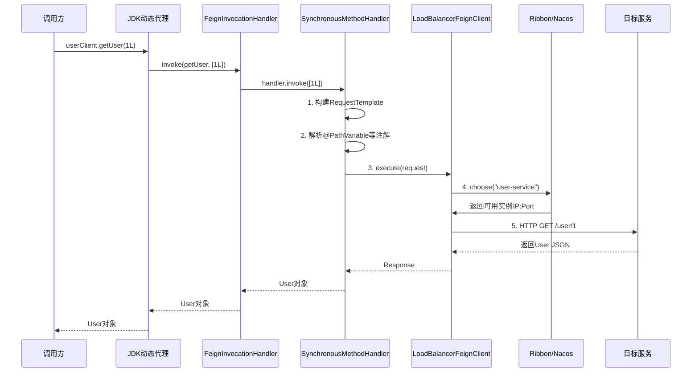

# Feign 远程调用原理

候选人小孙在面试字节微服务团队时，面试官问："Feign 的原理是什么？它是怎么把一个接口调用变成 HTTP 请求的？"

小孙说："Feign 是一个声明式的 HTTP 客户端..." 面试官追问："那 @FeignClient 注解标注的接口，是怎么变成实际 HTTP 请求的？"

小孙说："好像是动态代理..." 面试官继续追问："代理是怎么创建的？请求参数是怎么转换成 HTTP 请求体的？"

小孙支支吾吾答不上来。

面试官又问："Feign 和 Ribbon 是什么关系？Feign 的负载均衡是怎么实现的？"

小孙彻底卡住。

【面试官心理】

这道题我用来测试候选人对 Feign 底层原理的理解深度。Feign 是 Spring Cloud 中最常用的服务调用方式，但 90% 的候选人只会用注解，不知道它背后的动态代理、请求构建、超时配置的完整链路。能说出动态代理原理的占 30%，能讲清楚整个调用链路的只有 10%。这道题是区分"用过"和"理解过源码"的分水岭。

## 一、Feign 的本质：动态代理 🔴

### 1.1 最简单的 Feign 用法

```java
// 1. 定义 Feign 客户端接口
@FeignClient(name = "user-service", fallback = UserClientFallback.class)
public interface UserClient {

    @RequestMapping(method = RequestMethod.GET, path = "/user/{id}")
    User getUser(@PathVariable("id") Long id);

    @RequestMapping(method = RequestMethod.POST, path = "/user/create")
    User createUser(@RequestBody UserRequest request);
}

// 2. 使用接口调用（就像调用本地方法一样）
@Service
public class OrderService {
    @Autowired
    private UserClient userClient;

    public Order getOrderWithUser(Long orderId) {
        Order order = orderRepository.findById(orderId);
        User user = userClient.getUser(order.getUserId());  // 看起来像本地调用
        order.setUser(user);
        return order;
    }
}
```

### 1.2 为什么 Feign 用动态代理？

普通 HTTP 调用：

```java
// ❌ 传统方式：每个调用都要写完整的 HTTP 请求逻辑
@Service
public class UserService {
    public User getUser(Long id) {
        // 1. 构建 URL
        String url = "http://user-service/user/" + id;

        // 2. 发送 HTTP 请求
        HttpHeaders headers = new HttpHeaders();
        headers.setContentType(MediaType.APPLICATION_JSON);
        HttpEntity<String> entity = new HttpEntity<>(headers);

        // 3. 处理响应
        ResponseEntity<User> response = restTemplate.exchange(
            url,
            HttpMethod.GET,
            entity,
            User.class
        );

        return response.getBody();
    }
}
```

Feign 让我们用接口的方式调用远程服务：

```java
// ✅ Feign 方式：接口即调用
@FeignClient(name = "user-service")
public interface UserClient {
    @RequestMapping(method = RequestMethod.GET, path = "/user/{id}")
    User getUser(@PathVariable("id") Long id);
}

// 使用时就像调用本地方法
userClient.getUser(1L);  // 实际会发起 HTTP 请求
```

## 二、Feign 代理创建链路 🔴

### 2.1 @EnableFeignClients 扫描

```java
// FeignClientsRegistrar.java
// Spring 启动时扫描 @FeignClient 注解的接口

@Import(FeignClientsRegistrar.class)
@Configuration
@ConditionalOnClass(FeignClient.class)
public @interface EnableFeignClients {
    // 扫描的基础包路径
    String[] value() default {};
    String[] basePackages() default {};
    // 要扫描的类（更精确控制）
    Class<?>[] clients() default {};
}

// FeignClientsRegistrar 实现
public class FeignClientsRegistrar implements ImportBeanDefinitionRegistrar {
    @Override
    public void registerBeanDefinitions(AnnotationMetadata metadata,
                                        RegisterCallback callback) {
        // 1. 获取 @EnableFeignClients 注解的配置
        Map<String, Object> attrs = metadata.getAnnotationAttributes(
            EnableFeignClients.class.getName());

        // 2. 扫描 basePackages 下的所有 @FeignClient 接口
        registerFeignClients(attrs, callback);
    }

    private void registerFeignClients(Map<String, Object> attrs, ...) {
        // 获取要扫描的包路径
        String[] basePackages = getBasePackages(attrs);

        // 使用 ClassPathScanningCandidateComponentProvider 扫描
        // 找到所有标注了 @FeignClient 的接口
        for (String basePackage : basePackages) {
            Set<BeanDefinition> candidateComponents = scanner.findCandidates(...);
            for (BeanDefinition beanDefinition : candidateComponents) {
                // 注册为 Spring Bean
                registerFeignClient(config, beanDefinition);
            }
        }
    }
}
```

### 2.2 FeignClientFactoryBean 创建代理

```java
// FeignClientFactoryBean.java
// 每个 @FeignClient 接口由这个 FactoryBean 创建动态代理

@Component
public class FeignClientFactoryBean implements FactoryBean<Object>, ApplicationContextAware {
    private Class<?> type;
    private String name;          // 服务名：user-service
    private String url;           // 直接 URL（可选）
    private String path;          // 路径前缀
    private Class<?> fallback;    // 降级类

    @Override
    public Object getObject() {
        // ⭐ 核心：创建 Feign 客户端的动态代理

        // 1. 构建 Feign.Builder
        Feign.Builder builder = Feign.builder();

        // 2. 添加客户端：默认使用 LoadBalancerFeignClient（集成 Ribbon 负载均衡）
        builder.client(new LoadBalancerFeignClient(
            new DefaultFeignLoadBalancedConfiguration(),
            new SpringCloudLoadBalancerFactory(),
            new DefaultSpringCloudLoadBalancerFactory()
        ));

        // 3. 添加编码器/解码器
        builder.encoder(new SpringFormEncoder());
        builder.decoder(new ResponseEntityDecoder(new SpringDecoder()));

        // 4. 添加日志
        builder.logger(new Slf4jLogger(type));

        // 5. 添加 Contract：解析 @RequestMapping 等注解
        builder.contract(new SpringMvcContract());

        // 6. 构建 Feign 客户端（ReflectiveFeign）
        Feign.Builder feignBuilder = builder;
        target = HardcodedTarget<>(type, name, url);

        // 7. 创建动态代理
        return feignBuilder.target(target);
    }

    // 最终调用的方法
    public <T> T target(Class<T> feignClient, String url) {
        return build(feignClient, new HardcodedTarget<>(feignClient, name, url));
    }
}
```

### 2.3 ReflectiveFeign 动态代理机制

```java
// ReflectiveFeign.java - Feign 的动态代理实现

// 1. 创建 InvocationHandler
public <T> T newInstance(Target<T> target) {
    // 解析接口上的 @RequestMapping 注解，构建元数据
    Map<String, MethodHandler> nameToHandler = methodHandlerFactory.create(target);
    InvocationHandler handler = new FeignInvocationHandler(target, nameToHandler);

    // 2. JDK 动态代理：创建接口的代理对象
    T proxy = (T) Proxy.newProxyInstance(
        target.type().getClassLoader(),
        new Class<?>[] { target.type() },
        handler
    );

    return proxy;
}

// 3. InvocationHandler：方法调用拦截
class FeignInvocationHandler implements InvocationHandler {
    @Override
    public Object invoke(Object proxy, Method method, Object[] args) {
        // 4. 根据方法名找到对应的 MethodHandler
        MethodHandler handler = dispatch.get(method);

        // 5. 调用 SynchronousMethodHandler 执行实际 HTTP 请求
        return handler.invoke(args);
    }
}

// 6. SynchronousMethodHandler：实际执行 HTTP 请求
class SynchronousMethodHandler implements MethodHandler {
    @Override
    public Object invoke(Object[] argv) {
        // 6.1 构建请求模板
        RequestTemplate template = buildTemplate(argv);

        // 6.2 执行请求（通过 Client）
        Request request = template.request();
        Response response = client.execute(request, options);

        // 6.3 解码响应
        return decode(response);
    }
}
```

### 2.4 完整调用链路



## 三、请求构建过程 🔴

### 3.1 Contract 解析注解

```java
// SpringMvcContract.java - 解析 Spring MVC 注解
public class SpringMvcContract extends Contract {
    @Override
    protected void processAnnotationOnMethod(
        MethodMetadata data,
        Annotation methodAnnotation,
        Method method) {

        if (methodAnnotation instanceof RequestMapping) {
            RequestMapping mapping = (RequestMapping) methodAnnotation;

            // 解析 HTTP 方法
            data.template().method(
                String.valueOf(mapping.method()[0].name())
            );

            // 解析路径
            data.template().uri(
                resolve(mapping.value()[0], method)
            );

            // 解析 @RequestHeader 参数
            // 解析 @RequestParam 参数
            // 解析 @PathVariable 参数
            // 解析 @RequestBody 参数
        }
    }
}

// 例如：@RequestMapping(method = GET, path = "/user/{id}")
// 解析为模板：GET /user/{id}
```

### 3.2 请求参数处理

```java
// SynchronousMethodHandler.java
// 参数如何转换成 URL 查询参数和请求体

public Object invoke(Object[] argv) {
    RequestTemplate template = buildTemplate(argv);

    // 处理参数
    // @PathVariable -> 替换 URL 中的 {id}
    // @RequestParam -> 添加到 URL 查询参数
    // @RequestHeader -> 添加到请求头
    // @RequestBody -> 作为请求体

    return dispatcher.dispatch(template, argv);
}

// 参数替换示例
@FeignClient(name = "user-service")
public interface UserClient {
    // /user/123?name=zhang&age=25
    @RequestMapping(method = RequestMethod.GET, path = "/user/{id}")
    User getUser(
        @PathVariable("id") Long id,       // -> URL 路径参数
        @RequestParam("name") String name, // -> URL 查询参数
        @RequestHeader("X-Token") String token  // -> 请求头
    );
}
```

## 四、Feign 与 Ribbon 的集成 🔴

### 4.1 LoadBalancerFeignClient

```java
// LoadBalancerFeignClient.java - Feign 集成负载均衡
public class LoadBalancerFeignClient implements Client {
    private final LoadBalancer loadBalancer;

    @Override
    public Response execute(Request request, Request.Options options) {
        // 1. 从 URL 中提取服务名：http://user-service/user/1 -> user-service
        URL url = URL.parse(request.url());
        String clientName = url.getHost();

        // 2. 调用 Ribbon 的负载均衡器选择实例
        Server chosen = loadBalancer.chooseServer(clientName);

        // 3. 替换 URL 中的服务名为实际 IP:Port
        String uri = request.uri().toString()
            .replace(clientName, chosen.getHost() + ":" + chosen.getPort());

        // 4. 发送实际的 HTTP 请求
        Request modifiedRequest = Request.create(
            request.method(),
            uri,
            request.headers(),
            request.body()
        );
        return delegate.execute(modifiedRequest, options);
    }
}
```

### 4.2 Feign 超时配置

```yaml
# Feign 超时配置
feign:
  client:
    config:
      # 全局配置
      default:
        connect-timeout: 5000     # 连接超时：5秒
        read-timeout: 10000       # 读取超时：10秒
        logger-level: basic        # 日志级别
      # 针对特定服务配置
      user-service:
        connect-timeout: 3000     # user-service 专属配置
        read-timeout: 5000
  # 开启重试
  hystrix:
    enabled: true
```

```java
// 默认超时时间
public class Request.Options {
    public Options() {
        this(10 * 1000, 60 * 1000);  // 默认连接超时 10s，读取超时 60s
    }
}
```

## 五、常见翻车现场 🔴

### ❌ 翻车点一：FeignClient 接口和调用的方法参数名丢失

```java
// ❌ 错误：编译时参数名被擦除
@FeignClient(name = "user-service")
public interface UserClient {
    @RequestMapping(method = RequestMethod.GET, path = "/user/{id}")
    User getUser(@PathVariable Long id);  // 丢失参数名
}

// @PathVariable 需要指定 value
// 否则编译后没有参数名，Feign 无法知道参数对应哪个占位符

// ✅ 正确：明确指定参数名
@FeignClient(name = "user-service")
public interface UserClient {
    @RequestMapping(method = RequestMethod.GET, path = "/user/{id}")
    User getUser(@PathVariable("id") Long id);
}
```

### ❌ 翻车点二：Feign 和 Ribbon 默认重试机制

```java
// 默认情况下，Ribbon 的重试策略：
// - 同一实例最多重试 0 次
// - 所有实例重试次数为 1

// ❌ 容易忽略：当服务短暂不可用时，Ribbon 会自动重试
// 可能导致：
// - 幂等接口被重复调用
// - 非幂等接口产生副作用

// ✅ 正确：明确配置重试策略
@Configuration
public class FeignConfig {
    @Bean
    public Retryer feignRetryer() {
        // 不重试
        return new Retryer.NeverRetryer();
        // 或者：最多重试 3 次，每次失败后间隔 100ms 再试
        return new Retryer.Default(100, 1000, 3);
    }
}
```

### ❌ 翻车点三：没有指定 contextId 导致 Bean 覆盖

```java
// ❌ 错误：多个 FeignClient 指向同一个服务，Bean 名称冲突
@FeignClient(name = "user-service")
public interface UserClient {}

@FeignClient(name = "user-service")  // 同名，覆盖了上面的 Bean
public interface UserClient2 {}

// ✅ 正确：使用 contextId 区分
@FeignClient(name = "user-service", contextId = "userClient1")
public interface UserClient1 {}

@FeignClient(name = "user-service", contextId = "userClient2")
public interface UserClient2 {}
```

:::warning ⚠️
当服务名相同但不同用途时（如调用同一个服务的不同接口），一定要指定不同的 contextId，否则 Spring 容器只会注册一个 Bean。
:::

【面试官心理】

这道题我通常从动态代理开始，逐步深入到 Contract 解析、请求构建、负载均衡集成。能说出动态代理原理的占 40%，能讲清楚整个调用链路的占 20%，能回答重试机制和生产避坑的只有 10%。Feign 是 Spring Cloud 中最核心的组件之一，能把原理讲清楚的候选人，对 JDK 动态代理和 HTTP 客户端有较深的理解。
