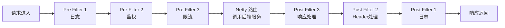

# Gateway 过滤器与路由断言

候选人小陈在面试快手网关团队时，面试官问："Gateway 的过滤器链执行顺序是怎样的？自定义过滤器的优先级怎么控制？"

小陈说："可以用 @Order 注解..." 面试官追问："@Order 和 GatewayFilter 的 Order 接口有什么区别？数字越小优先级越高还是越低？"

小陈说："应该是越小越高..." 面试官继续追问："Gateway 的路由断言有哪些？权重路由怎么配置？"

小陈支支吾吾答不上来。

面试官又问："那 Filter 链的 Pre 和 Post 是什么意思？它们分别对应什么场景？"

小陈彻底卡住。

【面试官心理】

这道题我用来测试候选人对 Gateway 过滤器链执行机制的深度理解。Gateway 的 Filter 链是网关的核心，理解了 Filter 链就理解了网关的灵魂。只配置过路由的占 80%，能说出 Filter 链执行顺序的占 40%，能自定义 GlobalFilter 并控制优先级的占 20%。过滤器链是区分"用过"和"理解"的分水岭。

## 一、过滤器链执行机制 🔴

### 1.1 过滤器链的本质

Gateway 的过滤器链本质上是一个**责任链模式（Chain of Responsibility）**，每个过滤器处理请求的某个切面：



**Pre Filter**：在请求转发到后端服务之前执行（处理请求）
**Post Filter**：在后端服务返回响应之后执行（处理响应）

### 1.2 过滤器链源码解析

```java
// FilteringWebHandler.java - 过滤器执行的核心类
public class FilteringWebHandler implements WebHandler {
    private final Route route;
    private final List<GatewayFilter> globalFilters;

    @Override
    public Mono<Void> handle(ServerWebExchange exchange) {
        // 1. 合并全局过滤器和路由局部过滤器
        List<GatewayFilter> allFilters = new ArrayList<>();
        allFilters.addAll(this.globalFilters);   // GlobalFilter
        allFilters.addAll(route.getFilters());   // GatewayFilter

        // 2. 按优先级排序（Order 越小越先执行）
        allFilters.sort(Comparator.comparingInt(GatewayFilter::getOrder));

        // 3. 构建过滤器链
        return new DefaultGatewayFilterChain(allFilters, 0).filter(exchange);
    }
}

// DefaultGatewayFilterChain.java - 责任链实现
public class DefaultGatewayFilterChain implements GatewayFilterChain {
    private final List<GatewayFilter> filters;
    private final int index;

    public Mono<Void> filter(ServerWebExchange exchange) {
        if (this.index >= this.filters.size()) {
            // 所有过滤器执行完毕，发送请求到后端
            return handleNow(exchange);
        }

        // 执行当前索引的过滤器
        GatewayFilter filter = this.filters.get(this.index);

        // 递归调用下一个过滤器
        return filter.filter(exchange,
            new DefaultGatewayFilterChain(this.filters, this.index + 1));
    }
}
```

### 1.3 优先级控制

```java
// Gateway 过滤器的 Order 来源有两种：

// 方式一：实现 Ordered 接口
@Component
public class MyFilter implements GlobalFilter, Ordered {
    @Override
    public Mono<Void> filter(ServerWebExchange exchange, GatewayFilterChain chain) {
        // 过滤器逻辑
        return chain.filter(exchange);
    }

    @Override
    public int getOrder() {
        return -100;  // 数字越小，优先级越高，越先执行
    }
}

// 方式二：使用 @Order 注解
@Component
@Order(-100)
public class AnotherFilter implements GlobalFilter {
    @Override
    public Mono<Void> filter(ServerWebExchange exchange, GatewayFilterChain chain) {
        return chain.filter(exchange);
    }
}

// 常见内置过滤器的优先级
/*
 * NettyRoutingFilter              Integer.MIN_VALUE  最先执行
 * NettyWriteResponseFilter        Integer.MIN_VALUE + 1
 * ForwardRoutingFilter            Integer.MIN_VALUE + 1
 * RouteToRequestUrlFilter        10000
 * LoadBalancerClientFilter       10101
 * WebsocketRoutingFilter         Integer.MAX_VALUE  最后执行
 */
```

:::tip 💡
Gateway 使用 `Comparator.comparingInt(GatewayFilter::getOrder)` 进行排序，数字越小排在越前面，也就是越先执行。如果两个 Filter 的 Order 相同，按照添加顺序执行。
:::

## 二、内置过滤器详解 🔴

### 2.1 请求过滤器

| 过滤器 | 功能 | 示例 |
| --- | --- | --- |
| AddRequestHeader | 添加请求头 | `AddRequestHeader=X-Gateway, Spring` |
| RemoveRequestHeader | 移除请求头 | `RemoveRequestHeader=X-Request-Id` |
| AddRequestParameter | 添加请求参数 | `AddRequestParameter=source, gateway` |
| RemoveRequestParameter | 移除请求参数 | `RemoveRequestParameter=debug` |
| SetRequestHeader | 设置请求头（覆盖） | `SetRequestHeader=X-Real-IP, 1.2.3.4` |
| SetPath | 修改请求路径 | `SetPath=/api/v2{path}` |
| StripPrefix | 去除路径前缀 | `StripPrefix=1`（去掉第一段路径） |

```yaml
# 路由配置示例
spring:
  cloud:
    gateway:
      routes:
        - id: user-service
          uri: lb://user-service
          predicates:
            - Path=/gateway/user/**
          filters:
            # 添加请求头
            - AddRequestHeader=X-Gateway, Gateway
            # 去除第一层路径前缀
            # /gateway/user/list -> /user/list
            - StripPrefix=1
            # 添加请求参数
            - AddRequestParameter=source, gateway
```

### 2.2 响应过滤器

| 过滤器 | 功能 | 示例 |
| --- | --- | --- |
| AddResponseHeader | 添加响应头 | `AddResponseHeader=X-Response-Time, 100ms` |
| RemoveResponseHeader | 移除响应头 | `RemoveResponseHeader=Server` |
| SetResponseHeader | 设置响应头（覆盖） | `SetResponseHeader=X-Real-IP, 1.2.3.4` |
| SetStatus | 设置 HTTP 状态码 | `SetStatus=UNAUTHORIZED` |
| RedirectTo | 重定向 | `RedirectTo=302, https://example.com` |

```yaml
# 响应头处理示例
spring:
  cloud:
    gateway:
      routes:
        - id: api-route
          uri: lb://api-service
          filters:
            # 添加响应头：当前时间
            - AddResponseHeader=X-Response-Time, '#{T(System).currentTimeMillis()}'
            # 移除敏感响应头
            - RemoveResponseHeader=Server
            - RemoveResponseHeader=X-Powered-By
```

### 2.3 协议转换过滤器

```yaml
# HTTP 转 WebSocket
spring:
  cloud:
    gateway:
      routes:
        - id: websocket-route
          uri: ws://echo-server:9000
          predicates:
            - Path=/ws/echo/**
          filters:
            - StripPrefix=1
```

## 三、自定义过滤器 🔴

### 3.1 全局过滤器（GlobalFilter）

```java
// 自定义全局过滤器：记录请求耗时
@Component
@Slf4j
public class RequestTimeFilter implements GlobalFilter, Ordered {

    private static final String START_TIME = "startTime";

    @Override
    public Mono<Void> filter(ServerWebExchange exchange, GatewayFilterChain chain) {
        // 1. Pre 阶段：记录开始时间
        exchange.getAttributes().put(START_TIME, System.currentTimeMillis());

        // 2. 继续执行过滤器链
        return chain.filter(exchange)
            // 3. Post 阶段：计算并记录耗时
            .then(Mono.fromRunnable(() -> {
                Long startTime = exchange.getAttribute(START_TIME);
                if (startTime != null) {
                    long duration = System.currentTimeMillis() - startTime;
                    String path = exchange.getRequest().getPath().value();
                    log.info("请求路径: {}, 耗时: {}ms", path, duration);
                }
            }));
    }

    @Override
    public int getOrder() {
        return Ordered.HIGHEST_PRECEDENCE;  // 最高优先级，最先执行
    }
}
```

### 3.2 局部过滤器（GatewayFilter）

局部过滤器只对特定路由生效：

```java
// 1. 定义自定义过滤器工厂
@Component
public class MyGatewayFilterFactory
    extends AbstractGatewayFilterFactory<MyGatewayFilterFactory.Config> {

    public static class Config {
        private String prefix;
        private boolean enabled = true;

        public String getPrefix() { return prefix; }
        public void setPrefix(String prefix) { this.prefix = prefix; }
        public boolean isEnabled() { return enabled; }
        public void setEnabled(boolean enabled) { this.enabled = enabled; }
    }

    public MyGatewayFilterFactory() {
        super(Config.class);
    }

    @Override
    public GatewayFilter apply(Config config) {
        return (exchange, chain) -> {
            if (!config.isEnabled()) {
                return chain.filter(exchange);
            }

            String prefix = config.getPrefix() != null
                ? config.getPrefix()
                : "default";

            // 添加带前缀的 Header
            ServerHttpRequest request = exchange.getRequest().mutate()
                .header("X-Request-Prefix", prefix)
                .build();

            return chain.filter(
                exchange.mutate().request(request).build()
            );
        };
    }
}
```

```yaml
# 使用自定义过滤器
spring:
  cloud:
    gateway:
      routes:
        - id: my-route
          uri: lb://user-service
          predicates:
            - Path=/api/user/**
          filters:
            # 使用默认配置
            - MyGatewayFilter
            # 使用自定义配置
            - name: MyGatewayFilter
              args:
                prefix: custom-prefix
                enabled: true
```

### 3.3 过滤器工厂命名规则

Gateway 过滤器工厂有两种命名风格：

```
// 方式一：简写形式（Spring 自动推断）
- StripPrefix=1
- AddRequestHeader=X-Token, token123

// 方式二：完整形式
- name: StripPrefixFactory
  args:
    parts: 1
- name: AddRequestHeaderGatewayFilterFactory
  args:
    name: X-Token
    value: token123
```

Spring Boot 的命名推断规则：
- 类名以 `GatewayFilterFactory` 结尾
- 使用时去掉 `GatewayFilterFactory` 后缀
- 例如：`AddRequestHeaderGatewayFilterFactory` -> `AddRequestHeader`

## 四、路由断言工厂 🔴

### 4.1 常用断言工厂

| 断言工厂 | 功能 | 配置示例 |
| --- | --- | --- |
| Path | 路径匹配 | `- Path=/user/**` |
| Method | HTTP 方法 | `- Method=GET,POST` |
| Header | 请求头匹配 | `- Header=X-Request-Id, \d+` |
| Query | 查询参数匹配 | `- Query=name, zhang.*` |
| Cookie | Cookie 匹配 | `- Cookie=session, abc.*` |
| Host | Host 匹配 | `- Host=**.example.com` |
| After | 时间在某个时间点之后 | `- After=2024-01-01T00:00:00Z` |
| Before | 时间在某个时间点之前 | `- Before=2024-12-31T23:59:59Z` |
| Between | 时间在某个时间范围内 | `- Between=2024-01-01T00:00:00Z,2024-12-31T23:59:59Z` |
| RemoteAddr | 客户端 IP | `- RemoteAddr=192.168.1.0/24` |

```yaml
# 路由断言配置示例
spring:
  cloud:
    gateway:
      routes:
        # 多条件组合：同时满足所有断言才匹配
        - id: multi-condition-route
          uri: lb://user-service
          predicates:
            - Path=/api/user/**
            - Method=GET
            - Header=X-Request-Id, \d+
            - Query=name, zhang.*
            - Host=**.example.com
            - After=2024-01-01T00:00:00Z
```

### 4.2 权重路由

权重路由用于灰度发布和金丝雀发布：

```yaml
# 权重路由配置
spring:
  cloud:
    gateway:
      routes:
        # 版本 A（接收 80% 流量）
        - id: user-service-v1
          uri: http://user-service-v1:8080
          predicates:
            - Path=/user/**
            - Weight=user-service, 8  # 权重 8
          filters:
            - SetPath=/api/v1{path}

        # 版本 B（接收 20% 流量）
        - id: user-service-v2
          uri: http://user-service-v2:8080
          predicates:
            - Path=/user/**
            - Weight=user-service, 2  # 权重 2
          filters:
            - SetPath=/api/v2{path}
```

:::warning ⚠️
权重路由基于请求的 group 进行哈希，同一个请求总是路由到同一个版本。如果需要按用户 ID 进行灰度，需要自定义 Predicate。
:::

### 4.3 自定义路由断言

```java
// 自定义断言工厂
@Component
public class UserIdHeaderRoutePredicateFactory
    extends AbstractRoutePredicateFactory<UserIdHeaderRoutePredicateFactory.Config> {

    public static class Config {
        private String headerName = "X-User-Id";

        public String getHeaderName() { return headerName; }
        public void setHeaderName(String headerName) {
            this.headerName = headerName;
        }
    }

    public UserIdHeaderRoutePredicateFactory() {
        super(Config.class);
    }

    @Override
    public Predicate<ServerWebExchange> apply(Config config) {
        return exchange -> {
            String userId = exchange.getRequest()
                .getHeaders()
                .getFirst(config.getHeaderName());
            // 判断 userId 是否存在且为数字
            return userId != null && userId.matches("\\d+");
        };
    }
}
```

## 五、动态路由 🟡

### 5.1 基于服务名自动路由

Gateway 可以根据服务名自动路由，无需手动配置：

```yaml
spring:
  cloud:
    gateway:
      discovery:
        locator:
          # 开启服务名路由
          enabled: true
          # 服务名转换为小写
          lower-case-service-id: true
          # 路由前缀（默认 /serviceId/**）
          url-expression: "'/' + serviceId + '/**'"
          # 去除服务名前缀
          strip-prefix: true
```

配置后，可以直接访问：
```
GET /user-service/user/123
-> 自动路由到 lb://user-service/user/123
```

### 5.2 动态路由实现

```java
// RouteDefinitionWriter.java - 动态路由接口
public interface RouteDefinitionWriter {
    // 保存路由定义
    Mono<Void> save(Mono<RouteDefinition> route);

    // 删除路由
    Mono<Void> delete(Mono<String> routeId);

    // 更新路由
    default Mono<Void> update(Mono<RouteDefinition> route) {
        return save(route);
    }
}

// 动态添加路由
@RestController
public class DynamicRouteController {
    @Autowired
    private RouteDefinitionWriter routeDefinitionWriter;

    @PostMapping("/routes")
    public Mono<ResponseEntity<Void>> addRoute(@RequestBody RouteDefinition route) {
        return routeDefinitionWriter.save(Mono.just(route))
            .then(Mono.just(ResponseEntity.ok().<Void>build()));
    }

    @DeleteMapping("/routes/{id}")
    public Mono<ResponseEntity<Void>> deleteRoute(@PathVariable String id) {
        return routeDefinitionWriter.delete(Mono.just(id))
            .then(Mono.just(ResponseEntity.noContent().build()));
    }
}
```

## 六、常见翻车现场 🔴

### ❌ 翻车点一：Filter 顺序写错导致鉴权失效

```java
// ❌ 错误：限流 Filter 在鉴权 Filter 之前执行
// 导致未登录用户也会被限流统计
public class RateLimitFilter implements GlobalFilter {
    @Override
    public int getOrder() {
        return 0;  // 鉴权是 -100，应该比它先执行（数字更小）
    }
}

public class AuthFilter implements GlobalFilter {
    @Override
    public int getOrder() {
        return -100;  // 鉴权应该最先执行
    }
}

// ✅ 正确：鉴权 Filter 的 Order 更小（优先级更高）
// 执行顺序：AuthFilter(-100) -> RateLimitFilter(0)
```

### ❌ 翻车点二：Post Filter 的 then() 使用错误

```java
// ❌ 错误：没有正确使用 then()，导致 Post 阶段不执行
public class MyFilter implements GlobalFilter {
    @Override
    public Mono<Void> filter(ServerWebExchange exchange, GatewayFilterChain chain) {
        return chain.filter(exchange)
            .doOnSuccess(aVoid -> {
                // 注意：这个 doOnSuccess 不会在 Post 过滤器中执行
                // 因为它没有包装成 filter 链的一部分
                System.out.println("执行了");
            });
    }
}

// ✅ 正确：使用 then() 将 Post 逻辑串联到过滤器链
public class MyFilter implements GlobalFilter {
    @Override
    public Mono<Void> filter(ServerWebExchange exchange, GatewayFilterChain chain) {
        // Pre 逻辑
        System.out.println("Pre 阶段");

        return chain.filter(exchange)
            // Post 逻辑：then() 接收一个 Mono，在请求处理完成后执行
            .then(Mono.fromRunnable(() -> {
                System.out.println("Post 阶段");
            }));
    }
}
```

### ❌ 翻车点三：网关超时配置缺失导致请求挂死

```yaml
# ❌ 缺少超时配置
spring:
  cloud:
    gateway:
      routes:
        - id: user-service
          uri: lb://user-service

# ✅ 正确配置超时
spring:
  cloud:
    gateway:
      routes:
        - id: user-service
          uri: lb://user-service
          filters:
            - name: RequestTimeout
              args:
                # 全局超时
                request-timeout: 5000
                # 后端超时
                backend-timeout: 3000
```

【面试官心理】

这道题我通常从过滤器链的执行顺序开始，逐步深入到自定义过滤器、断言工厂、动态路由。能说出 Pre/Post 概念的占 50%，能正确实现 GlobalFilter 并控制优先级的占 30%，能说出过滤器链的异步执行机制和 then() 语义的只有 15%。过滤器链是 Gateway 的灵魂，能把这个讲清楚的候选人对响应式编程和责任链模式有较深的理解。
