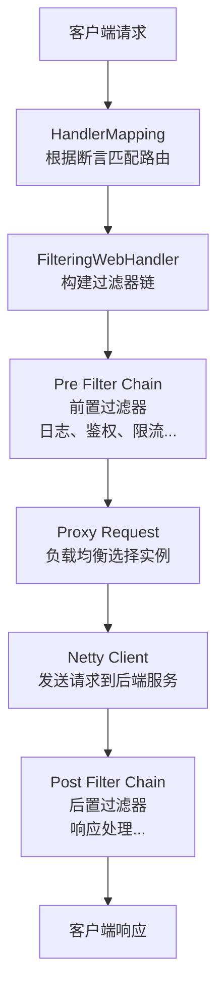

# 服务网关 Gateway 核心原理

候选人小刘在面试快手微服务架构岗时，面试官问："你们的网关用的什么？Gateway 还是 Zuul？"

小刘说："用的 Gateway..." 面试官追问："Gateway 和 Zuul 有什么区别？为什么 Gateway 性能更好？"

小刘说："Gateway 是非阻塞的..." 面试官继续追问："Gateway 的请求处理流程是什么？路由断言和过滤器是在哪个阶段执行的？"

小刘支支吾吾答不上来。

面试官又问："那 Gateway 怎么做灰度发布？怎么做限流？"

小刘彻底卡住。

【面试官心理】

这道题我是在测试候选人对网关架构的理解深度。网关是微服务的统一入口，承接着鉴权、路由、限流、监控等核心功能。只用过网关配置路由的占 80%，能说出请求处理流程和过滤器链的占 40%，能对比 Zuul 和 Gateway 并解释性能差异的占 20%。能讲清楚灰度和限流实现的，只有少数有生产经验的候选人。

## 一、为什么需要服务网关 🔴

### 1.1 无网关时代的客户端调用

在没有网关的时代，客户端需要知道每个微服务的地址：

```
客户端 → 直接调用 → user-service:8080
客户端 → 直接调用 → order-service:8081
客户端 → 直接调用 → product-service:8082
客户端 → 直接调用 → payment-service:8083
```

问题：
1. **地址耦合**：客户端和微服务地址绑定，环境切换困难
2. **鉴权重复**：每个微服务都要独立实现登录鉴权
3. **跨域问题**：浏览器需要处理复杂的 CORS 配置
4. **日志分散**：每个服务的调用日志分散在各个服务中
5. **限流困难**：无法统一限流，流量控制散落在各个服务

### 1.2 网关的核心职责

```
┌─────────────────────────────────────────────────────────┐
│                    客户端                                 │
│   Web / App / 第三方系统                                  │
└──────────────────────────┬──────────────────────────────┘
                            │ 统一入口
                            ▼
┌─────────────────────────────────────────────────────────┐
│              Spring Cloud Gateway                        │
│  ┌──────────────────────────────────────────────────┐  │
│  │  路由（Route）      : 根据规则转发到对应服务          │  │
│  │  断言（Predicate）  : 判断请求是否符合路由条件         │  │
│  │  过滤器（Filter）   : 请求/响应拦截处理              │  │
│  └──────────────────────────────────────────────────┘  │
└──────────────────────────┬──────────────────────────────┘
                            │
          ┌─────────────────┼─────────────────┐
          ▼                 ▼                 ▼
    user-service      order-service      payment-service
```

### 1.3 网关的核心能力矩阵

| 能力 | 说明 |
| --- | --- |
| 路由转发 | 将请求按规则转发到后端服务 |
| 负载均衡 | 结合 Ribbon/LoadBalancer 实现负载均衡 |
| 统一鉴权 | JWT Token 验证、OAuth2 认证 |
| 限流熔断 | 防止突发流量冲击后端服务 |
| 日志监控 | 统一采集请求日志，便于监控 |
| 协议转换 | HTTP → Dubbo / HTTP → gRPC |
| 灰度发布 | 流量切分，新版本验证 |
| 跨域处理 | 统一处理 CORS，避免后端重复配置 |

## 二、Zuul vs Gateway 架构对比 🔴

### 2.1 Zuul 1.x：同步阻塞架构

```
┌──────────────────────────────────────────────────────────┐
│                     Zuul 1.x                              │
│  ┌────────────────────────────────────────────────────┐ │
│  │              Zuul Servlet（同步阻塞）                  │ │
│  │   Thread 1: Request → Filter Chain → Backend        │ │
│  │   Thread 2: Request → Filter Chain → Backend         │ │
│  │   Thread 3: Request → Filter Chain → Backend          │ │
│  │   ...                                                │ │
│  └────────────────────────────────────────────────────┘ │
│            每个请求占用一个线程，后端慢 → 线程耗尽          │
└──────────────────────────────────────────────────────────┘
```

Zuul 1.x 使用同步阻塞模式：
- 每个 HTTP 请求占用一个 Tomcat 线程
- Tomcat 默认线程池只有 200 个线程
- 如果后端服务响应慢（慢 SQL、外部 API 调用），线程会被阻塞
- 200 个线程耗尽后，新请求只能排队等待或拒绝

### 2.2 Gateway：响应式非阻塞架构

```
┌──────────────────────────────────────────────────────────┐
│                Spring Cloud Gateway                       │
│  ┌────────────────────────────────────────────────────┐  │
│  │           Netty（事件循环，非阻塞 IO）                │  │
│  │                                                      │  │
│  │   Event Loop 1: Request A → Filter → Backend → Res  │  │
│  │   Event Loop 2: Request B → Filter → Backend → Res  │  │
│  │   Event Loop 3: Request C → Filter → Backend → Res  │  │
│  │   ...                                                │  │
│  │                                                      │  │
│  │   单线程可以处理成千上万个并发请求                     │  │
│  └────────────────────────────────────────────────────┘  │
└──────────────────────────────────────────────────────────┘
```

Gateway 基于 Spring WebFlux（响应式编程）：
- 底层使用 Netty 的非阻塞 IO
- 单个线程可以处理成千上万个并发连接
- 后端服务响应慢时，不阻塞线程，切换到其他请求处理
- 吞吐量是 Zuul 的 3~10 倍

### 2.3 性能对比

| 维度 | Zuul 1.x | Zuul 2.x | Spring Cloud Gateway |
| --- | --- | --- | --- |
| IO 模型 | 同步阻塞 | 同步阻塞 | 异步非阻塞 |
| 线程模型 | Tomcat 线程池 | Netty（但同步处理） | Netty（非阻塞） |
| 最大并发 | 200（Tomcat 默认） | 高（Netty 线程数） | 极高（EventLoop） |
| 吞吐量 | 低 | 中 | 高 |
| 延迟 | 高（线程阻塞） | 低 | 低（异步） |
| 维护状态 | 停止维护 | 停止维护 | 活跃维护 |

:::warning ⚠️
Gateway 不支持同步的 Filter，只能用 WebFlux 的异步方式处理。如果你的项目里有同步的 Filter（如某些 Cookie 处理逻辑），在 Gateway 中需要改写成异步方式，这是迁移成本的一部分。
:::

## 三、Gateway 核心概念 🔴

### 3.1 三大核心组件

```java
// Route（路由）：包含目的地地址和过滤器链
public class Route implements Ordered {
    private String id;
    private URI uri;                    // 目标地址
    private int order;                  // 优先级
    private List<GatewayFilter> filters; // 过滤器链
    private AsyncPredicate<ServerWebExchange> predicate;  // 断言条件
}

// Predicate（断言）：判断请求是否匹配该路由
// 常见的 Predicate 类型：
// - Path=/user/**
// - Method=GET
// - Header=X-Request-Id, \d+
// - Query=foo, bar
// - Cookie=session, abc
// - After/Before/Between=某个时间点

// GatewayFilter（过滤器）：拦截并处理请求/响应
// 分为：
// - GatewayFilter：局部过滤器，只作用于当前路由
// - GlobalFilter：全局过滤器，作用于所有路由
```

### 3.2 路由配置

```yaml
spring:
  cloud:
    gateway:
      # 路由配置
      routes:
        # 路由 ID，唯一标识
        - id: user-service-route
          # 目标 URI，可以是具体地址或负载均衡
          uri: lb://user-service
          # 断言条件：请求路径匹配 /user/** 时，走这个路由
          predicates:
            - Path=/user/**
            # 请求方法必须是 GET
            - Method=GET
            # 请求头必须包含 X-Request-Id
            - Header=X-Request-Id, \d+
          # 局部过滤器：只对这个路由生效
          filters:
            # 添加请求头
            - AddRequestHeader=X-Gateway, SpringCloudGateway
            # 去除前缀（StripPrefix 1 表示去掉第一个路径段）
            - StripPrefix=1
            # 请求限流
            - name: RequestRateLimiter
              args:
                redis-rate-limiter.replenishRate: 100
                redis-rate-limiter.burstCapacity: 200
```

## 四、Gateway 请求处理流程 🔴

### 4.1 处理流程图



### 4.2 源码解析

```java
// GatewayAutoConfiguration.java
// Gateway 的核心配置类

// 1. DispatcherHandler：请求分发器（类似 Spring MVC 的 DispatcherServlet）
public class DispatcherHandler implements WebHandler, ApplicationEventPublisherAware {
    private Map<String, HandlerMapping> handlerMappings;
    private Map<String, HandlerAdapter> handlerAdapters;
    private Map<String, HandlerResultHandler> resultHandlers;

    @Override
    public Mono<Void> handle(ServerHttpRequest request, ServerHttpResponse response) {
        // 匹配路由
        return handlerMappings
            .get(handlerMapping ->
                handlerMapping.getHandler(exchange)  // 根据断言匹配路由
            )
            // 构建过滤器链
            .flatMap(handler -> new FilteringWebHandler(handler).handle(exchange))
            // 执行过滤器和路由
            .then();
    }
}

// 2. RoutePredicateHandlerMapping：路由映射器
// 根据请求属性（path、method、header等）匹配路由
public class RoutePredicateHandlerMapping extends AbstractHandlerMapping {
    @Override
    protected Mono<?> getHandlerInternal(ServerWebExchange exchange) {
        // 从请求中获取路径
        String path = exchange.getRequest().getPath().value();
        // 遍历所有路由，找到第一个匹配的
        return flux
            .flatMap(route -> matchRoute(route, path, exchange))
            .next();
    }
}

// 3. FilteringWebHandler：过滤器执行器
public class FilteringWebHandler implements WebHandler {
    // 将全局过滤器和路由局部过滤器合并成一个链
    public FilteringWebHandler(Route route) {
        this.route = route;
        // 合并 GlobalFilter 和 GatewayFilter
        this.globalFilters = loadFilters();
        this.gatewayFilters = route.getFilters();
    }

    @Override
    public Mono<Void> handle(ServerWebExchange exchange) {
        // 按优先级排序所有过滤器
        List<GatewayFilter> allFilters = new ArrayList<>();
        allFilters.addAll(this.globalFilters);
        allFilters.addAll(this.gatewayFilters);

        // 按 @Order 排序（数字越小优先级越高）
        allFilters.sort(Comparator.comparingInt(GatewayFilter::getOrder));

        // 构建过滤器链，执行 Pre Filter
        return new GatewayFilterChain(allFilters).filter(exchange);
    }
}

// 4. 过滤器链：类似责任链模式
public class DefaultGatewayFilterChain implements GatewayFilterChain {
    private final List<GatewayFilter> filters;
    private final int index;

    public Mono<Void> filter(ServerWebExchange exchange) {
        if (index >= filters.size()) {
            // 所有过滤器执行完毕，发送代理请求
            return handleNow(exchange);
        }
        // 执行当前过滤器
        GatewayFilter filter = filters.get(index);
        return filter.filter(exchange, new DefaultGatewayFilterChain(filters, index + 1));
    }
}
```

### 4.3 过滤器优先级

```java
// 常见内置过滤器的默认优先级（数字越小越先执行）

// 第一梯队：系统级过滤器
NettyRoutingFilter = OrderedHighest = Integer.MIN_VALUE   // Netty 路由
NettyWriteResponseFilter = OrderedHighest + 1              // 写响应
ForwardRoutingFilter = OrderedHighest + 1                 // 转发

// 第二梯队：全局日志/监控
AdaptCachedBodyGlobalFilter = -1                          // 缓存请求体
RemoveCachedBodyFilter = 0                                // 移除缓存体

// 第三梯队：业务过滤器
RouteToRequestUrlFilter = 1                                // 路由到 URL
LoadBalancerClientFilter = 10101                          // 负载均衡客户端

// 第四梯队：局部过滤器
StripPrefix = 1                                           // 路径去除前缀
AddRequestHeader = 0                                       // 添加请求头
```

:::tip 💡
过滤器优先级遵循"洋葱模型"：Pre Filter 从外到内执行，Post Filter 从内到外执行。
```
请求 → Pre A → Pre B → Pre C → [后端服务] → Post C → Post B → Post A → 响应
```
:::

## 五、生产最佳实践 🟡

### 5.1 全局鉴权过滤器

```java
@Component
@Slf4j
public class AuthGlobalFilter implements GlobalFilter {
    @Autowired
    private JwtUtil jwtUtil;

    // 排除路径：登录、注册等不需要鉴权
    private final List<String> excludePaths = Arrays.asList(
        "/auth/login",
        "/auth/register",
        "/health"
    );

    @Override
    public Mono<Void> filter(ServerWebExchange exchange, GatewayFilterChain chain) {
        String path = exchange.getRequest().getPath().value();

        // 跳过不需要鉴权的路径
        if (isExcludePath(path)) {
            return chain.filter(exchange);
        }

        // 获取 Token
        String token = exchange.getRequest().getHeaders().getFirst("Authorization");
        if (token == null || !token.startsWith("Bearer ")) {
            return unauthorized(exchange, "Missing or invalid token");
        }

        // 验证 Token
        try {
            Claims claims = jwtUtil.parseToken(token.substring(7));
            // 将用户信息注入到请求属性中，传递给后端服务
            exchange.getAttributes().put("userId", claims.getSubject());
            exchange.getAttributes().put("roles", claims.get("roles"));
        } catch (Exception e) {
            return unauthorized(exchange, "Token validation failed");
        }

        // 继续过滤器链
        return chain.filter(exchange);
    }

    private boolean isExcludePath(String path) {
        return excludePaths.stream().anyMatch(path::startsWith);
    }

    private Mono<Void> unauthorized(ServerWebExchange exchange, String message) {
        ServerHttpResponse response = exchange.getResponse();
        response.setStatusCode(HttpStatus.UNAUTHORIZED);
        return response.setComplete();
    }
}
```

### 5.2 限流配置

```yaml
spring:
  cloud:
    gateway:
      routes:
        - id: user-service
          uri: lb://user-service
          predicates:
            - Path=/user/**
          filters:
            - name: RequestRateLimiter
              args:
                # 每秒允许的请求数
                redis-rate-limiter.replenishRate: 100
                # 令牌桶最大容量
                redis-rate-limiter.burstCapacity: 200
                # 限流 key 解析器（基于请求路径限流）
                key-resolver: "#{@pathKeyResolver}"
```

```java
@Configuration
public class RateLimiterConfig {
    // 基于路径限流
    @Bean
    public KeyResolver pathKeyResolver() {
        return exchange -> Mono.just(
            exchange.getRequest().getPath().value()
        );
    }

    // 基于用户 IP 限流
    @Bean
    public KeyResolver ipKeyResolver() {
        return exchange -> Mono.just(
            Objects.requireNonNull(
                exchange.getRequest().getRemoteAddress()
            ).getAddress().getHostAddress()
        );
    }

    // 基于用户 ID 限流（需要先鉴权）
    @Bean
    public KeyResolver userKeyResolver() {
        return exchange -> Mono.justOrEmpty(
            exchange.getAttribute("userId")
        ).defaultIfEmpty("anonymous");
    }
}
```

## 六、常见翻车现场 🔴

### ❌ 翻车点一：Predicate 和 Filter 顺序搞混

```yaml
# ❌ 错误：把 Predicate 当 Filter 用
spring:
  cloud:
    gateway:
      routes:
        - id: user-service
          uri: lb://user-service
          # Path 是 Predicate，不是 Filter！写在 filters 里无效
          filters:
            - Path=/user/**
            - AddRequestHeader=X-Gateway, gateway

# ✅ 正确：Predicate 在 predicates 下，Filter 在 filters 下
spring:
  cloud:
    gateway:
      routes:
        - id: user-service
          uri: lb://user-service
          predicates:
            - Path=/user/**
          filters:
            - AddRequestHeader=X-Gateway, gateway
```

### ❌ 翻车点二：静态配置无法热更新

Gateway 的路由配置是启动时加载到内存的，修改 YAML 后需要重启 Gateway 才能生效。如果需要动态路由，可以用 RouteDefinitionWriter：

```java
@Autowired
private RouteDefinitionWriter routeDefinitionWriter;

// 动态添加路由
public Mono<Void> addRoute(Mono<RouteDefinition> route) {
    return route.flatMap(routeDefinition -> {
        routeDefinitionWriter.save(Mono.just(
            RouteDefinition.of(
                routeDefinition.getId(),
                routeDefinition.getUri(),
                routeDefinition.getOrder(),
                routeDefinition.getPredicates(),
                routeDefinition.getFilters()
            )
        )).then();
    });
}
```

【面试官心理】

问到网关这道题，我通常会从 Gateway 和 Zuul 的区别开始，逐步深入到请求处理流程、过滤器链、限流实现。能说出基本区别的占 60%，能解释响应式编程和非阻塞 IO 的占 30%，能自己实现全局过滤器和限流逻辑的只有 10%。网关是微服务的守门人，能把网关讲清楚的候选人，通常对微服务架构有比较深的理解。
