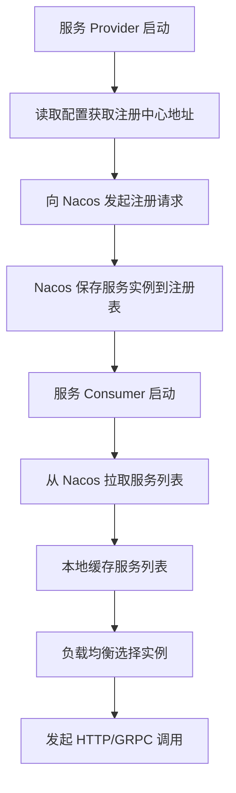
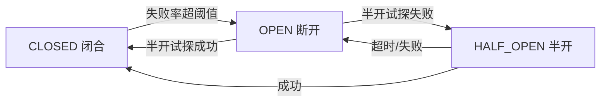
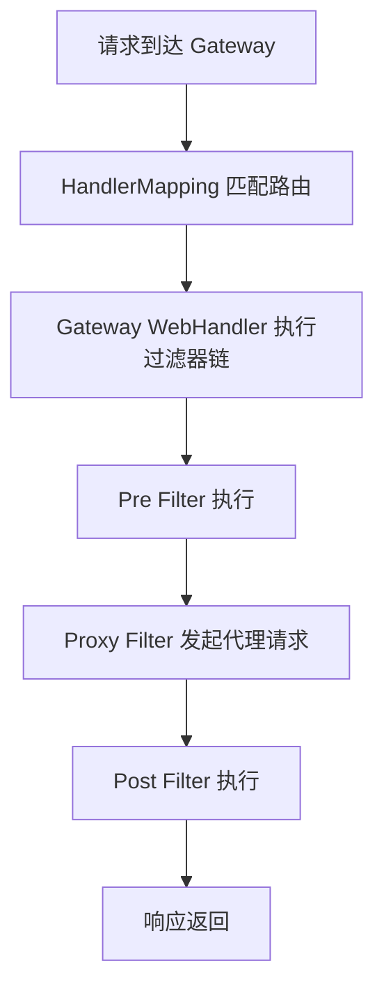
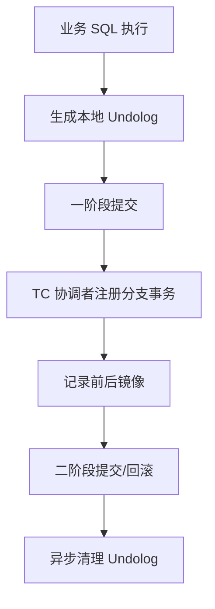

# Spring Cloud 微服务架构

候选人小李在面试时被问到："你们微服务是怎么做服务治理的？"

他回答："用 Spring Cloud Alibaba，Nacos 做注册配置中心，Sentinel 做限流..."

面试官追问："Nacos 的注册发现流程是什么？服务挂了是怎么感知的？"

小李愣了一下，说："心跳检测？"

面试官又问："Sentinel 的滑动窗口算法是怎么实现的？为什么叫滑动窗口？"

小刘开始擦汗。

【面试官心理】
我问他微服务架构，不是想听他背组件名字。我想知道的是：他有没有真正部署过微服务，有没有排查过"服务不可用"的故障，能不能说清楚"从请求到响应"中间链路上每个组件做了什么。

---

## 一、服务注册与发现 🔴

### 1.1 问题拆解

**第一层：怎么用？**
面试官问："Nacos/ Eureka 是怎么实现服务注册的？"
候选人答："服务启动时注册到注册中心..."（基本概念）

**第二层：底层实现**
面试官追问："心跳机制是什么？服务挂了多久能被感知到？"
候选人答：...（开始模糊）

**第三层：边界问题**
面试官追问："注册中心挂了，新服务还能调用吗？已经注册的服务呢？"
候选人答：...（P6 分水岭）

**第四层：高级特性**
面试官追问："Nacos 的集群部署是怎么保证一致性的？Raft 协议了解吗？"
候选人答：...（P7 拉开差距）

### 1.2 错误示范

**候选人原话**："Nacos 做服务注册发现，通过心跳检测服务健康状态..."

**问题诊断**：
- 只会背概念，不知道心跳检测的细节
- 不理解注册中心的 CAP 权衡
- 没遇到过注册中心故障的场景

**面试官内心 OS**："这个候选人肯定没经历过注册中心故障..."

### 1.3 标准回答

**服务注册发现流程**：



**Nacos 注册表数据结构**：

```java
// Nacos 命名空间 -> 服务名 -> 实例列表
Map<String, Map<String, Service>> namespace2Service = new ConcurrentHashMap<>();

public class Service {
    private String name;
    private Map<String, Instance> instanceMap;  // instanceId -> Instance

    // 实例信息
    private String instanceId;
    private String ip;
    private int port;
    private String clusterName;
    private double weight;
    private boolean healthy;  // 健康检查结果
    private long lastBeat;  // 上次心跳时间
}
```

**心跳检测机制**：

```java
// 服务端：检查客户端心跳
public class HealthCheckTask implements Runnable {
    @Override
    public void run() {
        for (Instance instance : allInstances) {
            long timeDiff = System.currentTimeMillis() - instance.getLastBeat();
            // 如果超过阈值，认为实例不健康
            if (timeDiff > timeoutMs) {
                if (instance.isHealthy()) {
                    // 先标记为不健康，发起重新检测
                    instance.setHealthy(false);
                    notifySubscribers(instance);
                }
            }
            // 超过最大次数仍无响应，从列表移除
            if (timeDiff > maxTimeout) {
                deregisterInstance(instance);
            }
        }
    }
}

// 客户端：发送心跳
public class BeatTask implements Runnable {
    @Override
    public void run() {
        // 每 5 秒发送一次心跳
        NamingProxy.sendBeat(beatInfo);
    }
}
```

:::warning ⚠️
服务挂了不是立即被感知的！Nacos 默认心跳间隔是 5 秒，超时 15 秒才标记为不健康，超时 30 秒才移除。所以服务挂了到被感知，最坏可能需要 30 秒！
:::

**服务消费者本地缓存**：

```java
// 服务列表本地缓存
public class ServiceInfoHolder {
    // 本地缓存 key: serviceName -> ServiceInfo
    private Map<String, ServiceInfo> cache = new ConcurrentHashMap<>();

    // 更新缓存
    public void updateService(String serviceName, ServiceInfo serviceInfo) {
        cache.put(serviceName, serviceInfo);
    }

    // 获取服务实例
    public List<Instance> getInstances(String serviceName) {
        ServiceInfo info = cache.get(serviceName);
        return info != null ? info.getInstances() : Collections.emptyList();
    }
}
```

消费者本地缓存服务列表，注册中心挂了：
1. **新服务启动**：无法注册，也调用不到其他服务
2. **已注册服务**：可以正常调用，因为用的是本地缓存
3. **故障恢复**：注册中心恢复后，服务重新注册

【面试官心理】
我追问他注册中心挂了怎么办，是想看他有没有经历过注册中心故障。能回答出"本地缓存"的，基本都有生产故障排查经验。

---

## 二、负载均衡 🔴

### 2.1 问题拆解

**第一层：怎么用？**
面试官问："Ribbon 和 LoadBalancer 有什么区别？"
候选人答："都是负载均衡器..."（开始混淆）

**第二层：算法原理**
面试官追问："常见的负载均衡算法有哪些？加权轮询怎么实现？"
候选人答：...（算法细节）

**第三层：扩展点**
面试官追问："怎么自定义负载均衡策略？"
候选人答：...（P6 分水岭）

### 2.2 标准回答

**负载均衡算法对比**：

| 算法 | 原理 | 优点 | 缺点 |
| --- | --- | --- | --- |
| RoundRobin | 轮询 | 简单、均匀 | 无法处理慢实例 |
| WeightedRoundRobin | 加权轮询 | 性能差异处理 | 权重固定 |
| Random | 随机 | 实现简单 | 偶发性不均匀 |
| LeastConnections | 最小连接 | 动态调整 | 实现复杂 |
| ConsistentHash | 一致性哈希 | 缓存命中高 | 节点变更时抖动 |

**加权轮询算法实现**：

```java
public class WeightedRoundRobinLoadBalancer {
    // 每个实例的当前权重
    private Map<String, AtomicInteger> currentWeights = new ConcurrentHashMap<>();

    public ServiceInstance choose(List<ServiceInstance> instances) {
        int totalWeight = instances.stream()
            .mapToInt(ServiceInstance::getWeight)
            .sum();

        // 每个实例的增量权重 = currentWeight + weight
        int maxWeight = 0;
        ServiceInstance chosen = null;

        for (ServiceInstance instance : instances) {
            AtomicInteger current = currentWeights.computeIfAbsent(
                instance.getInstanceId(),
                k -> new AtomicInteger(0)
            );
            // 增量
            current.addAndGet(instance.getWeight());

            if (current.get() > maxWeight) {
                maxWeight = current.get();
                chosen = instance;
            }
        }

        // 选中后减去总权重
        currentWeights.get(chosen.getInstanceId()).addAndGet(-totalWeight);

        return chosen;
    }
}
```

Spring Cloud LoadBalancer 的使用：

```java
@Service
public class OrderService {
    @Autowired
    private LoadBalancerClient loadBalancerClient;

    public Order createOrder() {
        // 通过负载均衡选择服务实例
        ServiceInstance instance = loadBalancerClient.choose("stock-service");
        String url = "http://" + instance.getHost() + ":" + instance.getPort() + "/stock";
        // 调用...
        return order;
    }
}

// 或者用 @LoadBalanced 注解
@Configuration
public class LoadBalancerConfig {
    @Bean
    @LoadBalanced
    public RestTemplate restTemplate() {
        return new RestTemplate();
    }
}
```

【面试官心理】
我追问他加权轮询的实现，是想看他有没有真正理解过负载均衡算法的原理。能手写加权轮询的，基本都有算法基础。

---

## 三、熔断限流 🔴

### 3.1 问题拆解

**第一层：怎么用？**
面试官问："Sentinel 和 Hystrix 有什么区别？"
候选人答："都是熔断器..."（开始混淆）

**第二层：算法原理**
面试官追问："Sentinel 的滑动窗口是怎么实现的？"
候选人答：...（核心算法）

**第三层：参数调优**
面试官追问："熔断阈值设多少合适？怎么调优？"
候选人答：...（P6 分水岭）

### 3.2 标准回答

**Sentinel 滑动窗口算法**：

```java
// 滑动窗口：把时间切成固定大小的窗口
public class SlidingWindow {
    // 窗口数组
    private final WindowWrap<MetricBucket>[] windows;
    // 窗口大小（毫秒）
    private final long windowLengthInMs;
    // 窗口数量
    private final int sampleCount;

    public SlidingWindow(int sampleCount, long intervalInMs) {
        this.windowLengthInMs = intervalInMs / sampleCount;
        this.sampleCount = sampleCount;
        this.windows = new WindowWrap[sampleCount];
    }

    // 获取当前时间戳对应的窗口
    public WindowWrap<MetricBucket> currentWindow() {
        long now = System.currentTimeMillis();
        // 计算当前时间属于哪个窗口
        long windowId = now / windowLengthInMs;
        int windowIndex = (int) (windowId % sampleCount);

        // 创建或获取窗口
        WindowWrap<MetricBucket> wrap = windows[windowIndex];
        if (wrap == null || wrap.windowId != windowId) {
            // 窗口过期，创建新窗口
            wrap = new WindowWrap<>(windowLengthInMs, windowId, new MetricBucket());
            windows[windowIndex] = wrap;
        }
        return wrap;
    }

    // 获取统计值（最近 intervalInMs 的请求）
    public long getSum() {
        long sum = 0;
        for (WindowWrap<MetricBucket> wrap : windows) {
            if (wrap != null && isWindowValid(wrap)) {
                sum += wrap.value().getPassCount();
            }
        }
        return sum;
    }
}
```

**熔断器状态机**：



Sentinel 的熔断策略：
1. **慢调用比例**：响应时间超过阈值即为慢调用
2. **异常比例**：异常比例超过阈值
3. **异常数**：异常数量超过阈值

```java
// Sentinel 熔断配置示例
@Configuration
public class SentinelConfig {
    @PostConstruct
    public void init() {
        // 声明熔断规则
        List<DegradeRule> rules = new ArrayList<>();
        DegradeRule rule = new DegradeRule("stock-service")
            .setGrade(CircuitBreakerStrategy.SLOW_REQUEST_RATIO.getType())
            .setCount(0.2)  // 慢调用比例阈值 20%
            .setMinRequestAmount(5)  // 最小请求数
            .setSlowRatioThreshold(1000.0)  // 慢调用阈值 1000ms
            .setTimeWindow(10);  // 熔断时长 10 秒
        rules.add(rule);
        DegradeRuleManager.loadRules(rules);
    }
}
```

【面试官心理】
我追问他滑动窗口的实现，是想看他有没有真正理解过限流的原理。能说清楚"为什么叫滑动窗口"的，基本都有过性能调优经验。

### 3.3 生产避坑

:::warning ⚠️
熔断阈值设置不当会导致严重问题：
- **阈值太高**：熔断不触发，服务被拖垮
- **阈值太低**：频繁熔断，服务不可用
- **半开时间太短**：还没恢复就又开始请求
- **最小请求数太小**：偶发请求就触发熔断

建议：最小请求数设 `>= 50`，熔断时长 `>= 30s`，先设宽松，再逐步收紧。
:::

---

## 四、网关与路由 🟡

### 4.1 问题拆解

**第一层：怎么用？**
面试官问："Spring Cloud Gateway 是怎么处理请求的？"
候选人答："路由转发..."（基本概念）

**第二层：过滤器链**
面试官追问："Gateway 的过滤器链是怎么工作的？Filter 有哪几种？"
候选人答：...（过滤器机制）

**第三层：动态路由**
面试官追问："怎么实现动态路由配置？"
候选人答：...（P6 分水岭）

### 4.2 标准回答

**Gateway 工作流程**：



**自定义 Global Filter**：

```java
@Component
public class AuthGlobalFilter implements GlobalFilter, Ordered {
    @Autowired
    private JwtUtil jwtUtil;

    @Override
    public Mono<Void> filter(ServerWebExchange exchange, GatewayFilterChain chain) {
        ServerHttpRequest request = exchange.getRequest();
        String path = request.getURI().getPath();

        // 跳过登录接口
        if (path.startsWith("/api/auth/")) {
            return chain.filter(exchange);
        }

        String token = request.getHeaders().getFirst("Authorization");
        if (token == null || !token.startsWith("Bearer ")) {
            exchange.getResponse().setStatusCode(HttpStatus.UNAUTHORIZED);
            return exchange.getResponse().setComplete();
        }

        try {
            String jwt = token.substring(7);
            Claims claims = jwtUtil.parseToken(jwt);
            // 把用户信息放到请求头
            ServerHttpRequest mutatedRequest = request.mutate()
                .header("X-User-Id", claims.getSubject())
                .build();
            return chain.filter(exchange.mutate().request(mutatedRequest).build());
        } catch (Exception e) {
            exchange.getResponse().setStatusCode(HttpStatus.UNAUTHORIZED);
            return exchange.getResponse().setComplete();
        }
    }

    @Override
    public int getOrder() {
        return -100;  // 优先级，越小越先执行
    }
}
```

【面试官心理】
我追问他自定义 Filter，是想看他有没有实战经验。能写出一个带 JWT 验证的 Filter，基本都有网关开发经验。

---

## 五、分布式事务 🟡

### 5.1 问题拆解

**第一层：怎么用？**
面试官问："Seata 的 AT 模式是怎么工作的？"
候选人答："两阶段提交..."（概念模糊）

**第二层：机制原理**
面试官追问："Seata 的 undo_log 表是干什么用的？回滚是怎么实现的？"
候选人答：...（核心机制）

**第三层：选型权衡**
面试官追问："AT 模式和 TCC 模式有什么区别？什么场景用哪种？"
候选人答：...（P7 拉开差距）

### 5.2 标准回答

**AT 模式两阶段**：



**Seata AT 模式配置**：

```yaml
seata:
  enabled: true
  application-id: order-service
  tx-service-group: my_test_tx_group
  config-type: nacos
  config:
    nacos:
      server-addr: ${NACOS_HOST:127.0.0.1}:8848
      group: SEATA_GROUP
      data-id: seataConfig
  registry:
    nacos:
      server-addr: ${NACOS_HOST:127.0.0.1}:8848
      application: seata-server
```

:::warning ⚠️
Seata AT 模式的限制：
1. **只支持关系型数据库**：MySQL/PostgreSQL/Oracle
2. **不支持子事务**：嵌套 @GlobalTransactional 会出问题
3. **全局锁**：高并发下性能下降
4. **回滚日志**：会占用额外存储空间

如果对性能要求极高，考虑 TCC 模式；如果跨服务调用，考虑 Saga 模式。
:::

---

## 六、学习路径指引

| 级别 | 重点 | 期望回答 |
| --- | --- | --- |
| P5 | 组件基本使用、概念理解 | 能说清各组件作用 |
| P6 | 底层原理、配置参数 | 能回答追问，理解算法 |
| P7 | 架构设计、选型权衡 | 能做技术选型，有生产经验 |

:::tip 💡
微服务面试的核心不是背组件名字，而是理解"为什么需要这些组件"以及"组件挂了怎么办"。建议准备时多想想"如果这个组件故障了，系统还能正常服务吗？"
:::

---

## 七、生产避坑总结

| 场景 | 问题 | 解决方案 |
| --- | --- | --- |
| 服务雪崩 | 某个服务挂了，拖垮整个系统 | 配置合理的超时时间 + 熔断降级 |
| 注册中心故障 | 新服务无法注册 | 本地缓存 + 重试机制 |
| 分布式事务 | AT 模式全局锁争用严重 | 拆分大事务，或改用 TCC |
| 网关单点 | 网关挂了，全部服务不可用 | 网关集群部署 + 健康检查 |
| 配置中心不一致 | 配置改了，服务没感知 | 配置推送 + 热更新 |
