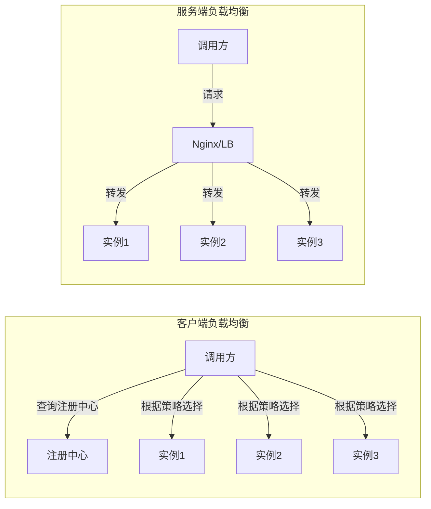

# 负载均衡策略深度解析

候选人小李在面试京东基础架构团队时，面试官问："Ribbon 的负载均衡策略有哪些？默认是哪种？"

小李说："有轮询、随机..." 面试官追问："加权响应时间策略是怎么实现的？权重是怎么计算的？"

小李说："好像是根据响应时间..." 面试官继续追问："ZoneAvoidanceRule 的 zone 淘汰机制是什么？为什么要有这个设计？"

小李支支吾吾答不上来。

面试官又问："Spring Cloud LoadBalancer 取代了 Ribbon，你知道它们的区别吗？"

小李彻底卡住。

【面试官心理】

这道题我用来测试候选人对负载均衡算法的理解深度。Ribbon 是微服务调用链中承上启下的关键组件，负载均衡策略的选择直接影响系统的稳定性和性能。只知道 Ribbon 名字的占 80%，能说出七大策略的占 40%，能解释权重计算和 zone 淘汰机制的只有 15%。能说清楚 LoadBalancer 演进的，更是凤毛麟角。

## 一、为什么需要负载均衡 🔴

### 1.1 没有负载均衡的问题

```java
// ❌ 硬编码服务地址
@Service
public class UserService {
    private final String USER_SERVICE_URL = "http://192.168.1.101:8080";

    public User getUser(Long id) {
        return restTemplate.getForObject(
            USER_SERVICE_URL + "/user/" + id,
            User.class
        );
    }
}
```

问题：
1. **单点故障**：101 挂了，整个服务就不可用
2. **无法扩展**：流量增加时无法动态增加实例
3. **负载不均**：101 承受所有流量，其他实例空闲

### 1.2 客户端负载均衡 vs 服务端负载均衡

| 维度 | 客户端负载均衡 | 服务端负载均衡 |
| --- | --- | --- |
| 代表 | Ribbon / LoadBalancer | Nginx / F5 |
| 决策位置 | 客户端（调用方） | 服务端（网关/LB） |
| 实例列表来源 | 从注册中心获取 | 由负载均衡器维护 |
|灵活性|高（可自定义策略）|低（固定策略）|
|复杂度|高（每个客户端都要配置）|低（集中管理）|
|调用链路|客户端直接调用实例|客户端调用 LB，LB 转发 |



## 二、Ribbon 负载均衡七大策略 🔴

### 2.1 策略概览

| 策略 | 类名 | 原理 | 适用场景 |
| --- | --- | --- | --- |
| 轮询 | RoundRobinRule | 按顺序依次选择每个实例 | 默认策略，负载均匀 |
| 随机 | RandomRule | 随机选择一个实例 | 测试/简单场景 |
| 加权响应时间 | WeightedResponseTimeRule | 响应时间越短，权重越高 | 性能差异大的集群 |
| 最少并发 | BestAvailableRule | 选择并发数最低的实例 | 有慢实例的场景 |
| 重试 | RetryRule | 轮询 + 失败重试其他实例 | 瞬时故障容错 |
| 可用性过滤 | AvailabilityFilteringRule | 过滤掉连接失败/熔断的实例 | 高可用要求 |
| 区域感知 | ZoneAvoidanceRule | 优先选择同 zone 实例，避免不健康 zone | 多机房部署 |

### 2.2 RoundRobinRule：轮询策略

```java
// RoundRobinRule.java - 最简单的负载均衡策略
public class RoundRobinRule extends AbstractLoadBalancerRule {
    private AtomicInteger nextServerCyclicCounter;

    public Server choose(ILoadBalancer lb, Object key) {
        if (lb == null) {
            return null;
        }

        List<Server> servers = lb.getReachableServers();  // 获取可用实例

        int serverCount = servers.size();
        if (serverCount == 0) {
            return null;
        }

        // 原子递增，取模得到下一个实例索引
        int next = nextServerCyclicCounter.incrementAndGet() % serverCount;

        return servers.get(next);
    }
}

/*
 * 轮询示例：
 * 假设有 3 个实例：实例0, 实例1, 实例2
 *
 * 请求1: next=1%3=0 -> 实例0
 * 请求2: next=2%3=1 -> 实例1
 * 请求3: next=3%3=2 -> 实例2
 * 请求4: next=4%3=0 -> 实例0
 * 请求5: next=5%3=1 -> 实例1
 * ...
 */
```

### 2.3 WeightedResponseTimeRule：加权响应时间策略

```java
// WeightedResponseTimeRule.java - 根据响应时间加权
public class WeightedResponseTimeRule extends AbstractLoadBalancerRule {
    // 权重数组：每个实例的权重
    // 权重 = 权重区间上限 - 权重区间下限
    // 响应时间越短，权重越大
    private volatile List<Double> accumulatedWeights = new ArrayList<>();

    // 定时更新权重（默认 30 秒）
    @edu.umd.cs.findbugs.annotations.SuppressWarnings(value = "RC")
    public Server choose(ILoadBalancer lb, Object key) {
        List<Double> currentWeights = accumulatedWeights;

        if (currentWeights == null || currentWeights.isEmpty()) {
            // 没有权重数据时，退化为轮询
            return new RoundRobinRule().choose(lb, key);
        }

        // 随机一个 [0, 总权重) 的数字
        double random = ThreadLocalRandom.current().nextDouble(
            currentWeights.get(currentWeights.size() - 1)
        );

        // 二分查找：找到权重区间对应的实例
        int index = binarySearch(currentWeights, random);
        return servers.get(index);
    }

    // 权重计算逻辑
    // 假设有 3 个实例，响应时间分别为：
    // 实例0: 100ms
    // 实例1: 50ms
    // 实例2: 150ms
    //
    // 总权重 = 100 + 50 + 150 = 300
    // 归一化权重区间：
    // 实例0: [0, 100/300] = [0, 0.33)
    // 实例1: [100/300, 150/300] = [0.33, 0.5)
    // 实例2: [150/300, 300/300] = [0.5, 1.0)
    //
    // 随机值落在哪个区间，就选择哪个实例
    // 响应时间短的实例，区间越大，被选中的概率越高
}
```

### 2.4 BestAvailableRule：最小并发数策略

```java
// BestAvailableRule.java - 选择并发数最低的实例
public class BestAvailableRule extends ClientConfigEnabledRoundRobinRule {
    @Override
    public Server choose(Object key) {
        if (loadBalancerStats == null) {
            return super.choose(key);
        }

        List<Server> servers = loadBalancerStats.getFilteredServers(
            upServers,
            predicate  // AvailabilityPredicate：过滤不可用实例
        );

        // 找到并发数最低的实例
        int minimalConcurrentConnections = Integer.MAX_VALUE;
        Server chosen = null;

        for (Server server : servers) {
            int currentConnections = loadBalancerStats
                .getSingleServerStat(server)
                .getActiveRequestsCount();

            if (currentConnections < minimalConcurrentConnections) {
                minimalConcurrentConnections = currentConnections;
                chosen = server;
            }
        }

        return chosen;
    }
}
```

### 2.5 RetryRule：重试策略

```java
// RetryRule.java - 轮询 + 重试
public class RetryRule extends AbstractLoadBalancerRule {
    private IRule subRule = new RoundRobinRule();  // 底层使用轮询

    @Override
    public Server choose(Object key) {
        long deadline = System.currentTimeMillis() + maxRetryMillis;

        Server server = null;
        int retries = 0;

        while (System.currentTimeMillis() <= deadline) {
            try {
                server = subRule.choose(key);  // 调用底层策略
                return server;
            } catch (UnavailableServerException e) {
                // 实例不可用，重试
                retries++;
                if (retries >= maxRetries) {
                    throw e;
                }
            }
        }

        return server;
    }
}
```

### 2.6 ZoneAvoidanceRule：区域感知策略

```java
// ZoneAvoidanceRule.java - 优先选择同 zone，避免不健康 zone
public class ZoneAvoidanceRule extends PredicateBasedRule {
    private CompositePredicate zonePredicate;

    @Override
    public void initWithNiwsConfig(IClientConfig clientConfig) {
        // 构建复合断言
        // 1. ZoneAffinityPredicate：优先选择同 zone
        // 2. AvailibilityPredicate：过滤不健康 zone
        this.zonePredicate = CompositePredicate.create(
            new ZoneAffinityPredicate(this.zoneAffinityPredicate),
            new AvailibilityPredicate(this.zoneAffinityPredicate, stats),
            COMPOSITE_PREDICATE_VALUE
        );
    }

    @Override
    public Server choose(Object key) {
        List<Server> servers = lb.getAllServers();

        // 1. 计算每个 zone 的平均活跃请求数
        Map<String, ZoneStats> zoneStats = calculateZoneStats(servers);

        // 2. 淘汰不健康的 zone
        // 条件：zone 的平均活跃请求数 > 阈值（默认 0.9999）
        for (String zone : zoneStats.keySet()) {
            double loadPerServer = zoneStats.get(zone).getLoad();
            if (loadPerServer > Threshold > 0.999999) {
                zoneStats.remove(zone);  // 淘汰该 zone
            }
        }

        // 3. 在剩余 zone 中使用轮询
        List<Server> availableServers = filterByZone(servers, zoneStats);
        return new RoundRobinRule().chooseFrom(availableServers);
    }
}
```

## 三、Spring Cloud LoadBalancer 🟡

### 3.1 为什么需要 LoadBalancer

Ribbon 停止维护后，Spring 推出了自己的负载均衡器：

| 维度 | Ribbon | Spring Cloud LoadBalancer |
| --- | --- | --- |
| 维护状态 | 停止维护 | 活跃维护 |
| 线程模型 | 同步阻塞 | 响应式（WebFlux）|
| 集成方式 | 独立组件 | Spring 生态原生集成 |
| 扩展性 | 一般 | 好（基于 Reactive 模式）|
| 命名空间 | ribbon-xxx | spring-cloud-loadbalancer |

### 3.2 LoadBalancer 核心接口

```java
// ReactorLoadBalancer<T> - 响应式负载均衡接口
public interface ReactorServiceInstanceLoadBalancer extends ReactorLoadBalancer<ServiceInstance> {
    Mono<Response<ServiceInstance>> choose(Request request);
}

// 核心实现
// 1. RoundRobinLoadBalancer - 轮询
// 2. RandomLoadBalancer - 随机
// 3. WeightedServiceInstanceLoadBalancer - 加权
// 4. ZonePreferenceServiceInstanceLoadBalancer - 区域感知
```

### 3.3 ZonePreferenceFilter：区域路由

```java
// ZonePreferenceServiceInstanceLoadBalancer.java
public class ZonePreferenceServiceInstanceLoadBalancer
    implements ReactorServiceInstanceLoadBalancer {

    @Override
    public Mono<Response<ServiceInstance>> choose(Request request) {
        ServiceInstance original = getPreviousServiceInstance(request);

        // 获取请求的 zone（通过 header 或其他方式）
        String zone = getZoneFromRequest(request);

        // 过滤出同 zone 的实例
        List<ServiceInstance> zoneInstances = instances.stream()
            .filter(instance -> Objects.equals(zone, instance.getZone()))
            .collect(Collectors.toList());

        // 同 zone 有可用实例，优先使用
        if (!zoneInstances.isEmpty()) {
            return chooseFrom(zoneInstances);
        }

        // 没有同 zone 实例，使用全量实例
        return chooseFrom(instances);
    }
}

// 使用场景：多机房部署时，优先调用同机房的实例
// 减少跨机房网络延迟
spring:
  cloud:
    loadbalancer:
      configurations: zone-preference
    discovery:
      zone: us-east-1a  # 当前实例所在的 zone
```

### 3.4 自定义负载均衡策略

```java
// 自定义基于权重的负载均衡器
public class CustomLoadBalancer
    implements ReactorServiceInstanceLoadBalancer {

    private final ObjectProvider<ServiceInstanceListSupplier> supplierProvider;

    @Override
    public Mono<Response<ServiceInstance>> choose(Request request) {
        return supplierProvider.getIfAvailable().flatMap(supplier -> {
            return supplier.get(request).next()
                .map(instances -> {
                    // 1. 获取实例权重
                    Map<String, Double> weights = getInstanceWeights(instances);

                    // 2. 过滤不可用实例
                    instances = filterAvailable(instances);

                    // 3. 加权随机选择
                    return doWeightedSelect(instances, weights);
                });
        });
    }

    private Response<ServiceInstance> doWeightedSelect(
        List<ServiceInstance> instances,
        Map<String, Double> weights) {

        double totalWeight = weights.values().stream()
            .mapToDouble(Double::doubleValue).sum();

        double random = ThreadLocalRandom.current().nextDouble() * totalWeight;

        double cumulative = 0;
        for (ServiceInstance instance : instances) {
            cumulative += weights.getOrDefault(instance.getInstanceId(), 0.0);
            if (random <= cumulative) {
                return new Response<>(instance);
            }
        }

        return new Response<>(instances.get(0));
    }
}

// 注册为 Spring Bean
@Configuration
public class LoadBalancerConfig {
    @Bean
    public ReactorServiceInstanceLoadBalancer customLoadBalancer(
        ObjectProvider<ServiceInstanceListSupplier> supplierProvider) {
        return new CustomLoadBalancer(supplierProvider);
    }
}

// 在 @FeignClient 中使用
@FeignClient(
    name = "user-service",
    configuration = LoadBalancerConfig.class
)
public interface UserClient {}
```

## 四、生产最佳实践 🟡

### 4.1 负载均衡策略选择

| 场景 | 推荐策略 | 原因 |
| --- | --- | --- |
| 实例性能一致 | RoundRobin | 负载均匀，简单高效 |
| 实例性能不一致 | WeightedResponseTimeRule | 性能好的实例承担更多流量 |
| 有慢实例（处理慢）| BestAvailableRule | 避免将请求打到慢实例上 |
| 多机房部署 | ZoneAvoidanceRule | 优先同机房，减少延迟 |
| 瞬时故障容忍 | RetryRule | 失败后自动重试其他实例 |
| 高可用要求 | AvailabilityFilteringRule | 自动过滤熔断的实例 |

### 4.2 权重动态配置

```yaml
# application.yml
user-service:
  ribbon:
    # 使用加权响应时间策略
    NFLoadBalancerRuleClassName: com.netflix.loadbalancer.WeightedResponseTimeRule
    # 权重配置（可选，默认根据响应时间自动计算）
    # 格式：IP:Port=权重
    # 也可以通过动态配置中心下发
```

```java
// 动态更新权重
@Configuration
public class DynamicWeightConfig {
    @Autowired
    private DynamicProperty dynamicProperty;

    @PostConstruct
    public void init() {
        dynamicProperty.addCallback("user-service.weight", (name, oldValue, newValue) -> {
            // 解析权重配置
            Map<String, Double> weights = parseWeights(newValue);
            // 更新 LoadBalancer 的权重
            updateWeights(weights);
        });
    }
}
```

## 五、常见翻车现场 🔴

### ❌ 翻车点一：Ribbon 和 Spring Cloud LoadBalancer 混用

Spring Cloud 2020.x 移除了 Ribbon，如果项目中同时有 Ribbon 和 LoadBalancer 依赖，可能导致冲突：

```xml
<!-- ❌ 错误：同时引入两个依赖 -->
<dependency>
    <groupId>org.springframework.cloud</groupId>
    <artifactId>spring-cloud-starter-netflix-ribbon</artifactId>  <!-- 已移除 -->
</dependency>
<dependency>
    <groupId>org.springframework.cloud</groupId>
    <artifactId>spring-cloud-starter-loadbalancer</artifactId>
</dependency>

<!-- ✅ 正确：只使用 LoadBalancer -->
<dependency>
    <groupId>org.springframework.cloud</groupId>
    <artifactId>spring-cloud-starter-loadbalancer</artifactId>
</dependency>
```

### ❌ 翻车点二：ZoneAvoidanceRule 导致大量跨机房调用

```yaml
# ❌ 问题：某些实例所在的 zone 被打上了熔断标记
# 导致请求全部路由到其他 zone，增加跨机房延迟

# ✅ 正确：确保每个 zone 都有足够的实例
# 同时配置熔断阈值，避免过度淘汰
user-service:
  ribbon:
    NFLoadBalancerRuleClassName: ZoneAvoidanceRule
    # 淘汰阈值（默认 0.999999）
    zoneAvoidanceRule.chanceOfZoneOutage: 0.999
```

### ❌ 翻车点三：加权策略权重为 0 的实例永远不会被选中

```yaml
# ❌ 错误配置：某个实例权重为 0
user-service:
  ribbon:
    WeightedResponseTimeRule:
      instance1:8080=0     # 永远不会被选中
      instance2:8080=100
      instance3:8080=200

# ✅ 正确：所有实例权重都应 > 0
# 如果某个实例需要暂时下线，应该从注册中心注销
# 而不是设置权重为 0
```

:::warning ⚠️
Ribbon 已停止维护，生产环境推荐迁移到 Spring Cloud LoadBalancer。Ribbon 的加权响应时间策略依赖定时任务收集响应时间数据，在实例数量少或流量不稳定的场景下，权重计算可能不准确。
:::

【面试官心理】

这道题我通常从 Ribbon 的七大策略开始，逐步深入到权重计算、zone 淘汰机制、LoadBalancer 演进。能说出七大策略的占 40%，能解释加权策略和 zone 淘汰的占 25%，能说清楚 LoadBalancer 演进和生产避坑的只有 10%。负载均衡是微服务架构的基础组件，能把这些讲清楚的候选人对分布式系统有较深的理解。
