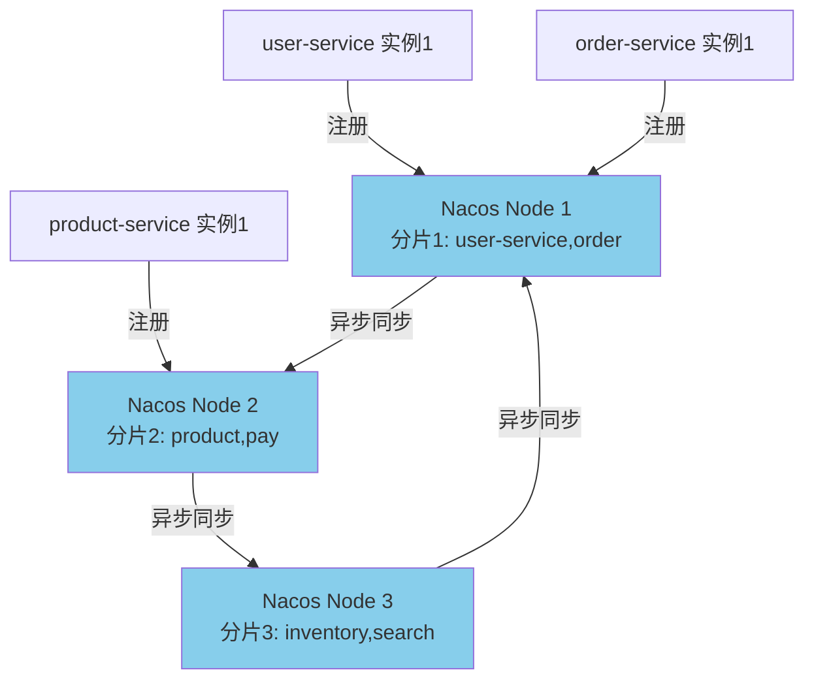

# Nacos 服务发现与配置管理

候选人小陈在面试阿里中间件团队时，面试官问："Nacos 的 AP 和 CP 模式有什么区别？什么场景下需要切换到 CP 模式？"

小陈说："AP 是最终一致，CP 是强一致..." 面试官追问："那 Nacos 的 CP 模式用的是什么一致性协议？Raft 协议的选主过程是什么？"

小陈说："好像是 Raft..." 面试官继续追问："临时实例和永久实例的区别是什么？它们分别适用什么场景？"

小陈支支吾吾答不上来。

面试官又问："Nacos 配置变更的推送机制是什么？长轮询的原理是什么？"

小陈彻底卡住。

【面试官心理】

这道题我用来测试候选人对 Nacos 架构设计原理的理解深度。Nacos 是 Spring Cloud Alibaba 的核心组件，同时支持服务发现和配置管理。能说出 AP/CP 差异的占 40%，能解释 Raft 协议和临时/永久实例的占 20%，能说清楚配置推送机制的只有 10%。Nacos 是目前生产环境使用最广泛的注册中心和配置中心，能把这些讲清楚的候选人对分布式一致性有较深的理解。

## 一、Nacos 核心能力 🔴

### 1.1 Nacos 两大功能

Nacos = **Naming**（服务发现）+ **Config**（配置管理）

```
Nacos
├── Naming Service（服务发现）
│   ├── 服务注册与注销
│   ├── 服务心跳与健康检查
│   ├── 服务列表查询
│   └── 集群同步（Distro/Raft）
│
└── Config Service（配置管理）
    ├── 配置发布与读取
    ├── 配置变更推送（长轮询）
    ├── 配置版本管理
    └── 配置加密
```

### 1.2 Nacos vs Eureka vs Consul

| 维度 | Nacos | Eureka | Consul |
| --- | --- | --- | --- |
| 一致性模型 | AP + CP 可切换 | AP | CP |
| 注册协议 | HTTP/Dubbo | HTTP | HTTP/gRPC |
| 健康检查 | 心跳/TCP/HTTP/MySQL | 心跳 | Consul Agent |
| 配置管理 | 原生支持 | 不支持 | 支持 |
| 多语言支持 | 多语言 SDK | Java | 多语言 |
| 运维复杂度 | 中 | 低 | 高 |
| 活跃度 | 非常活跃 | 停止维护 | 活跃 |

## 二、Nacos 的 AP/CP 双模式 🔴

### 2.1 CAP 理论回顾

```
C（Consistency）：一致性
P（Partition tolerance）：分区容错性
A（Availability）：可用性

在分布式系统中，网络分区不可避免，必须在 C 和 A 之间选择：
- CP：保证强一致，分区时可能牺牲可用性
- AP：保证可用性，分区时牺牲强一致性
```

### 2.2 AP 模式（默认）

```yaml
# Nacos 默认使用 AP 模式
spring:
  cloud:
    nacos:
      discovery:
        # ephemeral=false 时为 CP 模式
        # ephemeral=true（默认）时为 AP 模式
        ephemeral: true
```

```java
// AP 模式特点：
// 1. 每个节点都可以接收注册请求
// 2. 注册请求异步同步到其他节点（最终一致）
// 3. 使用 Distro 协议实现
// 4. 心跳断了立即删除实例
// 5. 适用于：普通微服务、注册中心、分区容忍

// Distro 协议核心逻辑
// NamingProxy.java
public void registerService(String namespaceId, String serviceName, Instance instance) {
    // 1. 将请求发送到当前节点
    // 2. 异步同步到其他节点
    // 3. 不保证强一致性
    doRegisterService(namespaceId, serviceName, instance);
}

// 分片负责机制
// Distro 协议将服务实例按服务名哈希分片
// 每个节点只负责部分服务的注册信息
// 节点之间异步同步数据
```

### 2.3 CP 模式

```yaml
# 切换到 CP 模式
spring:
  cloud:
    nacos:
      discovery:
        ephemeral: false  # CP 模式需要永久实例
```

```java
// CP 模式特点：
// 1. 使用 Raft 协议实现强一致性
// 2. 只有 Leader 节点接收注册请求
// 3. 注册请求同步到 Follower 节点后才返回成功
// 4. 适用于：配置中心、临时不可用的场景

// Raft 协议核心概念
/*
 * Raft 协议三个角色：
 * - Leader：处理所有写请求，将日志同步给 Follower
 * - Follower：接收 Leader 的日志同步
 * - Candidate：选举时的候选者
 *
 * Raft 协议三个阶段：
 * 1. 领导人选举（Leader Election）
 * 2. 日志复制（Log Replication）
 * 3. 安全性保证（Safety）
 */

// Raft 选主过程
/*
 * 选举触发条件：Follower 收不到 Leader 的心跳（默认 15 秒）
 *
 * 选举流程：
 * 1. Follower -> Candidate（将自己的 term + 1）
 * 2. Candidate 向所有节点发送投票请求
 * 3. 节点收到投票请求后：
 *    - 如果 term < currentTerm，拒绝投票
 *    - 如果还没投票，投给该 Candidate
 *    - 如果已投票给其他 Candidate，拒绝
 * 4. Candidate 获得多数票后，成为 Leader
 *
 * 选举超时（Election Timeout）：150ms ~ 300ms 随机
 * - 避免多个节点同时发起选举导致分票
 * - 随机超时保证大多数情况下只有一个节点能赢得选举
 */
```

### 2.4 何时使用 CP 模式

```java
// 场景一：临时实例需要强一致 → 不能使用 CP
// CP 模式只支持永久实例（ephemeral=false）

// 场景二：需要注册中心强一致
// 比如：分布式锁、配置中心
@Bean
public NacosServiceMetadataExtension nacosServiceMetadataExtension() {
    // 使用 CP 模式
    return new NacosServiceMetadataExtension();
}

// 场景三：主从切换时不能丢失注册信息
// CP 模式下，旧 Leader 的注册信息在重新选主后仍然有效
// AP 模式下，旧 Leader 的注册信息可能丢失
```

## 三、服务注册与心跳机制 🔴

### 3.1 临时实例（AP 模式）

```java
// 临时实例注册
// NacosNamingService.java
public void registerInstance(String serviceName, String groupName, Instance instance) {
    // ephemeral = true
    instance.setEphemeral(true);

    // 构建注册请求
    namingProxy.registerService(
        serviceName,
        groupName,
        instance.getClusterName(),
        instance.getIp(),
        instance.getPort(),
        instance.getWeight(),
        instance.getEnable(),
        instance.getHealthy(),
        instance.getEphemeral(),
        instance.getMetadata()
    );
}

// 心跳续约
// BeatTask.java
public class BeatTask implements Runnable {
    @Override
    public void run() {
        // 每 5 秒发送一次心跳
        // BeatReactor.java
        if (instance.isEphemeral()) {
            // 发送心跳到 Nacos Server
            namingProxy.sendBeat(instance, serviceName);
        }
    }

    // 心跳超时（默认 15 秒）
    // 服务端检测到心跳超时后，立即删除实例
    // 删除后，其他服务下次拉取注册表时就不会看到这个实例
}

// 服务端心跳检测
// DistroFilter.java
public class DistroFilter {
    // 检查心跳是否超时
    if (System.currentTimeMillis() - lastBeat > heartbeatTimeout) {
        // 心跳超时，删除实例
        deregisterInstance(serviceName, instance);
    }
}
```

### 3.2 永久实例（CP 模式）

```java
// 永久实例注册
// CP 模式下，注册请求发送到 Leader
public void registerInstance(String serviceName, String groupName, Instance instance) {
    instance.setEphemeral(false);

    // CP 模式使用 Raft 协议
    // Leader 收到请求后，同步到 Follower
    raftCore.signalLeaderChange(instance);

    // 注册请求必须多数节点确认才返回成功
}

// 永久实例不会因为心跳超时被删除
// 只有主动调用 deregisterInstance 才注销
// 适用于：配置中心、注册中心等需要强一致的场景
```

### 3.3 注册表拉取

```java
// NacosNamingService.java
// 客户端拉取注册表
public List<Instance> selectInstances(String serviceName, String groupName,
                                       boolean healthyOnly) {
    // 1. 优先从本地缓存获取
    // 2. 如果本地缓存为空或过期，向 Nacos Server 拉取
    // 3. 异步更新本地缓存

    // 拉取注册表
    // NamingProxy.java
    private void queryListOfService(String serviceName, String clusters) {
        // HTTP GET /v1/ns/instance/list
        // params: serviceName, clusters, healthyOnly
    }
}

// 订阅变更通知
// NacosNamingService.java
public void subscribe(String serviceName, NamingEventListener listener) {
    // 1. 本地缓存变更时，触发回调
    // 2. 通过长轮询感知服务实例变更
    // 3. 变更时拉取最新的注册表
}
```

## 四、配置变更推送机制 🔴

### 4.1 客户端长轮询

```java
// NacosConfigService.java
// 客户端的长轮询实现

// 配置监听器
public void addListener(String dataId, String group, Listener listener) {
    // 1. 本地缓存检查
    CacheData cache = getConfigFromLocal(dataId, group);

    // 2. 启动长轮询任务
    if (!isSubscribed(dataId, group)) {
        startLongPollingTask(dataId, group, listener);
    }
}

// 长轮询任务
// ClientLongPolling.java
public void run() {
    // 1. 发送 HTTP 请求到 Nacos Server
    // 2. 等待 Server 返回（默认 30 秒超时）
    // 3. 如果配置变更，立即返回
    // 4. 如果超时，重新发起轮询

    // 配置检查
    // httpClient.sendGetRequest(configsPath, headers);

    // 收到变更通知后
    private void onServerConfigChange(String config) {
        // 1. 更新本地缓存
        cacheData.setContent(config);

        // 2. 触发回调
        listener.receiveConfigInfo(config);

        // 3. 重新发起长轮询
        startLongPollingTask(dataId, group, listener);
    }
}
```

### 4.2 服务端短轮询

```java
// ConfigController.java
// 服务端处理轮询请求

@GetMapping("/v1/cs/configs")
public String queryConfig(
    @RequestParam("dataId") String dataId,
    @RequestParam("group") String group,
    @RequestParam("contentMD5") String contentMD5,  // 客户端当前的 MD5
    @RequestParam("timeout") long timeout
) {
    // 1. 获取服务端配置的 MD5
    String serverMD5 = getConfigMD5(dataId, group);

    // 2. MD5 相同，说明配置没变
    if (serverMD5.equals(contentMD5)) {
        // 3. 等待配置变更（最多 timeout 毫秒）
        // 这就是"长轮询"
        waitForConfigChange(dataId, group, timeout);

        // 4. 等待期间，如果配置被修改
        // notifyConfigChange() 会唤醒等待的线程
        // 然后返回新的 MD5
        serverMD5 = getConfigMD5(dataId, group);
    }

    // 5. 返回配置内容（如果变更）
    return serverMD5.equals(contentMD5) ? "" : getConfigContent(dataId, group);
}
```

### 4.3 长轮询优化：29.7 秒 + 500ms

```java
// 长轮询超时时间 = 29.7 秒
// 为什么不是 30 秒？

// 因为：客户端的定时刷新间隔是 30 秒
// 如果轮询超时时间 = 30 秒，客户端可能在下一轮刷新前还没收到响应

// Nacos 的优化：
// 1. 服务端长轮询超时：29.7 秒
// 2. 客户端定时刷新：30 秒
// 3. 客户端缓存刷新：30 + 5 = 35 秒

// 这样确保：
// - 轮询响应在下一轮刷新前到达
// - 不会漏掉配置变更

// 另外：500ms 抖动补偿
// 长轮询返回后，客户端会额外等待 500ms 再刷新
// 确保其他实例的变更通知也到达
```

## 五、Nacos 集群架构 🟡

### 5.1 Distro 协议（AP 模式）



Distro 协议特点：
1. **分片负责**：每个节点只负责部分服务实例的注册
2. **读操作本地化**：读请求优先在本节点完成
3. **写操作分片**：写请求发送到对应分片的节点
4. **异步同步**：注册信息异步同步到其他节点
5. **最终一致**：不保证强一致性，但保证最终一致

### 5.2 Raft 协议（CP 模式）

```
CP 模式使用 Raft 协议：
- 只有 Leader 接收写请求
- 写请求同步到多数 Follower 后才返回
- Leader 挂了会重新选举
- 选举期间（约几十毫秒）无法处理写请求
```

## 六、常见翻车现场 🔴

### ❌ 翻车点一：CP 模式下节点故障导致注册失败

```yaml
# ❌ 问题：3 节点集群，CP 模式下
# 如果 Leader 挂了，需要重新选举（约几十毫秒到几秒）
# 选举期间无法注册新实例

# ✅ 正确：CP 模式适用于配置中心等场景
# 普通微服务注册使用 AP 模式（ephemeral=true）
```

### ❌ 翻车点二：临时实例心跳间隔太长

```yaml
# ❌ 错误配置
spring:
  cloud:
    nacos:
      discovery:
        heart-beat-interval: 30000  # 30 秒心跳
        heart-beat-timeout: 15000   # 15 秒超时

# 问题：heart-beat-timeout < heart-beat-interval
# 心跳还没来得及发送，就被认为超时了

# ✅ 正确配置
spring:
  cloud:
    nacos:
      discovery:
        heart-beat-interval: 5000   # 5 秒心跳
        heart-beat-timeout: 15000  # 15 秒超时（> 3 倍心跳间隔）
```

### ❌ 翻车点三：长轮询超时配置不当

```java
// 客户端长轮询超时
// ❌ 错误：超时时间太短
@ConfigurationProperties(prefix = "spring.cloud.nacos.config")
public class NacosConfigProperties {
    private long timeout = 1000;  // 1 秒超时
}

// ✅ 正确：超时时间应该 >= 服务端默认的 29.7 秒
@ConfigurationProperties(prefix = "spring.cloud.nacos.config")
public class NacosConfigProperties {
    private long timeout = 30000;  // 30 秒超时
}
```

:::warning ⚠️
Nacos 2.x 相比 1.x 使用 gRPC 代替了 HTTP，通信效率更高。但 2.x 需要额外开放 9849 端口用于 gRPC 通信，如果通过 SLB 代理，需要确保端口配置正确。
:::

【面试官心理】

这道题我通常从 AP/CP 双模式开始，逐步深入到 Distro 协议、Raft 协议、临时/永久实例、配置长轮询。能说出 AP/CP 差异的占 40%，能解释 Distro 和 Raft 协议的占 25%，能说清楚配置变更推送机制的只有 10%。Nacos 是目前生产环境使用最广泛的注册中心和配置中心，能把这些讲清楚的候选人对分布式一致性有较深的理解。
