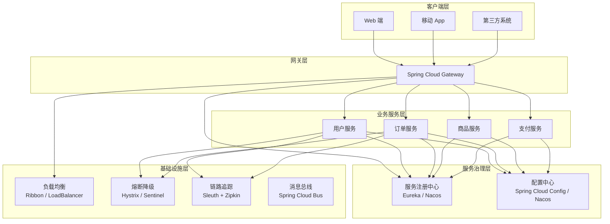

# Spring Cloud 生态组件全景图

候选人小赵在面试美团基础架构岗位时，面试官看了看他的简历说："你简历上写了熟练使用 Spring Cloud，能画一下 Spring Cloud 的整体架构图吗？"

小赵说："大概知道有哪些组件..." 面试官追问："那你能说清楚服务注册发现、配置中心、网关这几个组件的关系吗？什么场景下需要引入它们？"

小赵支支吾吾，画出来的图乱七八糟，几个组件之间的关系完全讲不清楚。

面试官又问："Spring Cloud 和 Dubbo 有什么区别？你们项目为什么选 Spring Cloud 不选 Dubbo？"

小赵答不上来。

【面试官心理】

这道题我通常用来测试候选人对微服务技术栈的全局视野。只知道 CRUD 和几个注解的占 80%，能画出完整架构图并说出组件关系的占 40%，能对比技术选型的占 20%。在基础架构岗位，这种全局认知是必备的。

## 一、微服务架构的挑战 🔴

### 1.1 没有 Spring Cloud 之前

假设你有 10 个微服务，每个微服务都要自己处理以下问题：

```
服务A → 需要知道服务B的地址
服务A → 需要处理服务B不可用的情况
服务A → 需要统一的配置管理
服务A → 需要统一的日志收集
服务A → 需要统一的限流熔断
...
服务B → 同样需要处理以上所有问题
服务C → 同样需要处理以上所有问题
...
```

每个服务都要重复造轮子，维护成本爆炸。

### 1.2 Spring Cloud 解决的四大问题

| 问题域 | 痛点 | Spring Cloud 解决方案 |
| --- | --- | --- |
| 服务治理 | 服务地址硬编码、多实例管理困难 | Eureka / Nacos / Consul |
| 配置管理 | 配置分散、修改需要重启 | Config Server / Nacos Config |
| 网关路由 | 鉴权重复、跨域复杂 | Gateway / Zuul |
| 流量管理 | 限流熔断缺失、雪崩风险 | Hystrix / Sentinel |
| 链路追踪 | 请求链路不透明、排障困难 | Sleuth + Zipkin / SkyWalking |
| 负载均衡 | 客户端负载均衡实现复杂 | Ribbon / LoadBalancer |

## 二、Spring Cloud 架构全景图 🔴

### 2.1 整体架构



### 2.2 请求全链路解析

一次典型的用户请求，经历以下组件：

```
1. 用户请求 → Gateway（统一入口）
       ↓
2. Gateway 根据路由规则断言 → 匹配 /api/user/**
       ↓
3. Gateway 过滤器链执行 → 鉴权、日志、限流
       ↓
4. Gateway 向 LoadBalancer 获取服务实例列表
       ↓
5. LoadBalancer 从注册中心获取服务实例
       ↓
6. LoadBalancer 根据负载均衡策略选择实例
       ↓
7. Gateway 向目标服务发起请求
       ↓
8. 目标服务从配置中心获取最新配置
       ↓
9. 目标服务处理业务逻辑
       ↓
10. 请求链路数据上报到链路追踪系统
```

## 三、核心组件详解 🔴

### 3.1 服务注册与发现

**Eureka**：Netflix 开源，已停止维护，但仍在大量使用
**Nacos**：阿里巴巴开源，支持 AP 和 CP 双模式，社区活跃
**Consul**：HashiCorp 开源，支持多数据中心

```java
// 服务注册
@EnableEurekaServer  // 服务端：启动注册中心
@EnableDiscoveryClient  // 客户端：将服务注册到注册中心

// 服务调用（Ribbon 负载均衡）
@Service
public class OrderService {
    @Autowired
    private RestTemplate restTemplate;

    public Order getOrder(Long userId) {
        // lb://user-service 是逻辑服务名，Ribbon 自动解析为实际 IP:Port
        return restTemplate.getForObject(
            "http://user-service/user/" + userId,
            Order.class
        );
    }
}
```

:::tip 💡
服务发现的本质是：客户端不再硬编码服务地址，而是通过服务名从注册中心动态获取可用实例列表。结合客户端负载均衡，实现服务地址的透明化。
:::

### 3.2 配置中心

**Spring Cloud Config**：Git 为后端，支持配置版本管理
**Nacos Config**：阿里巴巴开源，支持配置变更推送

```java
// Config Server 端
@EnableConfigServer  // 启用配置中心服务器

// 客户端：连接配置中心
spring:
  cloud:
    config:
      discovery:
        enabled: true  # 向注册中心查找 Config Server
      fail-fast: true  # 配置获取失败时启动失败
      retry:
        max-attempts: 6  # 重试次数
        multiplier: 1.5  # 重试间隔倍数
```

### 3.3 服务网关

**Gateway**：Spring 官方出品，基于 WebFlux 异步非阻塞
**Zuul**：Netflix 开源，1.x 同步阻塞，2.x 停止维护

```yaml
# Gateway 路由配置
spring:
  cloud:
    gateway:
      routes:
        - id: user-service
          uri: lb://user-service  # lb:// 表示负载均衡
          predicates:
            - Path=/api/user/**
          filters:
            - StripPrefix=1  # 去掉第一层路径
            - RequestRateLimiter=100
```

### 3.4 负载均衡

**Ribbon**：Netflix 开源，已停止维护，被 Spring Cloud LoadBalancer 取代
**Spring Cloud LoadBalancer**：Spring 官方出品，响应式设计

```java
// Ribbon 的负载均衡策略
@Configuration
public class RibbonConfig {
    @Bean
    public IRule ribbonRule() {
        // 轮询策略（默认）
        return new RoundRobinRule();

        // 加权策略：根据响应时间分配权重
        return new WeightedResponseTimeRule();

        // 随机策略
        return new RandomRule();

        // 重试策略：失败后自动重试
        return new RetryRule();

        // 最低并发策略：选择并发数最低的实例
        return new BestAvailableRule();
    }
}
```

### 3.5 熔断降级

**Hystrix**：Netflix 开源，已停止维护
**Sentinel**：阿里巴巴开源，功能更丰富，社区活跃

```java
// Hystrix 熔断示例
@Service
public class UserService {
    @HystrixCommand(
        fallbackMethod = "getUserFallback",
        commandProperties = {
            @HystrixProperty(name = "circuitBreaker.requestVolumeThreshold", value = "20"),
            @HystrixProperty(name = "circuitBreaker.sleepWindowInMilliseconds", value = "5000"),
            @HystrixProperty(name = "circuitBreaker.errorThresholdPercentage", value = "50")
        }
    )
    public User getUser(Long id) {
        return userClient.getUser(id);
    }

    // 降级方法
    public User getUserFallback(Long id) {
        return new User(-1L, "默认用户");
    }
}
```

## 四、组件选型对比 🟡

### 4.1 注册中心选型

| 维度 | Eureka | Nacos | Consul |
| --- | --- | --- | --- |
| CAP 模型 | AP | AP + CP 可切换 | CP |
| 一致性协议 | 无 | Raft（CP） | Raft |
| 健康检查 | 心跳续约 | TCP/HTTP/MySQL/CMDB | Consul Agent |
| 配置管理 | 不支持 | 支持 | 支持 |
| 多环境/命名空间 | 不支持 | 支持 | 支持 |
| 维护状态 | 已停止 | 活跃 | 活跃 |
| 适用场景 | 学习/内部系统 | 生产环境首选 | 多数据中心 |

### 4.2 网关选型

| 维度 | Gateway | Zuul 1.x | Zuul 2.x |
| --- | --- | --- | --- |
| IO 模型 | 异步非阻塞 | 同步阻塞 | 同步阻塞 |
| 底层框架 | WebFlux + Netty | Servlet + Tomcat | Netty |
| 吞吐量 | 高 | 低 | 中 |
| 过滤器开发 | 响应式 | 同步 | 同步 |
| 动态路由 | 支持 | 支持 | 支持 |
| 限流熔断 | 原生支持 | 需集成 Hystrix | 需集成 |
| 维护状态 | 活跃 | 停止维护 | 停止维护 |

### 4.3 熔断器选型

| 维度 | Hystrix | Sentinel |
| --- | --- | --- |
| 熔断策略 | 基于线程池/信号量隔离 | 基于滑动窗口统计 |
| 限流策略 | 线程数/QPS | QPS/并发线程数/冷启动 |
| 配置方式 | 代码注解 | 控制台 + SDK |
| 动态配置 | 不支持 | 支持（推模式） |
| 适配框架 | Spring Cloud | Spring Cloud + Dubbo + gRPC |
| Dashboard | 有（停止维护） | 有（活跃维护） |
| 适用场景 | Spring Cloud 老项目 | 新项目/多框架 |

## 五、Spring Cloud vs Dubbo 🟡

| 维度 | Spring Cloud | Dubbo |
| --- | --- | --- |
| 定位 | 微服务一站式解决方案 | 高性能 RPC 框架 |
| 通信方式 | HTTP（Restful） | RPC（Dubbo 协议，默认 TCP） |
| 序列化 | JSON/其他 | Dubbo Serialization（Hessian/ProtoBuf） |
| 性能 | 较低（HTTP 开销） | 高（长连接、低开销） |
| 服务治理 | 完整生态（配置/网关/链路） | 需集成第三方 |
| 生态整合 | 天然整合 | 需额外集成 |
| 适用场景 | 快速开发、中小型系统 | 高性能、大型分布式系统 |
| 语言支持 | 跨语言 | Java 为主 |

:::warning ⚠️
Dubbo 的高性能来源于它的 RPC 协议和长连接，适合对性能要求极高且团队技术栈统一的场景。Spring Cloud 的优势在于完整的生态和跨语言能力，适合快速迭代和异构系统。
:::

## 六、生产避坑 🟡

### 坑一：组件版本不兼容

Spring Cloud 的版本命名采用地铁线路命名法：

```
Spring Cloud Camden → 2016.0.x
Spring Cloud Edgware → 2017.1.x
Spring Cloud Finchley → 2018.0.x
Spring Cloud Greenwich → 2019.0.x
Spring Cloud Hoxton → 2020.0.x
Spring Cloud 2020.0.x（数字版本）
```

每个版本需要配套特定版本的 Spring Boot：

| Spring Cloud 版本 | Spring Boot 版本 |
| --- | --- |
| 2022.0.x | 3.0.x |
| 2021.0.x | 2.6.x |
| 2020.0.x | 2.5.x |
| Hoxton | 2.3.x / 2.4.x |

### 坑二：Eureka 已停止维护

Netflix 宣布 Eureka 2.x 停止开源后，社区迁移到 Nacos 或自维护 1.x 版本。新项目强烈建议使用 Nacos 作为注册中心。

### 坑三：Feign 依赖 Ribbon，但 Ribbon 已停止维护

Spring Cloud 2020.x 已移除 Ribbon，改用 Spring Cloud LoadBalancer。如果项目还在用 Ribbon，需要迁移。

【面试官心理】

这道题我通常从架构图画起，看候选人对整个技术栈的理解程度。能说出主要组件的占 70%，能解释组件之间关系的占 40%，能对比技术选型的占 20%。Spring Cloud 生态是微服务的基础设施，能把全景图画清楚的候选人，通常对分布式系统有较深的理解。
