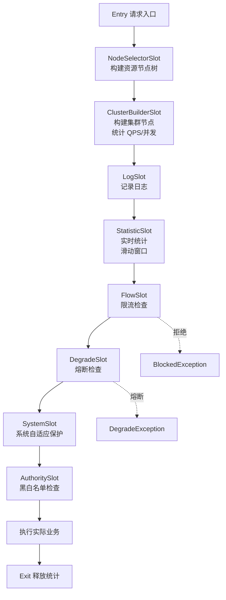

# Sentinel 限流规则与实战

候选人小赵在面试阿里中间件团队时，面试官问："Sentinel 的工作原理是什么？它是怎么统计 QPS 的？"

小赵说："Sentinel 用滑动窗口统计..." 面试官追问："滑动窗口的桶大小是多少？总时间窗口是多少？"

小赵说："好像是 1 秒..." 面试官继续追问："那 Sentinel 的 Slot Chain 有哪些插槽？每个插槽的作用是什么？"

小赵支支吾吾答不上来。

面试官又问："Sentinel 的 Push 模式和 Pull 模式有什么区别？你们用的是哪种？"

小赵彻底卡住。

【面试官心理】

这道题我用来测试候选人对 Sentinel 底层原理的理解深度。Sentinel 是阿里巴巴开源的流量控制组件，比 Hystrix 功能更丰富。能说出滑动窗口的占 40%，能讲清楚 Slot Chain 的占 20%，能说出 Push/Pull 差异和 Dashboard 集成的只有 10%。Sentinel 是生产环境流量控制的首选，能把这些讲清楚的候选人对高并发系统有较深的理解。

## 一、Sentinel 的核心概念 🔴

### 1.1 什么是 Sentinel

Sentinel 的三步走：**限制流量 → 保护资源 → 记录异常**

```
正常请求 → Sentinel 拦截 → 检查限流规则
                          → 检查熔断规则
                          → 检查系统规则
                          ↓
                    通过 → 执行实际逻辑 → 返回结果
                    拒绝 → 执行降级逻辑 → 返回降级结果
```

### 1.2 Sentinel vs Hystrix

| 维度 | Hystrix | Sentinel |
| --- | --- | --- |
| 限流 | 不支持 | 支持（5 种策略）|
| 熔断 | 基于错误率 | 基于错误率/异常数/慢调用 |
| 统计方式 | 滚动窗口（10 秒桶）| 滑动窗口（毫秒级）|
| 配置方式 | 代码注解 | 控制台 + SDK |
| 动态配置 | 不支持 | 支持（Push + Pull）|
| Dashboard | 有（停止维护）| 有（活跃维护）|
| 适配框架 | Spring Cloud | Spring Cloud + Dubbo + gRPC |

## 二、Sentinel 核心原理 🔴

### 2.1 Slot Chain 插槽链

Sentinel 的核心是一个插槽链，每个插槽负责不同的功能：



```java
// CtSph.java - 入口方法
public class CtSph implements Sph {
    @Override
    public Entry entry(String resourceName) throws BlockException {
        // 1. 构建上下文
        Context context = ContextUtil.enter(resourceName);

        // 2. 获取资源对应的 Slot Chain
        ProcessorSlotChain chain = SpiLoader.load(ProcessorSlotChain.class)
            .getFirst();

        // 3. 依次执行 Slot Chain
        // NodeSelectorSlot → ClusterBuilderSlot → ...
        // → FlowSlot → DegradeSlot → ...

        // 4. 如果所有 Slot 都通过，entry() 成功
        return entryWith(resourceName, null, 1, args);
    }
}

// 默认 Slot Chain 顺序
// 1. NodeSelectorSlot：构建资源的调用树
// 2. ClusterBuilderSlot：构建集群统计节点
// 3. LogSlot：记录日志
// 4. StatisticSlot：实时统计（最核心）
// 5. FlowSlot：限流检查
// 6. DegradeSlot：熔断检查
// 7. SystemSlot：系统自适应保护
// 8. AuthoritySlot：黑白名单检查
```

### 2.2 StatisticSlot：实时统计

```java
// StatisticSlot.java - 实时统计数据
// Sentinel 的统计核心

@Override
public void entry(ResourceWrapper resourceWrapper, int count, Object... args)
    throws BlockException {
    // 1. 检查是否应该被限流/熔断
    checkFlow(resourceWrapper, count, args);
    checkDegrade(resourceWrapper, count, args);

    // 2. 记录当前请求（用于后续统计）
    Record.of(resourceWrapper, count, args);

    // 3. 继续执行下一个 Slot
    fireEntry(resourceWrapper, count, args);
}

@Override
public void exit(ResourceWrapper resourceWrapper, int count, Object... args) {
    // 退出时记录
    Record.onPass(resourceWrapper, count);
    fireExit(resourceWrapper, count, args);
}

// 实际统计数据存储
// StatisticNode.java
public class StatisticNode {
    // 滑动窗口统计
    private final Metric rollingCounter = new Metric();

    // 通过的请求数（PASS）
    private final AtomicLong passCount = new AtomicLong(0);

    // 拒绝的请求数（BLOCK）
    private final AtomicLong blockCount = new AtomicLong(0);

    // 完成的请求数（成功 + 异常）
    private final AtomicLong totalCount = new AtomicLong(0);

    // 异常数
    private final AtomicLong exceptionCount = new AtomicLong(0);

    // 响应时间（用于计算平均 RT）
    private final AtomicLong totalRt = new AtomicLong(0);
}
```

### 2.3 LeapArray 滑动窗口

```java
// LeapArray.java - Sentinel 的滑动窗口实现
public class LeapArray<T> {
    private final int windowLength;   // 每个桶的时间长度（毫秒）
    private final int sampleCount;     // 桶的数量
    private final int intervalInMs;   // 总时间窗口 = windowLength * sampleCount

    // 桶数组（环形数组）
    private final AtomicReferenceArray<WindowWrap<T>> windowArray;

    // 时间窗口示意（以 1 秒总窗口为例）
    /*
     * windowLength = 200ms, sampleCount = 5, intervalInMs = 1000ms
     *
     * 当前时间 = 950ms
     *
     * | 0-200ms | 200-400ms | 400-600ms | 600-800ms | 800-1000ms |
     * | Bucket0 | Bucket1   | Bucket2   | Bucket3   | Bucket4    |
     * |  历史   |   历史    |   历史    |   历史   |   当前     |
     *
     * 计算 QPS = sum(Bucket0~Bucket4 的 PASS) / 1000ms
     */

    public long getPassCount() {
        // 1. 获取当前时间对应的桶索引
        long currentTime = Time.currentTimeMillis();
        int idx = (int) ((currentTime / windowLength) % sampleCount);

        // 2. 遍历所有桶，累加 PASS 计数
        long pass = 0;
        for (int i = 0; i < sampleCount; i++) {
            WindowWrap<T> wrap = windowArray.get(i);
            if (isWindowDeprecated(wrap, currentTime)) {
                continue;  // 跳过过期的桶
            }
            pass += getPass(wrap);
        }
        return pass;
    }

    // 判断桶是否过期
    private boolean isWindowDeprecated(WindowWrap<T> wrap, long currentTime) {
        return currentTime - wrap.windowStart > intervalInMs;
    }
}
```

## 三、限流规则详解 🔴

### 3.1 FlowRule 配置

```java
// FlowRule.java - 限流规则
FlowRule rule = new FlowRule("user-service")  // 资源名
    .setGrade(RuleConstant.FLOW_GRADE_QPS)     // 限流类型：QPS / 并发线程数
    .setCount(100)                               // 阈值
    .setControlBehavior(RuleConstant.CONTROL_BEHAVIOR_DEFAULT);  // 控制行为

// 限流类型
RuleConstant.FLOW_GRADE_QPS       // 基于 QPS（每秒请求数）
RuleConstant.FLOW_GRADE_THREAD   // 基于并发线程数

// 控制行为
RuleConstant.CONTROL_BEHAVIOR_DEFAULT       // 直接拒绝
RuleConstant.CONTROL_BEHAVIOR_WARM_UP       // 冷启动（预热）
RuleConstant.CONTROL_BEHAVIOR_RATE_LIMITER  // 匀速排队
RuleConstant.CONTROL_BEHAVIOR_WARM_UP_RATE_LIMITER  // 预热 + 匀速排队
```

### 3.2 五种流量整形策略

```java
// 1. 直接拒绝（Default）
// 超出阈值的请求直接拒绝
FlowRule rule = new FlowRule("user-service")
    .setGrade(RuleConstant.FLOW_GRADE_QPS)
    .setCount(100)
    .setControlBehavior(RuleConstant.CONTROL_BEHAVIOR_DEFAULT);
// QPS = 100 时，101 个请求会被拒绝

// 2. 冷启动（Warm Up）
// 新系统启动时，逐步提升到阈值
// 适用于秒杀等场景
FlowRule rule = new FlowRule("user-service")
    .setGrade(RuleConstant.FLOW_GRADE_QPS)
    .setCount(100)
    .setControlBehavior(RuleConstant.CONTROL_BEHAVIOR_WARM_UP)
    .setWarmUpPeriodSec(10);  // 预热时长 10 秒
// 开始时 QPS = 100 / 10 = 10
// 第 1 秒允许 10 个请求
// 第 5 秒允许 50 个请求
// 第 10 秒允许 100 个请求

// 3. 匀速排队（Rate Limiter）
// 请求匀速通过，超出的排队
FlowRule rule = new FlowRule("user-service")
    .setGrade(RuleConstant.FLOW_GRADE_QPS)
    .setCount(10)  // 每 100ms 允许 1 个请求
    .setControlBehavior(RuleConstant.CONTROL_BEHAVIOR_RATE_LIMITER)
    .setMaxQueueingTimeMs(500);  // 最多排队 500ms
// QPS = 1000 时，超出 990 个请求排队
// 每个请求间隔 100ms 释放
// 排队超过 500ms 的请求被拒绝

// 4. 预热 + 匀速排队
FlowRule rule = new FlowRule("user-service")
    .setGrade(RuleConstant.FLOW_GRADE_QPS)
    .setCount(100)
    .setControlBehavior(RuleConstant.CONTROL_BEHAVIOR_WARM_UP_RATE_LIMITER)
    .setWarmUpPeriodSec(10)
    .setMaxQueueingTimeMs(500);

// 5. 冷启动（简单模式）
FlowRule rule = new FlowRule("user-service")
    .setGrade(RuleConstant.FLOW_GRADE_QPS)
    .setCount(100)
    .setControlBehavior(RuleConstant.CONTROL_BEHAVIOR_WARM_UP)
    .setWarmUpPeriodSec(10);
```

## 四、熔断规则详解 🔴

### 4.1 DegradeRule 配置

```java
// DegradeRule.java - 熔断规则
// 支持三种熔断策略

// 1. 基于异常比例熔断
DegradeRule rule1 = new DegradeRule("user-service")
    .setResource("user-service")
    .setGrade(CircuitBreakerStrategy.ERROR_RATIO.getType())  // 异常比例
    .setCount(0.3)  // 30% 异常比例
    .setMinRequestAmount(5)  // 最小请求数（统计样本）
    .setStatIntervalMs(1000)  // 统计时间窗口（毫秒）
    .setTimeWindow(10);  // 熔断持续时间（秒）
// 1 秒内请求数 >= 5，且异常比例 >= 30%，熔断 10 秒

// 2. 基于异常数熔断
DegradeRule rule2 = new DegradeRule("user-service")
    .setGrade(CircuitBreakerStrategy.ERROR_COUNT.getType())  // 异常数
    .setCount(10)  // 10 个异常
    .setMinRequestAmount(5)
    .setTimeWindow(10);
// 1 秒内异常数 >= 10，熔断 10 秒

// 3. 基于慢调用比例熔断
DegradeRule rule3 = new DegradeRule("user-service")
    .setGrade(CircuitBreakerStrategy.SLOW_RT_RATIO.getType())  // 慢调用比例
    .setCount(1000)  // RT 阈值（毫秒）
    .setSlowRatioThreshold(0.5)  // 50% 慢调用比例
    .setMinRequestAmount(5)
    .setTimeWindow(10);
// 1 秒内请求数 >= 5，且慢调用（RT > 1000ms）比例 >= 50%，熔断 10 秒
```

### 4.2 熔断状态机

```java
// CircuitBreakerStrategy.java
public enum CircuitBreakerStrategy {
    // 正常 → 熔断
    // OPEN：熔断打开，所有请求被拒绝

    // OPEN → HALF_OPEN
    // 熔断持续时间到达后，自动进入半开状态

    // HALF_OPEN → CLOSED
    // 半开状态下，请求成功，关闭熔断器

    // HALF_OPEN → OPEN
    // 半开状态下，请求失败/超时，重新打开熔断器
}

// CircuitBreaker.java - 熔断器接口
public interface CircuitBreaker {
    // 检查是否允许请求通过
    boolean tryPass();

    // 记录请求成功
    void recordResponse(RtStat rtStat);

    // 记录请求失败
    void recordError();

    // 获取当前熔断器状态
    State currentState();
}
```

## 五、@SentinelResource 注解 🔴

### 5.1 注解使用

```java
// 方式一：使用 Sentinel API 手动控制
@Service
public class UserService {
    public User getUser(Long id) {
        Entry entry = null;
        try {
            // 1. 标记资源入口
            entry = SphU.entry("getUser");

            // 2. 执行业务逻辑
            return userRepository.findById(id);

        } catch (BlockException e) {
            // 3. 被限流/熔断时的处理
            return User.DEFAULT_USER;

        } finally {
            if (entry != null) {
                // 4. 退出资源
                entry.exit();
            }
        }
    }
}

// 方式二：使用注解（推荐）
@Service
public class UserService {
    @SentinelResource(
        value = "getUser",  // 资源名
        blockHandler = "getUserBlockHandler",    // 限流/熔断处理
        blockHandlerClass = UserServiceBlockHandler.class,  // 处理类
        fallback = "getUserFallback",            // 降级处理
        fallbackClass = UserServiceFallback.class,  // 降级类
        exceptionsToIgnore = {BusinessException.class}  // 忽略的异常
    )
    public User getUser(Long id) {
        return userRepository.findById(id);
    }
}

// 限流/熔断处理方法（必须和原方法签名一致，或使用 BlockException）
public class UserServiceBlockHandler {
    public static User getUserBlockHandler(Long id, BlockException e) {
        log.warn("Sentinel 拦截，resource=getUser, ex={}", e.getClass().getSimpleName());
        User user = new User();
        user.setId(-1L);
        user.setName("限流返回");
        return user;
    }
}

// 降级处理方法（Throwable 参数可获取异常）
public class UserServiceFallback {
    public static User getUserFallback(Long id, Throwable t) {
        log.error("降级处理，resource=getUser, id={}, ex={}", id, t.getMessage());
        User user = new User();
        user.setId(-1L);
        user.setName("降级返回");
        return user;
    }
}
```

## 六、Sentinel Dashboard 集成 🟡

### 6.1 Push vs Pull 模式

| 维度 | Pull 模式 | Push 模式 |
| --- | --- | --- |
| 数据流向 | 客户端主动拉取 | 控制台主动推送 |
| 实现方式 | 定时轮询文件/HTTP | 长连接推送 |
| 实时性 | 秒级延迟 | 毫秒级 |
| 适用场景 | 小规模 | 大规模/生产环境 |
| 实现复杂度 | 简单 | 复杂 |

### 6.2 Dashboard 配置

```yaml
# application.yml
spring:
  cloud:
    sentinel:
      # Dashboard 地址
      transport:
        dashboard: localhost:8080
        port: 8719  # 客户端 HTTP 端口
      # 提前加载规则（启动时就加载）
      eager: true
      # 规则持久化
      datasource:
        # 文件持久化
        ds1:
          file: "classpath:flow-rule.json"
        # Nacos 持久化
        ds2:
          nacos:
            server-addr: nacos-server:8848
            data-id: sentinel-rules
            group-id: SENTINEL_GROUP
            rule-type: FLOW
```

## 七、生产最佳实践 🟡

### 7.1 系统自适应保护

```java
// SystemRule.java - 系统自适应保护
// Sentinel 根据系统 Load/QPS/线程数/CPU 使用率自动限流

List<SystemRule> rules = new ArrayList<>();

SystemRule rule = new SystemRule()
    // 基于 QPS
    .setHighestCpuUsage(0.9)     // CPU >= 90% 时限流
    .setHighestSystemLoad(3.0)   // 系统 Load >= 3 时限流
    .setQps(10000)              // QPS >= 10000 时限流
    .setAvgRt(100)              // 平均 RT >= 100ms 时限流
    .setMaxThread(100);         // 线程数 >= 100 时限流

rules.add(rule);
SystemRuleManager.loadRules(rules);
```

### 7.2 热点参数限流

```java
// ParamFlowRule.java - 热点参数限流
// 对特定参数值进行细粒度限流

ParamFlowRule rule = new ParamFlowRule("getUser")
    .setParamIdx(0)  // 第一个参数（userId）
    .setGrade(RuleConstant.FLOW_GRADE_QPS)
    .setCount(10)  // 每个 userId 最多 10 QPS
    .setDurationInSec(1)
    // 参数值限流
    .setParamFlowItemList(Arrays.asList(
        // userId = -1 的请求不限制
        new ParamFlowItem().setObject(String.valueOf(-1))
            .setClassType(int.class.getName())
            .setCount(10000)
    ));

ParamFlowRuleManager.loadRules(Collections.singletonList(rule));
// 效果：普通 userId 每个最多 10 QPS，userId=-1 的最多 10000 QPS
```

## 八、常见翻车现场 🔴

### ❌ 翻车点一：Dashboard 推送的规则重启后丢失

```yaml
# ❌ 错误：没有配置规则持久化
spring:
  cloud:
    sentinel:
      transport:
        dashboard: localhost:8080
# 问题：Dashboard 下发的规则只在内存中
# 重启后全部丢失

# ✅ 正确：配置持久化
spring:
  cloud:
    sentinel:
      datasource:
        # Nacos 持久化
        ds1:
          nacos:
            server-addr: nacos-server:8848
            data-id: sentinel-flow-rules
            group-id: SENTINEL_GROUP
```

### ❌ 翻车点二：@SentinelResource 缺少 blockHandler 导致异常

```java
// ❌ 错误：没有指定 blockHandler
@SentinelResource(value = "getUser")
public User getUser(Long id) {
    // 如果被限流，会抛出 BlockException
    // 如果没有 blockHandler，异常不会被捕获
    return userRepository.findById(id);
}

// ✅ 正确：指定 blockHandler
@SentinelResource(
    value = "getUser",
    blockHandler = "getUserBlockHandler",
    blockHandlerClass = UserServiceBlockHandler.class
)
public User getUser(Long id) {
    return userRepository.findById(id);
}
```

### ❌ 翻车点三：熔断阈值设置不当

```java
// ❌ 错误：minRequestAmount 设置过低
.setMinRequestAmount(2)  // 只有 2 个请求就判断熔断
// 问题：统计样本太少，容易误判

// ✅ 正确：设置足够的统计样本
.setMinRequestAmount(5)  // 至少 5 个请求后统计
// 生产环境建议 >= 10
```

:::warning ⚠️
Sentinel 的 Dashboard 默认不包含规则持久化功能，需要配合 Nacos/Apollo/Zookeeper 等配置中心使用。纯 Dashboard 方式仅适用于开发测试环境，生产环境必须配置规则持久化。
:::

【面试官心理】

这道题我通常从 Slot Chain 开始，逐步深入到滑动窗口、限流策略、熔断规则、Dashboard 集成。能说出 Slot Chain 组成的占 30%，能讲清楚五种流量整形策略的占 20%，能说出 Push/Pull 差异和热点参数限流的只有 10%。Sentinel 是生产环境流量控制的标配，能把这些讲清楚的候选人对高并发系统有较深的理解。
