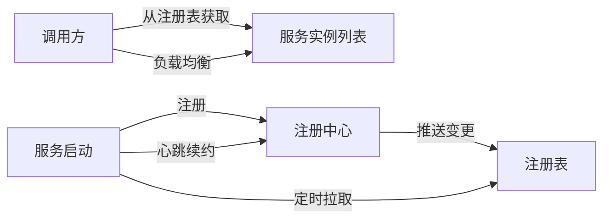
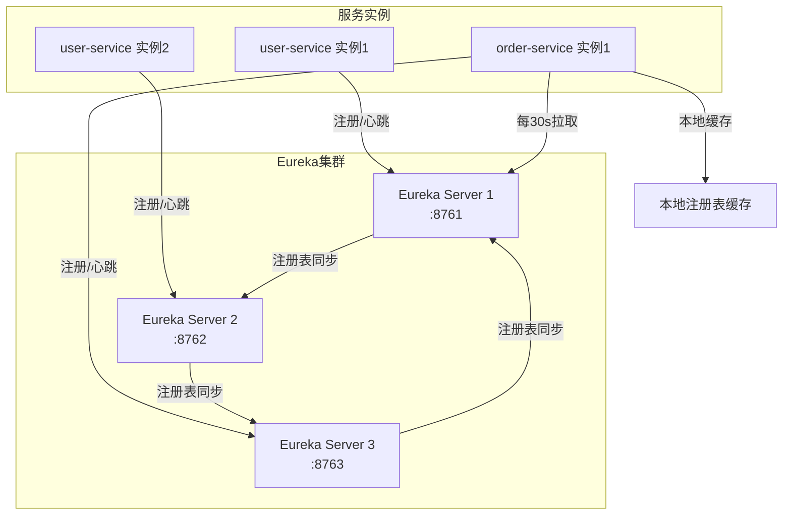
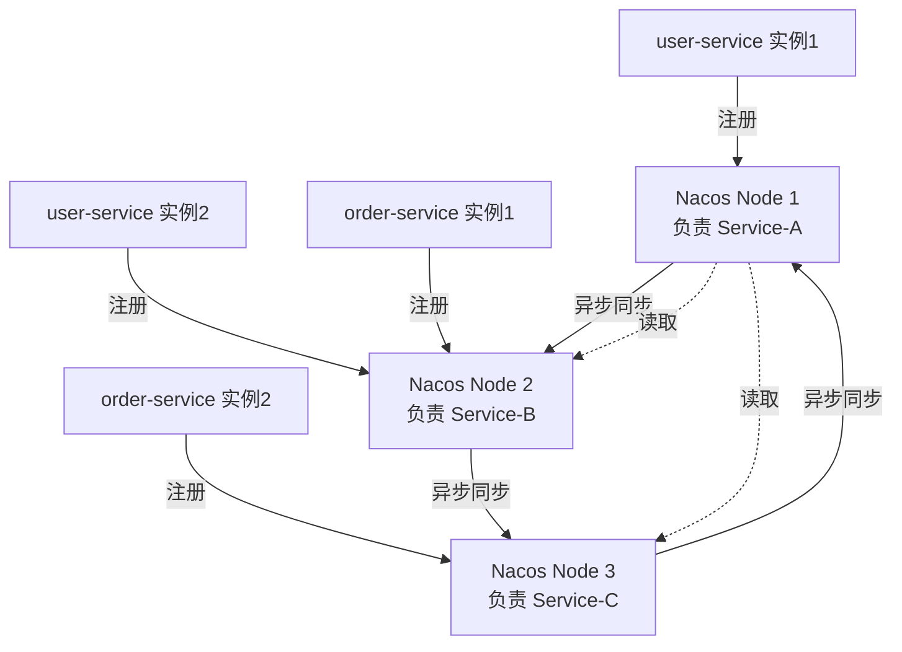

# 服务注册与发现机制

候选人小张在面试阿里中间件团队时，面试官问："你们的服务注册与发现是怎么实现的？Eureka 的心跳机制是什么？"

小张说："就是服务启动时注册到 Eureka，然后定时发送心跳..." 面试官追问："心跳续约的间隔是多少？多久不续约会被剔除？续约失败了会怎样？"

小张说："好像是 30 秒？"面试官继续追问："那注册表是客户端拉取还是服务端推送？拉取的间隔是多少？"

小张支支吾吾答不上来。

面试官又问："Nacos 和 Eureka 在一致性协议上有什么区别？"

小赵彻底卡住。

【面试官心理】

这道题我用来测试候选人对服务发现底层机制的理解深度。知道"注册"和"心跳"概念的占 80%，能说出具体时间的占 50%，能解释注册表同步机制和 Nacos CP/AP 双模式差异的只有 20%。服务注册中心是微服务的基础设施，这些细节决定了生产环境的行为模式。

## 一、为什么需要服务注册发现 🔴

### 1.1 硬编码地址的问题

```java
// ❌ 传统方式：地址硬编码
@Service
public class OrderService {
    private final String USER_SERVICE_URL = "http://192.168.1.101:8080";

    public User getUser(Long userId) {
        return restTemplate.getForObject(
            USER_SERVICE_URL + "/user/" + userId,
            User.class
        );
    }
}
```

问题：
1. **地址变更需要改代码**：服务实例 IP 变了，所有调用方都要改
2. **无法负载均衡**：每次都调同一台机器
3. **无法健康检查**：不知道目标服务是否还活着

### 1.2 服务发现的核心流程



## 二、Eureka 服务注册与发现 🔴

### 2.1 服务注册流程

```java
// Eureka Client 启动时，向 Eureka Server 注册
// AbstractJerseyEurekaHttpClient.java

// 1. 启动时注册
public boolean register(InstanceInfo info) {
    // 发送 POST /eureka/apps/{appId} 请求
    // Body: InstanceInfo JSON
    // 包括: instanceId, hostName, ipAddr, port, status, leaseInfo 等
}

// 2. 注册信息结构
InstanceInfo {
    instanceId: "user-service:192.168.1.101:8080"  // 实例唯一标识
    appName: "USER-SERVICE"                        // 服务名（大写）
    hostName: "192.168.1.101"
    ipAddr: "192.168.1.101"
    port: { $: 8080, @enabled: true }
    status: UP                                     // UP/DOWN/STARTING/OUT_OF_SERVICE
    leaseInfo: {
        renewalIntervalInSecs: 30                  // 心跳间隔
        durationInSecs: 90                         // 租约过期时间
    }
}
```

### 2.2 心跳续约机制

```java
// HeartbeatThread.java - Eureka Client 心跳续约线程
public void renew() {
    // 发送 PUT /eureka/apps/{appId}/{instanceId} 请求
    // 默认间隔：30 秒
    // Eureka Server 收到后，更新 lastDirtyTimestamp
}

// Eureka Server 端处理
// LeaseManager.java
public boolean renew(String appName, String id) {
    // 1. 找到对应租约
    Lease<InstanceInfo> lease = registry.getLease(appName, id);

    // 2. 如果租约不存在，说明从未注册过，视为注册
    if (lease == null) {
        return false;
    }

    // 3. 更新租约：重置 lastUpdateTimestamp
    lease.renew();

    // 4. 判断是否进入自我保护（后文详述）
    return renewsLastMin > expectedRenewalsPerMinute * 0.85;
}

// 租约过期清理
// EvictionTask.java - 每 60 秒执行一次
public void evict(long additionalLeaseMs) {
    // 遍历所有租约
    // 如果 (当前时间 - lastUpdateTimestamp) > durationInSecs
    // 则将该实例标记为过期，从注册表中移除
}
```

:::tip 💡
Eureka 的租约机制：客户端每 30 秒续约一次，Server 端 90 秒没收到续约就认为实例过期。但实际清理是后台线程扫描，过期实例不会立即被剔除，而是等到自我保护评估时一起处理。
:::

### 2.3 注册表拉取机制

```java
// DiscoveryClient.java - Eureka Client 初始化时拉取注册表
// 默认间隔：30 秒

// 1. 启动时全量拉取
if (clientConfig.shouldFetchRegistry()) {
    fetchRegistry(remoteRegionsRegistered.get(az));
}

// 2. 定时增量拉取（每 30 秒）
scheduler.schedule(
    new TimedSupervisorTask(
        "cacheRefresh",
        this::refreshRegistry,
        30, TimeUnit.SECONDS,
        30 * 10, TimeUnit.SECONDS
    )
);

// 3. 增量拉取逻辑
private void fetchRegistry(boolean forceFullRegistryFetch) {
    if (useDeltaForRegions(zone)) {
        // 增量模式：只拉取变更的实例
        localRegionApps.set(delta);
    } else {
        // 全量拉取
        localRegionApps.set(fullRegistry);
    }
}
```

:::warning ⚠️
Eureka Client 端会缓存注册表到本地内存，即使注册中心挂了，Client 依然能使用本地缓存的实例列表继续发起调用。这保证了注册中心不可用时的容错能力，但也意味着短时间内可能调用到已下线的实例。
:::

### 2.4 Eureka 架构图



## 三、Nacos 服务注册与发现 🔴

### 3.1 Nacos vs Eureka 的核心差异

| 维度 | Eureka | Nacos |
| --- | --- | --- |
| 一致性模型 | AP（最终一致） | AP + CP 双模式 |
| 服务端健康检查 | Client 报告（心跳） | Server 主动探测 + Client 报告 |
| 注册协议 | HTTP REST | HTTP / Dubbo RPC |
| 临时实例 | 不支持 | 支持（ephemeral=true） |
| 永久实例 | 默认 | 支持（ephemeral=false） |
| 配置管理 | 不支持 | 原生支持 |
| 命名空间/分组 | 不支持 | 支持 |

### 3.2 Nacos 注册流程

```java
// NacosNamingService.java - Nacos 注册客户端核心
public void registerInstance(String serviceName, String groupName, Instance instance) {
    // 1. 检查并创建命名空间/分组
    serverProxy.registerService(serviceName, groupName, instance);
}

// 2. HTTP 注册请求
// POST /nacos/v1/ns/instance
// params: serviceName, ip, port, clusterName, ephemeral, weight

// 3. 服务实例数据结构
Instance {
    instanceId: "192.168.1.101#8080#DEFAULT#DEFAULT_GROUP@user-service"
    ip: "192.168.1.101"
    port: 8080
    clusterName: "DEFAULT"           // 集群名
    serviceName: "user-service"       // 服务名
    groupName: "DEFAULT_GROUP"        // 分组
    ephemeral: true                    // true=临时实例，false=永久实例
    weight: 1.0                        // 权重
    healthy: true                      // 健康状态
    instanceHeartBeatInterval: 5000   // 心跳间隔（临时实例）
    instanceHeartBeatTimeOut: 15000   // 心跳超时
    ipDeleteTimeout: 30000            // 过期删除时间
}

// 4. 临时实例 vs 永久实例
// 临时实例（ephemeral=true）：
//   - 通过心跳维持活性，不注册到 Leader
//   - 类似于 Eureka，心跳断了立即删除
//   - 适用于：普通微服务实例
// 永久实例（ephemeral=false）：
//   - 注册到 Nacos Leader，通过 Raft 协议同步
//   - 心跳断了不会自动删除，需要手动下线
//   - 适用于：配置中心、注册中心等需要强一致的场景
```

### 3.3 Nacos 健康检查机制

```java
// Nacos Server 的健康检查
// Nacos 1.x 支持两种健康检查模式：

// 1. 临时实例：Client 报告模式（类 Eureka）
// Nacos 使用的是一个轻量级的 Distro 协议：
// - 每个节点负责部分服务实例的注册
// - 注册信息异步同步到其他节点
// - 节点故障时，其负责的实例会被重新分配

// 2. 永久实例：服务端主动探测
// Nacos 支持 TCP/HTTP/MySQL/CMDB 等探测方式

// 健康检查配置
spring:
  cloud:
    nacos:
      discovery:
        # 临时实例：心跳保持
        ephemeral: true
        # 健康检查间隔
        heart-beat-interval: 5000
        # 心跳超时时间
        heart-beat-timeout: 15000
        # 实例删除时间
        ip-delete-timeout: 30000
        # 集群名称
        cluster-name: DEFAULT
```

### 3.4 Nacos Distro 协议



Distro 协议特点：
1. **最终一致性**：不保证强一致，但保证最终一致
2. **分片负责**：每个节点只负责部分服务的注册信息
3. **异步同步**：注册信息通过异步任务同步到其他节点
4. **容错设计**：单节点故障不影响其他服务

## 四、客户端负载均衡 🔴

### 4.1 服务发现 + 负载均衡的协作

```java
// Ribbon 的服务发现与负载均衡流程
// LoadBalancerInterceptor.java

public ClientHttpResponse intercept(HttpRequest request, byte[] body) {
    // 1. 从 URL 中获取服务名：lb://user-service
    URI originalUri = request.getURI();
    String serviceName = originalUri.getHost();

    // 2. 从 Spring Cloud LoadBalancer 获取负载均衡器
    ILoadBalancer loadBalancer = LoadBalancerBuilder
        .newBuilder()
        .withProvider(ZoneAwareLoadBalancer<Server>.newBuilder().build())
        .build();

    // 3. 从注册中心获取服务实例列表
    List<Server> servers = loadBalancer.getReachableFromAllServers();

    // 4. 根据负载均衡策略选择一个实例
    Server selected = loadBalancer.chooseServer(Object.class);

    // 5. 替换服务名为实际地址
    URI uri = UriComponentsBuilder
        .fromHttpRequest(request)
        .host(selected.getHost())
        .port(selected.getPort())
        .build()
        .toUri();
}
```

### 4.2 健康检查与实例过滤

```java
// ZoneAwareLoadBalancer.java
public Server chooseServer(Object key) {
    // 1. 遍历所有 Zone
    Map<String, DynamicDoubleWeightedProperty<Server>> serversWithWeights =
        getLoadBalancer().getServerListWithWeights();

    // 2. 检查 Zone 可用性
    // 计算每个 Zone 的平均活跃请求数
    // 淘汰平均活跃请求数超过阈值的 Zone

    // 3. 在可用 Zone 中执行负载均衡策略
    return rule.choose(key);
}

// 健康实例过滤
// PingUrl.java - HTTP 健康检查
private boolean pingUrl(Server server) {
    // 向实例发送 HTTP GET 请求
    // 2xx 响应码视为健康
    // 否则视为不健康，从可用列表中移除
}
```

## 五、常见翻车现场 🔴

### ❌ 翻车点一：Eureka 自我保护导致服务已下线但仍可调用

生产环境常见问题：某个服务实例已异常退出，但由于 Eureka 进入了自我保护模式，该实例迟迟未被从注册表中剔除。调用方拿到的是已下线的实例地址，导致调用失败。

### ❌ 翻车点二：Nacos 和 Eureka 健康检查机制混用

有些项目在 Nacos 中配置了健康检查探针，但服务实例的 actuator 端点配置不完整，导致 Nacos 认为实例不健康但实际可用。

### ❌ 翻车点三：服务实例注册时序问题

服务启动时，如果注册中心不可用，服务可能会"裸奔"启动——即没有注册到注册中心，但已经开始接收请求。此时调用方获取不到该实例。

:::tip 💡
生产环境建议：
1. 配置 `spring.cloud.nacos.discovery.fail-fast=true`，注册失败时快速失败
2. 开启注册中心的健康检查，主动探测实例健康状态
3. 服务启动时设置 `spring.cloud.nacos.discovery.register-enabled=false`，等待应用完全启动后再注册
:::

【面试官心理】

这道题我会从服务注册流程开始，逐步深入到心跳机制、注册表同步、负载均衡协作。能说出基本流程的占 60%，能解释 Eureka 和 Nacos 差异的占 40%，能说清楚 Distro 协议和生产避坑的只有 15%。服务注册中心是微服务架构的第一块基石，能把这些讲清楚的候选人，对分布式系统有较深的理解。
