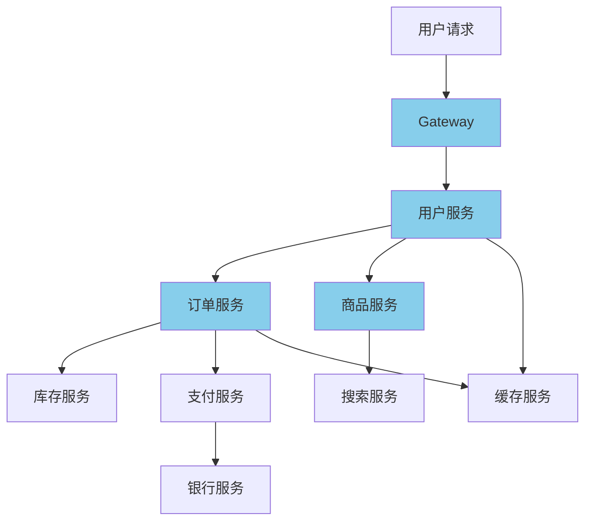

# 分布式链路追踪实战

候选人小王在面试字节基础架构团队时，面试官问："你们用链路追踪做什么？TraceId 是怎么在服务间传递的？"

小王说："用的是 SkyWalking..." 面试官追问："那 TraceId 是怎么从父服务传到子服务的？"

小王说："通过 HTTP Header..." 面试官继续追问："那跨线程时呢？ThreadLocal 中的 TraceId 怎么传递到子线程？"

小王支支吾吾答不上来。

面试官又问："Sleuth 的采样策略有哪些？什么场景下需要调整采样率？"

小赵彻底卡住。

【面试官心理】

这道题我用来测试候选人对分布式链路追踪原理的理解。链路追踪是排查微服务问题的核心工具，但很多人只会用不了解原理。能说出 TraceId 透传机制的占 40%，能讲清楚 ThreadLocal 传递和采样策略的只有 15%。链路追踪是微服务架构的必备基础设施，能把这些讲清楚的候选人对分布式系统有较深的理解。

## 一、为什么需要链路追踪 🔴

### 1.1 微服务调用链路



一次用户下单请求，涉及 10+ 个服务调用。当请求超时或出错时，排查问题变得极其困难。

### 1.2 链路追踪的核心概念

```
Trace（追踪）：一次完整的请求链路
  └── Span（跨度）：每个服务的调用记录
       ├── SpanId：当前调用的 ID
       ├── ParentId：父调用的 ID
       ├── TraceId：整条链路的唯一 ID
       └── 时间戳、标签、日志等
```

## 二、Sleuth + Zipkin 原理 🔴

### 2.1 Brave 库核心接口

```java
// Tracer.java - Brave 的核心追踪器
public interface Tracer {
    // 创建新的 Span（用于接收外部请求）
    Tracer.Span next();

    // 创建子 Span（用于内部调用其他服务）
    Span newTrace();

    // 从上下文中提取 Span
    Span joinSpan(TraceContext context);

    // 当前 Span 详情
    Span currentSpan();
}

// Span.java - 单个调用记录
public interface Span {
    // 获取 TraceId
    String traceId();

    // 获取 SpanId
    String spanId();

    // 获取父 SpanId
    String parentId();

    // 添加标签
    Span tag(String key, String value);

    // 记录事件
    Span annotate(String value);

    // 记录耗时
    Span start();
    void finish();

    // 检查是否被采样
    boolean sampled();
}
```

### 2.2 TraceId 和 SpanId 生成

```java
// TraceContext.java - 追踪上下文
public class TraceContext {
    private final String traceId;    // 全链路唯一 ID
    private final long parentId;     // 父 SpanId
    private final long spanId;      // 当前 SpanId
    private final boolean sampled;   // 是否被采样

    // TraceId 生成方式
    // 方式一：使用 Snowflake 算法
    // traceId = timestamp + workerId + sequence
    // 128.168.1.1.1234567890.0001.0001
    // 格式：{ip}.{timestamp}.{threadId}.{sequence}

    // 方式二：UUID
    // traceId = UUID.randomUUID().toString()

    // SpanId 生成方式
    // spanId = incrementAndGet()  // 原子递增
}

// SpanId 的层级关系
/*
 * Trace: traceId = abc123
 *   Span1: spanId=1, parentId=null    (入口服务)
 *     Span2: spanId=2, parentId=1      (调用订单服务)
 *       Span3: spanId=3, parentId=2    (调用库存服务)
 *       Span4: spanId=4, parentId=2    (调用支付服务)
 *     Span5: spanId=5, parentId=1      (调用商品服务)
 */
```

### 2.3 TraceId 在 HTTP 调用中的透传

```java
// Brave 的 HTTP 拦截器
// TracingClientHttpRequestInterceptor.java

// 发送请求时：添加 TraceId 到 Header
public class TracingClientHttpRequestInterceptor implements ClientHttpRequestInterceptor {
    @Override
    public ClientHttpResponse intercept(HttpRequest request, byte[] body,
                                          ClientHttpRequestExecution execution) {
        Span span = tracer.next().name("http").start();

        try (Tracer.SpanInScope scope = tracer.withSpanInScope(span)) {
            // 1. 添加 TraceId 到请求头
            SpanTextPublisher.addTracingHeaders(
                request.getHeaders(),
                span.context()
            );

            // 发送请求
            ClientHttpResponse response = execution.execute(request, body);

            // 2. 记录 HTTP 响应信息
            span.tag("http.status_code", String.valueOf(response.getStatusCode()));
            span.annotate("sr");  // Server Receive

            return response;

        } catch (Throwable t) {
            span.error(t);  // 记录异常
            throw t;

        } finally {
            span.finish();  // 结束 Span
        }
    }
}

// 接收请求时：从 Header 中提取 TraceId
// TracingServerHttpRequestInterceptor.java
public class TracingServerHttpRequestInterceptor
    implements ServerHttpRequestInterceptor {

    @Override
    public ServerHttpResponse intercept(ServerHttpRequest request,
                                          ServerHttpResponse response,
                                          HttpHandler handler) {
        // 1. 从 Header 中提取 TraceContext
        TraceContext context = tracer.joinSpan(
            TracingContextUtil.extract(request.getHeaders())
        );

        try (Tracer.SpanInScope scope = tracer.withSpanInScope(context)) {
            // 2. 继续传递 TraceId
            ServerHttpResponse httpResponse = handler.handle(request, response);

            context.annotate("ss");  // Server Send
            return httpResponse;

        } finally {
            context.finish();
        }
    }
}

// 关键的 Header 名称
/*
 * X-B3-TraceId:    TraceId
 * X-B3-SpanId:     SpanId
 * X-B3-ParentSpanId: 父 SpanId
 * X-B3-Sampled:   是否采样
 * X-B3-Flags:     调试标志
 */
```

### 2.4 TraceId 在线程间的透传

```java
// ❌ 错误：直接使用 ThreadLocal，子线程拿不到 TraceId
@Service
public class OrderService {
    public void createOrder() {
        // 父线程：TraceId 在 ThreadLocal 中
        Span span = tracer.currentSpan();

        // 子线程：TraceId 丢失
        CompletableFuture.runAsync(() -> {
            tracer.currentSpan();  // null！TraceId 丢失
            // 异步处理逻辑
        });
    }
}

// ✅ 正确：使用 ScopedSpan 或手动传递
@Service
public class OrderService {
    // 方式一：使用 InheritableThreadLocal（默认支持）
    // InheritableThreadLocal 会自动继承给子线程
    // 但线程池场景下会失效

    // 方式二：手动传递 TraceContext
    public void createOrder() {
        Span parentSpan = tracer.currentSpan();

        CompletableFuture.runAsync(() -> {
            // 1. 手动创建子 Span，继承父 Span 的 TraceId
            Span childSpan = tracer.newTrace()
                .parent(parentSpan.context())  // 继承父 Context
                .name("async-task")
                .start();

            try (Tracer.SpanInScope scope = tracer.withSpanInScope(childSpan)) {
                // 异步处理逻辑
            } finally {
                childSpan.finish();
            }
        }, Executors.newFixedThreadPool(10));
    }

    // 方式三：使用 Brave 提供的 Executor
    public void createOrder() {
        Span parentSpan = tracer.currentSpan();

        // Brave 封装的线程池，自动传递 TraceContext
        ExecutorService executor = BraveExecutors.newBoundedExecutorService(
            10,
            named("async").and(tracer.currentTraceContext()).get()
        );

        executor.submit(() -> {
            // 自动继承了父 Span 的 TraceId
            tracer.currentSpan();  // 可以拿到
        });
    }
}

// 方式四：使用 @Async 注解
@Configuration
public class AsyncConfig implements AsyncConfigurer {
    @Override
    public Executor getAsyncExecutor() {
        // 使用 Brave 封装的线程池
        return BraveExecutors.newBoundedExecutorService(
            10,
            tracer.currentTraceContext()
        );
    }
}

@Service
public class OrderService {
    @Async
    public void asyncCreateOrder() {
        // 自动继承了父 Span 的 TraceId
    }
}
```

## 三、采样策略 🟡

### 3.1 常用采样策略

```java
// Sampler.java - 采样接口
public interface Sampler {
    boolean isSampled(TraceContext context);
}

// 1. AlwaysSampler：全部采样
Sampler alwaysSampler = Sampler.always();

// 2. NeverSampler：全部不采样
Sampler neverSampler = Sampler.never();

// 3. PercentageBasedSampler：按比例采样
// 1000 个请求中，采样 10%
// 但在高并发场景下，可能采样不均匀
Sampler percentageSampler = new PercentageBasedSampler(0.1);

// 4. ReservoirSamplingSampler：水库采样
// 保证采样均匀性
// 即使 100 万请求，采样结果也相对均匀
Sampler reservoirSampler = new ReservoirSamplingSampler(100, 0.1);

// 5. BoundarySampler：边界采样
// 在采样边界时额外采样，减少误判
Sampler boundarySampler = new BoundaryBasedSampler(0.1);
```

### 3.2 生产环境采样配置

```yaml
# application.yml
spring:
  sleuth:
    # 默认采样率：10%
    sampler:
      probability: 0.1
      # 采样频率（每 N 个请求采样 1 个）
      rate: 10
      # 最大采样数（每秒）
      max: 100

  zipkin:
    # Zipkin 服务地址
    base-url: http://zipkin-server:9411
    # 使用 HTTP 发送（也可使用 MQ）
    sender:
      type: web
    # 采样百分比（和 sleuth.sampler.probability 效果相同）
    sample:
      rate: 0.1
```

:::tip 💡
生产环境不建议 100% 采样，因为：
1. 链路数据量巨大，存储成本高
2. 对服务性能有一定影响
3. 通常 5%-20% 采样足够分析问题

但对于关键链路（如支付、下单），建议 100% 采样。
:::

## 四、Feign + RestTemplate + WebClient 集成 🔴

### 4.1 Feign 集成 Sleuth

```java
// Spring Cloud OpenFeign 默认集成了 Sleuth
// 无需额外配置，Feign 请求会自动传递 TraceId

// 但如果使用自定义的 FeignClient，需要确保传递 Header
@Bean
public RequestInterceptor tracingRequestInterceptor(Tracer tracer) {
    return template -> {
        // 从当前上下文中获取 TraceContext
        Span currentSpan = tracer.currentSpan();
        if (currentSpan != null) {
            // 添加到请求头
            template.header("X-B3-TraceId", currentSpan.traceId());
            template.header("X-B3-SpanId", currentSpan.spanId());
        }
    };
}
```

### 4.2 RestTemplate 集成

```java
// 方式一：使用 @LoadBalanced + 拦截器
@Configuration
public class RestTemplateConfig {
    @Bean
    @LoadBalanced
    public RestTemplate restTemplate() {
        // 默认已集成 Sleuth
        return new RestTemplate();
    }
}

// 方式二：手动添加拦截器
@Bean
public RestTemplate restTemplate() {
    RestTemplate template = new RestTemplate();
    template.setInterceptors(Collections.singletonList(
        new BraveClientHttpRequestInterceptor(tracer)
    ));
    return template;
}
```

### 4.3 WebClient 集成

```java
// WebClient 配置
@Configuration
public class WebClientConfig {
    @Bean
    public WebClient webClient(WebClient.Builder builder, Tracer tracer) {
        return builder
            .filter((request, next) -> {
                Span span = tracer.next().name("webclient").start();

                try (Tracer.SpanInScope scope = tracer.withSpanInScope(span)) {
                    // 添加 TraceId Header
                    ClientRequest modifiedRequest = ClientRequest.from(request)
                        .header("X-B3-TraceId", span.traceId())
                        .header("X-B3-SpanId", span.spanId())
                        .build();

                    return next.exchange(modifiedRequest);
                } finally {
                    span.finish();
                }
            })
            .build();
    }
}
```

## 五、Zipkin 传输方式 🟡

### 5.1 HTTP 传输

```yaml
# application.yml
spring:
  zipkin:
    base-url: http://zipkin-server:9411
    sender:
      type: web  # 默认使用 HTTP
```

简单但在高并发场景下有性能问题。

### 5.2 MQ 传输（推荐）

```xml
<!-- 引入 Kafka 或 RabbitMQ -->
<dependency>
    <groupId>org.springframework.cloud</groupId>
    <artifactId>spring-cloud-starter-sleuth</artifactId>
</dependency>
<dependency>
    <groupId>org.springframework.kafka</groupId>
    <artifactId>spring-kafka</artifactId>
</dependency>
```

```yaml
# application.yml
spring:
  zipkin:
    # 禁用 HTTP，使用 Kafka
    sender:
      type: kafka
    kafka:
      topic: zipkin
    # 压缩
    compression:
      enabled: true
```

```java
// Kafka 配置
spring:
  kafka:
    bootstrap-servers: kafka-server:9092
    producer:
      acks: 1
      retries: 3
      compression-type: lz4
```

## 六、SkyWalking vs Jaeger vs Zipkin 🟡

| 维度 | Zipkin | Jaeger | SkyWalking |
| --- | --- | --- | --- |
| 语言 | Java/Go/.NET/JS | 多语言 | Java/Go/Node.js |
| 存储 | ES/Cassandra/MySQL | ES/Cassandra/TiDB | ES/H2/MySQL |
| Agent | 非侵入（通过拦截器）| 非侵入 | 侵入（Java Agent）|
| 性能开销 | 中 | 低 | 低 |
| 功能 | 基础追踪 | 高级追踪 | APM（全链路监控）|
| 分布式追踪 | 支持 | 支持 | 支持 |
| VM/指标 | 不支持 | 不支持 | 支持 |
| 适用场景 | 中小型系统 | 云原生/多语言 | 大型企业级系统 |

## 七、常见翻车现场 🔴

### ❌ 翻车点一：@Async 方法丢失 TraceId

```java
// ❌ 错误：使用 Spring 的 @Async，ThreadLocal 中的 TraceId 丢失
@Async
public void asyncProcess() {
    String traceId = tracer.currentSpan().traceId();  // null
}

// ✅ 正确：配置 Brave 封装的 Executor
@Bean
public AsyncExecutor asyncExecutor(Tracer tracer) {
    ExecutorService delegate = Executors.newFixedThreadPool(10);
    return new TracingExecutorService(delegate, tracer);
}

@Async
public void asyncProcess(AsyncExecutor executor) {
    // 自动继承了 TraceId
}
```

### ❌ 翻车点二：MDC 中的 TraceId 丢失

```java
// Logback 的 MDC（Mapped Diagnostic Context）
// 用于在日志中打印 TraceId
// 但 MDC 默认不传递到子线程

// ❌ 错误：MDC 丢失
log.info("开始处理");
// 子线程中 MDC 丢失
CompletableFuture.runAsync(() -> log.info("异步处理"));

// ✅ 正确：手动传递 MDC
@Slf4j
public class TraceMDCFilter extends OncePerRequestFilter {
    @Override
    protected void doFilterInternal(HttpServletRequest request,
                                     HttpServletResponse response,
                                     FilterChain chain) {
        String traceId = request.getHeader("X-B3-TraceId");

        try {
            // 设置 MDC
            MDC.put("traceId", traceId);

            chain.doFilter(request, response);

        } finally {
            MDC.remove("traceId");
        }
    }
}

// 配置 Logback 打印 traceId
<PatternLayout>
    <pattern>%d{yyyy-MM-dd HH:mm:ss.SSS} [%thread] [%X{traceId}] %-5level %logger{36} - %msg%n</pattern>
</PatternLayout>
```

### ❌ 翻车点三：采样率过高影响性能

```yaml
# ❌ 错误：100% 采样
spring:
  sleuth:
    sampler:
      probability: 1.0  # 100% 采样

# ✅ 正确：适度采样
spring:
  sleuth:
    sampler:
      probability: 0.1  # 10% 采样

# ✅ 重要接口 100% 采样
spring:
  sleuth:
    sampler:
      probability: 0.1
    # 针对特定接口配置不同采样率
    custom-sampler:
      order-service: 1.0  # 订单服务 100% 采样
      read-service: 0.05  # 读服务 5% 采样
```

:::warning ⚠️
链路追踪的数据量很大，生产环境需要配置合理的采样率。同时需要注意链路数据的存储成本，通常使用 Elasticsearch 或 Cassandra 等分布式存储。Zipkin 的存储默认是 in-memory，生产环境必须配置持久化存储。
:::

【面试官心理】

这道题我通常从 TraceId 和 SpanId 的概念开始，逐步深入到 HTTP 透传、线程间传递、采样策略、SkyWalking vs Zipkin vs Jaeger 的对比。能说出 TraceId 透传机制的占 40%，能讲清楚 ThreadLocal 传递和 MDC 配合的占 25%，能说出采样策略和生产避坑的只有 10%。链路追踪是微服务排查问题的核心工具，能把这些讲清楚的候选人对分布式系统有较深的理解。
