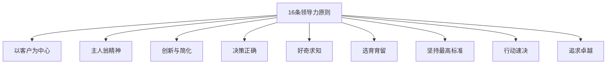

# 亚麻16条领导力原则

如果你要面试亚马逊（或任何一家重视文化的公司），亚马逊的 16 条领导力原则是你必须烂熟于心的「武功秘籍」。

不是因为要「迎合」亚马逊，而是因为这些原则本身就是优秀职场人的底层素养——掌握它们，不仅能通过面试，还能让你在职场中受益终身。

## 面试官最关心的 3 个问题

> **问题 1**：亚马逊的 16 条领导力原则分别考察什么？
> **问题 2**：如何用领导力原则准备 BQ 故事？
> **问题 3**：面试时如何在回答中「嵌入」领导力原则？

## 16 条领导力原则一览



## 核心原则详解

### 1. Customer Obsession（客户至上）

**原则**：领导者从客户的角度出发，想客户之所想。

**核心问题**：你的工作最终给客户带来了什么价值？

**面试问题示例**：

- 请描述一次你为了提升客户体验而超越职责范围的经历。
- 当客户需求和业务目标冲突时，你是怎么处理的？

**回答示例**：

```
【情境】在我们电商平台，用户反馈下单流程太复杂，转化率只有 60%。
【任务】作为产品负责人，需要提升用户体验和转化率。
【行动】
- 我花了 2 周时间分析用户行为数据，定位到用户在支付环节流失最严重
- 深入访谈 20 位用户，发现问题在于支付方式选择太多、页面加载慢
- 主导与支付团队、风控团队的协作，简化支付流程
- 上线前做 A/B 测试，确保改动正向
【结果】转化率从 60% 提升至 75%，每月 GMV 增加 200 万
【反思】这次经历让我深刻理解：客户体验不是功能多少，而是「能不能轻松完成任务」
```

### 2. Ownership（主人翁精神）

**原则**：领导者是主人，不等不靠，主动承担。

**核心问题**：你会为团队/公司的结果负责吗？

**面试问题示例**：

- 请描述一次你主动发现并解决了不在你职责范围内的问题。
- 当项目遇到困难而你的老板不在时，你会怎么做？

**回答示例**：

```
【情境】我负责用户增长模块，发现供应链系统的 bug 导致用户体验很差。
【任务】这个问题不在我的职责范围，但我意识到它直接影响用户增长目标。
【行动】
- 我主动调研了问题根源，发现是库存同步机制的缺陷
- 组织跨团队技术讨论，推动供应链团队优先修复
- 同时设计了一个临时解决方案，缓解用户体验问题
【结果】问题在一周内得到解决，用户满意度 NPS 提升 15 分
【反思】把自己的事做完是本分，把别人的事当成自己的事，才是真正的 Ownership
```

### 3. Invent and Simplify（创新与简化）

**原则**：领导者期望并寻求创新，同时不断简化。

**核心问题**：你如何在工作中创新？如何避免过度复杂？

**面试问题示例**：

- 请描述一次你简化了复杂流程或系统的经历。
- 当现有方案太复杂时，你是怎么提出更简单方案的？

**回答示例**：

```
【情境】团队有 10 个独立的后台管理系统，每个系统都要单独登录维护。
【任务】需要统一这些系统的认证和入口，提升团队效率。
【行动】
- 调研后提出「统一工作台」方案，但实现成本高
- 进一步思考，发现核心问题是 SSO 认证不是入口统一
- 最终采用渐进方案：第一阶段统一认证，第二阶段整合入口
【结果】团队登录时间减少 80%，新系统接入时间从 2 周缩短至 2 天
【反思】好的方案不是解决所有问题，而是解决核心问题
```

### 4. Are Right, A Lot（决策正确）

**原则**：领导者有良好的判断力和直觉，追求正确决策。

**核心问题**：你如何做出正确决策？

**面试问题示例**：

- 请描述一次你的决策被证明是正确的经历。
- 当信息不完整时，你是怎么做决策的？

**回答示例**：

```
【情境】公司决定是否上线一个新功能，团队内部意见分歧严重。
【任务】作为技术负责人，需要给出技术视角的判断建议。
【行动】
- 收集了竞品数据、用户调研、技术风险评估
- 制作决策矩阵，从用户价值、技术可行性、商业收益三个维度打分
- 明确指出：虽然有风险，但核心风险可管控，潜在收益值得尝试
- 建议先做灰度发布，降低风险
【结果】功能上线后数据正向，决定被验证为正确
【反思】决策不是赌博，是系统性地评估风险和收益
```

### 5. Learn and Be Curious（好奇求知）

**原则**：领导者永远保持学习热情，不断探索新事物。

**核心问题**：你是怎么保持学习和成长的？

**面试问题示例**：

- 请描述一次你学习了新技能并应用到工作中的经历。
- 最近你在学习什么？是怎么学习的？

**回答示例**：

```
【情境】团队开始用 Kubernetes，但我没有相关经验。
【任务】需要在 3 个月内掌握 K8s 并落地应用容器化。
【行动】
- 制定学习计划：官方文档 → 实战项目 → 内部分享
- 每周投入 10 小时学习，2 个月完成入门
- 在团队内做技术分享，推动落地
【结果】3 个月后主导完成服务容器化，部署效率提升 50%
【反思】技术变化快，唯有持续学习才能不被淘汰
```

### 6. Hire and Develop the Best（选育留人）

**原则**：领导者招聘和培养最优秀的人才。

**核心问题**：你是怎么培养团队成员的？

**面试问题示例**：

- 请描述一次你帮助团队成员成长的经历。
- 你是怎么招聘和培养新人的？

**回答示例**：

```
【情境】团队新来一位 P5 同学，技术基础不错但缺乏项目经验。
【任务】需要帮助他快速成长，胜任核心项目。
【行动】
- 入职第一周进行充分沟通，了解他的学习风格和职业规划
- 制定 3 个月的成长计划：基础 → 进阶 → 实战
- 每周 1:1 沟通，及时反馈和调整
- 分配适度挑战的任务，给他独立解决问题的空间
【结果】3 个月后他能独立负责子模块，6 个月后晋升 P6
【反思】培养人的过程，也是自己成长的过程
```

### 7. Insist on the Highest Standards（坚持最高标准）

**原则**：领导者不断提升标准，交付卓越成果。

**核心问题**：你如何在工作中坚持高标准？

**面试问题示例**：

- 请描述一次你坚持高标准而带来额外工作的经历。
- 当团队觉得「差不多就行」时，你是怎么推动高质量交付的？

**回答示例**：

```
【情境】项目 deadline 临近，团队觉得「代码能跑就行」。
【任务】作为技术负责人，需要在有限时间内保证质量。
【行动】
- 与团队达成共识：代码质量是长期债，低质量会拖慢后续迭代
- 重新评估 scope，砍掉非核心功能，保证核心功能质量
- 引入代码 review 机制，互相监督
【结果】按时上线，线上 bug 率为零，后续迭代效率提升 30%
【反思】高标准不是完美主义，是减少未来的返工
```

### 8. Bias for Action（行动速决）

**原则**：领导者快速行动，不怕犯错。

**核心问题**：你如何在不确定性下做出决策和行动？

**面试问题示例**：

- 请描述一次你快速行动并从中学到东西的经历。
- 当信息不完整时，你会怎么做？

**回答示例**：

```
【情境】竞品上线了类似功能，我们需要快速跟进。
【任务】需要在 2 周内上线 MVP 版本。
【行动】
- 快速分析竞品功能，确定核心功能点
- 与团队对齐：先跑通核心流程，非核心后续迭代
- 每天 standup，快速解决阻塞问题
【结果】2 周后 MVP 上线，抢占了市场窗口期
【反思】在商业竞争中，速度往往比完美更重要
```

### 9. Frugality（勤俭节约）

**原则**：领导者以更少的资源完成更多的事情。

**核心问题**：你是如何在资源有限的情况下达成目标的？

**面试问题示例**：

- 请描述一次你在资源有限时完成重要任务的经历。
- 你是如何用有限预算/人力达成目标的？

**回答示例**：

```
【情境】年度预算削减 30%，但业务目标不变。
【任务】需要在更少资源下完成相同的目标。
【行动】
- 重新评估所有项目，砍掉 ROI 低的投入
- 引入自动化工具，减少人工重复劳动
- 优化流程，提升团队效率
【结果】在预算削减 30% 的情况下，完成了 90% 的目标
【反思】资源限制往往能激发创新
```

### 10. Earn Trust（赢得信任）

**原则**：领导者通过倾听、坦诚、尊重来赢得信任。

**核心问题**：你是如何建立信任的？

**面试问题示例**：

- 请描述一次你与信任危机的经历。
- 你是如何在团队中建立信任的？

**回答示例**：

```
【情境】项目因技术风险延期，团队和业务方都有怨气。
【任务】需要修复信任，重新获得支持。
【行动】
- 坦诚沟通：主动承认风险评估不足，请求原谅
- 制定明确的修复计划：每周同步进展，接受监督
- 说到做到：每周按承诺交付进度
【结果】3 个月后项目成功上线，重新赢得信任
【反思】信任一旦失去，需要很长时间修复，但坦诚是最好的策略
```

### 11-16 条原则概览

| 编号 | 原则 | 核心问题 |
|------|------|----------|
| **11** | Dive Deep（深入研究） | 你会深入细节解决问题吗？ |
| **12** | Have Backbone, Disagree and Commit（敢于挑战） | 你能勇敢表达不同意见吗？ |
| **13** | Deliver Results（达成结果） | 你能在压力下交付成果吗？ |
| **14** | Strive to be Earth's Best Employer（成为最佳雇主） | 你如何为团队创造好环境？ |
| **15** | Success and Scale Bring Broad Responsibility（成功带来责任） | 你如何承担更大的社会责任？ |

## 如何用领导力原则准备 BQ

### 步骤 1：列出核心故事

针对每条原则，准备 1-2 个故事，确保故事：

- 真实发生过
- 有具体细节和数据
- 能展示你的独特贡献

### 步骤 2：用原则标注故事

```
故事 A：
- 适用于：Customer Obsession
- 适用于：Ownership
- 适用于：Bias for Action

故事 B：
- 适用于：Invent and Simplify
- 适用于：Insist on Highest Standards
```

### 步骤 3：面试中自然嵌入

**错误示范**（生硬嵌入）：

```
这个问题体现了 Customer Obsession 原则……」
```

**正确示范**（自然融入）：

```
我认为这个问题首先要从客户的角度思考……
最终这个方案让客户满意度提升了 30%……
```

## ⚠️ 常见陷阱

### 陷阱 1：只说不做

**错误**：面试中只列举领导力原则，但回答空洞。

**正确**：用具体故事支撑每个原则。

### 陷阱 2：过度「亚马逊化」

**错误**：回答中频繁提到「16 条原则」，显得刻意迎合。

**正确**：理解原则本质，自然表达。

### 陷阱 3：只讲团队不讲自己

**错误**：「我们团队」做了 XXX。

**正确**：「我」在团队中做了 XXX。

## 常见问题

**Q：不是面试亚马逊，也需要准备这些原则吗？**

A：是的。这些原则是优秀职场人的通用素养，很多公司（如字节、美团）也有类似的价值观考察。

**Q：一条原则可以用同一个故事吗？**

A：可以，但不建议。一个故事最好只用于一个原则，这样每个故事都能深入展开。

**Q：如果我的经历不够「亮眼」怎么办？**

A：原则不是要求「拯救世界」，而是要求你在自己的岗位上做到最好。选择能讲清楚的、真实的、有反思的故事即可。

---

**延伸阅读**：

- [BQ 回答框架](./framework)
- [常见BQ题50道](./questions)
- [如何判断面试官在挖BQ坑](./traps)
