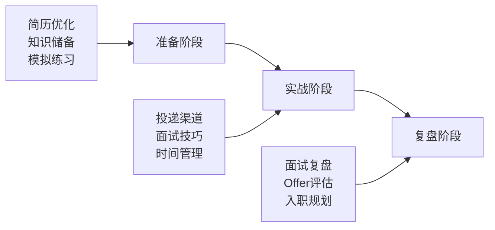

# 面试准备总览

面试是一场系统工程，从简历投递到 offer 谈判，每个环节都可能决定最终结果。很多人以为面试准备只是「刷题」，结果技术面过了，却在 HR 面上谈崩了；还有人精心准备了一周，面试前一天才发现公司已经关闭招聘。这些问题的根源在于：缺乏系统性的面试准备框架。

本模块将按照面试全流程，分八个方向帮助读者建立完整的面试准备体系。

## 模块导览

### 🔴 核心模块（必读）

| 模块 | 核心价值 | 优先级 |
|------|----------|--------|
| **面试流程** | 了解从投递到 offer 的完整流程，不同公司轮次差异 | P0 |
| **简历优化** | 让简历通过 ATS 筛选，获得面试机会 | P0 |
| **行为面试** | BQ 问题回答技巧，亚麻 16 条领导力原则 | P0 |
| **HR 面试** | 薪资谈判、offer 评估、offer 谈判技巧 | P0 |

### 🟡 重要模块（高频）

| 模块 | 核心价值 | 优先级 |
|------|----------|--------|
| **智力题** | 概率、博弈、估算、逻辑推理题的解题方法论 | P1 |
| **面经汇总** | 各公司面试风格、级别对标、针对性准备 | P1 |
| **复盘与评估** | 面试复盘方法、offer 评估维度、入职计划 | P1 |

## 快速自测

在开始之前，先做一个小测试，看看你的面试准备处于什么阶段：

> **问题 1**：如果简历投出去 3 天没有回应，你应该怎么做？
> 
> A. 等待 B. 重新投递 C. 联系 HR 跟进 D. 优化简历

> **问题 2**：技术面试的最后一道题没答好，会影响整体评价吗？
> 
> A. 会，B 面试官看整体表现 C 不确定

> **问题 3**：HR 问「你的期望薪资是多少」，最好的回答方式是？
> 
> A. 直接给出一个数字 B. 问对方预算 C. 给出一个范围并说明理由 D. 先反问对方的薪资结构

> **问题 4**：面试结束后，多久发送感谢邮件最合适？
> 
> A. 当天 B. 第二天 C. 等到下一轮面试前 D. 不需要发送

**参考答案**：1-C, 2-B, 3-C, 4-A

答错 2 道以上，说明你需要系统性地学习面试准备流程。

## 面试准备的三个阶段

面试准备可以分为三个阶段，每个阶段的重点不同：

### 准备阶段（提前 4-8 周）

这一阶段的核心任务是「补短板」。很多人喜欢在自己已经熟悉的领域反复刷题，却忽略了补足自己的弱项。

建议的准备顺序：

1. **简历诊断**：找 3-5 个已经成功的同学帮忙看简历，或者使用简历优化工具评估
2. **技术储备**：根据目标公司的面试题库，针对性复习
3. **BQ 准备**：准备 5-10 个核心 BQ 故事，覆盖不同类型
4. **模拟面试**：至少进行 2-3 次模拟面试，包括技术面和行为面

### 实战阶段（1-4 周）

这一阶段的核心是「高效执行」。拿到面试机会后，要迅速进入状态。

关键点：

- 每天保证 2-3 小时的针对性复习
- 面试前了解公司业务和技术栈
- 面试后 24 小时内发送感谢邮件
- 记录每次面试的问题和表现

### 复盘阶段（贯穿全程）

很多人只关注「怎么准备」，却忽略了「怎么复盘」。复盘是快速提升的关键。

复盘的核心问题：

1. 哪些问题回答得好？为什么？
2. 哪些问题回答得差？差在哪里？
3. 下次遇到类似问题，应该怎么回答？
4. 这次面试暴露了哪些知���短板？

## 不同级别的面试重点

| 级别 | 技术深度要求 | BQ 权重 | 薪资谈判空间 |
|------|-------------|---------|--------------|
| **P5** | 熟练使用，能解决实际问题 | 30% | 有限 |
| **P6** | 理解原理，能做技术方案设计 | 40% | 中等 |
| **P7** | 深度掌握，能带团队做技术决策 | 50% | 较大 |

> **注意**：P7 及以上的面试，行为面试（BQ）的权重会显著提升，有时甚至超过技术面试。很多 P6 升 P7 的候选人挂在 BQ 上，就是因为低估了 BQ 的重要性。

## 常见误区

| 误区 | 正确做法 |
|------|----------|
| 等准备好再投简历 | 先投再看，面试是最好的准备 |
| 只刷题不准备 BQ | 技术:BQ = 6:4 准备时间 |
| 忽视 HR 面 | HR 面决定最终薪资 |
| offer 拿到就结束 | 谈判可以多拿 10-30% 薪资 |
| 面试完不复盘 | 每场面经都是下次成功的基石 |

## 延伸阅读

如果你已经准备好进入具体模块，可以从以下任一方向开始：

- [大厂面试流程详解](./process/flow) —— 了解从投递到 offer 的完整流程
- [STAR 法则详解](./resume/star) —— 让简历和 BQ 回答更有说服力
- [常见 BQ 题 50 道](./behavioral/questions) —— 覆盖所有高频 BQ 类型
- [期望薪资的回答技巧](./hr/salary-answer) —— 不要在 HR 面上吃亏

---

**下一章预告**：如果你不确定「我应该什么时候开始投简历」，请继续阅读 [面试时间线规划](./process/timeline)。
