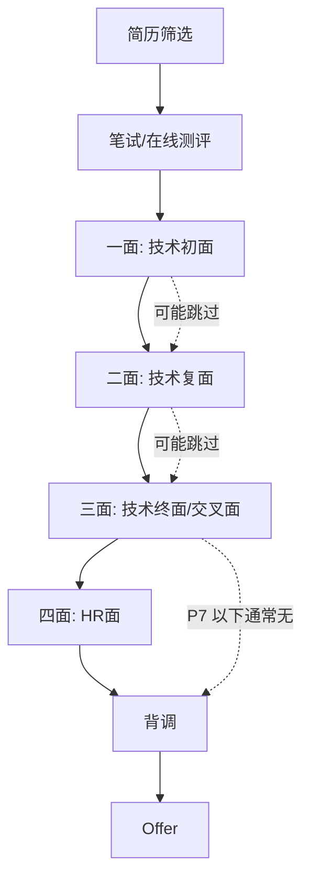

# 大厂面试流程详解

面试流程不熟悉，上来就被问懵了？很多候选人在技术面试中表现不错，却因为不了解面试流程而在不该紧张的时候紧张，不该放松的时候放松。本章将详细介绍国内大厂（阿里、腾讯、字节、美团等）的标准面试流程，帮助你在每个环节都游刃有余。

## 面试官最关心的 3 个问题

> **问题 1**：国内大厂的标准面试流程是几轮？每轮考察什么？
> **问题 2**：为什么有时候技术面完突然加了交叉面或 HR 面？
> **问题 3**：如果某轮面试表现很差，会影响最终结果吗？

## 标准面试流程概览

### 国内大厂通用流程



### 各轮次详细说明

| 轮次 | 名称 | 时长 | 面试官 | 核心考察 |
|------|------|------|--------|----------|
| **第一轮** | 技术初面 | 45-60 分钟 | 高级工程师/技术组长 | 基础知识、项目经历 |
| **第二轮** | 技术复面 | 45-60 分钟 | 资深工程师/技术专家 | 深度追问、系统设计 |
| **第三轮** | 技术终面/交叉面 | 45-60 分钟 | 部门 leader/跨部门专家 | 架构能力、价值观匹配 |
| **第四轮** | HR 面 | 30-45 分钟 | HR | 动机、文化匹配、薪资期望 |
| **背调** | 背景调查 | 3-5 工作日 | 第三方机构 | 履历真实性 |

## 各公司面试流程差异

### 阿里巴巴/蚂蚁集团

```
流程特点：流程较长，通常 5-7 轮，注重候选人的综合素质

标准流程：
一面（技术初面，45分钟）
    ↓
二面（技术复面，45分钟）
    ↓
三面（交叉面，45分钟）← 可能被加面
    ↓
四面（HR面，30分钟）
    ↓
背调
    ↓
Offer
```

**特别说明**：

- 阿里系喜欢「多对一」面试，即一轮面试中可能有多位面试官同时在场
- 蚂蚁集团的技术面试可能会考察候选人的金融业务理解
- P7 及以上可能需要通过晋升委员会评审

### 腾讯

```
流程特点：微信事业群流程最短，其他事业群 4-5 轮

标准流程（微信事业群）：
一面（技术初面）
    ↓
二面（技术复面）
    ↓
HR面
    ↓
Offer

标准流程（其他事业群）：
一面（技术初面）
    ↓
二面（技术复面）
    ↓
三面（技术终面）
    ↓
HR面
    ↓
Offer
```

**特别说明**：

- 腾讯的面试流程相对标准化，每轮面试后都会给候选人打分
- 微信事业群因为招聘量大，流程被大幅压缩
- 腾讯云、CSIG 等部门可能需要现场笔试

### 字节跳动

```
流程特点：速度快，最快 3 天完成全部面试

标准流程：
一面（技术初面，45分钟）
    ↓
二面（技术复面，45分钟）
    ↓
三面（技术终面，45分钟）← 可能是跨部门面试
    ↓
HR面（30分钟）
    ↓
背调
    ↓
Offer
```

**特别说明**：

- 字节的面试流程是所有大厂中最快的，最快记录是 3 天完成从初面到 offer
- 字节的面试官通常会在当天或第二天给出面试反馈
- 字节跳动鼓励「内推」，内推简历会被优先处理
- 每轮面试都会在系统中留下详细评价，后面的面试官可以看到

### 美团

```
流程特点：流程清晰，节奏稳定

标准流程：
一面（技术初面）
    ↓
二面（技术复面）
    ↓
三面（技术终面/交叉面）← P6+ 需要
    ↓
HR面
    ↓
Offer
```

**特别说明**：

- 美团的面试流程比较稳定，每轮面试间隔通常 3-5 天
- 美团的技术面试可能会考察候选人的代码规范性
- 稳定性是美团 HR 面考察的重点之一

### 百度

```
流程特点：技术轮次可能较多，注重深度

标准流程：
一面（技术初面）
    ↓
二面（技术复面）
    ↓
三面（技术终面）
    ↓
四面（部门leader面）← 可能加面
    ↓
HR面
    ↓
Offer
```

**特别说明**：

- 百度的面试流程可能因部门而异
- 自动驾驶、AI 等核心部门的面试难度较高
- 百度会在某些轮次进行笔试或现场写代码

## ⚠️ 常见陷阱

### 陷阱 1：以为「技术面完了就稳了」

很多候选人技术面表现不错，以为后面的 HR 面只是「走流程」。结果在 HR 面上表现很差（薪资期望太高、稳定性被质疑、价值观不匹配），最终被卡在 HR 面上。

**正确做法**：每一轮面试都要认真准备，包括 HR 面。

### 陷阱 2：被加面时心态崩溃

有时候面试官觉得候选人「潜力不错但还不够」，会临时加一轮面试。候选人此时往往心态崩溃，表现反而更差。

**正确做法**：被加面不一定是坏事，说明面试官对你有兴趣，想多了解一下。把加面当作展示自己的额外机会。

### 陷阱 3：每轮面试「重置」表现

有些候选人以为每轮面试是独立的，不会在面试官之间共享信息。结果在第一轮表现很好，第二轮又开始「表演」，和第一轮的人设不一致。

**正确做法**：保持一致的人设和表现，后面的面试官会参考前面的评价。

### 陷阱 4：忽视「隐性轮次」

有些公司（如字节）在技术面之前会增加笔试或在线测评，这些环节虽然不是正式面试，但淘汰率很高。

**正确做法**：提前了解目标公司的招聘流程，不要忽略任何环节。

## 💡 加分回答：如何应对面试流程中的不确定性

> 面试官追问：「如果你在面试过程中发现流程和你预期的不同，你会怎么做？」

普通回答：「我会按照公司的安排来。」

加分回答：「我会保持灵活性，理解不同公司有不同的面试流程。但同时，我也会主动和 HR 沟通，了解每一轮的考察重点，确保我能发挥出最好的水平。比如字节的面试节奏很快，我就需要提前调整状态；而阿里的面试可能轮次较多，我需要做好长期作战的心理准备。这本质上是一个适应能力的问题，我在这方面还是比较有信心的。」

这个回答展示了候选人的适应性、沟通能力和自我认知，是面试官喜欢听到的答案。

## 各轮面试的核心问题

| 轮次 | 面试官关心的问题 | 候选人的应对策略 |
|------|-----------------|-----------------|
| **一面** | 「这人基础扎实吗？项目经历是真的吗？」 | 展示扎实的基础知识，详细描述项目细节 |
| **二面** | 「这人能解决复杂问题吗？有深度吗？」 | 展示技术深度，准备系统设计思路 |
| **三面** | 「这人能带团队吗？价值观匹配吗？」 | 展示 leadership，准备 BQ 故事 |
| **HR面** | 「这人稳定吗？薪资期望合理吗？」 | 展示稳定性，合理表达薪资期望 |

## 面试节奏控制

每轮面试的时间有限，如何在有限时间内展示最关键的自己？

### 45 分钟面试的时间分配建议

```
开场介绍（2-3分钟）
    ↓
项目经历介绍（10-15分钟）
    ↓
技术深度追问（15-20分钟）
    ↓
反问环节（5分钟）
```

### 注意事项

- 不要在前 5 分钟就「抛答案」，留一些悬念让面试官追问
- 如果面试官对某个话题特别感兴趣，可以适当展开
- 反问环节很重要，这是你了解团队的机会

## 常见问题

**Q：面试挂了多久可以再投？**

A：大多数公司有 6 个月的冷冻期（如阿里、腾讯），但如果是不同部门或不同岗位，可能可以缩短到 3 个月。字节的冷冻期较短，通常 3 个月。

**Q：如果某轮面试没通过，后续轮次还需要参加吗？**

A：不需要。通常 HR 会通知你面试流程终止。但如果是因为某轮面试官临时有事导致面试取消，可能会被安排重新面试。

**Q：可以同时面试同一家公司的多个岗位吗？**

A：不建议。大多数公司的招聘系统会显示候选人的所有投递记录，同时投递多个岗位会被认为「没有明确的职业方向」。

---

**延伸阅读**：

- [面试轮次与考察重点](./rounds)
- [时间线规划](./timeline)
- [面试前中后 Checklist](./checklist)
