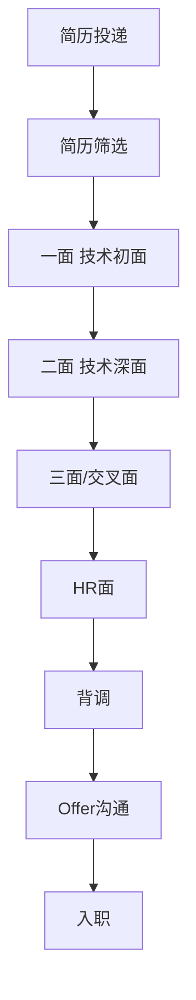

# 面试流程与环节

【面试官手记】
很多候选人技术很强，但输在流程上——不知道面试有几轮、不知道每轮考什么、不知道每个环节要注意什么。面试不是一次性考试，是一场马拉松。这篇指南，带你走完整场面试的每个环节。

## 目录概述

一场完整的面试流程，从简历投递到Offer拿到手，经历多个环节：
- 简历投递与筛选
- 技术面（多轮）
- HR面
- 背调
- Offer沟通
- 入职

每个环节都有它的规则和套路。了解规则，才能利用规则。

## 内容范围

| 主题 | 核心价值 |
| --- | --- |
| [面试流程总览](/interview-prep/process/flow) | 完整面试流程图解 |
| [面试轮次详解](/interview-prep/process/rounds) | 一面/二面/三面/HR面各考察什么 |
| [时间节点](/interview-prep/process/timeline) | 面试各阶段要等多久 |
| [信息渠道](/interview-prep/process/channels) | 怎么获取招聘信息和面试进度 |
| [面试清单](/interview-prep/process/checklist) | 面试前/中/后必做的事项 |

## 学习路径指引

**第一步：了解完整流程**

大厂标准面试流程（不同厂略有差异）：

**第二步：搞清楚每轮考察重点**

| 轮次 | 考察重点 | 时长 | 淘汰率 |
| --- | --- | --- | --- |
| 一面 | 基础扎实度、编程能力 | 45-60min | 30-40% |
| 二面 | 项目深度、技术选型 | 45-60min | 20-30% |
| 三面 | 架构思维、综合能力 | 45-60min | 10-20% |
| HR面 | 稳定性、价值观、薪资 | 30-45min | 5-10% |

**第三步：掌握每个环节的注意事项**

- **简历投递**：不要只投一个岗位，多投几个增加机会
- **一面**：不要紧张，当成技术交流，展示真实水平
- **二面**：会深挖项目，准备好被追问细节
- **三面**：展示架构能力和成长潜力
- **HR面**：提前准备谈薪，不要等技术面完再想

**第四步：跟进进度**

面试不是投完简历就等通知。要主动跟进：
- 面试后发感谢邮件（可选但加分）
- 超过预期时间没回音，主动询问HR
- 多个Offer时协调时间，给自己留选择余地

## 避坑指南

**坑一：只准备技术面，不管其他轮**

技术面只是门槛，HR面和交叉面同样重要。很多技术强的人挂在HR面，不是因为不会谈薪，是因为表现出不稳定或者价值观不匹配。

**坑二：不了解面试形式**

现在很多公司是视频面试+在线编程。提前测试好设备，搞清楚面试平台怎么用。

**坑三：面试时间不会管理**

每道题的时间是有限的。如果一道题卡太久，后面的题就没时间了。学会控制节奏，一道题5-10分钟没思路就先跳过。

**坑四：不问清楚岗位信息**

去面试前要搞清楚：岗位是做什么的、团队规模多大、技术栈是什么。不然面试官问"你对我们团队有什么了解"，你答不上来。

**坑五：面完不跟进**

超过一周没消息可以主动问HR。但不要一天问三遍，会显得太焦虑。

**坑六：同时面多家不协调时间**

同时面多家公司是正常的，但要注意时间协调。不要为了等一家错过另一家的面试机会。

**坑七：拿到Offer不确认细节**

口头Offer不算数。签Offer前确认清楚：薪资结构、职级、入职时间、试用期、股票/期权归属条件。

:::tip 💡
面试是一场信息战。你对流程越了解，准备就越充分。提前知道下一轮考什么，这轮就知道展示什么。
:::

:::warning ⚠️
最容易翻车的环节：反问阶段。面试官问"你有什么问题要问我"，很多人不知道问什么，或者问了一些不该问的问题。这个环节准备得好，能加不少分。
:::
