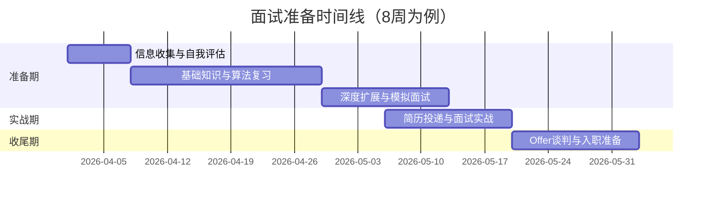

# 时间线规划

「我应该什么时候开始准备面试？」「面试要准备多久？」「万一面试和手上的项目冲突怎么办？」这些问题，几乎每个求职者都会遇到。

答案因人而异，但有一个基本原则：**面试准备是一个持续的过程，而不是一个临时抱佛脚的事件**。

## 面试官最关心的 3 个问题

> **问题 1**：面试准备需要多久？不同级别需要的时间差异有多大？
> **问题 2**：如何平衡日常工作与面试准备？
> **问题 3**：面试高峰期是什么时候？如何把握节奏？

## 面试准备的黄金时间

### 最佳跳槽窗口

```
3月-5月（金三银四）：招聘旺季，机会最多
9月-11月（金九银十）：次佳窗口，部分公司年底冲刺
```

> **注意**：这两个窗口不是「只能在这段时间面试」，而是「这段时间机会最多、HC 最充足」。如果你在其他时间准备充分了，照样可以拿到 offer。

### 不同级别的准备时间

| 级别 | 建议准备时间 | 核心工作量 |
|------|-------------|-----------|
| **P5** | 4-6 周 | 算法题 100 道 + 项目梳理 |
| **P6** | 6-8 周 | 算法题 200 道 + 系统设计 + BQ 准备 |
| **P7** | 8-12 周 | 算法题 200 道 + 系统设计 + 架构思维 + Leadership 故事 |

## 面试准备时间线（以 8 周为例）

### 第一阶段：信息收集与自我评估（第 1 周）

```
目标：明确目标、了解差距、制定计划
```

**任务清单**：

- 确定目标公司清单（5-10 家）
- 了解目标公司的面试流程和考察重点
- 自我评估：哪些知识点熟悉，哪些需要补足
- 优化简历：通过 ATS 关键词检查
- 列出「项目亮点清单」：至少 10 个可讲述的故事

**每天投入时间**：2-3 小时

### 第二阶段：基础知识与算法（第 2-4 周）

```
目标：补足技术短板，系统复习核心知识
```

**任务清单**：

- 系统复习目标岗位的核心知识（如 Java 工程师复习 JUC、JVM、MySQL）
- 每天完成 3-5 道算法题，重点类型：链表、树、动态规划
- 整理「高频面试题清单」：至少 50 道
- 开始准备 BQ 故事：至少 5 个完整 STAR 故事

**每天投入时间**：3-4 小时

### 第三阶段：深度扩展与模拟面试（第 5-6 周）

```
目标：提升深度，增加实战经验
```

**任务清单**：

- 深入学习高级主题：系统设计、源码分析
- 进行 2-3 次模拟面试（技术面 + BQ 面）
- 根据模拟面试反馈，查漏补缺
- 准备「反问清单」：每轮面试准备 3-5 个好问题
- 开始投递简历（边准备边投递）

**每天投入时间**：3-4 小时

### 第四阶段：实战与复盘（第 7-8 周）

```
目标：最大化面试成功率
```

**任务清单**：

- 全力投入面试实战
- 每场面试后 24 小时内复盘
- 根据面试反馈调整策略
- 进入 offer 谈判阶段
- 准备入职相关事宜

**每天投入时间**：根据面试安排灵活调整

## ⚠️ 常见时间管理陷阱

### 陷阱 1：准备完美再投递

很多候选人觉得「我还没准备好，等我刷完 500 道题再投」，结果等到招聘季结束了还没投出去。

**正确做法**：准备到 60-70% 就可以开始投递了。面试是最好的准备方式，每场面试都能让你发现自己的短板。

### 陷阱 2：只刷题不准备项目

有些候选人花 80% 的时间刷算法题，却忽略了项目经历的梳理。结果技术面还行，项目面被问到「你们的系统QPS是多少」，答不上来。

**正确做法**：技术面试的时间分配建议是：基础知识 30%、项目经历 30%、算法题 30%、其他 10%。

### 陷阱 3：忽视 BQ 准备

「BQ 不就是聊天吗？我到时候自由发挥。」这种想法很危险。BQ 问题回答不好，会直接影响最终评级，甚至导致面试失败。

**正确做法**：BQ 准备至少占总准备时间的 20%，准备 5-10 个核心故事，覆盖不同类型。

### 陷阱 4：面试期间停止准备

「拿到面试邀请了，这周要全力准备这一家。」结果这一家挂了，准备节奏也被打断。

**正确做法**：保持每天 1-2 小时的复习节奏，即使在面试期间也不中断。

## 💡 加分回答：如何平衡工作与面试准备

> 面试官追问：「你现在还在职，如何平衡工作和面试准备？」

普通回答：「我会利用周末和晚上的时间准备。」

加分回答：「我会在三个层面做好时间管理——第一，提高日常工作的时间效率，减少不必要的加班，把碎片时间利用起来，比如通勤时刷题；第二，提前和 HR 沟通面试时间，尽量安排在下班后或周末，避免影响正常工作；第三，保持稳定的节奏，每天保证 2 小时的学习时间，周末可以增加到 4-5 小时。面试是双向选择，我不会因为准备面试而影响本职工作，这是最基本的职业素养。」

这个回答展示了候选人的时间管理能力、职业素养和诚信品质，是面试官（尤其是 HR）喜欢听到的。

## 不同场景的时间安排

### 场景 1：在职跳槽（最常见）

**挑战**：时间有限、精力有限

**建议策略**：

- 早起 1 小时：复习基础知识
- 通勤时间：刷算法题（手机上用 LeetCode）
- 午休时间：看技术文章
- 晚上 2 小时：项目复盘 + 系统设计
- 周末 4-5 小时：模拟面试 + 查漏补缺

**关键点**：提高效率比增加时长更重要。

### 场景 2：裸辞跳槽（风险较高）

**挑战**：没有收入压力、容易焦虑

**建议策略**：

- 第一周休息，调整状态
- 第二周开始全力准备，每天 8 小时
- 给自己设定「deadline」：如 3 个月内必须拿到 offer
- 保持社交，避免陷入焦虑

**关键点**：裸辞后 2-3 个月是黄金期，超过 6 个月会开始影响求职竞争力。

### 场景 3：应届生求职

**挑战**：缺乏实战经验、对职场不了解

**建议策略**：

- 提前 1 年开始准备（大三下学期）
- 利用实习机会积累实战经验
- 多参加校招宣讲会，了解公司
- 关注秋招和春招时间节点

**关键点**：校招是最容易进入大厂的渠道，不要错过。

## 面试高峰期攻略

### 3-5 月（金三银四）

**特点**：

- 年终奖已发，员工流动意愿高
- HC（Hiring Count）充足
- 竞争激烈

**应对策略**：

- 提前 1 个月开始投递，不要等到高峰期
- 投递后主动跟进，3 天没回复就问
- 同一时间安排 3-5 家面试，提高成功率

### 9-11 月（金九银十）

**特点**：

- 部分公司有年度招聘计划
- 竞争相对较小（年底离职的人少）
- 可能赶上当年最后一波 HC

**应对策略**：

- 关注公司的秋季招聘计划
- 可以尝试投递一些竞争较小的岗位
- 年底 offer 谈判空间可能更大

## 面试时间线总览



## 每日时间分配建议

| 时段 | 内容 | 时长 |
|------|------|------|
| 早起 1 小时 | 基础知识 | 1h |
| 通勤/碎片时间 | 算法题 | 0.5h |
| 午休时间 | 技术文章 | 0.5h |
| 晚上 1.5 小时 | 项目复盘/系统设计 | 1.5h |
| 周末 | 模拟面试/总结复盘 | 4-5h |
| **合计** | - | **约 2-3h/天** |

## 常见问题

**Q：面试准备需要多久才能有把握？**

A：这个问题没有标准答案，取决于你的基础、目标公司和准备效率。一般来说，P6 级别需要 6-8 周的系统准备，P7 需要 8-12 周。但准备是永无止境的，建议在准备到 60-70% 时就开始投递，在实战中提升。

**Q：可以同时准备多家公司的面试吗？**

A：可以，也应该这样做。不要把鸡蛋放在一个篮子里，同时准备 3-5 家公司可以提高成功率，也能让自己有更多选择。

**Q：如果面试安排和上班冲突怎么办？**

A：可以和 HR 沟通调整时间，大多数公司理解候选人需要请假面试。如果实在无法协调，可以考虑请半天假或者利用午休时间。

**Q：面试期间要告诉同事吗？**

A：不建议。除非你确定要离职，否则不要让同事知道你在找工作。这会影响你的工作关系和职业形象。

---

**延伸阅读**：

- [简历投递渠道对比](./channels)
- [面试前中后 Checklist](./checklist)
- [面试记录与复盘模板](../review/template)
