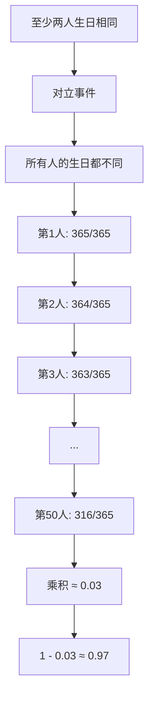

# 概率题解题套路：生日悖论与抽球问题

上周模拟面试，有个学员小陈栽在了一道"简单"的概率题上。

面试官问："50个人的班级，至少两人生日相同的概率是多少？"

小陈张口就来："大概 3%左右吧。"面试官追问："你怎么算的？"他愣了两秒，说："用1减去50个人都不重复的概率..."

面试官点点头："那你算出来是多少？"

他又愣了。

这个问题我见过太多人答错。不是因为概率论没学过，而是因为没有形成一套清晰的解题套路。今天这篇，把概率题的两大核心题型彻底讲透。

## 一、生日悖论：算不对就别说懂概率 🔴

### 1.1 问题拆解

先说标准问题：

> 在 n 个人的班级里，至少有两人生日相同的概率是多少？

很多人会凭直觉想：一年365天，50个人，概率应该很小吧？

错。这个问题的答案会颠覆你的认知。

### 1.2 ❌ 错误示范

**候选人原话**："50个人，生日可能是365种，概率大概是 50/365 = 14% 左右..."

**问题诊断**：
- 把"生日相同"理解成了"某个人和我生日相同"
- 用的是加法思维，不是乘法思维
- 完全没理解"至少两人相同"的逆否命题

**面试官内心 OS**："这种算式的候选人，一听就是背过结论但没理解推导过程的。"

### 1.3 标准回答

**核心思路**：算"至少两人生日相同"的反面——"所有人的生日都不同"。



所以，50个人的班级，生日相同的概率是 **1 - P(50个人生日都不同)**：

```
P(都不相同) = 365/365 × 364/365 × 363/365 × ... × 316/365 ≈ 0.03
P(至少相同) = 1 - 0.03 ≈ 0.97
```

也就是说，50个人的班级，有 97% 的概率存在生日相同的人。

:::tip 💡
记住这个结论：只需要 23 个人，生日相同的概率就能超过 50%。这就是著名的"生日悖论"——直觉和实际结果之间的巨大反差。
:::

### 1.4 追问升级

面试官通常会继续追问：

**追问1**："如果要保证至少有两个人生日相同，班级至少需要多少人？"

答：这个问题等价于"至少多少人使得 P(至少相同) `>` 50%"。

计算过程：
- 23人时：`1 - (365×364×...×343)/365^23 ≈ 0.507`
- 所以 **23人** 是临界点

**追问2**："那如果有100个人，至少有两个人生日相同的概率是多少？"

答：100人时，不重复的概率已经非常小了，约为 `365!/265! / 365^100 ≈ 3.07×10^-7`，所以概率接近 **99.99997%**。

**追问3**："这个悖论为什么叫'悖论'？"

答：因为直觉上我们觉得365天，50个人，重复概率应该很小。但实际上23人就超过50%了，这就是直觉和数学结果的矛盾。

【面试官手记】
小陈的失误在于：他知道要用"1减去对立事件"，但没有真正理解如何计算"n个人生日都不相同"的概率。我追问"怎么列式子"时，他开始慌了。真正懂的人，能把这个乘法写出来并解释每一步的含义。
:::

## 二、抽球问题：袋子里摸出来的真相 🔴

### 2.1 问题拆解

经典抽球问题通常长这样：

> 袋子里有 n 个白球、m 个黑球，每次摸一个，摸完后不放回。连续摸 k 次，求恰好摸到 x 个白球的概率。

或者升级版：

> 袋子里有 n 个白球、m 个黑球，每次摸一个，摸完后放回。连续摸 k 次，求恰好摸到 x 个白球的概率。

**核心区别**：不放回用组合公式，放回用二项分布。

### 2.2 ❌ 错误示范

**候选人原话**："摸 k 次，恰好摸到 x 个白球的概率...这个不好算吧..."

**问题诊断**：
- 不放回和有放回的处理方式完全不同，他没有区分清楚
- 组合数 C(n,k) 容易和排列数 P(n,k) 混淆
- 不知道什么时候用组合，什么时候用概率相乘

**面试官内心 OS**："连抽球问题都分不清放不放回，这概率论肯定是半吊子。"

### 2.3 标准回答

**不放回模型**（超几何分布）：

```
袋中有 N 个球，其中 K 个白球，N-K 个黑球
不放回摸 n 次，恰好摸到 k 个白球的概率：

P(X = k) = C(K, k) × C(N-K, n-k) / C(N, n)
```

**有放回模型**（二项分布）：

```
每次摸到白球概率 p = K/N
连续摸 n 次，恰好摸到 k 个白球：

P(X = k) = C(n, k) × p^k × (1-p)^(n-k)
```

### 2.4 追问升级

**追问1**：为什么放回可以用二项分布？

答：因为每次摸球独立，概率不变。摸 n 次相当于 n 次伯努利实验。

**追问2**：袋子里有 5 个白球、5 个黑球，不放回摸 3 次，恰好摸到 2 个白球的概率？

答：
```
P = C(5,2) × C(5,1) / C(10,3)
  = 10 × 5 / 120
  = 50/120
  ≈ 0.417
```

**追问3**：有放回的情况下呢？

答：p = 0.5，每次独立。
```
P = C(3,2) × 0.5^2 × 0.5^1 = 3 × 0.125 = 0.375
```

:::tip 💡
放回和不放回的概率不一样，因为不放回改变了剩余的球的比例。这就是为什么需要区分两种模型。
:::

【面试官手记】
有个学员被追问放不放回的区别时，说"其实差不多"。我追问："有放回情况下，第二次摸到白球的概率会和第一次不同吗？"他说会不同——这说明他其实知道不放回会改变概率，但没能把这个知识迁移到公式选择上。
:::

## 三、条件概率：Bayes定理的陷阱 🟡

### 3.1 问题拆解

条件概率是概率题里的深水区，经典问题：

> 已知一个家庭有两个孩子，其中一个是男孩，求另一个也是男孩的概率。

直觉答案：1/2（因为另一个要么是男孩要么是女孩）

正确答案：1/3

### 3.2 ❌ 错误示范

**候选人原话**："另一个是男孩还是女孩，和已知的那个没关系，所以是 1/2。"

**问题诊断**：
- 没有理解"已知一个是男孩"的信息量
- 混淆了"随机选一个孩子是男孩"和"已知其中一个是男孩"
- 没有列举所有可能情况

**面试官内心 OS**："这道题迷惑性太强了，十个候选人九个会答错。能答对的，说明真的动脑子想过条件概率。"
:::

### 3.3 标准回答

所有可能情况（假设孩子按出生顺序）：

| 情况 | 老大 | 老二 |
|------|------|------|
| 1 | 男 | 男 |
| 2 | 男 | 女 |
| 3 | 女 | 男 |
| 4 | 女 | 女 |

"已知有一个男孩"排除了第4种，剩下3种情况。

其中"两个都是男孩"只有情况1，所以概率是 1/3。

:::warning ⚠️
关键陷阱：这道题如果换成"已知老大是男孩"，那另一个是男孩的概率就是 1/2 了。因为"老大是男孩"只排除了3、4两种情况，只剩下1、2。
:::

### 3.4 追问升级

**追问1**：能不能用 Bayes 定理证明？

答：设 A = "至少有一个男孩"，B = "两个都是男孩"。
```
P(B|A) = P(A|B) × P(B) / P(A)
       = 1 × (1/4) / (3/4)
       = 1/3
```

**追问2**：那如果是三孩家庭，已知至少有一个男孩，求三个都是男孩的概率？

答：总情况 2^3 = 8种，至少一男排除掉"全是女孩"1种，剩7种，三男只有1种：
```
P = 1/7
```

【面试官手记】
三孩问题的追问很多候选人答错了，但更可怕的是有人开始怀疑自己的推理。我告诉他们：数学不会骗人，把所有情况列出来数一遍，比相信直觉靠谱一百倍。
:::

## 四、概率题万能公式

把上面几道题吃透，你已经掌握了概率题的精髓。总结一下：

| 问题类型 | 核心公式 | 适用场景 |
|----------|----------|----------|
| 生日悖论 | `1 - 365!/((365-n)! × 365^n)` | 对立事件转换 |
| 抽球-不放回 | `C(K,k) × C(N-K,n-k) / C(N,n)` | 超几何分布 |
| 抽球-放回 | `C(n,k) × p^k × (1-p)^(n-k)` | 二项分布 |
| 条件概率 | `P(B|A) = P(A∩B) / P(A)` | Bayes定理 |

:::tip 💡
面试时如果实在算不出最终结果，至少要把解题框架搭出来。面试官更看重你的思路，而不是最后那个数字。
:::

## 五、生产避坑

有人问：这些概率题和写代码有什么关系？

关系大了。

**场景1：推荐系统**
如果你设计一个推荐算法，需要计算"用户点击某内容的概率"，你会怎么建模？是伯努利实验还是更复杂的模型？

**场景2：熔断机制**
设计服务熔断时，需要计算"连续 n 次请求失败"的概率，来决定是否触发熔断。这本质上就是二项分布。

**场景3：缓存穿透**
计算"恶意用户连续访问不存在key"的概率，来设计防穿透策略。

【面试官手记】
能把这三个生产场景说出来的候选人，基本上都能拿到P6+。因为他们不仅会做题，还能把数学和工程结合起来。
:::

## 六、工程选型

遇到概率类面试题，记住"三步走"：

**第一步：判断是什么模型**
- 独立重复？→ 二项分布
- 有限样本不放回？→ 超几何分布
- 有条件约束？→ Bayes定理

**第二步：找对立事件**
- "至少有一个成功"往往算对立事件更简单

**第三步：列出所有可能**
- 条件概率题，把样本空间列出来就不会错

| 级别 | 期望回答 | 判分标准 |
|------|----------|----------|
| P5 | 能正确列出公式并计算简单情况 | 公式正确、计算准确 |
| P6 | 能区分不同模型，解释为什么用这个公式 | 理解模型假设和适用场景 |
| P7 | 能结合生产场景，解释概率在系统设计中的应用 | 有工程视角，能举一反三 |
