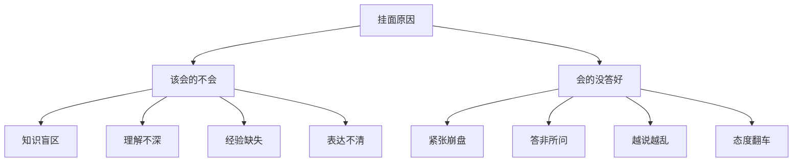

# 挂面原因分析

我带过上千个学员，面试挂了的案例看了不下五百个。

有个规律越看越清晰：**挂面这件事，从来不是运气问题，是系统问题。**

有人挂完觉得是自己运气不好，面的这家公司正好问到了盲区。另一个人挂完觉得是面试官太刁钻，故意挖抗。还有人挂完完全懵了，根本不知道哪儿出了问题。

但我复盘了这么多场后发现：挂面背后永远是那几个固定的原因，反复挂、反复错、从来不改。

今天把这些坑掰开了揉碎了讲，你对照着看，挂了哪场就知道根因在哪儿。

---

## 一、挂面原因分类图谱

挂面的原因粗分就两种：**该会的不会**和**会的没答好**。但这两种下面又细分了七八个坑，你不一定知道自己挂在哪个坑上。



这两个方向不一样，解决方式也不一样。前者是积累问题，后者是技巧问题。你要先判断自己属于哪种，才能对症下药。

【面试官手记】
我面试了这么多年，发现一个有趣的现象：有些人技术明明很扎实，但每次面试都挂。问他当时怎么答的，他说得头头是道，但就是过不了。后来我仔细看他录音，发现问题在于他"说得太散了"，没有结构，没有重点，面试官顺着他的回答往下挖，挖到一个点他就慌了。这种情况不是技术不行，是表达有问题。反过来，有些人技术一般，但特别会包装，把仅有的经验讲得天花乱坠，反而过了。所以面试这件事，技术是一方面，技巧也是一方面。

---

## 二、知识盲区型挂面

### 2.1 这种挂面的表现

典型表现：**完全不知道面试官在问什么，或者只能答出表面概念，一追问就死**。

比如面试官问："Redis的SDS是怎么实现的？"

知道的人能说出"简单动态字符串，用预分配和惰性空间释放优化内存"。不知道的人会说："就是字符串吧..."然后卡住。

或者面试官问："JVM的类加载过程是什么？"

背过的人能说出来"加载-验证-准备-解析-初始化"。没背过的人直接懵在原地。

### 2.2 根本原因

知识盲区型挂面的根因就三个：

**第一，储备不够。** 该背的没背，该看的没看，面试范围远超过自己的知识边界。

**第二，侥幸心理。** 觉得这个点不考、那个点不考，结果每次都考到侥幸心理没覆盖的地方。

**第三，深度不够。** 有些知识点只看了皮毛，知道"是什么"但不知道"为什么"，一追问就穿帮。

### 2.3 怎么改

**扩大知识边界。** 很多人准备面试的方式是：先列一个清单，觉得"这个可能考、那个可能不考"。这本身就是错的。正确的姿势是：先把核心知识点全覆盖，再深挖高频点。

**不要有侥幸心理。** 你觉得不考的点，往往就是面试官拿来区分度的点。HashMap的put流程谁都会，但"JDK8为什么引入红黑树"能答出来的就少了一半。能答出"TREEIFY_THRESHOLD为什么是8"的基本上又是凤毛麟角。

【面试官手记】
我面试的时候，最喜欢问的问题往往不是那些"八股文"，而是顺着候选人的回答往下追问。有个人跟我说他"精通Redis"，我问"Redis的过期策略是什么"，他答上来了。我问"那淘汰策略呢"，他愣了一下。我问"那你觉得生产环境中，过期key占满内存的时候会发生什么"，他答不上来了。一个"精通Redis"的人，如果只能答出缓存的作用，不知道缓存可能带来的问题，那这个"精通"是要打个问号的。

---

## 三、理解不深型挂面

### 3.1 这种挂面的表现

典型表现：**能背出答案，但被追问"为什么"就卡住，或者只能说出结论，说不出原理**。

比如面试官问："HashMap的容量为什么是2的幂次？"

很多人答："为了hash散列均匀。"面试官追问："怎么散列？"答不上来。

或者面试官问："线程池的拒绝策略有哪些？"

能背出四种：AbortPolicy、CallerRunsPolicy、DiscardOldestPolicy、DiscardPolicy。但问"什么场景下应该选哪种"，就答不上来了。

### 3.2 根本原因

**只背结论，不理解过程。** 这是中国程序员准备面试的通病——把面试题当成问答题来背，而不是当成原理来理解。

**没有建立知识之间的联系。** HashMap的容量设计、扩容机制、树化阈值，这些不是孤立的设计，是一整套权衡的结果。你只记其中一个点，面试官顺着问下去，你就接不住。

### 3.3 怎么改

**每个结论追问自己三个"为什么"。** HashMap容量是2的幂次——为什么？答："因为用hash&(length-1)代替取模运算"——为什么能代替？答："因为length-1二进制全是1"——为什么length是2的幂次二进制就全是1？这三个问题能答出来，才算理解了。

**建立知识网络。** 不要孤立地记知识点，要把知识点串联起来。比如线程池的核心参数：corePoolSize、maxPoolSize、queueCapacity、rejectPolicy——这几个不是独立设计的，是一套配合工作的机制。你要理解它们怎么配合、什么时候扩容、什么时候拒绝、拒绝之后怎么办。

【面试官手记】
我判断一个候选人是真的理解还是背的，有一个很简单的方法：看他能不能用自己的话把原理讲清楚。我问过一个候选人："线程池的执行流程是什么？"他背得很流利："先看核心线程数，没满就创建线程执行任务..."我问："那如果核心线程数满了呢？"他说："看队列有没有满..."我问："队列满了之后呢？"他说："看最大线程数..."我说："好，那如果最大线程数也满了呢？"他开始犹豫了。一套流程背得流利，但内在逻辑没理解透，一追问就散架。

---

## 四、紧张崩盘型挂面

### 4.1 这种挂面的表现

典型表现：**平时准备得挺好，一上场就大脑空白，原本会的题也答不上来**。

有个学员跟我说，他面试阿里之前把HashMap源码看了五遍，闭着眼睛都能背出来。结果面试官问"HashMap的put流程说一下"，他张嘴就说："首先...呃...先..."然后卡了整整十秒。

这十秒一过，他心态彻底崩了，后面的问题越答越乱。

### 4.2 根本原因

**把面试当成审判，而不是交流。** 紧张的根本原因是太在意结果，太把面试当回事，觉得"这场面试决定一切"。

**准备方式有问题。** 有些人准备面试是"背"，不是"理解"。背的东西一旦换一种问法，就接不上。理解的东西是活的，换什么问法都能接住。

**缺少模拟练习。** 平时一个人复习，没有对练环境，上场就慌。

### 4.3 怎么改

**降低预期，把每次面试当成练习。** 这个道理听起来像废话，但真正能做到的没几个。我带学员的时候，第一件事就是让他们把"这场面试必须过"的执念放下。你越在意结果，越容易紧张，越紧张越容易崩。

**对着镜子练、对着录音练、找人模拟面试。** 很多学员跟我说自己紧张，我说你先给我录一段自我介绍发过来。录完他们自己看回放，发现自己的问题：语速太快、小动作太多、眼神乱飘。这些问题不录出来自己根本意识不到。

**准备"救场话术"。** 紧张的时候脑子空白是正常的，但要给自己准备几个救场的话术。比如面试官问了一个你不会的问题，你可以说："这个问题我了解得不太深入，我可以说说我的理解..."或者"这个点我之前研究得不够，能不能先说一下我熟悉的相近知识点..."这比你愣在原地强多了。

【面试官手记】
我见过太多"紧张型"挂面。有个人技术实力很强，我一看就知道他是能做事的，但面试的时候完全不在状态，问他三个问题他能答错两个。不是不会，是太紧张了。后来我让他回去练了半个月，再来面，状态完全不一样。我问他怎么练的，他说就照你说的，对着镜子录，发现自己紧张的时候语速会变快、小动作会变多，有意识地控制了一下。技术还是那个技术，但表现完全不一样了。

---

## 五、答非所问型挂面

### 5.1 这种挂面的表现

典型表现：**面试官问A，你答B，看似答了很多但没答到点上，面试官多次打断或者换问题**。

比如面试官问："Redis的持久化机制有哪些？"

你答："Redis是内存数据库，性能很高，我们项目里用Redis做缓存..."说了三十秒还没切入正题，面试官打断你："好，我知道了，那持久化呢？"

或者面试官问："HashMap是线程安全的吗？"

你答："HashMap不是线程安全的，线程安全应该用ConcurrentHashMap..."然后开始大讲ConcurrentHashMap，完全忘了这个问题问的是HashMap。

### 5.2 根本原因

**审题不清，急于表现。** 有些人听到一个关键词就开始往外倒，不管问的是什么。比如听到"Redis"，脑子里浮现的是缓存、集群、应用场景，根本不管问题问的是持久化还是别的。

**没有结构化思维。** 想到什么说什么，容易跑偏。好的回答是"结论先行，再展开"，先给一个简洁的答案，再慢慢解释。

### 5.3 怎么改

**先确认，再回答。** 面试官问完，不要急着开口，先想两秒钟，确认自己真的理解了在问什么。如果你觉得有歧义，可以确认一下："您问的是Redis的持久化机制对吗？"这比答非所问强多了。

**结论先行。** 好的回答结构是：先给一个简洁的结论（比如"Redis有两种持久化机制：RDB和AOF"），再解释细节，再举例。如果你一上来就开始讲细节，面试官听半天不知道你想说什么。

【面试官手记】
我面试的时候最烦的一种情况是：我问了一个很具体的问题，候选人开始长篇大论，讲了一堆相关但不相关的东西，最后还没回答我的问题。我会打断他："好，我听到了，那你先回答一下我刚才的问题。"这种时候其实已经在扣分了——不是因为技术不行，是因为表达效率太低。职场上的沟通也是这样，能一句话说清楚的，不要说十句。

---

## 六、越说越乱型挂面

### 6.1 这种挂面的表现

典型表现：**知道个大概，但说不清楚，越解释越乱，面试官皱眉头或者露出困惑的表情**。

比如面试官问："MySQL的事务隔离级别有哪些？"

你答："有...有读未提交、读已提交...还有..."卡住，想了两秒："还有可重复读和串行化。"面试官追问："它们分别解决了什么问题？"你开始说："读未提交就是...就是可以读到..."越说越乱，自己都不知道在说什么。

### 6.2 根本原因

**基础不扎实，理解有误差。** 有些知识点自己以为自己懂，但懂得不透，一开口就露馅。

**表达没有结构。** 东一榔头西一棒槌，没有逻辑线。面试官听你说话很费劲，不知道你的重点是什么。

### 6.3 怎么改

**重新理解基础概念。** 越说越乱的根因往往是自己没真正理解。停下来，回去把基础概念再读一遍，搞清楚每个概念的准确定义，再来说。

**用"金字塔原理"组织回答。** 先说结论，再分点，每个点一句话说清楚。比如问MySQL事务隔离级别，结论："MySQL有四种隔离级别，从低到高是读未提交、读已提交、可重复读、串行化。"然后分点："读未提交会出现脏读..."每一级都有一句话解释。这样结构清晰，面试官听得不累。

【面试官手记】
我判断一个候选人的基础是否扎实，有一个简单的方法：看他能不能把一个概念解释清楚。我问过很多人"MySQL的MVCC是什么"，能答出来的不多。有个人答得很乱，说了一分钟我也没听懂他在讲什么。后来我让他回去写一篇博客解释MVCC，两周后再来面。他真的写了，拿给我看，写得还挺清楚。我说这就是进步——能写清楚，说明真的理解了。第二次面试的时候，他回答MVCC的问题，只用了三句话就说清楚了。

---

## 七、态度翻车型挂面

### 7.1 这种挂面的表现

**技术问题答得还行，但态度出了问题，直接被挂。**

常见的有几种：

**第一种，太狂。** 面试官问："HashMap了解吗？"你答："这个太简单了，我闭着眼睛都会..."还没等你说完，面试官已经想好怎么怼你了。

**第二种，太负能量。** 问到之前公司的经历，开始疯狂吐槽："我们之前那个leader特别水，什么都不懂...""我们公司技术栈太落后了，没法提升..."面试官心想：这人以后是不是也会这么说我？

**第三种，太敷衍。** 问什么都"还行吧""差不多""这个我不太确定"，没有一点认真探讨的精神。

**第四种，太较真。** 和面试官争辩起来，非要证明自己是对的、面试官是错的。面试不是学术辩论，面试官不是你的对手。

### 7.2 根本原因

**没有摆正自己的位置。** 面试是双向选择，不是单方面审判。你展示的是"我能做什么"，不是"我有多牛"。

**情绪管理能力差。** 技术面试是有压力的，但你要能扛住压力，不能被压力带偏。

### 7.3 怎么改

**保持谦逊但不卑微的姿态。** 你不需要表现得啥都会，但需要表现 出"我愿意学习、愿意探讨"的态度。

**吐槽的话憋回去。** 面试中不管被问到什么前任公司、前任领导的事，一律给正面评价："我学到了很多"、"那段时间成长很快"。

**把面试当成技术探讨。** 遇到分歧，可以说"我理解您的意思，不过我的看法是这样..."或者"这个点我理解得可能不太准确，我说说我的理解..."不要直接说"你错了"。

【面试官手记】
我面试过一个人，技术实力其实挺强的，问的几个问题都答得不错。但整个面试过程中，他的态度让我很不舒服。我说一个观点，他就反驳，我换一个问题，他还是反驳，好像专门为了反对我而反对我。面试结束后，我给他的评价就四个字：态度问题。果然，复试的时候其他面试官也觉得他不太好协作。这种人技术再好，也不能要——团队合作比单兵作战能力重要多了。

---

## 八、挂面复盘模板

每次挂面之后，用这个模板认真复盘：

```markdown
## 挂面复盘

**公司**：____ **岗位**：____ **面试轮次**：____
**日期**：____年__月__日

### 1. 挂面原因归类
□ 知识盲区  □ 理解不深  □ 紧张崩盘  □ 答非所问  □ 越说越乱  □ 态度翻车

### 2. 核心问题点
________________[这场面试暴露的最严重的问题是什么]________________

### 3. 根本原因分析
________________[为什么会出现这个问题]________________

### 4. 下次改进计划
- [ ] ________________
- [ ] ________________
- [ ] ________________

### 5. 关联历史
这场挂的面，和之前挂的面，有没有共同点？
________________
```

---

## 九、防挂 Checklist

每次面试前过一遍这个清单，降低挂面概率：

**知识准备**
- [ ] 核心知识点全覆盖，没有明显盲区
- [ ] 每个知识点能回答"是什么、为什么、怎么用"
- [ ] 高频追问点准备了自己的理解

**表达准备**
- [ ] 能用结构化的方式回答问题
- [ ] 有救场话术，不会的问题知道怎么应对
- [ ] 录过自己的回答，听过回放

**心态准备**
- [ ] 降低预期，不把这场面试当"决定性"考试
- [ ] 准备好被追问，不惧压力
- [ ] 遇到不会的问题知道怎么应对

**态度准备**
- [ ] 不会的问题会说"这个我了解不深"
- [ ] 不会和面试官争辩
- [ ] 不会吐槽前任公司/领导

【面试官手记】
有个学员跟我说，老师我每次面试都挂，不知道为什么。我说你把最近三场的面试记录拿给我看。他翻出来，我发现一个很明显的规律：每次挂都是卡在同一个知识点上——线程池。我说你这三次挂在同一个点上，说明这个不是运气问题，是你那个知识点真的有盲区。他后来花了两周专门怼线程池，再面试，这个问题再也没挂过。所以挂面不可怕，可怕的是挂完不改，挂着挂着就习惯了。

---

记住，**挂面不是终点，是起点**。每次挂完认真复盘，把暴露的问题解决了，下一场面试就多了一件武器。最可怕的不是挂面，是挂完不知道挂在哪儿，然后带着同样的问题挂下一场。
