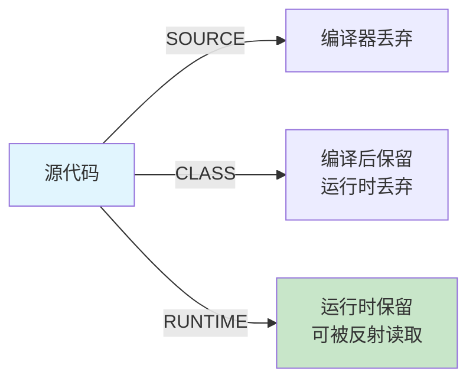

字节跳动P6面试间里，面试官看了看候选人小冯的简历，上面写着"熟练使用Spring Boot"。

"你简历上写了 Spring Boot，"面试官说，"那你知道 Spring 是怎么通过注解来装配 Bean 的吗？比如 `@Autowired` 注解是怎么被处理的？"

小冯说："Spring 会在启动时扫描所有的类，然后找到带有 `@Autowired` 注解的字段，通过反射注入。"

面试官点点头："那 `@Autowired` 是什么类型的注解？它的 `@Target` 和 `@Retention` 是什么？"

小冯说："...不太清楚。"

面试官追问："那 `@Documented`、`@Inherited` 这些元注解呢？分别有什么用？"

小冯完全答不上来了。

面试官又问："注解和注释有什么区别？注解是怎么被处理的？"

小冯支支吾吾。

【面试官心理】
这道题我用来测试候选人对 Java 注解体系的理解深度。Spring 用了大量注解，但很多开发者只会用不理解。能说出注解的 `@Retention` 策略、能区分编译时注解和运行时注解的候选人，说明他不只用过，还研究过背后的机制。

## 一、注解是什么 🔴

### 1.1 问题拆解

**第一层：怎么用？**
面试官问："注解和注释有什么区别？注解有什么作用？"

**第二层：底层实现**
追问："`@Override` 是怎么被处理的？为什么编译器能检测到方法没有重写父类方法？"

**第三层：边界缺陷**
追问："运行时注解和编译时注解有什么区别？怎么决定用什么？"

**第四层：选型 trade-off**
追问："你在项目里自定义过注解吗？什么场景下适合用注解而不是配置？"

### 1.2 标准回答

**注解（Annotation）是 JDK 5 引入的元数据机制，为代码提供额外的可读信息，可以在编译时、类加载时或运行时被处理**。

```java
// 注释：给程序员看的，编译器完全忽略
// 这是一个用户服务类
public class UserService {
    // 注解：给编译器/框架看的，可以被处理
    @Override
    public String toString() {
        return "UserService";
    }
}
```

### 1.3 注解 vs 注释

| 维度 | 注释（Comment） | 注解（Annotation） |
| --- | --- | --- |
| 用途 | 给程序员看的说明文档 | 给编译器/框架看的元数据 |
| 处理方式 | 编译器完全忽略 | 可以被注解处理器处理 |
| 效果 | 无运行时影响 | 可以改变代码行为 |
| 示例 | `// TODO: 优化性能` | `@Override`, `@Autowired` |

## 二、元注解 🔴

### 2.1 问题拆解

面试官追问："Java 有哪些元注解？分别有什么用？"

### 2.2 五大元注解

```java
// 1. @Target：注解可以用在哪里
@Target(ElementType.TYPE)           // 类、接口、枚举
@Target(ElementType.METHOD)          // 方法
@Target(ElementType.FIELD)            // 字段
@Target(ElementType.CONSTRUCTOR)     // 构造函数
@Target(ElementType.PARAMETER)       // 参数
@Target(ElementType.LOCAL_VARIABLE)  // 局部变量
@Target(ElementType.ANNOTATION_TYPE) // 注解类型

// 可以组合多个
@Target({ElementType.TYPE, ElementType.METHOD})

// 2. @Retention：注解在什么阶段保留
@Retention(RetentionPolicy.SOURCE)   // 只在源码中存在，编译时丢弃
@Retention(RetentionPolicy.CLASS)    // 编译时保留，运行时丢弃（默认值）
@Retention(RetentionPolicy.RUNTIME)  // 运行时保留，可通过反射读取

// 3. @Documented：是否包含在 Javadoc 中
@Documented
public @interface MyAnnotation { }

// 4. @Inherited：是否允许子类继承父类的注解
@Inherited
public @interface MyAnnotation { }

// 5. @Repeatable：是否可重复使用（Java 8+）
@Repeatable(Schedules.class)
public @interface Schedule {
    String dayOfWeek();
}
```

### 2.3 @Retention 的三个级别



| 级别 | 存在时期 | 处理方式 | 典型用途 |
| --- | --- | --- | --- |
| `SOURCE` | 源码阶段 | 编译器丢弃 | `@Override`（编译检查），Lombok |
| `CLASS` | 编译后 | 类加载时丢弃 | 编译时注解处理器（APT） |
| `RUNTIME` | 运行时 | 可被反射读取 | Spring DI，JUnit，自定义运行时注解 |

:::tip 💡
**判断标准**：只需要编译器看到 → SOURCE；需要在编译时生成代码 → CLASS；需要在运行时通过反射处理 → RUNTIME。
:::

### 2.4 @Inherited 的继承行为

```java
@Inherited  // 父类有这个注解，子类自动继承
@Retention(RetentionPolicy.RUNTIME)
public @interface MyAnnotation {
    String value();
}

@MyAnnotation("parent")
public class Parent {}

// 子类自动拥有 @MyAnnotation（如果子类没有显式标注）
public class Child extends Parent {}  // Child 也相当于有 @MyAnnotation("parent")

// 但孙类不会继承，除非也是直接继承 Parent
```

## 三、内置注解 🔴

### 3.1 常用内置注解

```java
// @Override：编译检查是否真的重写了父类方法
public class Child extends Parent {
    @Override
    public void method() { }  // 如果父类没有这个方法，编译报错
}

// @Deprecated：标记已过时的API
@Deprecated
public void oldMethod() {
    // 旧方法...
}

// @SuppressWarnings：抑制编译器警告
@SuppressWarnings("unchecked")
public void rawTypeUsage() {
    List list = new ArrayList();  // 本应有警告，但被抑制
}

// @SafeVarargs：抑制可变参数泛型警告
@SafeVarargs
public final void method(List<String>... lists) {
    // 不再警告
}

// @FunctionalInterface：标记函数式接口（只有一个抽象方法）
@FunctionalInterface
public interface Converter<F, T> {
    T convert(F from);
}
```

## 四、运行时注解处理：反射 🔴

### 4.1 问题拆解

面试官追问："Spring 是怎么通过反射处理 `@Autowired` 的？"

### 4.2 反射读取注解

```java
// 定义注解
@Retention(RetentionPolicy.RUNTIME)
@Target(ElementType.FIELD)
public @interface Inject {
    String value() default "";
}

// 使用注解
public class UserService {
    @Inject("userDao")
    private UserDao userDao;
}

// 通过反射处理注解
public static void inject(Object target) throws Exception {
    Class<?> clazz = target.getClass();

    // 遍历所有字段
    for (Field field : clazz.getDeclaredFields()) {
        // 检查字段是否有 @Inject 注解
        if (field.isAnnotationPresent(Inject.class)) {
            Inject inject = field.getAnnotation(Inject.class);
            System.out.println("字段 " + field.getName() +
                " 有 @Inject 注解，value = " + inject.value());

            // 通过反射注入
            field.setAccessible(true);
            Object dependency = createDependency(field.getType(), inject.value());
            field.set(target, dependency);
        }
    }
}
```

### 4.3 Spring 的 @Autowired 处理（简化版）

```java
// Spring 处理 @Autowired 的简化流程
public Object autowire(Object bean, Class<?> beanClass) {
    for (Field field : beanClass.getDeclaredFields()) {
        if (field.isAnnotationPresent(Autowired.class)) {
            Autowired autowired = field.getAnnotation(Autowired.class);

            // 根据字段类型从容器中查找 Bean
            Class<?> fieldType = field.getType();
            Object dependency = applicationContext.getBean(fieldType);

            // 注入
            field.setAccessible(true);
            field.set(bean, dependency);
        }
    }
    return bean;
}
```

### 4.4 获取注解的 API

```java
// 1. 检查是否有注解
field.isAnnotationPresent(MyAnnotation.class);

// 2. 获取注解（如果有多个同类注解用 getAnnotations）
MyAnnotation annotation = field.getAnnotation(MyAnnotation.class);

// 3. 获取所有注解（包括继承的）
Annotation[] annotations = field.getAnnotations();

// 4. 获取直接标注的注解（不包括继承的）
Annotation[] declaredAnnotations = field.getDeclaredAnnotations();

// 5. 获取方法参数上的注解
Parameter[] params = method.getParameters();
for (Parameter param : params) {
    MyAnnotation annotation = param.getAnnotation(MyAnnotation.class);
}
```

## 五、编译时注解处理 🔴

### 5.1 APT：注解处理器

编译时注解处理发生在编译阶段，通过**注解处理器（APT）**实现：

```java
// 1. 定义注解（必须是 CLASS 级别）
@Retention(RetentionPolicy.CLASS)
@Target(ElementType.TYPE)
public @interface AutoService {
    Class<?>[] value();
}

// 2. 创建注解处理器
public class AutoServiceProcessor extends AbstractProcessor {

    @Override
    public boolean process(Set<? extends TypeElement> annotations,
                          RoundEnvironment roundEnv) {
        for (Element element : roundEnv.getElementsAnnotatedWith(AutoService.class)) {
            TypeElement typeElement = (TypeElement) element;
            AutoService autoService = typeElement.getAnnotation(AutoService.class);

            // 生成代码：例如创建一个 ServiceLoader 配置文件
            for (Class<?> iface : autoService.value()) {
                // 生成 META-INF/services 配置文件
                String serviceName = iface.getCanonicalName();
                // writeToFile(serviceName, typeElement.getQualifiedName());
            }
        }
        return true;
    }
}
```

### 5.2 Lombok：编译时注解的典型应用

```java
// Lombok 使用编译时注解处理
// 源码（简洁）
@Data
public class User {
    private String name;
    private int age;
}

// 编译后生成的字节码（通过 Lombok 注解处理器生成）
public class User {
    private String name;
    private int age;

    public User() { }

    public String getName() { return name; }
    public void setName(String name) { this.name = name; }
    public int getAge() { return age; }
    public void setAge(int age) { this.age = age; }
    public boolean equals(Object o) { ... }
    public int hashCode() { ... }
    public String toString() { ... }
}
```

Lombok 的注解处理器在编译阶段读取注解，然后生成额外的字节码。这些生成的代码在 .class 文件中存在，但在 .java 源代码中不存在。

## 六、自定义注解实战 🔴

### 6.1 完整示例：请求日志注解

```java
// 1. 定义注解
@Retention(RetentionPolicy.RUNTIME)
@Target(ElementType.METHOD)
@Documented
public @interface RequestLog {
    String value() default "";
    boolean saveParams() default true;
}

// 2. 使用注解
public class OrderController {

    @RequestLog(value = "创建订单", saveParams = true)
    public Order createOrder(String userId, BigDecimal amount) {
        // 业务逻辑
        return new Order();
    }
}

// 3. AOP 处理注解
@Aspect
@Component
public class RequestLogAspect {

    @Around("@annotation(requestLog)")
    public Object around(ProceedingJoinPoint joinPoint,
                         RequestLog requestLog) throws Throwable {
        long start = System.currentTimeMillis();
        String methodName = requestLog.value();

        // 记录参数
        if (requestLog.saveParams()) {
            Object[] args = joinPoint.getArgs();
            log.info("方法 {} 入参: {}", methodName, Arrays.toString(args));
        }

        try {
            Object result = joinPoint.proceed();
            long cost = System.currentTimeMillis() - start;
            log.info("方法 {} 完成，耗时: {}ms", methodName, cost);
            return result;
        } catch (Exception e) {
            long cost = System.currentTimeMillis() - start;
            log.error("方法 {} 异常，耗时: {}ms，异常: {}",
                methodName, cost, e.getMessage());
            throw e;
        }
    }
}
```

## 七、面试高频追问 🔴

### 7.1 追问：为什么 @Override 能检测方法是否重写？

```java
public class Parent {
    public void doSomething() { }
}

public class Child extends Parent {
    @Override
    public void doSomethingElse() { }  // 编译错误！父类没有这个方法
}
```

编译器在处理 `@Override` 时，会检查标注的方法是否真的在父类中存在。如果不存在，编译失败。这是一种**编译时安全检查**。

### 7.2 追问：注解能否继承？

```java
@Inherited  // 加了这个元注解，父类的注解才会被子类继承
public @interface MyAnnotation { }

// 默认情况下，注解不能继承
// @Inherited 只能让类继承父类的注解，方法/字段上的注解不会继承
```

### 7.3 追问：注解的默认值

```java
public @interface MyAnnotation {
    String value() default "default";  // 有默认值，使用时可以省略
    int count() default 0;
}

// 使用时可以只指定部分属性
@MyAnnotation(value = "custom")
public class MyClass { }
```

## 八、面试总结

| 级别 | 期望回答 | 判分标准 |
| --- | --- | --- |
| P5 | 知道注解是什么，知道 @Override、@Deprecated 的用法 | 基础使用 |
| P6 | 能讲清元注解的作用，能区分 SOURCE/CLASS/RUNTIME 三种保留策略，能通过反射读取注解 | 追问 2-3 轮不崩 |
| P7 | 能讲清编译时注解处理器的原理（Lombok/APT），能设计自定义注解体系，能结合 Spring AOP 讲注解的应用 | 有工程实践，有框架理解深度 |

注解是 Java 元编程的核心。理解它需要从三个层面：知道怎么用（基础）、知道怎么被处理（原理）、知道什么时候用（设计）。Spring 选择了运行时反射 + AOP 来处理注解，Lombok 选择了编译时 APT 来生成代码——不同的场景需要不同的注解保留策略。
